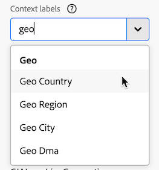
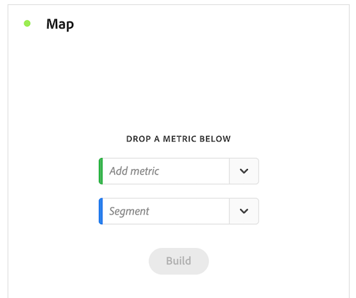
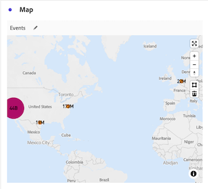
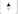

# Mapa {#map}

<!-- markdownlint-disable MD034 -->

>[!CONTEXTUALHELP]
>id="workspace_map_button"
>title="Mapa"
>abstract="Essa visualização representa as métricas ao sobrepô-las em um mapa. Isso é útil para identificar dados em diferentes regiões geográficas."

<!-- markdownlint-enable MD034 -->

<!-- markdownlint-disable MD034 -->

>[!CONTEXTUALHELP]
>id="workspace_map_bubbles"
>title="Propagações"
>abstract="Marque eventos usando bolhas."

<!-- markdownlint-enable MD034 -->

<!-- markdownlint-disable MD034 -->

>[!CONTEXTUALHELP]
>id="workspace_map_heatmap"
>title="Mapa de calor"
>abstract="Marcar eventos usando um mapa de calor."

<!-- markdownlint-enable MD034 -->

>[!BEGINSHADEBOX]

_Este artigo documenta a Visualização de mapa no_  _&#x200B;**Customer Journey Analytics**._ _Consulte o [Mapa](https://experienceleague.adobe.com/pt-br/docs/analytics/analyze/analysis-workspace/visualizations/map-visualization) da versão_  _&#x200B;**Adobe Analytics** deste artigo._

>[!ENDSHADEBOX]

A visualização do  **[!UICONTROL Mapa]** no Analysis Workspace permite criar um mapa visual de qualquer métrica (incluindo métricas calculadas). É útil para identificar e comparar dados de métricas em diferentes regiões geográficas.

## Pré-requisitos

### Adicionar rótulos de contexto em visualizações de dados

Nas configurações de visualizações de dados do Customer Journey Analytics, os administradores podem adicionar [rótulos de contexto](/help/data-views/component-settings/overview.md) a uma dimensão ou métrica, e serviços do Customer Journey Analytics, como o [!UICONTROL mapa], podem usar esses rótulos para suas finalidades.

#### Rótulos de contexto necessários para latitude e longitude na visualização do mapa

Rótulos de contexto são necessários para que a visualização de mapa funcione. Sem os rótulos de contexto a seguir, a visualização do mapa não funciona, pois não há dados de latitude e longitude para trabalhar.

* [!UICONTROL Geografia: Latitude]
* [!UICONTROL Geo: Longitude]

Para adicionar esses rótulos de contexto:

1. No Customer Journey Analytics, selecione **[!UICONTROL Gerenciamento de dados]** > **[!UICONTROL Visualizações de dados]**.

1. Na página Visualizações de dados, selecione a visualização de dados que contém os dados que você deseja analisar na visualização de mapa.

1. Selecione a guia **[!UICONTROL Componentes]**.

1. (Condicional) Se você estiver usando o Web SDK e tiver configurado a latitude e a longitude para serem preenchidas no fluxo de dados, ou se estiver usando o Analytics Source Connector para preencher dados de evento, os campos de latitude e longitude já deverão estar disponíveis no esquema e preenchidos com os rótulos de contexto corretos.

   Localize estes campos de esquema **[!UICONTROL Latitude]** e **[!UICONTROL Longitude]** (em **[!UICONTROL Conjuntos de dados de eventos]** > **[!UICONTROL placeContext]** > **[!UICONTROL geo]** > **[!UICONTROL _schema]**) e arraste-os para sua visualização de dados como dimensões, se ainda não estiverem presentes.

   Quando esses campos de esquema existem como dimensões na visualização de dados, seus rótulos de contexto são aplicados automaticamente e a visualização de mapa os usa sem qualquer configuração adicional.

   

1. (Condicional) Se você tiver dimensões personalizadas que deseja usar para dados de latitude e longitude, poderá configurar os rótulos de contexto nos campos personalizados:

   1. Na seção **[!UICONTROL Dimensões]**, selecione a dimensão que contém os dados de longitude.

   1. Na seção **[!UICONTROL Configurações do componente]** no painel direito, no campo **[!UICONTROL Rótulos de contexto]**, comece digitando `Longitude` e selecione-o no menu suspenso.

      

   1. Repita esse processo para adicionar o rótulo de contexto **[!UICONTROL Latitude]** à dimensão que contém os dados de latitude.

   1. (Opcional) Por padrão, essas dimensões são precisas ao nível da cidade ou do CEP na visualização do mapa e mostram 2 casas decimais nos relatórios do Workspace. É possível ajustá-los para serem precisos em um único metro na visualização do mapa e para mostrar 5 casas decimais nos relatórios do Workspace. Para obter mais informações sobre como ajustar o nível de precisão, consulte [Configurar locais precisos para dimensões](#configure-precise-locations-for-dimensions).

1. Selecione **[!UICONTROL Salvar e continuar]** > **[!UICONTROL Salvar e concluir]**.

#### Rótulos de contexto necessários para modelos geográficos

O Adobe fornece vários [modelos pré-criados](/help/analysis-workspace/templates/use-templates.md#web-audience) que usam a visualização de mapa. Para usar cada modelo, você deve adicionar o rótulo de contexto correspondente a uma dimensão em sua visualização de dados.

A seguir estão os modelos e o rótulo de contexto necessário. Sem a presença desses rótulos, os modelos não funcionam, pois não há dados geográficos para trabalhar.

| Nome do modelo | Rótulo de contexto obrigatório |
|---------|----------|
| Países geográficos | [!UICONTROL Geo: Geo Country] |
| Regiões geográficas | [!UICONTROL Geo: Região Geográfica] |
| Cidades geográficas | [!UICONTROL Geo: Cidade Geográfica] |
| Estados geográficos dos EUA | [!UICONTROL Geo: Estado Geográfico] |
| DMA Geográfico dos EUA | [!UICONTROL Geo: Geo Dma] |

Para adicionar esses rótulos de contexto:

1. No Customer Journey Analytics, selecione **[!UICONTROL Gerenciamento de dados]** > **[!UICONTROL Visualizações de dados]**.

1. Na página Visualizações de dados, selecione a visualização de dados que contém os dados que você deseja analisar com modelos pré-construídos que usam a visualização de mapa. Nesta visualização de dados, escolha cinco dimensões: uma com os dados do país, uma com os dados da região, uma com os dados da cidade, uma com os dados do estado e uma com os dados do DMA. Em seguida, rotule essas dimensões com o rótulo de contexto correspondente.

1. Selecione a guia **[!UICONTROL Componentes]**.

1. (Condicional) Se estiver usando o Web SDK e tiver configurado campos geográficos para serem preenchidos no fluxo de dados ou se estiver usando o Analytics Source Connector para preencher dados de evento, os campos geográficos já deverão estar disponíveis no esquema e preenchidos com os rótulos de contexto corretos.

   Localize os campos de esquema apropriados, como **[!UICONTROL Cidade]**, **[!UICONTROL CEP]**, **[!UICONTROL Estado ou província]** (em **[!UICONTROL Conjuntos de dados de eventos]** > **[!UICONTROL placeContext]** > **[!UICONTROL geo]**), e arraste-os para sua visualização de dados como dimensões, se ainda não estiverem presentes.

   Quando esses campos de esquema existem como dimensões na visualização de dados, seus rótulos de contexto são aplicados automaticamente e os modelos geográficos os usam sem qualquer configuração adicional.

   

1. (Condicional) Se você tiver dimensões personalizadas que deseja usar para dados geográficos, será possível configurar os rótulos de contexto nos campos personalizados:

   1. Selecione a dimensão que contém os dados do país.

   1. Na seção **[!UICONTROL Configurações do componente]** no painel direito, no campo **[!UICONTROL Rótulos de contexto]**, comece digitando `Geo Country` e selecione-o no menu suspenso.

      

   1. Repita esse processo para adicionar o rótulo de contexto **[!UICONTROL Geo: Geo Region]**, **[!UICONTROL Geo: Geo City]**, **[!UICONTROL Geo: Geo State]** e **[!UICONTROL Geo: Dma]** a cada dimensão que contenha os dados correspondentes.

1. Selecione **[!UICONTROL Salvar e continuar]** > **[!UICONTROL Salvar e concluir]**.

### Os drivers gráficos devem suportar a renderização WebGL

A visualização de mapa usa WebGL para exibição gráfica. Se os drivers gráficos não forem compatíveis com a renderização WebGL, talvez seja necessário atualizar os drivers.

## Visualização de mapa no Customer Journey Analytics versus Adobe Analytics

A visualização de mapa no Customer Journey Analytics difere da visualização de mapa no Adobe Analytics das seguintes maneiras:

| Recurso | Customer Journey Analytics | Adobe Analytics |
|---------|----------|---------|
| Fonte de dados | Use qualquer segmento disponível na visualização de dados como fonte de dados. | Fornece as seguintes opções: <ul><li>Lat/long móveis</li><li>Dimension geográfico Representa dados de segmentação geográfica sobre a localização do visitante com base no endereço IP do visitante. </li></ul> |
| Precisão | Para conjuntos de dados com grande precisão, é possível configurar as dimensões na visualização de dados para mostrar até 5 casas decimais. Isso permite que a visualização do mapa seja precisa em um único metro. 
Para obter mais informações, consulte [Configurar locais precisos para dimensões](#configure-precise-locations-for-dimensions).
 | Os dados estão precisos para o nível de [!UICONTROL País], [!UICONTROL Região] e [!UICONTROL Cidade]. (Ele não vai para o nível de DMA ou CEP.) |
| Criar um segmento a partir de uma seleção | Crie um segmento com base em uma área específica selecionada na visualização de mapa. 
Para obter mais informações, consulte [Criar um segmento da visualização de mapa](#create-a-segment-from-the-map-visualization).
 | Crie um segmento com base nos dados que estão sendo relatados na visualização de mapa em geral. |
| Criar um público-alvo a partir de uma seleção | Crie um público-alvo com base em uma área específica selecionada na visualização de mapa. 
Para obter mais informações, consulte [Criar um público-alvo da visualização de mapa](#create-an-audience-from-the-map-visualization). | Não é possível criar um público-alvo a partir da visualização do mapa. |
| Criar uma tendência a partir de uma seleção | Crie uma visualização de gráfico de linhas de tendência com base em uma área específica selecionada na visualização de mapa. 
Para obter mais informações, consulte [Criar um gráfico de linhas de tendência a partir da visualização de mapa](#create-a-trended-line-chart-from-the-map-visualization). <!-- is this correct? --> | Não é possível criar uma tendência na visualização de mapa. |
| Adicionar um detalhamento de uma seleção | Detalhe um item de dimensão, métrica, segmento ou intervalo de datas específico em uma área específica selecionada na visualização de mapa. 
Para obter mais informações, consulte [Adicionar um detalhamento da visualização de mapa](#add-a-breakdown-from-the-map-visualization). | Não é possível adicionar um detalhamento da visualização do mapa. |

## Criar uma visualização de mapa {#begin-building-map}

<!-- markdownlint-disable MD034 -->

>[!CONTEXTUALHELP]
>id="workspace_map_panel"
>title="Configurar a visualização de mapa"
>abstract="Escolha a métrica ou métrica calculada que servirá de base para a sua visualização de mapa. Você também pode adicionar um segmento se quiser se focar em um subconjunto específico dos dados.
É possível atualizar essas informações a qualquer momento após a renderização da visualização.
"

<!-- markdownlint-enable MD034 -->

1. Selecione o ícone [!UICONTROL **Visualizações**] no painel à esquerda e arraste o **[!UICONTROL Mapa]** da visualização  para um painel que contenha uma tabela de forma livre.

   Ou

   Adicione uma visualização de mapa de qualquer uma das maneiras descritas na seção [Adicionar visualizações a um painel](/help/analysis-workspace/visualizations/freeform-analysis-visualizations.md#add-visualizations-to-a-panel) em [Visão geral das visualizações](/help/analysis-workspace/visualizations/freeform-analysis-visualizations.md).

   {width="50%"}

1. Especifique as seguintes informações básicas para configurar a visualização de mapa:

   * **[!UICONTROL Adicionar métrica]**: na lista suspensa de métricas, selecione uma métrica ou métrica calculada. (Também é possível arrastar uma métrica do painel esquerdo.)

     >[!IMPORTANT]
     >
     >Se você escolher uma métrica que tenha [atribuição aplicada](/help/data-views/component-settings/attribution.md#attribution-models), a mesma atribuição será aplicada aos pares de latitude e longitude dentro do visor atual da visualização de mapa.
     >

     <!-- Only choose metrics that use Last Touch as the [attribution model](/help/data-views/component-settings/attribution.md#attribution-models) (this is the default attribution model for all metrics). Choosing a metric that has an attribution model other than Last Touch results in inaccurate map data, because attribution is applied to the latitude and longitude pairs. -->

   * **[!UICONTROL Adicionar segmento]**: (opcional) na lista suspensa de segmentos, selecione um segmento. Ou arraste um segmento da lista de segmentos.

   Você pode atualizar essas informações depois que a visualização for criada selecionando o ícone Editar  no cabeçalho da visualização.

1. Selecione **[!UICONTROL Criar]**.

   Uma visualização do mapa-múndi com propagações é gerada.

   

1. Continue com [Exibir uma visualização de mapa](#view-a-map-visualization) e [Definir configurações de visualização](#configure-visualization-settings).

## Exibir uma visualização de mapa

1. Caso ainda não o tenha feito, crie uma visualização de mapa conforme descrito em [Criar uma visualização de mapa](#begin-building-a-map-visualization).

1. Na visualização de mapa no Analysis Workspace, siga um destes procedimentos:

   * **Mais zoom**: Você pode ampliar o mapa para ampliar determinadas áreas de qualquer uma das seguintes maneiras:

      * Clique duas vezes no mapa com o mouse.

      * Use a roda de rolagem do mouse ou uma ação semelhante no trackpad.

      * Selecione o ícone de adição  na visualização de mapa.

     O mapa aumenta o zoom de acordo. A dimensão necessária (país > estado > cidade) é atualizada automaticamente com base no nível de zoom.

   * **Reduzir**: você pode reduzir o mapa para exibir áreas maiores de qualquer uma das seguintes maneiras:

      * Mantenha pressionada a tecla Shift e clique duas vezes no mapa com o mouse.

      * Use a roda de rolagem do mouse ou uma ação semelhante no trackpad.

      * Selecione o ícone de menos  na visualização de mapa.

     O mapa aumenta o zoom de acordo. A dimensão necessária (país > estado > cidade) é atualizada automaticamente com base no nível de zoom.

   * **Girar**: você pode girar o mapa em 2D ou 3D mantendo a tecla [!UICONTROL Ctrl] pressionada enquanto arrasta o mapa com o mouse.

     Para redefinir o mapa para seu alinhamento norte original, selecione o ícone de bússola .

   * **Ferramenta de seleção**: é possível selecionar uma área do mapa para [criar um segmento](#create-a-segment-from-the-map-visualization), [criar uma tendência](#create-a-trended-line-chart-from-the-map-visualization) ou [adicionar um detalhamento](#add-a-breakdown-from-the-map-visualization).

     Clique no  da ferramenta de seleção e arraste o mouse para selecionar a área desejada.

   * **Comparar**: você pode comparar duas ou mais visualizações de mapa no mesmo projeto, colocando-as lado a lado.

   * **Mostrar comparações período por período (como ano por ano)**:

      * Mostrar números negativos.

        Por exemplo, se você estiver plotando uma métrica ano a ano, o mapa poderá mostrar -33% sobre Nova York.

      * Com métricas do tipo *porcentagem*, o agrupamento calcula a média das porcentagens.

      * Um esquema de cores verde e vermelho indica positivo e negativo.

   * **Configurações de visualização adicionais**: selecione o ícone Configurações  no cabeçalho da visualização para exibir configurações adicionais para a visualização de mapa. Para obter mais informações, consulte [Definir configurações de visualização](#configure-visualization-settings).

1. **Salve** o projeto para salvar todas as configurações do mapa (coordenadas, zoom, rotação).
1. (Opcional) A tabela de forma livre abaixo da visualização pode ser preenchida arrastando as dimensões e métricas de localização do painel esquerdo.

## Definir configurações de visualização

Para definir as configurações da visualização de mapa:

1. No Analysis Workspace, abra uma visualização de mapa existente ou [crie uma nova](#begin-building-a-map-visualization).

1. Passe o mouse sobre a visualização do mapa, em seguida, selecione o ícone Configurações  no cabeçalho da visualização.

   As seguintes opções estão disponíveis:

   | Seção | Configuração | Descrição |
   | --- |--- |--- |
   | **[!UICONTROL Tipo de mapa]** | | |
   | | **[!UICONTROL Propagação]** | Plota eventos usando bolhas. Um gráfico de bolhas é um gráfico de várias variáveis que é um cruzamento entre um gráfico de dispersão e um gráfico de área proporcional. Essa exibição é o padrão. |
   | | **[!UICONTROL Mapa de calor]** | Plota eventos usando um mapa de calor. Um mapa de calor é uma representação gráfica de dados em que os valores individuais contidos em uma matriz são representados como cores. |
   | **[!UICONTROL Estilos]** | | |
   | | **[!UICONTROL Tema de cores]** | Mostra o esquema de cores para o mapa de calor e bolhas. Você pode escolher entre Coral, Vermelhos, Verdes ou Azuis. O padrão é Coral. |
   | | **[!UICONTROL Estilo do mapa]** | É possível escolher entre Básico, Ruas, Brilhante, Claro, Escuro e Satélite. |
   | | **[!UICONTROL Raio do cluster]** | Agrupa os pontos de dados que estão dentro do número especificado de pixels. O padrão é 50.
Esta opção está disponível somente quando **[!UICONTROL Bolhas]** é selecionado como o **[!UICONTROL Tipo de mapa]**.
 |
   | | **[!UICONTROL Valor máximo personalizado]** | Permite alterar o limite para o valor máximo do mapa. O ajuste desse valor ajusta a escala para os valores de propagações ou de mapa de calor (cor e tamanho) relativos ao valor máximo personalizado definido. |
   | | **[!UICONTROL Mostrar anotações]** | Mostra as anotações feitas nesta visualização. |
   | | **[!UICONTROL Ocultar título]** | Oculta o título da visualização. |

## Configuração de locais precisos para dimensões

Se você tiver conjuntos de dados personalizados com precisão profunda, poderá configurar a visualização de mapa para obter a precisão da localização em um único medidor.

1. No Customer Journey Analytics, selecione **[!UICONTROL Gerenciamento de dados]** > **[!UICONTROL Visualizações de dados]**.

1. Selecione a visualização de dados que contém as dimensões que você deseja configurar para usar locais mais precisos.

1. Na visualização de dados, selecione a guia **[!UICONTROL Componentes]**.

1. Selecione as dimensões que você está usando para a latitude e a longitude que deseja configurar. Para obter mais informações sobre quais dimensões você está usando, consulte [Rótulos de contexto obrigatórios para latitude e longitude na visualização de mapa](#required-context-labels-for-latitude-and-longitude-in-the-map-visualization).

1. Configure o nível de precisão para a dimensão:

   1. Com a dimensão que você deseja configurar ainda selecionada, expanda a seção **[!UICONTROL Formato]** no painel direito.

      

   1. No campo **[!UICONTROL Casas decimais]**, altere o número de decimais para refletir o nível desejado de precisão:

      * **0:** preciso ao nível de região ou país grande na visualização de mapa. Mostra 0 casas decimais nos relatórios do Workspace.

      * **1:** preciso ao nível da região ou cidade grande na visualização de mapa.  Mostra 1 casa decimal nos relatórios do Workspace.

      * **2:** preciso ao nível de cidade ou código postal na visualização de mapa. Mostra 2 casas decimais nos relatórios do Workspace.

        Esta é a seleção padrão.

      * **3:** Preciso do nível muito pequeno da cidade ou bairro na visualização do mapa. Mostra 3 casas decimais nos relatórios do Workspace.

      * **4:** Preciso de uma parcela específica de terreno ou nível de edifício na visualização de mapa. Mostra 4 casas decimais nos relatórios do Workspace.

      * **5:** Preciso de um único metro na visualização de mapa. Mostra 5 casas decimais nos relatórios do Workspace.

1. Selecione **[!UICONTROL Salvar e continuar]** > **[!UICONTROL Salvar e concluir]**.

## Criar um segmento a partir da visualização de mapa {#map-create-segment}

Você pode criar um segmento com base em uma área específica selecionada na visualização de mapa. Quando você cria um segmento com base em uma área selecionada, todos os dados que estão dentro da latitude e longitude de sua seleção são incluídos no segmento.

Para criar um segmento a partir da visualização de mapa:

1. Aplique zoom ou panorâmica à área do mapa que contém os dados que você deseja usar para o segmento.

1. Realize uma das seguintes ações:

   * **Para criar um segmento a partir de tudo o que está mostrado no mapa:** Clique com o botão direito do mouse em qualquer lugar do mapa e selecione **[!UICONTROL Criar segmento a partir da exibição atual]**.

   * **Para criar um segmento para uma área mais específica do mapa:** Clique na ferramenta de seleção , arraste o mouse para selecionar a área desejada e selecione **[!UICONTROL Criar segmento a partir da seleção]**.

1. Use o Construtor de segmentos para definir o novo segmento. Para obter mais informações, consulte [Construtor de segmentos](/help/components/segments/seg-builder.md).

## Criar um público-alvo a partir da visualização de mapa

Você pode criar um público-alvo com base em uma área específica selecionada na visualização de mapa.

Para criar um público-alvo a partir da visualização de mapa:

1. Aplique zoom ou panorâmica para a área do mapa que contém os dados que você deseja usar para o público-alvo.

1. Realize uma das seguintes ações:

   * **Para criar um público-alvo a partir de tudo que está mostrado no mapa:** Clique com o botão direito do mouse em qualquer lugar do mapa e selecione **[!UICONTROL Criar público-alvo da exibição atual]**.

   * **Para criar um público-alvo para uma área mais específica do mapa:** Clique na ferramenta de seleção , arraste seu mouse para selecionar a área desejada e selecione **[!UICONTROL Criar público-alvo a partir da seleção]**.

1. Use o Construtor de público-alvo para definir o novo público-alvo. Para obter mais informações, consulte [Construtor de público](/help/components/audiences/publish.md#audience-builder) em [Criar e publicar públicos](/help/components/audiences/publish.md)

## Criar um gráfico de linhas de tendência a partir da visualização de mapa

É possível criar uma visualização de gráfico de linhas de tendência para os dados em uma área específica selecionada na visualização de mapa.

Para criar um gráfico de linhas de tendência a partir da visualização de mapa:

1. Aplique zoom ou panorâmica à área do mapa que contém os dados que você deseja usar para o gráfico de linhas de tendência.

1. Realize uma das seguintes ações:

   * **Para criar um gráfico de linhas de tendência a partir de tudo o que está mostrado no mapa:** Clique com o botão direito do mouse em qualquer lugar do mapa e selecione **[!UICONTROL Tendência da exibição atual]**.

   * **Para criar um gráfico de linhas de tendência para uma área mais específica do mapa:** Clique na ferramenta de seleção , arraste o mouse para selecionar a área desejada e selecione **[!UICONTROL Tendência]**.

   É criada uma visualização de linha que inclui uma linha de tendência. Para obter mais informações sobre esta visualização, consulte [Linha](/help/analysis-workspace/visualizations/line.md).

<!--

Can you do this?

## Add a breakdown from the map visualization

You can break down a specific dimension item, metric, segment, or date range for the data within a designated area that you select in the map visualization.

To add a breakdown from the map visualization:

1. (Optional) Zoom in on the specific area of the map that contains the data where you want to add the breakdown.

1. Click the selection tool , then drag your mouse to select the desired area.

1. Select **[!UICONTROL Add breakdown]**. 

-->

<!--

Can you do this?

## Export the map visualization as a PDF

To export the map visualization in PDF format:

1. how...

-->

