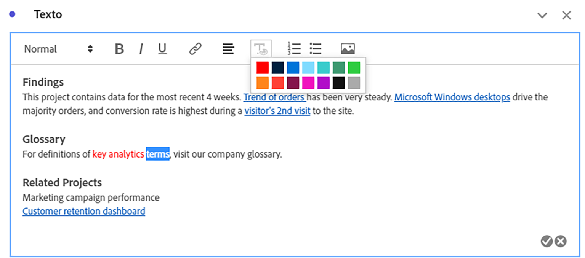
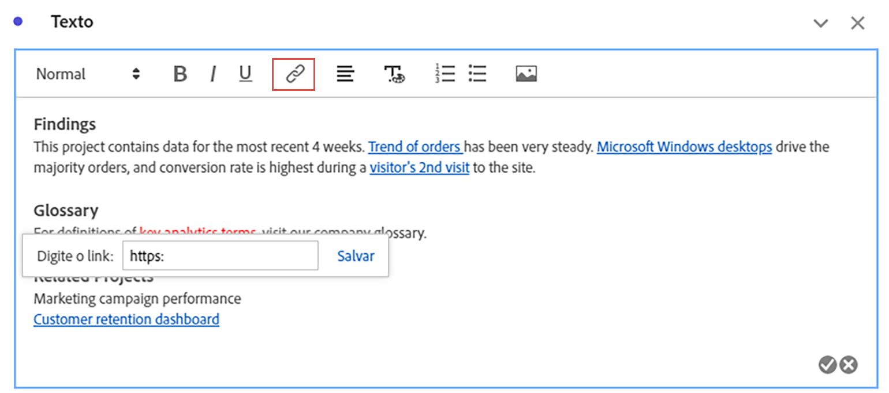
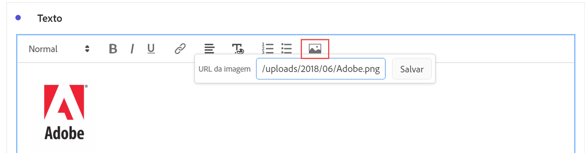

# Texto

Você pode adicionar texto definido pelo usuário ao projeto do Workspace usando visualizações de texto ou descrições de painel/visualização (clique com o botão direito do mouse no cabeçalho > **[!UICONTROL Editar descrição]**). Você também pode alterar a formatação do texto, adicionar hiperlinks e imagens.

## Ajustar a formatação {#format}

Ao editar sua caixa de texto ou descrição, você pode ajustar o tamanho da fonte (níveis de cabeçalho), a cor, o estilo (negrito, itálico, sublinhado) e o alinhamento do texto selecionado. Você também pode adicionar listas numeradas e com marcadores.

## Adicionar hyperlinks {#hyperlinks}

Para adicionar um hiperlink, realce o texto e clique no ícone de hiperlink no menu. Hiperlinks podem ser vinculados a sites externos, páginas de documentação, [projetos/painéis/visualizações do Workspace](https://experienceleague.adobe.com/docs/analytics/analyze/analysis-workspace/curate-share/shareable-links.html?lang=pt-BR) e muito mais para ajudar os destinatários do projeto.

## Adicionar imagens {#images}

Para adicionar uma imagem ao seu projeto, clique no ícone de imagem no menu e insira uma URL de imagem pública. A URL da imagem deve estar acessível publicamente, começar com `https` e ter o formato `.png`, `.jpeg`, `.jpg` ou `.gif`. Há suporte para imagens estáticas e animadas.

