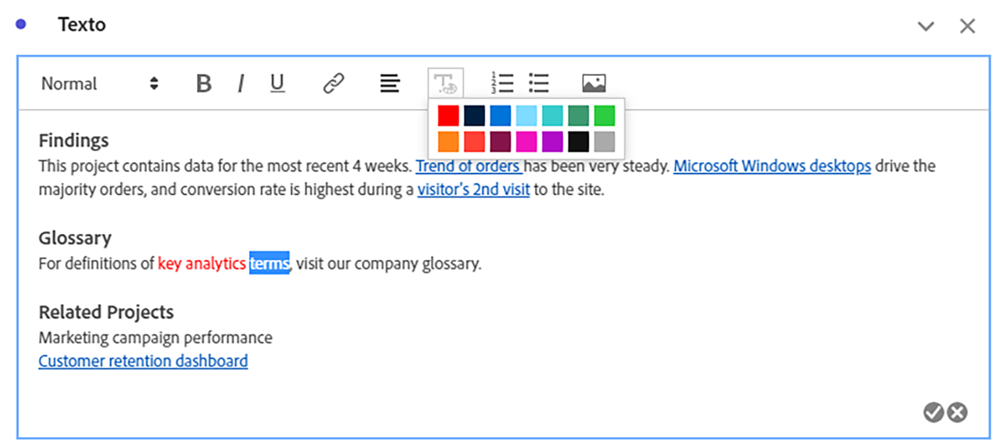
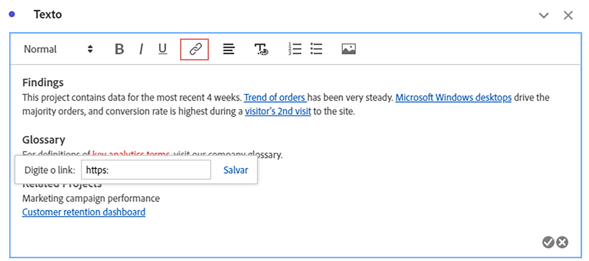
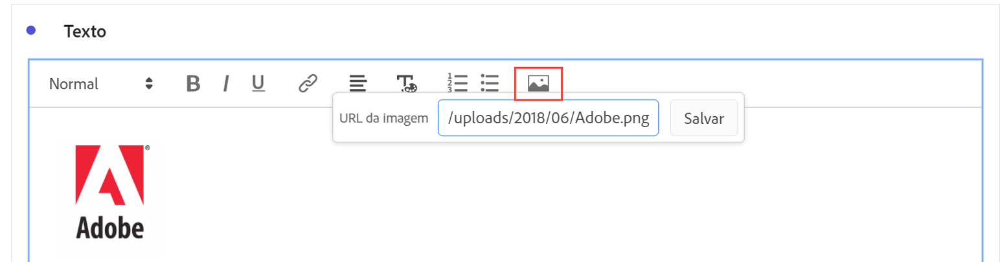

# Texto {#text-visualization}

<!-- markdownlint-disable MD034 -->

>[!CONTEXTUALHELP]
>id="workspace_text_button"
>title="Texto"
>abstract="Adicione uma visualização de rich text definida pelo usuário ao projeto."

<!-- markdownlint-enable MD034 -->

>[!BEGINSHADEBOX]

_Este artigo documenta a visualização de texto no_  _**Customer Journey Analytics**._ _Consulte [Texto](https://experienceleague.adobe.com/pt-br/docs/analytics/analyze/analysis-workspace/visualizations/text) para a versão_  _**Adobe Analytics** deste artigo._

>[!ENDSHADEBOX]

Para adicionar rich text definido pelo usuário ao seu projeto do Workspace, você pode usar uma visualização de  **[!UICONTROL Texto]** ou usar descrições para uma visualização e um painel.

>[!BEGINSHADEBOX]

Consulte  [Visualização de texto](https://experienceleague.adobe.com/en/docs/customer-journey-analytics-learn/tutorials/analysis-workspace/visualizations/add-text-visualizations){target="_blank"} para ver um vídeo de demonstração.

>[!ENDSHADEBOX]

## Usar

Você pode usar a visualização de texto das seguintes maneiras:

1. Adicionar uma visualização de  **[!UICONTROL Texto]**. Consulte [Adicionar uma visualização a um painel](freeform-analysis-visualizations.md#add-visualizations-to-a-panel).

1. Em um painel ou visualização, no menu de contexto, selecione **[!UICONTROL Editar descrição]**.

   Selecione  quando terminar de editar a descrição ou  para cancelar.

Você também pode alterar a formatação do texto, acrescentar hiperlinks e adicionar imagens.

## Ajustar a formatação {#format}

Ao editar sua caixa de texto ou descrição, você pode ajustar o tamanho da fonte (níveis de cabeçalho), a cor, o estilo (negrito, itálico, sublinhado) e o alinhamento do texto selecionado. Você também pode adicionar listas numeradas e com marcadores.

## Adicionar hyperlinks {#hyperlinks}

Para adicionar um hiperlink, realce o texto e selecione  no menu. Você pode usar hiperlinks para prestar assistência adicional aos destinatários do projeto. Os hiperlinks podem ser vinculados a sites externos, páginas de documentação, [projetos, painéis ou visualizações do Workspace](/help/analysis-workspace/curate-share/shareable-links.md), e muito mais.

## Adicionar imagens {#images}

Para adicionar uma imagem ao seu projeto, selecione  no menu, especifique uma URL de imagem na **[!UICONTROL URL da Imagem]** (por exemplo `https://www.adobe.com/uploads/2018/06/Adobe.png`) e selecione **[!UICONTROL Salvar]**.

A URL da imagem deve estar acessível publicamente, começar com `https` e ter o formato `.png`, `.jpeg`, `.jpg` ou `.gif`. Há suporte para imagens estáticas e animadas.

Observe que a inserção de arrastar e soltar em uma imagem não é suportada.

