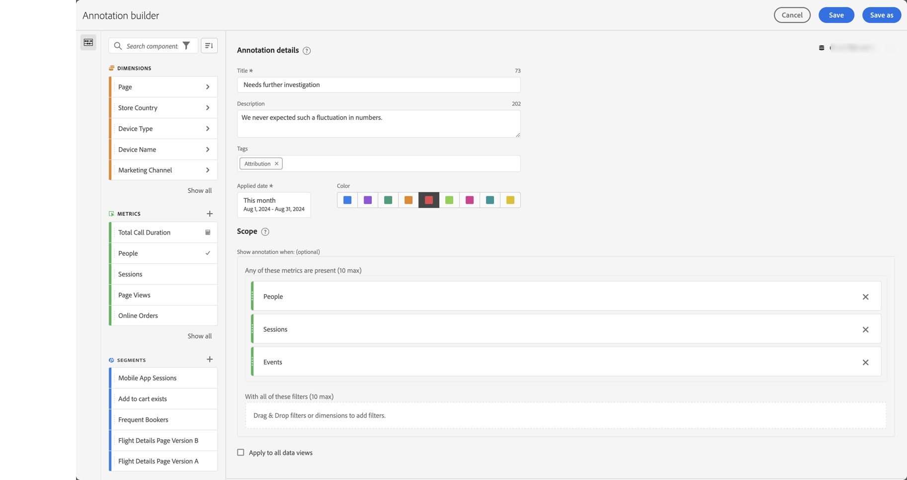

# Criar anotações

Por padrão, somente administradores podem criar anotações. Os usuários têm o direito de visualizar anotações de maneira semelhante à forma como os usuários visualizam outros componentes (como filtros, métricas calculadas etc.).

No entanto, os administradores podem conceder a permissão **[!UICONTROL Criação de anotações]** para **[!UICONTROL Ferramentas de relatórios]** em **[!UICONTROL Editar permissões para acesso ao CJA Workspace]** para usuários através do Admin Console. Consulte [Controle de acesso de nível de usuário](/help/technotes/access-control.md#user-level-access) para obter mais informações.

Você pode criar uma anotação das seguintes maneiras:

* ?? Na interface principal, selecione **[!UICONTROL Componentes]** e selecione **[!UICONTROL Anotações]**. Selecione  [!UICONTROL **[!UICONTROL Add]**] no gerenciador [[!UICONTROL Annotations]](/help/components/annotations/manage-annotations.md).
* ?? Em um projeto do Workspace, no menu de contexto de uma visualização, selecione **[!UICONTROL Criar anotação a partir da seleção]**.
* ?? Em um projeto do Workspace, no menu de contexto em um gráfico de linhas, selecione **[!UICONTROL Anotar Seleção]**.
* ??Em um projeto do Workspace, selecione **[!UICONTROL Componentes]** no menu e selecione **[!UICONTROL Criar anotação]**.
* ?? Em um projeto do Workspace, use o atalho **[!UICONTROL ctrl+shift+o]** (Windows) ou **[!UICONTROL shift+command+o]** (macOS)

Para definir a anotação, use o [[!UICONTROL Construtor de anotações]](#annotation-builder):

<!-- Should we really mention API here. If so, we can do it all over the place in the docs...
| **Use the [Customer Journey Analytics Annotations API](https://developer.adobe.com/cja-apis/docs/endpoints/annotations/)** | The Customer Journey Analytics Annotations APIs allow you to create, update, or retrieve annotations programmatically through Adobe Developer. These APIs use the same data and methods that Adobe uses inside the product UI. |
-->

## Construtor de anotações {#annotation-builder}

<!-- markdownlint-disable MD034 -->

>[!CONTEXTUALHELP]
>id="cja_components_annotations_details"
>title="Detalhes da anotação"
>abstract="As anotações permitem comunicar com eficácia nuances de dados contextuais e insights à sua organização. Eles permitem vincular eventos de calendário a dimensões/métricas específicas."

<!-- markdownlint-enable MD034 -->

<!-- markdownlint-disable MD034 -->

>[!CONTEXTUALHELP]
>id="cja_components_annotations_scope"
>title="Escopo"
>abstract="O escopo permite personalizar quais dados serão anotados. As métricas calculadas e os segmentos não herdarão automaticamente as anotações aplicadas aos componentes usados nas definições. É possível adicionar novas métricas calculadas à seção de escopo de uma anotação existente. Novos segmentos exigem uma nova anotação."

<!-- markdownlint-enable MD034 -->

A caixa de diálogo **[!UICONTROL Construtor de anotações]** é usada para criar anotações novas ou editar anotações existentes. A caixa de diálogo é denominada **[!UICONTROL Nova anotação]** ou **[!UICONTROL Editar anotação]** para anotações que você cria ou gerencia no gerenciador [[!UICONTROL Anotações]](/help/components/annotations/manage-annotations.md).

>[!BEGINTABS]

>[!TAB Construtor de anotações]

>[!TAB Criar/Editar anotação]

>[!ENDTABS]

1. Especifique os seguintes detalhes ( é obrigatório):

   | Elemento | Descrição |
   | --- | --- |
   | **[!UICONTROL Visualização de dados]** | É possível selecionar a visualização de dados para a anotação. A anotação definida está disponível como uma anotação nos projetos do Workspace com base na visualização de dados selecionada. Esta seleção é anulada quando você habilitou [!UICONTROL Aplicar a todas as visualizações de dados]. |
   | **[!UICONTROL Anotação somente de projeto]** | Uma caixa de informações para explicar que a anotação criada é visível somente no projeto do Workspace em que você está trabalhando. Habilite **[!UICONTROL Disponibilizar esta anotação para todos os projetos]**, para tornar a anotação visível para todos os projetos. Essa caixa de informações só é visível quando você cria uma anotação de dentro de um projeto do Workspace. |
   | **[!UICONTROL Título]**  | Nomeie a anotação, por exemplo, `Needs further investigation`. |
   | **[!UICONTROL Descrição]** | Forneça uma descrição para a anotação, por exemplo, `We never expected such a fluctuation in numbers.`. |
   | **[!UICONTROL Tags]** | Organize a anotação criando ou aplicando uma ou mais tags. Comece a digitar para encontrar as tags existentes que você pode selecionar. Ou pressione **[!UICONTROL Enter]** para adicionar uma nova marca. Selecione  para remover uma marca. |
   | **[!UICONTROL Data aplicada]**  | Selecione a data ou o intervalo de datas que precisa estar presente para que a anotação fique visível. Ao criar uma anotação usando o atalho, a anotação assume como padrão um intervalo de dados apenas para o dia. Ao criar uma anotação usando uma seleção em uma visualização, a anotação assume como padrão o intervalo de dados com base no intervalo de datas do painel ao qual a visualização pertence. |
   | **[!UICONTROL Cor]** | Aplicar uma cor à anotação. A anotação aparece no projeto com a cor selecionada. A cor pode ser usada para categorizar anotações, como feriados, eventos externos, problemas de rastreamento etc. |
   | **[!UICONTROL Escopo]** | Arraste e solte métricas do painel do componente que aciona a anotação. Por exemplo Pessoas, Sessões e Eventos. Em seguida, arraste e solte quaisquer dimensões ou filtros do painel de componentes que atuam como filtros para determinar se a anotação deve ser exibida ou não. Se você não especificar um escopo, a anotação se aplica a todos os seus dados.  Você tem duas opções:<ul><li>**[!UICONTROL Qualquer uma destas métricas está presente]**: arraste e solte até 10 métricas que disparam a exibição da anotação. Por exemplo, a métrica Receita parou de coletar dados de um intervalo de datas específico. Arraste a métrica Receita para esta caixa.</li><li>**[!UICONTROL Com todos esses filtros]**: arraste e solte até 10 dimensões ou filtros que filtram se a anotação é exibida.</li></ul>

**Observação:** qualquer anotação aplicada a um componente que é subsequentemente usado como parte de uma métrica calculada ou definição de filtro NÃO herda automaticamente a anotação. A métrica calculada desejada também deve ser adicionada à seção do escopo para exibir a anotação. No entanto, uma nova anotação deve ser criada para qualquer filtro que você deseja anotar com as mesmas informações. Por exemplo, você aplica uma anotação a [!UICONTROL Pedidos] em um dia específico. Em seguida, use [!UICONTROL Pedidos] em uma métrica calculada para o mesmo intervalo de datas. A nova métrica calculada não exibe automaticamente a anotação de pedidos. Adicione também a métrica calculada à seção escopo para que a anotação seja exibida. |
   | **[!UICONTROL Aplicar a todas as visualizações de dados]** | Por padrão, a anotação se aplica à visualização de dados de origem. Ao marcar essa caixa de seleção, a anotação se aplicará a todas as visualizações de dados da empresa. |

   {style="table-layout:auto"}

1. Selecionar
   * **[!UICONTROL Salvar]** para salvar a anotação.
   * **[!UICONTROL Salvar como]** para salvar uma cópia da anotação.
   * **[!UICONTROL Excluir]** para excluir uma anotação.
   * **[!UICONTROL Cancelar]** para cancelar as alterações feitas em uma anotação ou a criação de uma nova anotação.
