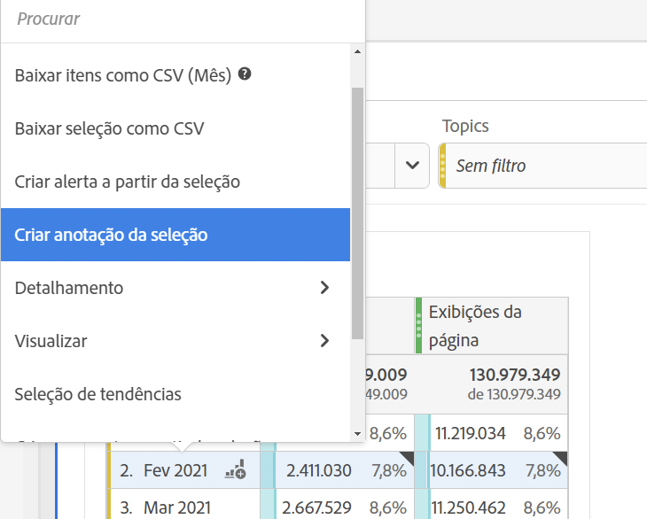
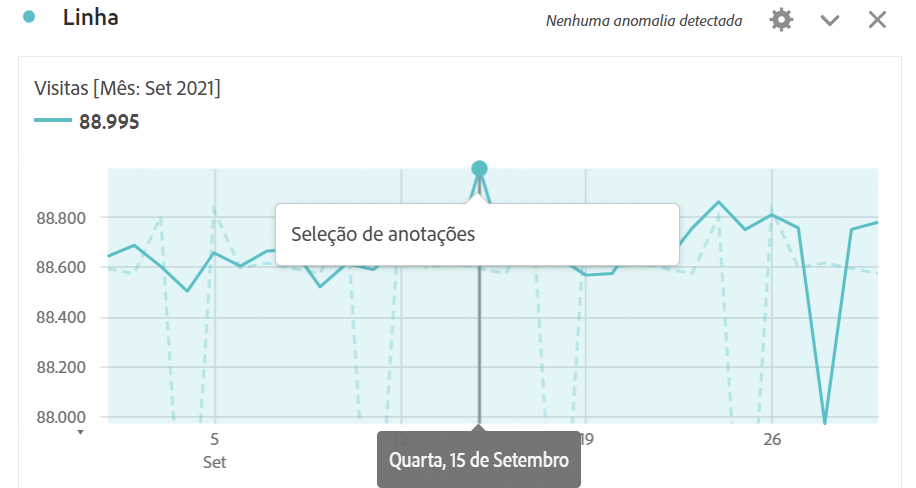
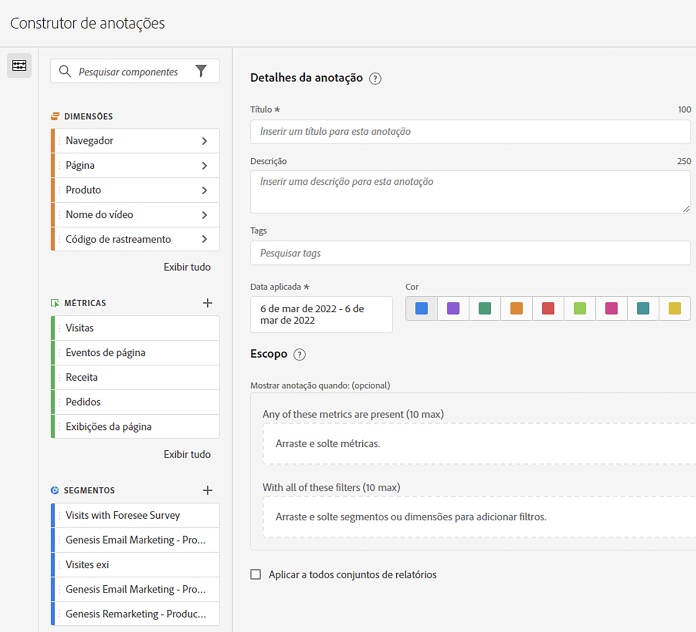

# Criar anotações

Por padrão, somente administradores podem criar anotações. Os usuários têm o direito de visualizar anotações da mesma forma que fazem com outros componentes do Analytics (como filtros, métricas calculadas etc.).

No entanto, os administradores podem fornecer a permissão [!UICONTROL Criação de anotações] (Ferramentas do Analytics) para usuários por meio do [Adobe Admin Console](https://experienceleague.adobe.com/docs/analytics/admin/admin-console/permissions/analytics-tools.html?lang=pt-BR).

1. Para criar anotações, você tem várias maneiras de começar:

| Método de criação | Detalhes |
| --- | --- |
| **Acesse [!UICONTROL Componentes] > [!UICONTROL Anotação].** | A página Gerenciador de anotações é aberta. Clique em [!UICONTROL Criar nova anotação] e o [!UICONTROL Construtor de anotações] é aberto. |
| **Clique com o botão direito do mouse em um ponto da tabela.** | [!UICONTROL O construtor de anotações é aberto. ] Observe que, por padrão, as anotações criadas dessa maneira são visíveis somente no projeto em que foram criadas. Mas você pode disponibilizá-las para todos os projetos. Observe também que a(s) data(s) e qualquer métrica, etc., já foram preenchidas.
 |
| **Clique com o botão direito do mouse em um ponto em um gráfico de [!UICONTROL Linha].** | O [!UICONTROL Construtor de anotações] se abre. Observe que, por padrão, as anotações criadas dessa maneira são visíveis somente no projeto em que foram criadas. Mas você pode disponibilizá-las para todos os projetos. Observe também que a(s) data(s) e qualquer métrica, etc., já foram preenchidas.
 |
| **No Espaço de trabalho, acesse [!UICONTROL Componentes] > [!UICONTROL Criar anotação].** | O [!UICONTROL Construtor de anotações] se abre. |
| **Usar esta tecla de atalho** para abrir o Construtor de anotações: (PC) `ctrl` `shift` + o, (Mac) `shift` + `command` + o | Observe que ao usar a tecla de atalho para criar uma anotação, você cria uma anotação de um dia para a data atual, sem nenhum escopo pré-selecionado (métricas ou dimensões). |
| **Use o [API de anotações Customer Journey Analytics](https://developer.adobe.com/cja-apis/docs/endpoints/annotations/)** | As APIs de anotações Customer Journey Analytics permitem criar, atualizar ou recuperar anotações de forma programática por meio do Adobe Developer. Essas APIs usam os mesmos dados e métodos que a Adobe usa na interface do usuário do produto. |

{style="table-layout:auto"}

1. Preencha os elementos do [!UICONTROL Construtor de anotações].

   

   | Elemento | Descrição |
   | --- | --- |
   | [!UICONTROL Título] | Nomeie a anotação. Por exemplo, &quot;Dia Memorial&quot; |
   | [!UICONTROL Descrição] | (Opcional) Forneça uma descrição para a anotação. Por exemplo, &quot;Feriado público observado nos EUA&quot;. |
   | [!UICONTROL Tags] | (Opcional) Organize as anotações criando ou aplicando uma tag. |
   | [!UICONTROL Data aplicada] | Selecione a data ou o intervalo de datas que precisa estar presente para que a anotação fique visível. |
   | [!UICONTROL Cor] | Aplicar uma cor à anotação. A anotação aparece no projeto com a cor selecionada. A cor pode ser usada para categorizar anotações, como feriados, eventos externos, problemas de rastreamento etc. |
   | [!UICONTROL Escopo] | (Opcional) Arraste e solte as métricas que acionam a anotação. Em seguida, arraste e solte quaisquer dimensões ou filtros que atuam como filtros (ou seja, com os quais a anotação estará visível). Se você não especificar um escopo, a anotação será aplicada a todos os seus dados.<ul><li>**[!UICONTROL Qualquer uma dessas métricas está presente]**: arraste e solte até 10 métricas que dispararão a exibição da anotação.</li><li>**[!UICONTROL Com todos esses filtros]**: arraste e solte até 10 dimensões ou filtros que serão filtrados quando a anotação for exibida.</li></ul>
Casos de uso: um eVar parou de coletar dados de um intervalo de datas específico. Arraste o eVar para a caixa de diálogo **[!UICONTROL Qualquer uma dessas métricas está presente]**. Ou sua métrica [!UICONTROL Visitas] não está relatando dados; siga o mesmo processo.
**Nota:** Qualquer anotação aplicada a um componente que é usado como parte de uma métrica calculada ou definição de filtro NÃO herda automaticamente a anotação. A métrica calculada desejada também deve ser adicionada à seção de escopo para exibir a anotação. No entanto, uma nova anotação deve ser criada para qualquer filtro que você deseja anotar com as mesmas informações.
Exemplo: aplique uma anotação a [!UICONTROL Pedidos] em um dia específico. Em seguida, use [!UICONTROL Pedidos] em uma métrica calculada para o mesmo intervalo de datas. A nova métrica calculada não exibirá automaticamente a anotação de pedidos; a métrica calculada também deve ser adicionada à seção escopo para que a anotação seja exibida. |
   | [!UICONTROL Aplicar a todas as visualizações de dados] | Por padrão, a anotação se aplica à visualização de dados de origem. Ao marcar essa caixa de seleção, é possível fazer com que a anotação se aplique a todas as visualizações de dados na empresa. |
   | [!UICONTROL Aplicar a todos os projetos] | Por padrão, a anotação se aplica ao projeto atual. Ao marcar essa caixa de seleção, é possível fazer com que a anotação se aplique a todos os projetos que você possui. Observe que essa caixa de seleção aparece somente quando você inicia o Construtor de anotações direto do Construtor de anotações. |

   {style="table-layout:auto"}

1. Clique em **[!UICONTROL Salvar]**.
