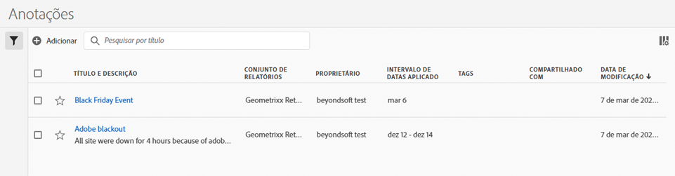

# Gerenciar anotações

O gerenciador em [!UICONTROL Componentes] > [!UICONTROL Anotações] oferece várias formas de gerenciar anotações, como compartilhar, filtrar, marcar, aprovar, copiar, excluir e marcar como favoritos.

O gerenciador [!UICONTROL Anotações] mostra todas as anotações que você possui que foram segmentadas para todos os seus projetos e que foram compartilhadas com você.

>[!NOTE]
>
>As [!UICONTROL Anotações] que você criou apenas para um projeto específico não aparecem no gerenciador.

## Interface do usuário do Gerenciador de anotações

| Elemento da interface | Descrição |
| --- | --- | 
| [!UICONTROL Título e descrição] | Fornecidos no Construtor de anotações. Para editar o título e a descrição, clique no link de título. Isso leva você até o Construtor de anotações. |
| [!UICONTROL Visualização de dados] | As visualizações de dados às quais essa anotação se aplica. |
| [!UICONTROL Proprietário] | Indica quem é o proprietário da anotação. Como um usuário não administrador, você pode ver somente as suas anotações ou as que foram compartilhadas com você. |
| [!UICONTROL Intervalo de datas aplicado] | A data ou o intervalo de datas ao qual essa anotação se aplica. |
| [!UICONTROL Compartilhado com] | Lista com quantos indivíduos ou grupos a anotação foi compartilhada. Clique para obter mais detalhes. |
| [!UICONTROL Data de modificação] | Mostra a data e a hora em que a anotação foi modificada pela última vez. |

{style="table-layout:auto"}

## Editar anotações

Editar uma anotação significa que você pode ajustar intervalos de datas, cores, escopo ou se ela se aplica ou não a todas as visualizações de dados ou projetos. É possível editar anotações de duas formas:

* Em um gráfico de linhas, passe o mouse sobre a anotação e clique no ícone de lápis dentro do popover.

* No [!UICONTROL Gerenciador de anotações], clique no título da anotação.

Ambas as opções o direcionam de volta ao Criador de anotações. Lá, é possível fazer os ajustes necessários e salvar a nova versão.

## Compartilhar anotações

Ao compartilhar anotações ou trabalhar com anotações compartilhadas com você, lembre-se:

* Digamos que você crie um projeto com anotações somente de projeto e, em seguida, compartilhe o projeto com outro usuário. Essas anotações serão exibidas, mas não poderão ser editadas ou excluídas por ninguém com quem você compartilha o projeto.

* Se você salvar uma anotação e compartilhá-la diretamente com um usuário, ele poderá editar/excluir a anotação somente se tiver direitos de administrador.

* Para recapitular, se o projeto for compartilhado com você, ele será exibido somente nesse projeto. Se a anotação for compartilhada diretamente com você, ela será exibida em todos os projetos nos quais essa anotação pode ser exibida.

## Anotações e fusos horários

Todas as anotações são criadas com um carimbo de data e hora, mas nenhuma informação de “hora” ou “fuso horário”. No momento do relatório, o fuso horário da visualização de dados do painel é sempre aplicado. Assim, uma anotação criada para o dia de Natal acontece em 25 de dezembro, independentemente do fuso horário da visualização de dados em que você estiver.

Outro exemplo é o Dia de Ano Novo. A cada hora, um fuso horário diferente dispara fogos de artifício conforme o ano novo começa. Às 22h, Hora das Montanhas dos EUA, a costa leste dos EUA está soltando fogos porque já é meia-noite da Hora do Leste.

## Outras tarefas de anotações

O Gerenciador de anotações permite aos administradores editar, adicionar, marcar, excluir, renomear, aprovar, copiar, exportar e filtrar anotações. Não é visível para usuários não administrativos.

Basta selecionar uma ou mais anotações e a barra de tarefas é exibida.

| Tarefa | Descrição |
| --- | --- |
| Adicionar | Direciona para o construtor de anotações, onde é possível criar novas anotações. |
| Tag | Todos os usuários podem criar tags para anotações e aplicar uma ou mais tags a uma anotação. Entretanto, você pode exibir tags somente dos filtros proprietários. Que tipos de tags você deve criar? Estas são algumas sugestões para tags úteis:<ul><li>Tags com base em nomes de equipe, como Marketing social, Marketing móvel</li><li>Tags de projeto (tags de análise), como análises de página de entrada</li><li>Tags de categoria: masculino; geografia</li><li>Tags de fluxo de trabalho: organizado para (uma unidade de negócio específica); Aprovado</li></ul> |
| Excluir | Excluir uma anotação a remove de qualquer projeto em sua organização. |
| Renomear | Renomear uma anotação a renomeia em todos os projetos aos quais foi aplicada. |
| Copiar | Cria uma cópia distinta com sua própria ID de anotação, mas com o mesmo nome e definição. |
| Exportar para CSV | Exporte a definição da anotação para um arquivo CSV. |
| Filtro (painel esquerdo) | Filtre por tags, visualizações de dados, proprietários e outros filtros (Meus, Aprovados, Favoritos, Compartilhados comigo e Mostrar todos). |

{style="table-layout:auto"}
