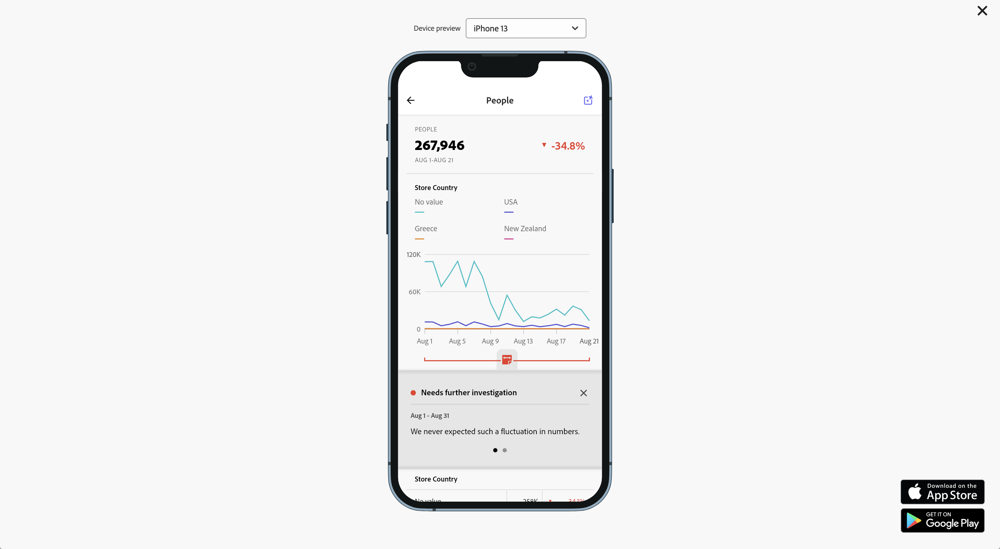

# Anotações de cartão de pontuação

Você pode exibir anotações criadas no Analysis Workspace em cartões de pontuação para dispositivos móveis. As anotações dos cartões de pontuação móveis permitem compartilhar nuances de dados contextuais e insights sobre sua organização e campanhas.

## Exibir anotações em cartões de pontuação móveis

Para destacar anotações em cartões de pontuação para dispositivos móveis, primeiro crie a anotação em projetos do espaço de trabalho ou no menu Componentes.

Para obter informações sobre como criar anotações, consulte [Criar anotações](create-annotations.md). As anotações são desabilitadas em cartões de pontuação para dispositivos móveis por padrão e devem ser habilitadas para cada cartão de pontuação que você deseja exibir em cartões de pontuação para dispositivos móveis.

1. Ativar anotações. Para ativar as anotações, consulte [Ativar ou desativar anotações](overview.md#turn-annotations-on-or-off).

1. Crie uma anotação e verifique se ela está compartilhada com todos os projetos. Consulte [Criar anotações](create-annotations.md) para obter mais informações.

1. Selecione **[!UICONTROL Mostrar anotações]** para exibi-las nos cartões de pontuação para dispositivos móveis.

   

   Também é possível confirmar se a opção **[!UICONTROL Mostrar anotações]** está selecionada em **[!UICONTROL Projeto]** > **[!UICONTROL Informações e configurações do projeto]**

## Visualizar anotações em cartões de pontuação móveis

Quando as anotações estão habilitadas, os ícones de anotação ficam visíveis no Criador de cartões de pontuação. As anotações são exibidas somente em gráficos e tabelas na exibição detalhada. As anotações não são visíveis na exibição principal do bloco do cartão de pontuação.

Quando esses ícones estão visíveis, não é possível visualizar completamente ou interagir com as anotações na tela do criador. Use o ícone de **&#x200B;** para visualizar e interagir com as anotações conforme elas aparecem no aplicativo.

As cores da anotação são selecionadas após criar a anotação no espaço de trabalho. As anotações em cinza indicam a presença de mais de uma anotação.

## Visualizar anotações

Para visualizar a anotação, utilize o ícone de . Selecione uma anotação para abrir seus detalhes.

Se mais anotações estiverem disponíveis, você verá vários pontos (●) na parte inferior da anotação. Deslize para a esquerda ou para a direita para alternar entre as anotações.
