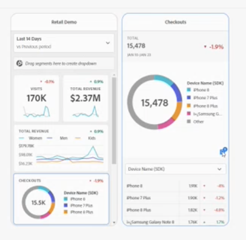

# Compartilhar anotações em Scorecards para dispositivos móveis

Você pode exibir anotações criadas no Workspace - nos Scorecards para dispositivos móveis. Isso permite compartilhar nuances de dados contextuais e insights em sua organização e campanhas diretamente nos Scorecards.

As anotações nos Scorecards para dispositivos móveis funcionam de forma semelhante às anotações do Workspace com alguns recursos adicionais. No Workspace, por exemplo, você pode criar anotações em nível de tabela para um intervalo de datas. Nos Scorecards para dispositivos móveis, você visualiza anotações em nível de categoria. Isso fornece contexto adicional para usuários do Mobile Scorecard.
__adicionar um exemplo - ou mais informações descrevendo a diferença

?? quais recursos adicionais o Mobile possui?

## Adicionar anotações aos Scorecards para dispositivos móveis

As anotações exibidas nos Scorecards para dispositivos móveis são criadas no Workspace usando os métodos de criação de anotação do Workspace. Para obter informações sobre como criar anotações, consulte [Criar anotações](create-annotations.md).

1. Ativar anotações. Para ativar as anotações, consulte [Ativar ou desativar anotações](https://experienceleague.adobe.com/docs/analytics-platform/using/cja-components/annotations/overview.html?lang=en#turn-annotations-on-or-off).

1. Crie uma anotação e a atribua a projetos _globais. Para criar uma anotação no Workspace, consulte [Criar anotações](create-annotations.md).

1. Selecionar **Mostrar anotações** para exibir a anotação nos Scorecards para dispositivos móveis.

Para confirmar que a opção show annotations está selecionada, acesse **Projeto** > **Informações e configurações do projeto**.

## Exibir anotações em Scorecards para dispositivos móveis

No Workspace, você pode verificar as anotações no Construtor. Você também pode usar o modo Visualização para exibir o Scorecard para dispositivos móveis com anotações.

Para exibir anotações em um dispositivo móvel, nos Scorecards para dispositivos móveis, toque em um ícone de anotação. Passe o dedo para a esquerda ou para a direita para exibir anotações adicionais. Isso permite que você visualize rapidamente todas as anotações.

Ao visualizar um __donut, um resumo das anotações aplicadas a uma métrica está localizado no canto inferior direito.

## Considerações de anotação do Scorecard para dispositivos móveis

* Se uma anotação for aplicada a uma categoria e um usuário alternar dessa exibição de categoria, a anotação desaparecerá. As anotações são exibidas somente em uma categoria associada.

* As anotações são desativadas por padrão.

## Cores da anotação

Ao criar uma anotação, você atribui uma cor específica à anotação exibida no Scorecard. As anotações que aparecem em cinza indicam que várias anotações são atribuídas à mesma categoria. Caso contrário, a anotação aparecerá na cor definida no Workspace.
