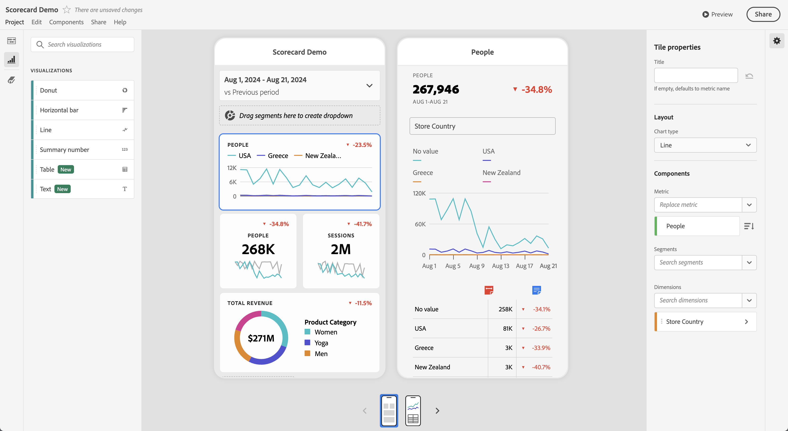

# Compartilhar anotações em Cartões de pontuação para dispositivos móveis

Você pode exibir anotações criadas no Workspace em cartões de pontuação para dispositivos móveis. As anotações em cartões de pontuação móveis permitem compartilhar nuances de dados contextuais e insights sobre sua organização e campanhas.

## Exibir anotações em cartões de pontuação para dispositivos móveis

Para destacar anotações em cartões de pontuação para dispositivos móveis, crie a anotação primeiro em projetos do Espaço de trabalho ou no menu Componentes.

Para obter informações sobre como criar anotações, consulte [Criar anotações](create-annotations.md). As anotações são desativadas em cartões de pontuação para dispositivos móveis por padrão e devem ser ativadas para cada cartão de pontuação que você deseja exibir em cartões de pontuação para dispositivos móveis.

1. Ativar anotações. Para ativar as anotações, consulte [Ativar ou desativar anotações](overview.md#turn-annotations-on-or-off).

1. Crie uma anotação e verifique se ela está compartilhada com todos os projetos. Consulte [Criar anotações](create-annotations.md) para obter mais informações.

1. Selecione **[!UICONTROL Mostrar anotações]** para exibir a anotação nos Cartões de pontuação para dispositivos móveis.

   

   Você pode confirmar opcionalmente que **[!UICONTROL Mostrar anotações]** está selecionado em **[!UICONTROL Projeto]** > **[!UICONTROL Informações e configurações do projeto]**

## Exibir anotações em cartões de pontuação para dispositivos móveis

Quando as anotações são ativadas, os ícones de anotação ficam visíveis no Construtor de cartões de pontuação. As anotações são exibidas somente em gráficos e tabelas na exibição detalhada. As anotações não são visíveis na exibição principal do bloco do cartão de pontuação.

Quando os ícones de anotação estão visíveis, não é possível visualizar ou interagir totalmente com as anotações na tela do construtor. Use o  **[!UICONTROL Preview]** para exibir e interagir com as anotações conforme elas aparecem no aplicativo.

As cores da anotação são selecionadas quando a anotação é criada no Workspace. As anotações em cinza indicavam a presença de mais de uma anotação.

## Visualizar anotações

Você pode visualizar a anotação usando a Visualização do . Selecione uma anotação para abrir os detalhes da anotação.

Se mais anotações estiverem disponíveis, você verá vários pontos ( ●) aparecerem na parte inferior da anotação. Deslize para a esquerda ou para a direita para alternar entre as anotações.
