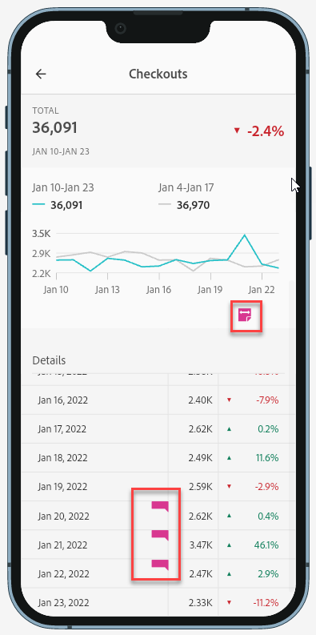

# Compartilhar anotações em Cartões de pontuação para dispositivos móveis

Você pode exibir anotações criadas no Espaço de trabalho, nos Cartões de pontuação para dispositivos móveis. Isso permite compartilhar nuances de dados contextuais e insights sobre sua organização e campanhas diretamente em projetos do Cartão de pontuação para dispositivos móveis, visualizáveis no aplicativo móvel de painéis do Analytics.

## Destacar anotações em Cartões de pontuação para dispositivos móveis

Para destacar anotações em cartões de pontuação para dispositivos móveis, crie a anotação primeiro em projetos do Espaço de trabalho ou no menu Componentes.

Para obter informações sobre como criar anotações, consulte [Criar anotações](create-annotations.md). As anotações são desativadas em cartões de pontuação para dispositivos móveis por padrão e devem ser ativadas para cada cartão de pontuação que você deseja exibir em cartões de pontuação para dispositivos móveis.

1. Ativar anotações. Para ativar as anotações, consulte [Ativar ou desativar anotações](overview.md#annotations-on-off).

1. Crie uma anotação e verifique se ela está compartilhada com todos os projetos. Para criar uma anotação no Espaço de trabalho, consulte [Criar anotações](create-annotations.md).

1. Selecione **[!UICONTROL Mostrar anotações]** para exibir a anotação nos Cartões de pontuação para dispositivos móveis.

   

1. Confirme se a opção mostrar anotações está selecionada, vá para **[!UICONTROL Projeto]** > **[!UICONTROL Informações e configurações do projeto]**.

   

## Exibir anotações em Cartões de pontuação para dispositivos móveis

Quando as anotações são ativadas, os ícones de anotação ficam visíveis no Construtor de cartões de pontuação. As anotações são exibidas somente em gráficos e tabelas na exibição detalhada. As anotações não são visíveis na exibição principal do bloco do cartão de pontuação.

Quando os ícones de anotação estão visíveis, você não pode visualizar ou interagir totalmente com as anotações na tela do construtor. Use o modo de Visualização para exibir e interagir com anotações conforme elas aparecem no aplicativo. 

As cores da anotação são selecionadas quando a anotação é criada no espaço de trabalho. As anotações em cinza indicavam a presença de mais de uma anotação.  

## Exibir anotações do gráfico

| Data | Aparência |
| --- | --- |
| **[!UICONTROL Um diay]** |    |
| **[!UICONTROL Intervalo de datas]** |  |
| **[!UICONTROL Sobreposição de anotações]** |   Para exibir os detalhes da anotação no aplicativo de painéis do Analytics, toque em um ícone de anotação.   Ao visualizar uma anotação em um gráfico, é possível deslizar o dedo para a esquerda e para a direita para navegar por todas as anotações presentes no gráfico. Ao visualizar uma anotação na tabela, passe o dedo para a esquerda e para a direita para navegar em todas as anotações associadas a esse item de linha na tabela.      Em gráficos que não têm um *eixo x* como base de tempo, como os gráficos de rosca ou de barra horizontal, as anotações aplicáveis ao gráfico podem ser visualizadas ao tocar no ícone localizado no canto inferior direito.    |
