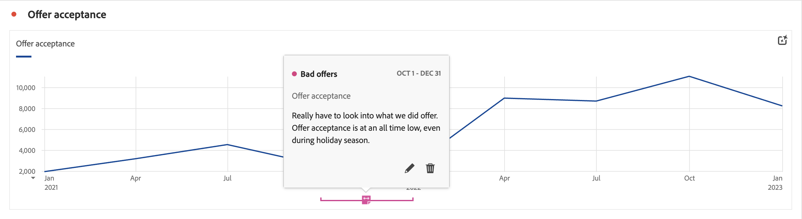

# Visão geral sobre as anotações

As anotações permitem comunicar nuances de dados contextuais e insights com eficiência a outras partes interessadas em sua organização. As anotações permitem vincular eventos de calendário a dimensões e métricas específicas. Você pode anotar uma data ou intervalo de datas com problemas de dados conhecidos, feriados, lançamentos de campanhas etc., Em seguida, é possível exibir graficamente os eventos e verificar se as campanhas ou outros eventos afetaram o tráfego no site, o uso do aplicativo móvel, a receita ou qualquer outra métrica.

Por exemplo, você está compartilhando projetos com sua organização. Se você tiver uma queda acentuada em suas ofertas que estão sendo aceitas, poderá criar uma anotação de **Ofertas inválidas** e colocá-la no escopo para toda a sua visualização de dados. Quando os usuários visualizam qualquer conjunto de dados que inclui essa data, eles veem a anotação nos projetos, junto com seus dados.

As anotações podem se aplicar a:

* Uma única data ou um intervalo de datas.

* Seu conjunto de dados inteiro ou métricas, dimensões ou filtros específicos.

* O projeto no qual as anotações são criadas (padrão) para todos os projetos.

* A visualização de dados em que as anotações são criadas (padrão) ou todas as visualizações de dados.

Consulte [Criar anotações](/help/components/annotations/create-annotations.md) para obter as várias opções disponíveis para criar anotações. Em seguida, você compila, modifica e salva anotações no [Construtor de anotações](create-annotations.md#annotation-builder).

Você usa o [Gerenciador de anotações](manage-annotations.md) para gerenciar anotações.

## Ativar ou desativar anotações

As anotações podem ser ativadas ou desativadas em vários níveis:

| Nível | Como... |
|---|---|
| **Visualização** | Habilite ou desabilite a  > **[!UICONTROL Configurações]** > **[!UICONTROL Mostrar anotações]**.  |
| **Projeto** | Em um menu de projeto do Workspace, selecione **[!UICONTROL Projeto]** > **[!UICONTROL Informações e configurações do projeto]** e habilite ou desabilite **[!UICONTROL Mostrar anotações]**.  |
| **Usuário** | Na guia **[!UICONTROL Componentes]**, selecione **[!UICONTROL Preferências]** ou, em um menu de projeto do Workspace, selecione **[!UICONTROL Projeto]** > **[!UICONTROL Preferências do usuário]**.  Em **[!UICONTROL Preferências]**, selecione **[!UICONTROL Projetos e Análise]**. Na barra de guias à esquerda, selecione **[!UICONTROL Dados]**. Na parte inferior, habilite ou desabilite **[!UICONTROL Mostrar anotações]** abaixo do cabeçalho **[!UICONTROL Tabela de forma livre]**.  |
