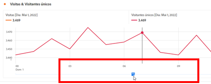
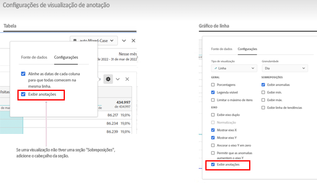

# Visão geral sobre as anotações

As anotações permitem comunicar com eficácia nuances de dados contextuais e insights à sua organização. Elas permitem vincular eventos de calendário a dimensões/métricas específicas. Você pode anotar uma data ou um intervalo de datas com problemas de dados conhecidos, feriados, lançamentos de campanhas etc. Em seguida, você pode exibir graficamente os eventos e ver se as campanhas ou outros eventos afetaram o tráfego do site, o uso do aplicativo móvel, a receita ou qualquer outra métrica.

Por exemplo, digamos que você esteja compartilhando projetos com sua organização. Se você tiver um grande pico no tráfego devido a uma campanha de marketing, poderá criar uma anotação de &quot;Data de lançamento da campanha&quot; e colocá-la no escopo de toda a visualização de dados. Quando os usuários visualizam qualquer conjunto de dados que inclui essa data, eles veem a anotação dentro dos projetos, junto com os dados deles.

Lembre-se:

* As anotações podem ser vinculadas a uma única data ou a um intervalo de datas.

* Elas podem se aplicar a todo o seu conjunto de dados ou a métricas, dimensões ou filtros especificados.

* Podem aplicar-se ao projeto em que foram criadas (padrão) ou a todos os projetos.

* Elas podem se aplicar à visualização de dados em que foram criadas (padrão) ou a todas as visualizações de dados.

## Permissões

Por padrão, somente administradores podem criar anotações. Os usuários têm o direito de visualizar anotações da mesma forma que fazem com outros componentes do Analytics (como filtros, métricas calculadas etc.).

No entanto, os administradores podem fornecer a permissão [!UICONTROL Criação de anotações] (Ferramentas do Analytics) para usuários por meio do [Adobe Admin Console](https://experienceleague.adobe.com/docs/analytics/admin/admin-console/permissions/analytics-tools.html?lang=pt-BR).

## Ativar ou desativar anotações {#annotations-on-off}

As anotações podem ser ativadas ou desativadas em vários níveis:

* No nível de visualização: configurações da [!UICONTROL Visualização] > [!UICONTROL Mostrar anotações]

* No nível do projeto: [!UICONTROL Informações do projeto &amp; configurações] > [!UICONTROL Mostrar anotações]

* No nível do usuário: [!UICONTROL Componentes] > [!UICONTROL Preferências do usuário] > [!UICONTROL Dados] > [!UICONTROL Mostrar anotações]

