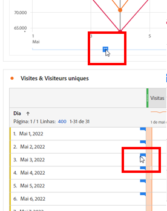
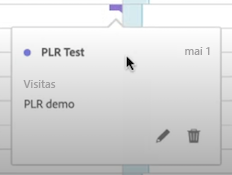
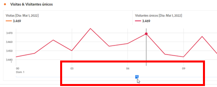
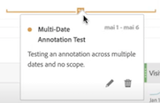
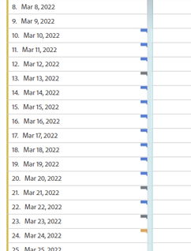
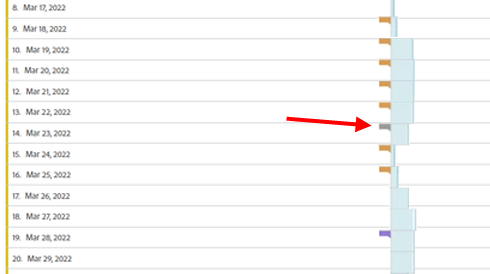
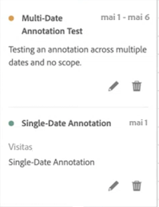
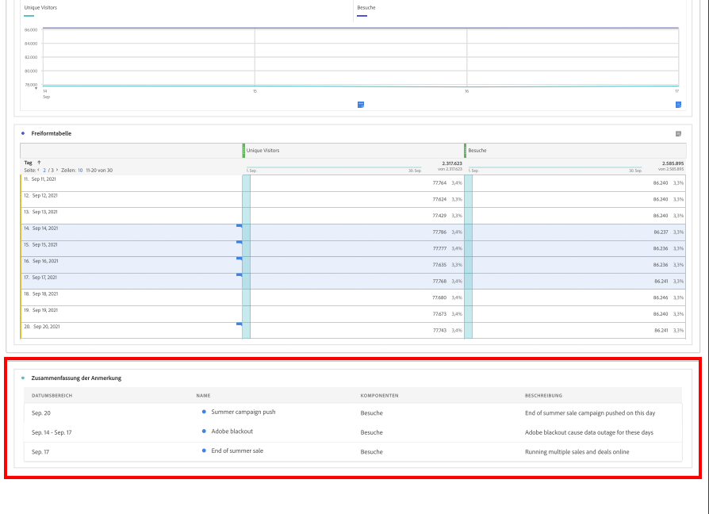
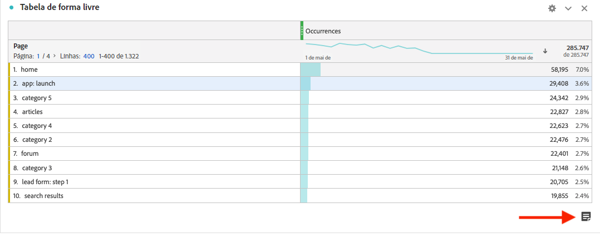
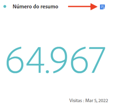

# Exibir anotações

As anotações se manifestam de forma um pouco diferente, dependendo se abrangem um único dia ou um intervalo de datas.

## Exibir anotações em gráficos de linha ou tabelas

| Data | Aparência |
| --- | --- |
| **Dia único** | 
Ao passar o mouse sobre a anotação, é possível visualizar os detalhes, editá-la selecionando o ícone de caneta ou excluí-la:
  |
| **Intervalo de datas** | O ícone muda, e quando você passa o mouse sobre ele, o intervalo de datas é exibido.

Ao selecioná-la no gráfico de linhas, os metadados da anotação são exibidos e você pode editá-los ou excluí-los:
Em uma tabela, um ícone é exibido em cada data no intervalo de datas.
 |
| **Sobreposição de anotações** | Em dias que tenham mais de uma anotação vinculada a eles, o ícone aparece com a cor cinza.

Ao passar o mouse sobre o ícone cinza, todas as anotações sobrepostas são exibidas:
 |

{style="table-layout:auto"}

## Exibir anotações em um arquivo PDF

Como não é possível passar o mouse sobre os ícones em um arquivo PDF, esse arquivo (após a exportação) fornece notas explicativas na parte inferior de um painel. Exemplo:

## Exibir anotações com dados sem tendência

Às vezes, a anotação é mostrada com dados sem tendências, mas vinculada a uma dimensão específica. Nesse caso, elas aparecem somente em um resumo de anotação no canto inferior direito. Veja um exemplo:

O gráfico de resumo é exibido em todos os tipos de visualização no canto, não apenas em tabelas de forma livre sem tendência e números de resumo. Também aparece em visualizações como [!UICONTROL Rosca], [!UICONTROL Fluxo], [!UICONTROL Fallout], [!UICONTROL Coorte] e assim por diante.

