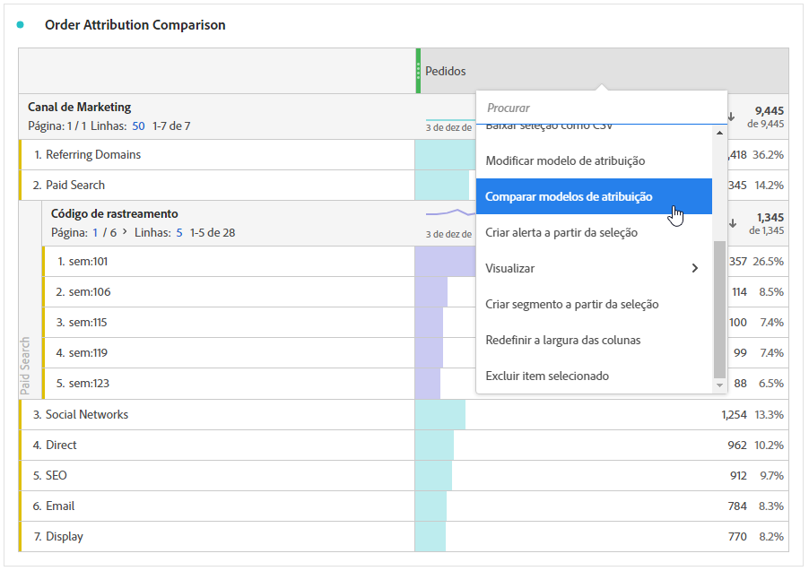

# Métricas

As métricas permitem quantificar os pontos de dados no Analysis Workspace. Elas são usadas com mais frequência como colunas em uma visualização e são vinculadas a dimensões.

## Tipos de métricas

A Adobe oferece vários tipos de métricas para uso no Analysis Workspace:

* **Métricas padrão**: Exemplo de métricas padrão são Pessoas, Sessões, Eventos.

* **Métricas calculadas** : métricas definidas pelo usuário baseadas em métricas padrão, números estáticos ou funções algorítmicas.

* **Modelos de métrica calculada**   : métricas definidas por Adobe que se comportam de forma semelhante às métricas calculadas. É possível usá-los como estão nos projetos do Workspace ou salvar uma cópia para personalizar sua lógica.

É possível ver se uma métrica foi aprovada   ou não. Se quiser obter mais detalhes sobre uma métrica, passe o mouse sobre a métrica e selecione .

As métricas são flexíveis em seu uso no Analysis Workspace. Arrastar uma métrica para uma Tabela de forma livre vazia para ver como essa métrica se comportou ao longo do período do projeto. Você também pode arrastar uma métrica quando uma dimensão estiver presente para ver essa métrica em comparação com cada item de dimensão. Arrastar uma métrica para cima de um cabeçalho de métrica existente a substitui e arrastar uma métrica ao lado de um cabeçalho permite ver ambas as métricas lado a lado.

## Métricas calculadas 

Métricas calculadas permitem ver facilmente como as métricas se relacionam entre si usando operadores simples ou funções estatísticas. Há várias maneiras de criar métricas calculadas:

É possível selecionar **[!UICONTROL Componentes]** > **[!UICONTROL Métricas calculadas]**. Isso leva você ao [Construtor de métrica calculada](/help/components/calc-metrics/calc-metr-overview.md), onde é possível criar métricas personalizadas a partir de métricas existentes.

Para facilitar a criação rápida de métricas calculadas, a opção **[!UICONTROL Criar métrica a partir da seleção]** foi adicionada ao menu da coluna exibida quando clicamos com o botão direito do mouse nas Tabelas de forma livre. Essa opção é exibida quando uma ou mais células de coluna de cabeçalho são selecionadas.

[Métricas calculadas: métricas sem implementação](https://experienceleague.adobe.com/docs/analytics-learn/tutorials/components/calculated-metrics/calculated-metrics-implementationless-metrics.html?lang=pt-BR) (3:42)

## Comparar métricas com diferentes modelos de atribuição

Se você deseja comparar um modelo com outro de maneira fácil e rápida, clique com o botão direito em uma métrica e selecione **[!UICONTROL Comparar modelos de atribuição]**:

Esse atalho permite comparar de forma rápida e fácil um modelo de atribuição com outro, sem arrastar uma métrica e configurá-la duas vezes.
