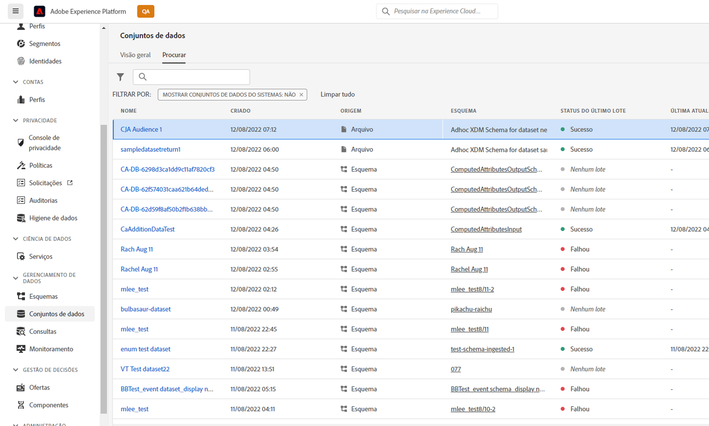

# Gerenciar públicos-alvo criados no Customer Journey Analytics

O gerenciamento de públicos-alvo criados anteriormente permite

* **Agendamento ou desprogramação** atualização/atualização automática de público-alvo. A expiração máxima na programação é de 1 ano.
* **Renovar um agendamento de atualização de público-alvo** quando estiver prestes a expirar. Públicos que expiram são tratados de forma semelhante aos relatórios agendados que expiram - o administrador recebe um email por mês antes de o agendamento expirar.
* Visualize o **última vez que um público-alvo foi atualizado**
* Obter informações sobre o **tempo necessário para produzir um público-alvo** do Customer Journey Analytics (CJA) e o tempo necessário para que o público-alvo apareça no Perfil do cliente em tempo real para fins de ativação.
* Veja se os públicos-alvo no CJA são **uso ativo pelo Perfil do cliente em tempo real** ou (idealmente) quaisquer aplicativos Experience Platform que consumam os públicos-alvo criados pelo CJA.

## Interface do usuário de gerenciamento

captura de tela

| Configuração da interface do usuário | Definição |
| --- | --- |
| Ocultar/Mostrar filtros | Permite mostrar ou ocultar os seguintes filtros no painel esquerdo: <ul><li>Exibição de dados</li><li>Proprietário</li><li>Frequência de atualização</li><li>Tags</li></ul> |
| Título e descrição |  |
| Visualização de dados |
| Tamanho do público |  |
| Proprietário |  |
| Frequência de atualização |  |
| Tags |  |
| Última atualização |  |
| Última modificação |  |

{style=&quot;table-layout:auto&quot;}

## Exibir e usar públicos-alvo do CJA no Experience Platform

Você pode visualizar públicos-alvo do CJA na Platform acessando [!UICONTROL Segmentos] > [!UICONTROL Criar segmentos] > [!UICONTROL Públicos-alvo] guia > [!UICONTROL Públicos-alvo do CJA].

Você pode arrastar os públicos-alvo do CJA para a definição de segmentos do AEP.

Se optar por exportar esse público para o lago de dados da AEP, ele aparecerá como um conjunto de dados em conformidade com a Classe de esquema de perfil individual do XDM:

