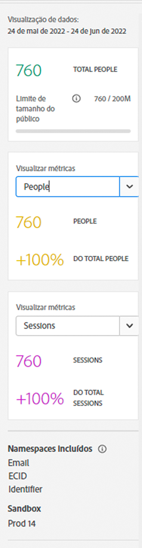
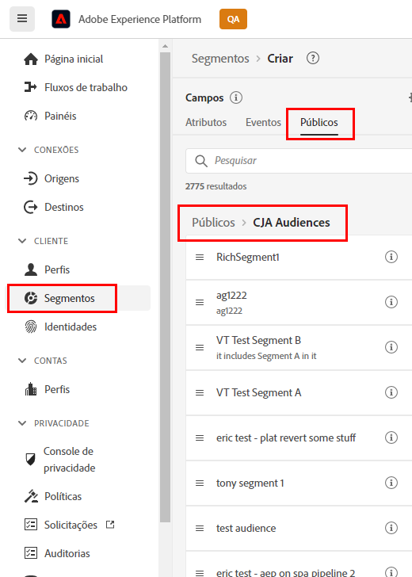

# Criar e publicar públicos

>[!NOTE]
>
>Essa funcionalidade está atualmente em [teste limitado](/help/release-notes/releases.md).

Este tópico discute como criar e publicar públicos-alvo identificados no Customer Journey Analytics (CJA) para [Perfil do cliente em tempo real](https://experienceleague.adobe.com/docs/experience-platform/profile/home.html?lang=pt-BR) no Adobe Experience Platform para direcionamento e personalização de clientes.

Leia isto [visão geral](/help/components/audiences/audiences-overview.md) familiarizar-se com o conceito de públicos-alvo do CJA.

## Criar público-alvo

1. Para criar públicos-alvo, você tem três maneiras de começar:

   | Método de criação | Detalhes |
   | --- | --- |
   | Do principal **[!UICONTROL Componentes] > [!UICONTROL Públicos-alvo]** menu | A página Audiences Manager é aberta. Clique em **[!UICONTROL Criar público-alvo]** e [!UICONTROL Construtor de público-alvo] é aberto. |
   | A partir de uma tabela de forma livre | Clique com o botão direito do mouse em um item na tabela de Forma livre e selecione **[!UICONTROL Criar um público-alvo a partir da seleção]**. O uso desse método preenche o filtro previamente com a dimensão ou o item de dimensão selecionado na tabela. |
   | Na interface de criação/edição do filtro | Marque a caixa que diz **[!UICONTROL Criar um público-alvo com base neste filtro]**. O uso desse método preenche o filtro previamente. |

   {style=&quot;table-layout:auto&quot;}

1. Crie o público-alvo.

   Configure essas configurações antes de publicar o público-alvo.

   

   | Configuração | Descrição |
   | --- | --- |
   | [!UICONTROL Nome] | O nome do público-alvo. |
   | [!UICONTROL Tags] | Quaisquer tags que você deseja atribuir ao público-alvo para fins organizacionais. Você pode usar uma tag pré-existente ou inserir uma nova. |
   | [!UICONTROL Descrição] | Adicione uma boa descrição do público-alvo para diferenciá-lo dos outros. |
   | [!UICONTROL Frequência de atualização] | A frequência na qual você deseja atualizar o público-alvo.<ul><li>Você pode optar por criar um público-alvo único (padrão) que não precise de atualização. Por exemplo, isso pode ser útil para campanhas específicas, únicas.</li><li>Você pode selecionar outros intervalos de atualização. Para a frequência de 4 horas, há um limite de 75 ou 150 públicos-alvo, dependendo do seu direito CJA. Para outros intervalos, não há número máximo de públicos-alvo.</li></ul> |
   | Data de expiração | Quando o público-alvo parará de ser atualizado. O padrão é 1 ano a partir da data de criação. Públicos que expiram são tratados de forma semelhante aos relatórios agendados que expiram - o administrador recebe um email um mês antes de o público expirar. |
   | Atualizar janela de retrospectiva | Especifica até que ponto você deseja voltar na janela de dados ao criar esse público-alvo. O máximo é de 90 dias. |
   | [!UICONTROL Intervalo de datas único] | Intervalo de datas quando você deseja que o público-alvo único seja publicado. |
   | [!UICONTROL Filtro] | Os filtros são a principal entrada para o público. Você pode adicionar até 20 filtros. Esses filtros podem ser unidos com `And` ou `Or` operadores. |
   | [!UICONTROL Ver amostras de IDs] | Um exemplo de IDs neste público-alvo. Use a barra de pesquisa para procurar IDs de exemplo. |

   {style=&quot;table-layout:auto&quot;}

1. Interpretar a visualização de dados.

   A visualização do público-alvo é exibida no painel direito. Ele permite uma análise resumida do público-alvo criado.

   

   | Configuração de visualização | Descrição |
   | --- | --- |
   | [!UICONTROL Visualização de dados] janela | O intervalo de datas do público-alvo. |
   | [!UICONTROL Total de pessoas] | Um número de resumo do número total de pessoas neste público-alvo. Pode chegar a 100 milhões de pessoas. Se seu público-alvo exceder 100 milhões de pessoas, você deverá reduzir o tamanho do público-alvo antes de publicá-lo. |
   | [!UICONTROL Limite de tamanho do público] | Mostra o quão longe está do limite de 100 milhões de pessoas. |
   | [!UICONTROL Retorno estimado do público] | Essa configuração é útil para redirecionar clientes nesse público-alvo que retornam ao site. (Em outras palavras, que são vistas neste conjunto de dados novamente.) 
Aqui, você pode selecionar o período (próximos 7 dias, próximas 2 semanas, próximo mês) para o número estimado de clientes que podem retornar. |
   | [!UICONTROL Estimativa de retorno] | Esse número oferece um número estimado de clientes recorrentes durante o período selecionado na lista suspensa. Observamos a taxa de churn histórica para esse público-alvo prever esse número. |
   | [!UICONTROL Visualizar métricas] | Essa configuração permite que você veja métricas específicas para ver se esse público-alvo contribui com uma quantidade desproporcional para essa métrica, como &quot;[!UICONTROL Receita]&#39; ou &#39;[!UICONTROL Tempo médio no site]&quot;. Ele fornece a contagem agregada da métrica, bem como a porcentagem do total que ela representa. Você pode selecionar qualquer métrica disponível na visualização de dados. |
   | [!UICONTROL Namespaces incluídos] | Os namespaces específicos que estão associados às pessoas no seu público-alvo. Os exemplos incluem ECID, CRM ID, endereços de email, etc. |
   | [!UICONTROL Sandbox] | O [sandbox de Experience Platform](https://experienceleague.adobe.com/docs/experience-platform/sandbox/home.html?lang=pt-BR) em que esse público-alvo reside. Ao publicar esse público-alvo na Platform, você só pode trabalhar com ele nos limites dessa sandbox. |

   {style=&quot;table-layout:auto&quot;}

1. Verifique novamente a configuração do público-alvo e clique em **[!UICONTROL Publicar]**.

   Se tudo correr bem, você receberá uma mensagem de confirmação de que o público-alvo foi publicado. Demora apenas um ou dois minutos para esse público aparecer no Experience Platform. (Mesmo para públicos-alvo com milhões de membros, deve levar menos de 5 minutos.)

1. Clique em **[!UICONTROL Exibir público-alvo no AEP]** na mesma mensagem e você será direcionado para o [Interface do usuário do segmento](https://experienceleague.adobe.com/docs/experience-platform/segmentation/ui/overview.html?lang=en) no Adobe Experience Platform. Veja mais informações abaixo.

## Usar públicos-alvo do CJA no Experience Platform

O CJA agora pega todas as combinações de namespace e ID do seu público-alvo publicado e as transforma em RTCP (Real-time Customer Profile, Perfil do cliente em tempo real). Em seguida, o RTCP examina cada combinação de namespace/ID e procura por um perfil do qual possa fazer parte. Um perfil é basicamente um cluster de namespaces, IDs e dispositivos vinculados. Se encontrar um perfil, ele adicionará o namespace e a ID às outras IDs neste perfil como um atributo de associação de segmento. Agora, por exemplo, &quot;user@adobe.com&quot; pode ser direcionado para todos os dispositivos e canais. Se um perfil não for encontrado, um novo perfil será criado.

Você pode visualizar públicos-alvo do CJA na Platform acessando **[!UICONTROL Segmentos]** > **[!UICONTROL Criar segmentos]** > **[!UICONTROL Públicos-alvo]** guia > **[!UICONTROL Públicos-alvo do CJA]**.

Você pode arrastar os públicos-alvo do CJA para a definição de segmentos do AEP.

## Próximas etapas

* Para gerenciar esse público-alvo, acesse o [Interface do usuário de gerenciamento](/help/components/audiences/manage.md).
