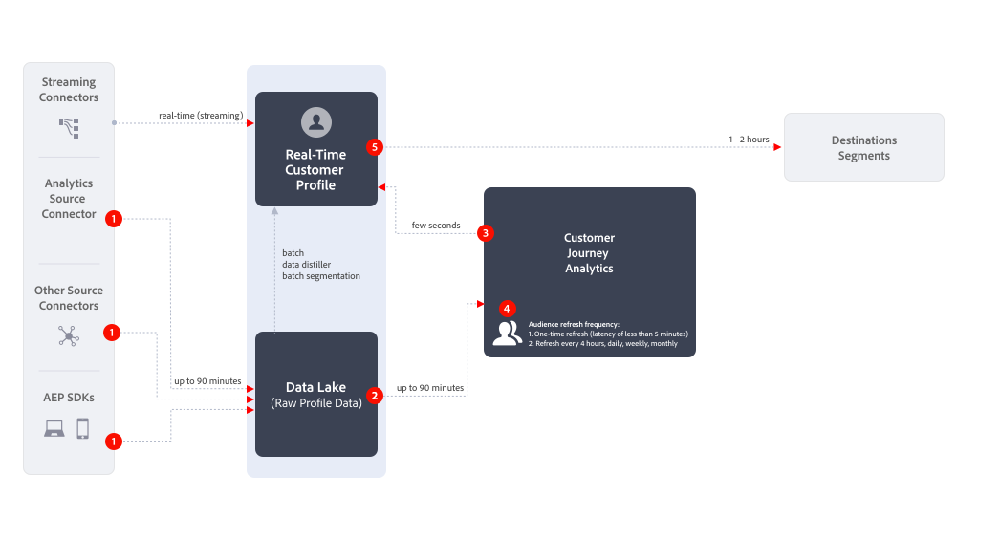

# Criar e publicar públicos-alvo {#create-and-publish-audiences}

<!-- markdownlint-disable MD034 -->

>[!CONTEXTUALHELP]
>id="components_audiences_refreshfrequency"
>title="Frequência de atualização"
>abstract="Veja a frequência com que a associação de um público-alvo é reavaliada. Públicos-alvo únicos são avaliados apenas uma vez."

<!-- markdownlint-enable MD034 -->

<!-- markdownlint-disable MD034 -->

>[!CONTEXTUALHELP]
>id="components_audiences_audiencelimit"
>title="Limite de público-alvo"
>abstract="As atualizações de públicos-alvo são limitadas com base na frequência com que são atualizadas."

<!-- markdownlint-enable MD034 -->

<!-- markdownlint-disable MD034 -->

>[!CONTEXTUALHELP]
>id="component_audiences_refreshlookbackwindow"
>title="Atualizar janela de retrospectiva"
>abstract="Defina o número de dias da retrospectiva, a partir de hoje, com base na qual o público-alvo será avaliado."

<!-- markdownlint-enable MD034 -->

<!-- markdownlint-disable MD034 -->

>[!CONTEXTUALHELP]
>id="component_audiences_audiencesizelimit"
>title="Limite de tamanho do público-alvo"
>abstract="O público-alvo não pode exceder um tamanho de 20 milhões de membros."

<!-- markdownlint-enable MD034 -->

<!-- markdownlint-disable MD034 -->

>[!CONTEXTUALHELP]
>id="component_audiences_namespacesincluded"
>title="Namespaces incluídos"
>abstract="As identidades nesse público-alvo são compostas pelos namespaces abaixo."

<!-- markdownlint-enable MD034 -->

Este tópico discute como criar e publicar públicos-alvo identificados no Customer Journey Analytics no [Perfil do cliente em tempo real](https://experienceleague.adobe.com/pt-br/docs/experience-platform/profile/home) no Adobe Experience Platform para direcionamento e personalização de clientes.

Leia esta [visão geral](/help/components/audiences/audiences-overview.md) para se familiarizar com o conceito de públicos-alvo da Customer Journey Analytics.

## Criar e publicar um público-alvo {#create}

1. Para criar e publicar um público-alvo, siga um destes procedimentos:

   | Método de criação | Detalhes |
   | --- | --- |
   | Na interface de **[!UICONTROL Públicos-alvo]** | Selecione **[!UICONTROL Componentes]** > **[!UICONTROL Públicos-alvo]** no menu principal do Customer Journey Analytics. A interface Públicos-alvo é exibida. Selecione **[!UICONTROL Criar público-alvo]** e o [!UICONTROL Construtor de público-alvo] será aberto. |
   | De uma visualização no Analysis Workspace | Muitas visualizações no Analysis Workspace permitem criar um público usando o menu de contexto. Por exemplo, você pode selecionar **[!UICONTROL Criar público-alvo]** no menu de contexto de um item em uma [Tabela de forma livre](/help/analysis-workspace/visualizations/freeform-table/freeform-table.md) ou em um nó na [Tela de Jornada](/help/analysis-workspace/visualizations/journey-canvas/journey-canvas.md).
O uso desse método preenche o segmento previamente no Construtor de público-alvo com a dimensão ou o item de dimensão selecionado.

As visualizações a seguir permitem criar um público-alvo usando o menu do botão direito do mouse:
<ul><li>[Tabela de coorte](/help/analysis-workspace/visualizations/cohort-table/cohort-analysis.md)</li><li>[Fallout](/help/analysis-workspace/visualizations/fallout/fallout-flow.md)</li><li>[Fluxo](/help/analysis-workspace/visualizations/c-flow/flow.md)</li><li>[Tabela de forma livre](/help/analysis-workspace/visualizations/freeform-table/freeform-table.md)</li><li>[tela de Jornada](/help/analysis-workspace/visualizations/journey-canvas/journey-canvas.md)</li><li>[Venn](/help/analysis-workspace/visualizations/venn.md)</li></ul>
**Observação:** públicos-alvo não podem incluir métricas calculadas. Se você tentar criar um público-alvo que contenha uma métrica calculada, a métrica calculada não será incluída na definição do público-alvo.
 |
   | Na interface de criação/edição de segmentos | Marque a caixa que diz **[!UICONTROL Criar um público-alvo deste segmento]**. O uso desse método preenche o segmento previamente. Consulte [Criar filtros](/help/components/filters/create-filters.md) para obter mais informações. |

   {style="table-layout:auto"}

1. Crie a audiência usando o [Construtor de público-alvo](#audience-builder).

1. Interprete os dados usando o painel [Visualização de data](#data-preview).

1. Selecione **[!UICONTROL [!UICONTROL Exibir IDs de exemplo]]** para exibir uma amostra de IDs neste público-alvo. Na caixa de diálogo **[!UICONTROL IDs de amostra]**, você pode usar a  [!UICONTROL *Pesquisar IDs de amostra*] para procurar IDs de exemplo.

1. Verifique novamente a configuração do público e selecione **[!UICONTROL Publicar]**.
Você receberá uma mensagem de confirmação de que o público-alvo foi publicado. A publicação leva apenas um ou dois minutos para esse público aparecer no Experience Platform.

1. Selecione **[!UICONTROL Exibir público-alvo no AEP]** na mesma mensagem e você será direcionado para a [Interface do usuário do segmento](https://experienceleague.adobe.com/en/docs/experience-platform/segmentation/ui/overview) no Adobe Experience Platform. Veja mais informações abaixo.

## Construtor de público

Defina essas configurações para definir ou atualizar seu público-alvo.

| Configuração | Descrição |
| --- | --- |
|  | Selecione uma visualização de dados para usar na criação do público-alvo. |
| **[!UICONTROL Nome]** | O nome do público. Por exemplo, `Really Interested in Potential Car Buyers` |
| **[!UICONTROL Tags]** | Quaisquer tags que você deseja atribuir ao público-alvo para fins organizacionais. É possível selecionar uma ou mais tags pré-existentes ou inserir uma nova. |
| **[!UICONTROL Descrição]** | Uma descrição do público-alvo para diferenciá-lo dos outros. Por exemplo, `Build an audience of really interested potential car buyers` |
| **[!UICONTROL Frequência de atualização]** | A frequência na qual você deseja atualizar o público-alvo.
Você pode escolher entre <ul><li>**[!UICONTROL Público-alvo]** único: um público-alvo (padrão) que não precisa de atualização. Por exemplo, essa opção pode ser útil para campanhas específicas, únicas. É necessário especificar um **[!UICONTROL Intervalo de datas único]**. Você pode usar o  para inserir um intervalo de datas.</li><li>Um público-alvo interessante. Você pode selecionar entre as opções a seguir:<ul><li>**[!UICONTROL A cada 4 horas]** s: um público-alvo que é atualizado a cada 4 horas.</li><li>**[!UICONTROL Diariamente]**: um público-alvo que é atualizado diariamente</li><li>**[!UICONTROL Semanalmente]**: uma audiência que é atualizada semanalmente.</li><li>**[!UICONTROL Mensal]**: um público-alvo que é atualizado mensalmente</li></ul></li>Para atualizar públicos, é necessário especificar:<ul><li>**[!UICONTROL Atualizar janela de pesquisa]**. Defina o número de dias da retrospectiva, a partir de hoje, que um público-alvo será avaliado. Você pode selecionar entre opções ou definir um Tempo personalizado. O máximo é de 90 dias.</li><li>**[!UICONTROL Data de expiração]**: defina quando o público-alvo para de atualizar. Você pode usar o  para selecionar uma data. O padrão é 1 ano a partir da data de criação. Públicos-alvo que expiram são tratados de forma semelhante aos relatórios agendados que expiram. O administrador recebe um email um mês antes de o público-alvo expirar.</li></ul> Observe que há um limite de 75 a 150 atualizações de público, dependendo dos seus direitos do Customer Journey Analytics.</li></ul> |
| **[!UICONTROL Filtro]** | Os filtros são a principal entrada para o público. Arraste e solte um ou mais segmentos do painel  **[!UICONTROL Segmento]** à esquerda na área Segmento. Você pode usar a  [!UICONTROL *Pesquisar segmentos*] para procurar segmentos. Você pode adicionar até 20 segmentos. Segmentos podem ser unidos com operadores **[!UICONTROL And]** ou **[!UICONTROL Or]**.
Ao criar um público-alvo a partir de uma visualização no Analysis Workspace (como uma tabela de forma livre ou tela de Jornada), todos os segmentos aplicados ao painel ou à coluna são preservados. Você pode remover qualquer segmento aplicado automaticamente.
 |
| **[!UICONTROL Visualização de dados]** | Selecione  para mostrar ou ocultar a [visualização de dados](#data-preview) para o intervalo de datas selecionado. |

## Visualização de dados

O painel Visualização de dados fornece as seguintes informações.

| Elemento | Descrição |
| --- | --- |
| **[!UICONTROL Total de pessoas]** | Um número resumido do número total de pessoas neste público-alvo. O tamanho máximo é de 20 milhões de pessoas. Se o público-alvo exceder 20 milhões de pessoas, você deverá reduzir o tamanho do público-alvo antes de publicar. |
| **[!UICONTROL Limite de tamanho do público]** | Visualização para mostrar a distância que está do limite de 20 milhões de pessoas. |
| **[!UICONTROL Retorno estimado do público]** | Você pode usar esse valor para redirecionar as pessoas nesse público-alvo que retornam ao seu site, aplicativo móvel ou outro canal.
Você pode selecionar o período (**[!UICONTROL Próximos 7 dias]**, **[!UICONTROL Próximas 2 semanas]** ou **[!UICONTROL Próximo mês]**) para o número estimado de clientes que podem retornar. |
| **[!UICONTROL Estimativa de retorno]** | Esse número oferece um número estimado de clientes recorrentes durante o período selecionado. Esse número é previsto usando a taxa de churn histórica para esse público-alvo. |
| **[!UICONTROL Visualizar métricas]** | É possível selecionar uma métrica específica para ver como os dados dessa métrica se baseiam no público-alvo definido.  Cada métrica de Visualização exibe um total para a métrica com base no público-alvo. E uma porcentagem da métrica com base no público do total geral da métrica, conforme definido pela visualização de dados. Por exemplo, 381 pessoas (a métrica selecionada) são o resultado da definição do público-alvo, que é 5% do total de pessoas disponíveis na visualização de dados. Você pode selecionar qualquer métrica disponível na visualização de dados. |
| **[!UICONTROL Namespaces incluídos]** | Os namespaces específicos que estão associados às pessoas no seu público-alvo. Os exemplos incluem ECID, CRM ID, endereços de email, etc. |
| **[!UICONTROL Sandbox]** | A [sandbox da Experience Platform](https://experienceleague.adobe.com/pt-br/docs/experience-platform/sandbox/home) em que esse público-alvo está. Ao publicar esse público-alvo na Platform, você só pode trabalhar com o público-alvo nos limites dessa sandbox. |

{style="table-layout:auto"}

## O que acontece depois que um público-alvo é criado e publicado? {#after-audience-created}

Depois de criar e publicar um público-alvo no Customer Journey Analytics, o público-alvo fica disponível no Experience Platform. Um segmento de transmissão do Adobe Experience Platform só será criado se sua organização estiver configurada para segmentação de transmissão.

* O público-alvo na Platform compartilha o mesmo nome e descrição do público-alvo da Customer Journey Analytics. O nome é anexado à ID de público-alvo da Customer Journey Analytics para garantir que o público-alvo seja exclusivo.
* Quaisquer alterações feitas no nome ou na descrição do público-alvo no Customer Journey Analytics são refletidas no Experience Platform.
* Se um público-alvo for excluído no Customer Journey Analytics, ele continuará disponível no Experience Platform até que a associação de perfil do público-alvo expire. A associação de perfil expira após 420 dias para públicos-alvo únicos e após 16 dias para públicos-alvo recorrentes.

## Considerações sobre latência {#latency}

Em vários pontos antes, durante e depois da publicação do público-alvo, podem ocorrer latências. Esta é uma visão geral de possíveis latências.

|  | Ponto de latência | Duração da latência |
| --- | --- | --- |
| Não exibido | Conector de origem do Adobe Analytics para o Analytics (A4T) | Até 30 minutos |
| 1 | Assimilação de dados no Data Lake (do conector de origem do Analytics ou de outras fontes) | Até 90 minutos |
| 2 | Assimilação de dados do Experience Platform Data Lake na Customer Journey Analytics | Até 90 minutos |
| 3 | Publicação de público-alvo no perfil do cliente em tempo real, incluindo a criação automática do segmento de transmissão e permitindo que o segmento esteja pronto para receber os dados. | Alguns segundos |
| 4 | Atualizar frequência dos públicos | <ul><li>Atualização única (latência inferior a 5 minutos)</li><li>Atualizar a cada 4 horas, diariamente, semanalmente, mensalmente (a latência acompanha a taxa de atualização) |
| 5 | Criação de destino no Adobe Experience Platform: ativação do novo segmento | 1 a 2 horas |

{style="table-layout:auto"}

## Usar públicos-alvo da Customer Journey Analytics no Experience Platform {#audiences-aep}

A Customer Journey Analytics pega todas as combinações de namespace e ID de seu público-alvo publicado e as transmite para o Real-Time Customer Data Platform. O Customer Journey Analytics envia o público-alvo para o Experience Platform com a identidade principal definida, de acordo com o que foi selecionado como a [!UICONTROL ID de pessoa] quando a conexão foi configurada.

Em seguida, o Real-Time Customer Data Platform examina cada combinação de namespace/ID e procura por um perfil do qual possa fazer parte. Um perfil é basicamente um cluster de namespaces, IDs e dispositivos vinculados. Se encontrar um perfil, ele adicionará o namespace e a ID às outras IDs neste perfil como um atributo de associação de segmento. Por exemplo, <user@adobe.com> pode ser direcionado em todos os seus dispositivos e canais. Se um perfil não for encontrado, um novo perfil será criado.

Para exibir públicos-alvo da Customer Journey Analytics na Platform:

1. Expanda **[!UICONTROL Cliente]** no painel esquerdo e selecione **[!UICONTROL Públicos-alvo]**. <!-- is there a folder called "Customer Journey Analytics? -->

1. Selecione a guia **[!UICONTROL Procurar]**.

1. Para localizar o público-alvo publicado no Customer Journey Analytics, siga um destes procedimentos:

   

   * Classifique a tabela pela coluna **[!UICONTROL Origem]** para exibir públicos-alvo que mostram [!UICONTROL **Customer Journey Analytics**] como a origem.

   * Filtrar  em **[!UICONTROL Origem]** e selecionar **[!UICONTROL Customer Journey Analytics]**.

   * Use o campo de pesquisa .

Para obter mais informações sobre como usar o Audiences na Platform, consulte a seção [Audiences](https://experienceleague.adobe.com/en/docs/experience-platform/segmentation/ui/segment-builder) no [guia da interface do usuário do Construtor de segmentos](https://experienceleague.adobe.com/en/docs/experience-platform/segmentation/ui/segment-builder), na documentação da Experience Platform.

### Entender as discrepâncias nas contagens de público

Podem ocorrer discrepâncias nas contagens de público-alvo entre o Customer Journey Analytics e o Real-Time Customer Data Platform.

<!--

-->

#### Contagens estimadas versus determinísticas

A metodologia pela qual os números de associação de público-alvo são calculados difere entre os dois aplicativos, conforme descrito abaixo.

* **Customer Journey Analytics**: a métrica **[!UICONTROL Total de pessoas]** no Customer Journey Analytics é um valor estimado. Isso significa que a contagem é uma estimativa baseada nas regras do público-alvo e pode mudar entre intervalos de atualização.
* **Real-Time Customer Data Platform**: a contagem no Real-Time Customer Data Platform é determinística, com base em trabalhos de avaliação diária, e corrigida no momento em que o público-alvo termina de publicar no portal de público-alvo.

#### Intervalo e taxa de publicação

Os públicos-alvo são publicados na Real-Time Customer Data Platform a uma taxa de 1500 registros por segundo (RPS). Por exemplo, um público-alvo de 20 milhões de membros levará aproximadamente 3,7 horas para publicar totalmente (20M / 1500 RPS / 3600 segundos por hora). Durante esse período, é provável que haja diferenças na associação do público-alvo entre os dois aplicativos.

#### Fragmentação de perfil

Se os perfis importados do Customer Journey Analytics já existirem no Real-Time Customer Data Platform, eles não serão contados como novos perfis. Isso pode fazer com que a contagem de perfis no Real-Time Customer Data Platform seja menor do que o esperado.

#### Públicos-alvo em lote ou de transmissão contínua

Os públicos-alvo da Customer Journey Analytics não são incluídos no trabalho diário de avaliação em lote e permanecem fixos até o próximo intervalo de publicação. Por outro lado, outros públicos-alvo em lote no Real-Time Customer Data Platform são reavaliados a cada 24 horas.

### Principais pontos a serem lembrados

* **Contagens estimadas no Customer Journey Analytics**: entenda que a contagem **[!UICONTROL Total de pessoas]** no Customer Journey Analytics é uma estimativa e pode variar devido aos dados de transmissão e aos comportamentos de identidade.
* **Contagens determinísticas no Real-Time Customer Data Platform**: a contagem no Real-Time Customer Data Platform é fixa e não é alterada até o próximo intervalo de publicação.
* **Fragmentação de perfil**: saiba que os perfis existentes no Real-Time Customer Data Platform podem não contribuir para novas contagens de perfis ao importar do Customer Journey Analytics.

Ao diferenciar claramente esses aspectos, é possível entender e gerenciar melhor os dados de público-alvo no Customer Journey Analytics e no Real-Time Customer Data Platform.—>

## Perguntas frequentes {#faq}

Perguntas frequentes sobre a publicação de público-alvo.

+++**O que acontece se um usuário não é mais membro de um público-alvo no Customer Journey Analytics?**

Nesse caso, um evento de saída é enviado para o Experience Platform a partir do Customer Journey Analytics.

+++

+++**O que acontece se você excluir um público no Customer Journey Analytics?**

Quando um público-alvo da Customer Journey Analytics é excluído, ele não é mais exibido na interface do usuário do Experience Platform. No entanto, os perfis associados a esse público-alvo não são excluídos no Experience Platform.

+++

+++**Se um perfil correspondente não existir no Real-Time Customer Data Platform, um novo perfil será criado?**

Sim, será.

+++

+++**O Customer Journey Analytics envia os dados de público-alvo como eventos de pipeline ou como um arquivo simples que também vai para o data lake?**

O Customer Journey Analytics transmite os dados para o Real-Time Customer Data Platform por meio de pipeline e esses dados também são coletados em um conjunto de dados do sistema no data lake.

+++

+++**Que identidades o Customer Journey Analytics envia?**

Qualquer par de identidade/namespace que tenha sido especificado na [Configuração de conexão](https://experienceleague.adobe.com/en/docs/analytics-platform/using/cja-connections/create-connection). Especificamente, a etapa quando um usuário seleciona o campo que deseja usar como a ID de pessoa.

+++

+++**Qual ID é escolhida como a identidade principal?**

Veja acima. Somente uma identidade por pessoa Customer Journey Analytics é enviada.

+++

+++**O Real-Time Customer Data Platform também processa as mensagens do Customer Journey Analytics? O Customer Journey Analytics pode adicionar identidades a um gráfico de identidade de perfil por meio do compartilhamento de público-alvo?**

Não. Somente uma identidade por pessoa é enviada, portanto, não haveria bordas de gráfico para o Real-Time Customer Data Platform consumir.

+++

+++**Que hora do dia ocorrem as atualizações diárias, semanais e mensais? Que dia da semana ocorrem as atualizações semanais?**

O momento da atualização é baseado em quando o público original foi publicado e ancora esse horário do dia (e dia da semana ou mês).

+++

+++**Você pode configurar o horário de atualização diário, semanal e mensal?**

Não, os usuários não podem configurar o horário da atualização.

+++

## Próximas etapas

* Para gerenciar esse público-alvo, acesse a [Interface do usuário de gerenciamento](/help/components/audiences/manage.md).
