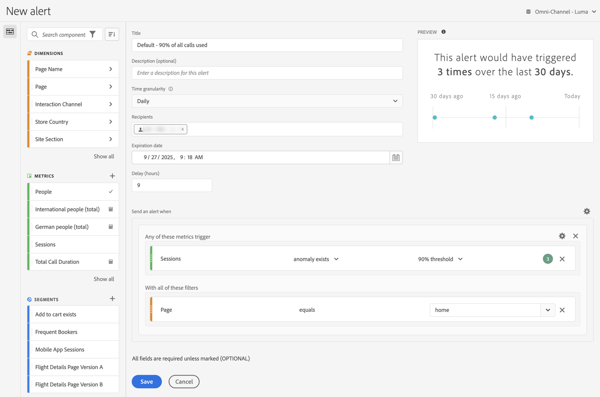

# Criar alertas {#create-alerts}

<!-- markdownlint-disable MD034 -->

>[!CONTEXTUALHELP]
>id="components_alerts_timegranularity"
>title="Granularidade de tempo"
>abstract="A granularidade de tempo se refere à frequência com a qual o alerta será verificado e ao que será incluído"

<!-- markdownlint-enable MD034 -->

>[!NOTE]
>
>O uso de alertas com detecção de anomalias (também conhecidos como _Alertas inteligentes_) está disponível somente para organizações com um pacote Prime ou Ultimate do Customer Journey Analytics.

Os alertas no Customer Journey Analytics permitem a notificação com base em porcentagens alteradas ou pontos de dados específicos. Dependendo do pacote do Customer Journey Analytics, você também pode usar alertas para serem acionados com base em limites de anomalias. 

Para informações de visão geral mais detalhadas sobre alertas, consulte [Visão geral dos alertas](/help/components/c-intelligent-alerts/intelligent-alerts.md).

Para criar um alerta:

1. No Customer Journey Analytics, <!-- add this back in after the other methods are available like in AA and make a bulleted list: "You can access the alert builder in any of the following ways:" -->, selecione **[!UICONTROL Componentes]** > **[!UICONTROL Alertas]**. No [Gerenciador de alertas](alert-manager.md), selecione  **[!UICONTROL Adicionar]** para criar um novo alerta ou escolha qualquer um dos alertas listados para modificar um alerta existente.

   A interface do [Construtor de alertas](#alert-builder) é exibida.

1. Clique em **[!UICONTROL Salvar]** para salvar o alerta. Clique em **[!UICONTROL Salvar como]** para salvar uma cópia do alerta.

## Construtor de alertas

A interface do Criador de alertas é semelhante àquela que cria segmentos ou métricas calculadas no Customer Journey Analytics:

Especifique os seguintes detalhes no Construtor de alertas para um alerta:

| Elemento | Descrição |
|---------|----------|
| **[!UICONTROL Título]** | Especifique um nome para o alerta. O nome do alerta pode conter o nome do relatório ou o limite da métrica. |
| **[!UICONTROL Descrição (opcional)]** | Especifique uma descrição para o alerta. |
| **[!UICONTROL Granularidade de tempo]** | Selecione a frequência com que deseja verificar a métrica: por dia, hora ou mês.
<b>Observação:</b>para visualizações de dados com um calendário personalizado, não oferecemos suporte à granularidade mensal no Construtor de alertas.<!--true?-->
 |
| **[!UICONTROL Destinatários]** | Especifique para onde o alerta pode ser enviado. Um alerta pode ser enviado a um usuário do Analytics, a um grupo do Analytics, a um endereço de email bruto ou a um número de telefone.
<b>Importante:</b>o telefone deve ser precedido por um “+” e um [código de país](https://countrycode.org/).

o email que um usuário recebe após um alerta ser acionado é similar a este:

 |
| **[!UICONTROL Data de expiração]** | Defina a data e a hora em que deseja que o alerta expire. |
| **[!UICONTROL Atraso]** | O tempo necessário antes que os dados sejam concluídos e estejam disponíveis para serem relatados no Customer Journey Analytics muda de acordo com a organização, normalmente com uma variação de 3 a 9 horas após o horário do evento de dados. Para que os alertas sejam precisos, os dados de evento para um determinado intervalo de evento devem ser concluídos, o que significa que a Adobe não está mais recebendo dados de evento para o intervalo de evento especificado.
Para levar em conta esse atraso no tempo de ingestão, os alertas têm um atraso padrão de 9 horas antes de serem enviados.

É possível ajustar o atraso padrão de 9 horas para qualquer valor entre 0 e 24 horas. No entanto, diminuir o atraso para menos de 9 horas pode significar que você está relatando dados incompletos, o que resulta em informações de alerta imprecisas.

Leve em consideração o seguinte ao diminuir o tempo de atraso:
<ul><li>**Entenda a disponibilidade de dados em comparação com a integridade de dados**: embora alguns dados possam estar disponíveis para relatar antes, todos os dados em lote são assimilados em um conjunto de dados da Platform somente após um período de 3 a 9 horas. Para que os alertas sejam precisos, a ingestão de dados deve ser concluída, com todos os dados em lote disponíveis no conjunto de dados.</li><li>**Determine quanto tempo leva para que seus dados sejam concluídos e estejam disponíveis no conjunto de dados**: os tempos de ingestão de dados diferem de acordo com a organização. Certifique-se de que o tempo de atraso escolhido para a entrega de alertas é o mesmo ou menos frequente do que o tempo que leva para que os dados em lote fiquem disponíveis no conjunto de dados da Platform<!--add link? -->.</li>
**Dica:** a maneira mais precisa de saber o tempo necessário para que todos os dados em lote sejam concluídos e assimilados no conjunto de dados da Platform é consultar os engenheiros de dados em sua organização.

Como alternativa, você pode ter uma ideia geral de quanto tempo leva para que a entrega em lote em sua organização fique disponível no conjunto de dados da Platform criando a seguinte tabela de forma livre no Analysis Workspace:
<ol><li>Em uma tabela de forma livre no Analysis Workspace, adicione uma métrica [!UICONTROL **Eventos**] e uma dimensão [!UICONTROL **Dia**].</li><li>Detalhe a dimensão [!UICONTROL **Dia**] usando uma dimensão [!UICONTROL **Horas**].
Horas que não têm dados serão exibidas como 0.
</li></ol><li>**Considere possíveis erros em seus cálculos**: se você diminuir o tempo de atraso padrão, recomendamos configurar o atraso para pelo menos uma hora a mais do que o tempo que leva para a organização concluir a ingestão de dados. Por exemplo, se houver um atraso de 3 horas antes da conclusão da ingestão de dados, você deve definir o atraso em 4 horas.</li></ul>
Para obter mais informações, consulte [Os tempos da ingestão de dados variam no Customer Journey Analytics](/help/components/c-intelligent-alerts/alerts-feature-comparison.md#data-ingestion-times-vary-in-customer-journey-analytics), no artigo [Comparação de recursos de alertas: Customer Journey Analytics e Adobe Analytics](/help/components/c-intelligent-alerts/alerts-feature-comparison.md). |
| **[!UICONTROL Enviar um alerta quando]**: | [!UICONTROL **Qualquer uma destas métricas aciona**]: arraste e solte métricas (incluindo métricas calculadas) aqui para criar acionadores para o alerta.
Será exibida uma mensagem **“componentes incompatíveis”** se nem todas as métricas, dimensões ou segmentos no alerta forem compatíveis com a visualização de dados selecionada atualmente.

Determine o limite que a métrica deve exceder antes de definir um alarme. Você pode definir este valor para um limite e, em seguida, para uma das condições a seguir:
<ul><li>a anomalia existe</li><li>a anomalia está acima do esperado</li><li>a anomalia está abaixo do esperado</li><li>é igual ou maior que</li><li>é igual ou menor que</li><li>alterações por</li><li>Você pode definir um limite de 90%, 95%, 99%, 99,75% e 99,9%.</li></ul>
[!UICONTROL **Com todos esses segmentos**]: arraste e solte segmentos ou dimensões para adicionar segmentos. Por exemplo, adicionar um segmento “Somente dispositivos móveis” significaria que a regra é acionada apenas para dispositivos móveis. Você pode adicionar outros segmentos usando uma instrução AND. Você pode adicionar regras AND ou OR, clicando no ícone de engrenagem.

Consulte [Alertas - casos de uso](/help/components/c-intelligent-alerts/alerts-use-cases.md) para exemplos de casos de uso.
 |
| **[!UICONTROL Pré-visualizar]** | A pré-visualização de alertas interativa mostra a frequência de acionamento aproximada de um alerta com base na experiência passada.
Por exemplo, se você definir a granularidade de tempo para diário, a visualização pode informar se o alarme foi disparado para uma determinada métrica x vezes durante os últimos 30 ou 31 dias.

Se achar que muitos alertas podem ser acionados, é possível ajustar o limite no [Gerenciador de alertas](/help/components/c-intelligent-alerts/alert-manager.md).

{width="50%"}
 |
