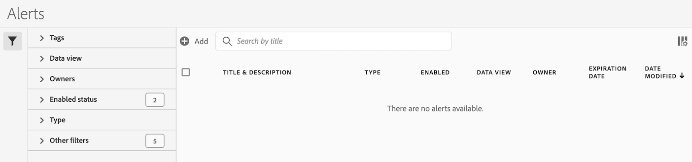
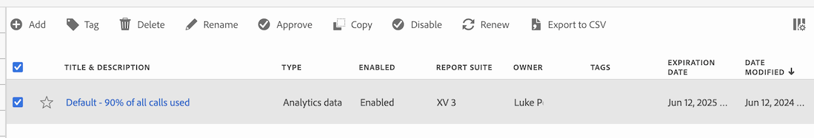

# Gerenciar alertas

Você pode gerenciar alertas existentes no Gerenciador de alertas. Você pode executar várias tarefas de gerenciamento em alertas, como marcar, renomear, excluir e muito mais.

O gerenciador de Alertas está estruturado de maneira semelhante ao [Gerenciador de filtros](/help/components/filters/manage-filters.md) e ao [Gerenciador de Métricas Calculadas](/help/components/calc-metrics/cm-workflow/cm-manager.md).

## Criar alertas

Para criar alertas a partir do Gerenciador de alertas:

1. Selecione **[!UICONTROL Componentes]** > **[!UICONTROL Alertas]** para acessar o gerenciador de Alertas no Customer Journey Analytics.

   

1. Selecione [!UICONTROL **Adicionar**] (ou [!UICONTROL **Criar novo alerta**] se você não tiver nenhum alerta existente).

1. Continue com [Criar alertas](/help/components/c-intelligent-alerts/alert-builder.md) para obter mais detalhes sobre como criar alertas.

## Gerenciar alertas existentes

Para gerenciar alertas existentes no Gerenciador de alertas:

1. Selecione **[!UICONTROL Componentes]** > **[!UICONTROL Alertas]** para acessar o gerenciador de Alertas no Customer Journey Analytics.

   

1. Selecione um ou mais alertas que deseja gerenciar.

   

1. Na barra de ações, selecione qualquer uma das seguintes opções:

   | Ação | Função |
   |---------|----------|
   | [!UICONTROL **Tag**] | Aplicar uma tag a um alerta. Isso ajuda a organizar alertas para facilitar o uso. |
   | [!UICONTROL **Excluir**] | Exclui o alerta. |
   | [!UICONTROL **Renomear**] | Renomeia o alerta. |
   | [!UICONTROL **Aprovar**] | Marcar o alerta como Aprovado. |
   | [!UICONTROL **Copiar**] | Cria uma cópia (duplicata) do alerta. |
   | [!UICONTROL **Desabilitar**] | Desativa um alerta atualmente ativado. |
   | [!UICONTROL **Ativar**] | Ativa um alerta desativado no momento. |
   | [!UICONTROL **Renovar**] | Renova a data de expiração do alerta. Essa ação estende a data de expiração para 1 ano a partir do dia em que você selecionou essa opção, independentemente da data de expiração original. |
   | [!UICONTROL **Exportar para CSV**] | Exporta o alerta para um arquivo .CSV. |

## Editar um alerta

Para editar um alerta existente:

1. Selecione **[!UICONTROL Componentes]** > **[!UICONTROL Alertas]** para acessar o gerenciador de Alertas no Adobe Analytics.

   

1. Selecione o nome do alerta na coluna [!UICONTROL **Título e descrição**].

1. Edite o alerta conforme desejado.

   Veja a seguir algumas das coisas que você pode fazer ao editar um alerta:

   * Adicionar alertas a outros conjuntos de relatórios
   * Alterar o proprietário
   * Atualizar os filtros
   * Atualizar a data de expiração

1. Edite o alerta e selecione [!UICONTROL **Salvar**].

## Configurar colunas

Você pode configurar as informações exibidas para cada alerta no Gerenciador de alertas, configurando as colunas exibidas.

Para configurar as colunas visíveis no Gerenciador de alertas:

1. No Adobe Analytics, selecione a guia **[!UICONTROL Componentes]** e selecione **[!UICONTROL Alertas]**.

1. No Gerenciador de alertas, selecione o ícone **Personalizar colunas**  e selecione as colunas que deseja exibir no gerenciador de alertas.

   As seguintes colunas estão disponíveis:

   | Título da coluna | Descrição |
   |---|---|
   | Título e descrição | Esses valores são fornecidos no Criador de alertas. Para editar o título e a descrição, selecione o link de título para abrir o Criador de alertas. |
   | Favoritos | Exibe ícones de estrela ao lado de cada alerta, permitindo marcar os alertas como favoritos. <!-- For more information, see [Mark calculated metrics as favorites](/help/components/c-calcmetrics/c-workflow/cm-workflow/cm-favorite.md). --> |
   | Tipo | Mostra se o alerta é um alerta de dados do Analytics ou um alerta de uso de chamada do servidor. |
   | Ativado | Mostra se o alerta está ativado ou desativado no momento. |
   | Conjunto de relatórios | Indica em qual conjunto de relatórios o alerta foi salvo pela última vez. |
   | Proprietário | Indica quem possui o alerta. Como um usuário não administrativo, você pode ver somente os alertas que possui ou que foram compartilhados com você. |
   | Tags | Mostra marcas que foram aplicadas ao alerta por você ou por pessoas que compartilharam o alerta com você. |
   | Data de validade | Mostra a data e a hora em que o alerta está definido para expirar. |
   | Data de modificação | Indica a data em que o alerta foi modificado pela última vez. |

   {style="table-layout:auto"}

   <!-- When "Last used" column is added, add this information as the description: Shows the date when the alert was last used. 
This information can help you determine whether a component is valuable to users in your organization, where it is used, and if it needs to be deleted or modified.

Consider the following when viewing this column:
<ul><li>This information does not include usage from the API, Report Builder, or Data Warehouse.</li><li>For some components, this column might not contain data if the component was last used prior to September 2023.</li></ul> -->

## Solução de problemas de um alerta

Ao solucionar um problema com um alerta, forneça o número da JID (ID de instância de trabalho) para o Suporte Adobe. O número JID está localizado na parte inferior do email de notificação de alerta que você recebeu.

