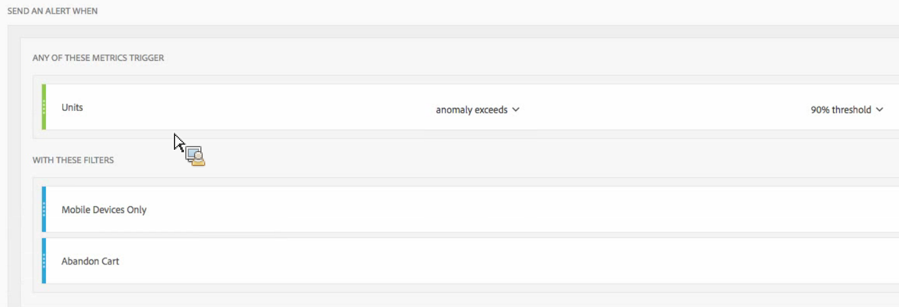

# Alertas - Casos de uso

Você pode criar alertas conforme descrito em [Criar alertas](/help/components/c-intelligent-alerts/alert-builder.md).

As seções a seguir ilustram exemplos de casos de uso a serem considerados ao criar alertas.

## Criar alertas simples filtrados por dois filtros {#section_2E96FFFA93D44F7D8DBCEC97203204AA}

<!-- 

Update screenshots for better readability.

 -->

## Consolidar (empilhar) alertas em vez de criar vários alertas {#section_B27B0856BA104B9FB6D0BBB317633F18}

O empilhamento de alertas combina os alertas para que você não receba vários alertas separados.

