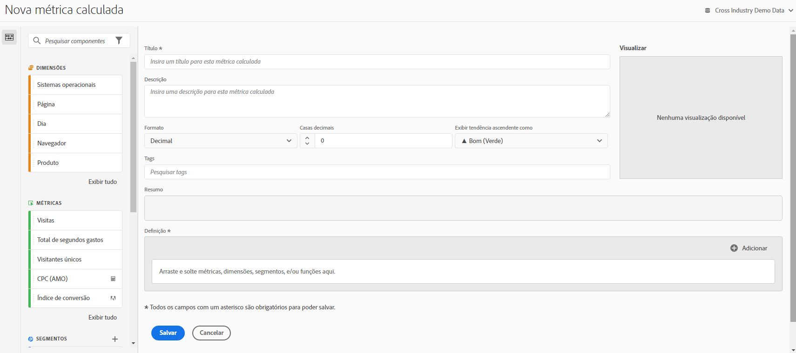

# Criar métricas

O Customer Journey Analytics fornece uma tela para arrastar e soltar dimensões, métricas, filtros e funções a fim de criar métricas personalizadas com base na lógica, nas regras e nos operadores da hierarquia do container. Essa ferramenta de desenvolvimento integrado permite criar e salvar métricas calculadas simples ou métricas calculadas avançadas complexas.

## Começar a criar uma métrica calculada

Você pode usar o construtor de métrica calculada para criar métricas calculadas. Quando criadas dessa forma, as métricas calculadas ficam disponíveis na lista de componentes e podem ser usadas em projetos em toda a organização. Como alternativa, crie uma métrica calculada rápida, conforme descrito em [Criar métricas calculadas para um único projeto](/help/components/apply-create-metrics.md#create-calculated-metrics-for-a-single-project) em [Métricas](/help/components/apply-create-metrics.md).

Acesse o construtor de métricas calculadas para começar a criar uma métrica calculada que esteja disponível na lista de componentes.

1. Acesse o construtor de métricas calculadas de qualquer uma das seguintes maneiras:

   * No Analysis Workspace, abra um projeto e selecione **[!UICONTROL Componentes]** > **[!UICONTROL Criar métrica]**.
   * No Analysis Workspace, abra um projeto e selecione o ícone **De adição** ao lado da seção [!UICONTROL **Métricas**] no painel esquerdo.
   * Em [!DNL Customer Journey Analytics], vá para **[!UICONTROL Componentes]** > **[!UICONTROL Métricas calculadas]** e selecione **[!UICONTROL + Adicionar]** na parte superior da página Métricas calculadas.

1. Continue com [Áreas do construtor de métrica calculada](#areas-of-the-calculated-metrics-builder).

## Áreas do construtor de métricas calculadas

<!-- 

>[!CONTEXTUALHELP]
>id="cja_journeycanvas_viz_product_compatibility"
>title="Product compatibility"
>abstract="Indicates where in Customer Journey Analytics this calculated metric can be used, such as in Analysis Workspace, Report Builder, and so forth."  
>"Some calculated metrics cannot be used with experimentation. Calculated metrics that are not compatible with experimentation have the following value: "Everywhere in Customer Journey Analytics (excluding experimentation)" "
>"Various factors affect whether a calculated metric is compatible with experimentation. Learn more (https://experienceleague.adobe.com/en/docs/analytics-platform/using/cja-workspace/panels/experimentation#use-in-experimentation) ."
>additional-url="https://experienceleague.adobe.com/en/docs/analytics-platform/using/cja-workspace/panels/experimentation#use-in-experimentation" text="Use calculated metrics in experimentation"

-->

A imagem a seguir e a tabela que a acompanha explicam algumas das principais áreas e recursos do Criador de métricas calculadas.

| Campo | Descrição |
| --- | --- |
| Título | É obrigatório fornecer um nome para a métrica. Não é possível salvar a métrica sem um nome. |
| Descrição | Forneça uma descrição simples para mostrar sua utilização e diferenciá-la de métricas similares. 
A descrição também será exibida em um relatório. É melhor NÃO colocar a fórmula na descrição; em vez disso, descreva quando ela deve ou não ser utilizada. (A fórmula é gerada conforme você cria a métrica, abaixo do cabeçalho Resumo. Como resultado, não é necessário adicionar a fórmula à descrição.) 
 |
| Formato | As opções incluem Decimal, Hora, Porcentagem e Moeda. |
| Casas decimais | Mostra quantas casas decimais serão exibidas no relatório. O número máximo de casas decimais que você pode especificar é 10. |
| Mostrar tendência para cima como... | A configuração de polaridade desta métrica mostra se o Analytics deve considerar uma tendência para cima na métrica como algo positivo (verde) ou negativo (vermelho). Como resultado, o gráfico do relatório será exibido em verde ou vermelho ao subir. |
| Moeda | A moeda base dessa visualização de dados. |
| Tags | Adicionar tags é uma boa maneira de organizar as métricas. Todos os usuários podem criar tags e aplicar uma ou mais tags a uma métrica. No entanto, é possível visualizar tags somente para os filtros que você possui ou que foram compartilhados com você. Que tipos de tags você deve criar? Estas são algumas sugestões para tags úteis:<ul><li>**Nomes de equipes**, como Marketing Social, Marketing para dispositivos móveis.</li><li>**Projetos** (marcas de análise), como Análise de página de entrada.</li><li>**Categorias**, como Mulheres; Geografia.</li><li>**Fluxos de trabalho**, como Para ser aprovado; Preparado para (uma unidade de negócios específica)</li></ul> |
| Resumo | 
A fórmula Resumo é atualizada sempre que a definição da métrica é alterada. Esta fórmula também é exibida no painel Métricas à esquerda, ao passar o mouse sobre uma métrica e clicar no botão Ícone . 
 |
| Definição | É aqui que você arrasta métricas/métricas calculadas, filtros e/ou funções para criar a métrica calculada. <ul><li>Se você arrastar uma métrica calculada, ela expandirá automaticamente sua definição de métrica. </li> <li>Você pode aninhar definições em contêineres. No entanto, diferentemente dos contêineres de filtro, esses contêineres funcionam como uma expressão matemática e determinam a ordem das operações. </li> </ul> |
| Operador | Dividido por (  ) é o operador padrão, além dos operadores +, - e x. |
| Visualização | Fornece uma leitura rápida sobre possíveis erros. A visualização abrange os últimos 90 dias. Esta é uma maneira de medir, ao menos de maneira inicial, se você selecionou os componentes certos para a sua métrica. Um resultado inesperado significa que você precisa analisar a definição da métrica novamente. |
| Compatibilidade do produto | Indica em que Customer Journey Analytics essa métrica calculada pode ser usada. 
Os valores possíveis são:
<ul><li>[!UICONTROL **Em qualquer lugar no Customer Journey Analytics**]: a métrica calculada pode ser usada em todo o Customer Journey Analytics, inclusive no Analysis Workspace, Report Builder e assim por diante.</li><li>[!UICONTROL **Em todos os lugares no Customer Journey Analytics (exceto a experimentação)**]: a métrica calculada pode ser usada em todo o Customer Journey Analytics, exceto no painel Experimentação.</li> 
Para obter informações sobre os critérios que determinam se uma métrica calculada pode ser usada com experimentação, consulte [Usar métricas calculadas no painel Experimentação](/help/analysis-workspace/c-panels/experimentation.md#use-calculated-metrics-in-the-experimentation-panel) em [Painel Experimentação](/help/analysis-workspace/c-panels/experimentation.md).
</ul> |
| Adicionar | Para todos os tipos de métricas calculadas, é possível adicionar contêineres e números estáticos à definição. Para métricas calculadas avançadas, também é possível adicionar filtros e funções.<ul><li>Os contêineres funcionam como uma expressão matemática e determinam a ordem das operações. Todo o conteúdo do contêiner será processado antes da próxima operação.</li><li>Arrastar um filtro para um container filtra tudo nesse container. (Somente métricas calculadas avançadas)</li><li>É possível empilhar vários filtros em um container.</li></ul> |
| Ícone de engrenagem (Tipo de métrica, Atribuição) | Selecionar o ícone de engrenagem ao lado de uma métrica permite especificar o tipo de métrica e os modelos de atribuição. 
**Observação:** considere o seguinte ao atualizar uma atribuição de componente para um modelo de atribuição não padrão:
<ul><li>**Ao usar o componente em um relatório com *uma única dimensão*:** a atribuição do componente ignora o modelo de alocação quando um modelo de atribuição não padrão é usado.</li><li>**Ao usar o componente em um relatório com *várias dimensões*:** a atribuição do componente retém o modelo de alocação quando um modelo de atribuição não padrão é usado.</li><li>Várias dimensões estão disponíveis somente ao [exportar dados para a nuvem](/help/analysis-workspace/export/export-cloud.md).</li></ul> 
Para obter mais informações sobre alocação, consulte [Configurações do componente de Persistência](/help/data-views/component-settings/persistence.md).
 |
| Ícone de adição (+) | Permite criar um novo componente, como um novo filtro (que leva você ao Construtor de filtros). |
| Pesquisar componentes | Essa barra de pesquisa permite procurar dimensões, métricas, filtros (somente métricas calculadas avançadas) e funções (somente métricas calculadas avançadas). |
| Lista de dimensões | Em vez de sair do construtor de métricas calculadas para criar um filtro simples (no Construtor de filtros), por exemplo &quot;Página = Página inicial&quot;, é possível arrastar para a Página e selecionar Página inicial diretamente do construtor de métricas calculadas. Isso resulta em um fluxo de trabalho mais simplificado para a criação de métricas calculadas filtradas. |
| Lista de métricas | As métricas possuem 3 categorias:<ul><li>Métricas padrão</li><li>Métricas calculadas</li><li>Modelos de métricas - na parte inferior da lista.</li></ul>Ao passar o mouse sobre uma métrica, é possível ver o ícone Informações à direita. Clicar neste ícone fornece as seguintes informações:<ul><li>A fórmula de como é calculado.</li><li>Uma tendência prevista da métrica.</li><li>Um ícone de edição (lápis) na parte superior direita, que direcionará você ao construtor de métricas calculadas, onde será possível editar essa métrica calculada.</li></ul> |
| Lista de filtros | (Somente métricas calculadas avançadas) Como administrador, esta lista mostra todos os filtros criados na sua empresa de logon. Caso seja um usuário não administrador, esta lista mostra os filtros que possui e os que são compartilhados com você. |
| Lista de funções | (Somente métricas calculadas avançadas) As funções estão divididas em duas listas: Básicas (usadas com mais frequência) e Avançadas. |
| Seletor de visualizações de dados | Esse seletor (na parte superior direita) permite alternar para uma visualização de dados diferente. |
