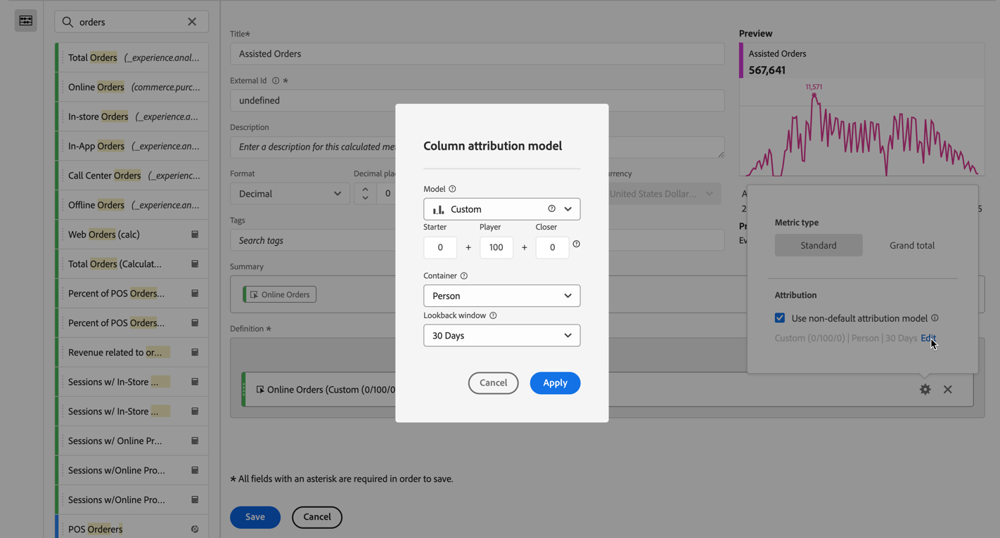

# Criar uma métrica calculada mais complexa

Este artigo explica um exemplo mais complexo de uma métrica calculada. Essas métricas calculadas mostram quais Canais de marketing auxiliam na criação de pedidos. Esse tipo de métrica calculada pode ser adaptado a qualquer dimensão ou evento bem-sucedido.

1. Comece a criar uma métrica calculada, conforme descrito em [Criar métricas](/help/components/calc-metrics/cm-workflow/cm-build-metrics.md).

1. No Criador de métricas calculadas, nomeie a métrica `Assisted Online Orders` ou algo semelhante.

1. Selecione a métrica **[!UICONTROL Pedidos online]** dos componentes de **[!UICONTROL Métricas]** e arraste a métrica para a área **[!UICONTROL Definição]**.

   1. Selecione  para a métrica.
   1. Clique em **[!UICONTROL Usar modelo de atribuição não padrão]**.
   1. Ajuste o modelo de atribuição no **[!UICONTROL Modelo de atribuição de coluna]**.
      1. Selecione **[!UICONTROL Personalizado]** para **[!UICONTROL Modelo]**. Defina **[!UICONTROL Iniciante]** para `0`, **[!UICONTROL Reprodutor]** para `100` e **[!UICONTROL Mais próximo]** para `0`.
      1. Selecione **[!UICONTROL Visitante]** para **[!UICONTROL Contêiner]**.
      1. Selecione **[!UICONTROL 30 Dias]** para **[!UICONTROL Janela de pesquisa]**.

      1. Selecione **[!UICONTROL Aplicar]**.

      

1. Selecione **[!UICONTROL Salvar]** para salvar a métrica calculada.

Para usar a métrica calculada:

1. No Analysis Workspace, crie uma tabela de forma livre com a dimensão **[!UICONTROL Canal de marketing]**, **[!UICONTROL Pedidos online]** e sua nova métrica **[!UICONTROL Pedidos online assistidos]**.

   

1. (Opcional) Compartilhe a métrica com outros usuários em sua organização, conforme descrito em [Compartilhar métricas calculadas](/help/components/calc-metrics/cm-workflow/cm-sharing.md).

Essa é uma maneira fácil de saber quais Canais de marketing auxiliaram na criação de pedidos. Como alternativa, em uma tabela de forma livre, você pode selecionar qualquer métrica e, no menu de contexto, ajustar o modelo de atribuição diretamente da tabela.
