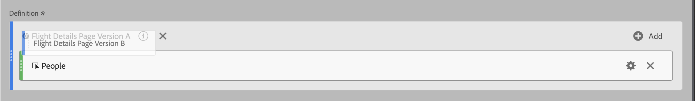

# Empilhar e substituir segmentos

É possível empilhar e substituir segmentos no Criador de métricas calculadas.

## Empilhar segmentos {#stack-segment}

1. Comece a criar uma métrica, conforme descrito em [Criar métricas calculadas](/help/components/calc-metrics/cm-workflow/cm-build-metrics.md).

1. Na tela Definição, solte o novo segmento ao lado do segmento existente:

   

## Substituir um segmento por outro {#replace-segment}

1. Comece a criar uma métrica, conforme descrito em [Criar métricas](/help/components/calc-metrics/cm-workflow/cm-build-metrics.md).

1. Na tela Definição, solte o novo segmento sobre o segmento existente:

   
