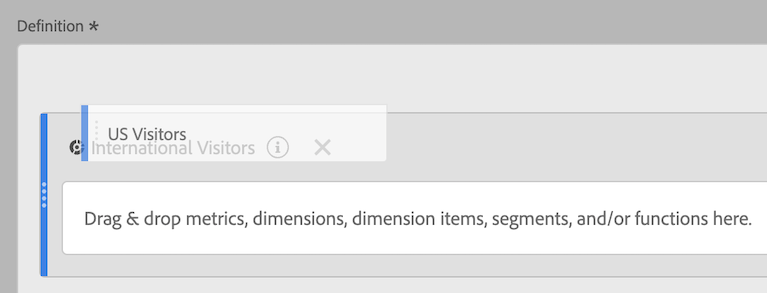

# Empilhar e substituir filtros

Mostra como empilhar e substituir filtros no Criador de métricas calculadas.

## Empilhar filtros {#stack-filter}

Na tela de Definição, basta soltar o novo filtro ao lado do filtro existente:

## Substituir um filtro por outro {#replace-filter}

Na tela de Definição, basta soltar o novo filtro em cima do filtro existente:

