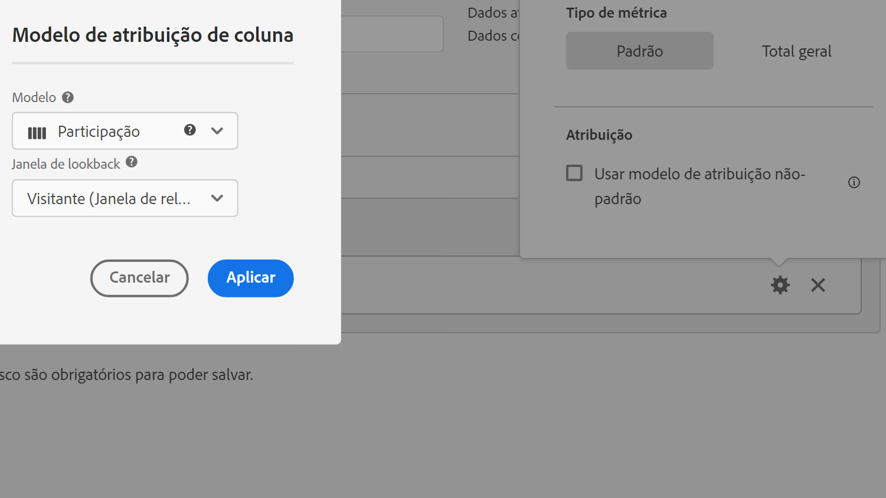

# Atribuição e tipo de métrica

Selecionar o ícone de engrenagem ao lado de uma métrica permite especificar o tipo e o modelo de atribuição.

## Tipo de métrica

Para especificar o tipo de métrica ao criar uma métrica calculada:

1. Selecione o ícone de engrenagem ao lado da métrica cujo tipo você deseja selecionar.

   

1. Escolha entre as seguintes opções:

   | Tipo de métrica | Definição |
   |---|---|
   | Padrão | Essas métricas são as mesmas métricas usadas nos relatórios padrão do [!DNL Analytics]. Se uma fórmula consistir de uma única métrica padrão, ela exibirá dados idênticos à sua métrica não calculada equivalente. Métricas padrão são úteis ao criar métricas calculadas específicas para cada item de linha. Por exemplo, [Pedidos] / [Sessões] pega os pedidos de um item de linha específico e divide pelo número de sessões desse item de linha específico. |
   | Total geral | Use o total geral para o período do relatório em cada item de linha. Se uma fórmula consistir em uma única métrica de total geral, ela exibirá o mesmo número total geral em cada item da linha. As métricas totais gerais são úteis para criar métricas calculadas que se comparam com os dados totais. Por exemplo, [Pedidos] / [Total de sessões] mostra a proporção de pedidos com relação a TODAS as sessões em um canal, não apenas as sessões com o item de linha específico. |

## Atribuição

Para obter informações sobre atribuição no Customer Journey Analytics, consulte [Configurações do componente de atribuição](/help/data-views/component-settings/attribution.md).
