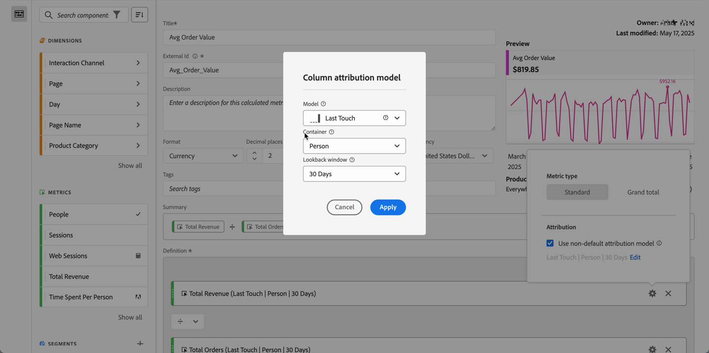

# Tipo de métrica e atribuição

Você pode configurar o tipo de métrica e o [modelo de atribuição](#attribution-models) para uma métrica em uma definição de métrica calculada.

1. Selecione a  no componente de métrica.
1. Na caixa de diálogo pop-up:

   

   * Especifique o **[!UICONTROL Tipo de métrica]**:

     | Tipo de métrica | Definição |
     |---|---|
     | **[!UICONTROL Padrão]** | Se uma fórmula consistir de uma única métrica padrão, ela exibirá dados idênticos à sua métrica não calculada equivalente. Métricas padrão são úteis ao criar métricas calculadas específicas para cada item da linha.  
Por exemplo,  **[!UICONTROL Pedidos]**   **[!UICONTROL Sessões]** pega os pedidos de um item da linha específico e divide pelo número de sessões desse item de linha específico. |
     | **[!UICONTROL Total geral]** | Use o **[!UICONTROL Total geral]** para informar o período de relatórios em cada item da linha. Se uma fórmula consistir em uma única métrica de total geral, a métrica calculada exibirá o mesmo número de total geral em cada item da linha. As métricas de total geral são úteis quando você deseja criar métricas calculadas que se comparam aos dados totais. 
Por exemplo,  **[!UICONTROL Pedidos]**   **[!UICONTROL Total de sessões]** mostra a proporção de pedidos com relação a todas as sessões, não apenas as sessões com o item da linha específico. Neste exemplo, você especifica **[!UICONTROL Total geral]** para a métrica  **[!UICONTROL Sessões]** em sua métrica calculada, que a transformará automaticamente em  **[!UICONTROL Total de sessões]**. |

   * Especifique a **[!UICONTROL atribuição]**.

      1. Você também pode:

         * Desabilitar a opção **[!UICONTROL Usar modelo de atribuição não padrão]** para usar o modelo de atribuição de coluna padrão, que é Último contato, com uma janela de pesquisa de 30 dias.
         * Habilitar a opçã o **[!UICONTROL Usar modelo de atribuição não padrão]**. Na caixa de diálogo **[!UICONTROL Modelo de atribuição de coluna]**,

            * Selecione um **[!UICONTROL Modelo]** dos modelos de atribuição.
            * Selecione uma **[!UICONTROL Janela de pesquisa]**. Se você selecionar **[!UICONTROL Tempo personalizado]**, será possível definir o período em **[!UICONTROL Minuto(s)]** até **[!UICONTROL Trimestre(s)]**. Consulte [Janela de pesquisa](#lookback-window) para obter mais informações.

      1. Selecione **[!UICONTROL Aplicar]** para aplicar o modelo de atribuição não padrão. Selecione Cancelar para cancelar.

     Se você já tiver definido um modelo de atribuição não padrão, selecione **[!UICONTROL Editar]** para modificar a seleção.

Consulte [Exemplo](#example) para obter um exemplo de uso de um modelo de atribuição e uma janela de pesquisa.

## Atribuição {#attribution}

>[!CONTEXTUALHELP]
>id="components_calculatedmetrics_nondefaultattributionmodel"
>title="Usar modelo de atribuição não-padrão"
>abstract="Habilite um modelo de atribuição não padrão para a métrica selecionada."

>[!CONTEXTUALHELP]
>id="components_calculatedmetrics_attributionmodel"
>title="Modelo"
>abstract="Selecione um modelo de atribuição para a métrica."

>[!CONTEXTUALHELP]
>id="components_calculatedmetrics_attribution_lasttouch"
>title="Último contato"
>abstract="100% do crédito vai para o último valor de dimensão visto por um visitante."

>[!CONTEXTUALHELP]
>id="components_calculatedmetrics_attribution_firsttouch"
>title="Primeiro contato"
>abstract="100% do crédito vai para o primeiro valor de dimensão visto por um visitante."

>[!CONTEXTUALHELP]
>id="components_calculatedmetrics_attribution_linear"
>title="Linear"
>abstract="O crédito é distribuído uniformemente em todos os valores de dimensão."

>[!CONTEXTUALHELP]
>id="components_calculatedmetrics_attribution_participation"
>title="Participação"
>abstract="100% de crédito para cada valor de dimensão visto por um visitante. Os totais da coluna estão exagerados."

>[!CONTEXTUALHELP]
>id="components_calculatedmetrics_attribution_sametouch"
>title="Mesmo contato"
>abstract="O crédito é fornecido somente para valores de dimensão que ocorrem no mesmo evento que a conversão."

>[!CONTEXTUALHELP]
>id="components_calculatedmetrics_attribution_instance"
>title="Mesmo contato"
>abstract="O crédito é fornecido somente para valores de dimensão que ocorrem no mesmo evento que a conversão."

>[!CONTEXTUALHELP]
>id="components_calculatedmetrics_attribution_ushaped"
>title="Forma de U"
>abstract="40% do crédito é atribuído ao primeiro valor de dimensão, 40% ao último, 20% é compartilhado pelo meio."

>[!CONTEXTUALHELP]
>id="components_calculatedmetrics_attribution_jcurve"
>title="Curva J"
>abstract="60% do crédito é atribuído ao valor da última dimensão, 20% ao primeiro, 20% é compartilhado pelo meio."

>[!CONTEXTUALHELP]
>id="components_calculatedmetrics_attribution_jshaped"
>title="Curva J"
>abstract="60% do crédito é atribuído ao valor da última dimensão, 20% ao primeiro, 20% é compartilhado pelo meio."

>[!CONTEXTUALHELP]
>id="components_calculatedmetrics_attribution_inversej"
>title="J invertido"
>abstract="60% do crédito é atribuído ao primeiro valor de dimensão, 20% ao último, 20% é compartilhado pelo meio."

>[!CONTEXTUALHELP]
>id="components_calculatedmetrics_attribution_reversejshaped"
>title="J invertido"
>abstract="60% do crédito é atribuído ao primeiro valor de dimensão, 20% ao último, 20% é compartilhado pelo meio."

>[!CONTEXTUALHELP]
>id="components_calculatedmetrics_attribution_timedecay"
>title="Declínio de tempo"
>abstract="Os valores de dimensão mais próximos do tempo a uma conversão recebem mais crédito."

>[!CONTEXTUALHELP]
>id="components_calculatedmetrics_attribution_custom"
>title="Personalizado"
>abstract="Defina sua própria posição com base na ponderação de atribuição."

>[!CONTEXTUALHELP]
>id="components_calculatedmetrics_attribution_positionbased"
>title="Personalizado"
>abstract="Defina sua própria posição com base na ponderação de atribuição."

>[!CONTEXTUALHELP]
>id="components_calculatedmetrics_attribution_algorithmic"
>title="Algorítmico"
>abstract="O crédito é determinado dinamicamente em um algoritmo estatístico."

{{attribution-models-details}}

### Janela de pesquisa {#lookback-window}

<!-- markdownlint-disable MD034 -->

>[!CONTEXTUALHELP]
>id="components_calculatedmetrics_attribution_lookbackwindow"
>title="Janela de pesquisa"
>abstract="Essa configuração determina a janela de atribuição de dados que será aplicada a cada conversão."

<!-- markdownlint-enable MD034 -->

{{attribution-lookback-window}}

### Exemplo de atribuição {#attribution-example}

Considere o exemplo a seguir:

1. Em 15 de setembro, um visitante chega ao seu site através de um anúncio de pesquisa pago e depois sai.
1. Em 18 de setembro, a pessoa acessa seu site novamente por meio de um link de redes sociais que recebeu de um amigo. Eles adicionam vários itens ao carrinho, mas não compram nada.
1. Em 24 de setembro, sua equipe de marketing envia um email com um cupom para alguns dos itens em seu carrinho. Eles aplicam o cupom, mas visitam vários outros sites para ver se existem outros cupons disponíveis. Eles encontram outro cupom por meio de um anúncio de exibição e, em seguida, fazem uma compra de US$ 50.

Dependendo da janela de retrospectiva e do modelo de atribuição, os canais recebem crédito diferente. Veja a seguir alguns exemplos:

* Ao usar o modelo **primeiro contato** e uma **janela de retrospectiva de sessão**, a atribuição considera somente a terceira visita. Entre email e exibição, o email foi o primeiro, portanto, o email recebe 100% de crédito pela compra de US$ 50.

* Ao usar o modelo **primeiro contato** e uma **janela de retrospectiva de pessoa**, a atribuição considera todas as três visitas. A pesquisa paga foi a primeira, portanto recebe 100% de crédito pela compra de US$ 50.

* Ao usar o modelo **linear** e uma **janela de retrospectiva de sessão**, o crédito é dividido entre email e exibição. Ambos os canais recebem um crédito de US$ 25.
Ao usar o modelo **linear** e uma **janela de retrospectiva de pessoa**, o crédito é dividido entre pesquisa paga, redes sociais, email e exibição. Cada canal recebe um crédito de US$ 12,50 por esta compra.

* Ao usar o modelo **Forma de J** e uma **janela de retrospectiva de pessoa**, o crédito é dividido entre pesquisa paga, redes sociais, email e exibição.

   * O crédito será de 60% para a exibição (US$ 30).
   * De 20% para a pesquisa paga (US$ 10).
   * Os 20% restantes são divididos entre redes sociais e email (US$ 5 para cada).

* Ao usar o modelo **Decaimento de tempo** e uma **janela de retrospectiva de pessoa**, o crédito é dividido entre pesquisa paga, redes sociais, email e exibição. Usando a meia-vida padrão de 7 dias:

   * Intervalo de 0 dias entre o ponto de contato de exibição e a conversão. `2^(-0/7) = 1`
   * Intervalo de 0 dias entre o ponto de contato de email e a conversão. `2^(-0/7) = 1`
   * Intervalo de seis dias entre o ponto de contato de rede social e a conversão. `2^(-6/7) = 0.552`
   * Intervalo de nove dias entre o ponto de contato de pesquisa paga e a conversão. `2^(-9/7) = 0.41`
   * A normalização desses valores resulta no seguinte:

      * Exibição: 33,8%, crédito de US$ 16,88
      * Email: 33,8%, crédito de US$ 16,88
      * Redes sociais: 18,6%, crédito de US$ 9,32
      * Pesquisa paga: 13,8%, crédito de US$ 6,92

Os eventos de conversão que normalmente têm números inteiros são divididos se o crédito pertencer a mais de um canal. Por exemplo, se dois canais contribuem para um pedido usando um modelo de atribuição linear, ambos os canais recebem 0,5 desse pedido. Essas métricas parciais são somadas para todas as pessoas e depois arredondadas para o número inteiro mais próximo para fins de geração de relatórios.

>[!MORELIKETHIS]
>
>[Configurações de componentes de atribuição](/help/data-views/component-settings/attribution.md)
>[Métrica de participação](participation-metric.md)
>

