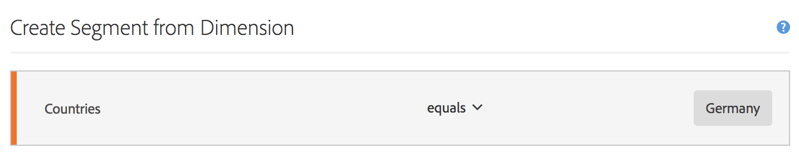

# Métricas filtradas

No Criador de métrica calculada, é possível aplicar filtros em suas definições de métricas. Isso é útil se você quer derivar novas métricas para usar em sua análise. Lembre-se, as definições de filtros podem ser atualizadas por meio do Construtor de filtros. Se forem feitas alterações, o filtro será atualizado automaticamente em qualquer lugar em que for aplicado, inclusive se fizer parte de uma definição de métrica calculada.

## Criar uma métrica filtrada {#create}

Suponhamos que você deseje comparar diferentes aspectos de um filtro “Visitantes alemães” com os de um filtro “Visitantes internacionais”. É possível criar métricas para obter insights como:

* Qual é a diferença de comportamento de navegação no conteúdo entre os dois grupos? (Outro exemplo seria: qual é a diferença da taxa de conversão entre os dois filtros?)
* Em porcentagem do total de pessoas, quantas pessoas alemãs navegam por determinadas páginas, em comparação com pessoas internacionais?
* Quais são as maiores diferenças em termos de conteúdo acessado por esses diferentes filtros?

Crie e salve uma métrica chamada &quot;Visitantes alemães&quot; e uma métrica chamada &quot;Visitantes internacionais&quot;:

1. Crie um filtro adhoc no Criador de métrica calculada chamado &quot;Visitantes alemães&quot;, em que &quot;Países&quot; corresponda a &quot;Alemanha&quot;. Arraste a dimensão Países para a tela Definição e selecione [!UICONTROL **Alemanha**] como o valor:

   

   >[!NOTE]
   >
   >Também é possível fazer isso no [Construtor de filtros](/help/components/filters/create-filters.md), mas simplificamos o fluxo de trabalho, disponibilizando dimensões no Criador de métricas calculadas. &quot;Adhoc&quot; significa que o filtro não está visível na lista **[!UICONTROL Filtros]** no painel esquerdo. Entretanto, é possível torná-lo público ao passar o mouse sobre o ícone &quot;i&quot; e clicar em **[!UICONTROL Tornar público]**.

1. Arraste o filtro Alemanha para a tela Definição e arraste a métrica Visitantes únicos dentro dele:

   

1. Selecione [!UICONTROL **Salvar**] para salvar a métrica calculada.

1. Crie um filtro adhoc no Criador de métrica calculada chamado &quot;Visitantes internacionais&quot;, em que &quot;Países&quot; não corresponda a &quot;Alemanha&quot;.

   Arraste a dimensão Países para a tela Definição, selecione [!UICONTROL **Alemanha**] como o valor e [!UICONTROL **não é igual**] como operador.

1. Arraste a métrica Visitantes únicos para dentro dela.

1. Selecione [!UICONTROL **Salvar**] para salvar a métrica calculada.

1. Na Analysis Workspace, arraste a dimensão **[!UICONTROL Página]** para uma Tabela de forma livre e arraste as 2 novas métricas calculadas para ficarem próximas na parte superior:

   

Esta é uma visão geral do vídeo:

>[!VIDEO](https://video.tv.adobe.com/v/25407/?quality=12)

## Porcentagem do total de métricas {#percent-total}

É possível ir além do exemplo acima comparando seu filtro a uma população total. Para fazer isso, crie duas novas métricas, “% do total de visitantes alemães” e “% do total de visitantes internacionais”:

1. Solte o filtro Visitantes alemães (ou internacionais) dentro da tela.
1. Solte outro filtro Visitantes alemães (ou internacionais) abaixo. Mas, desta vez, clique no ícone de configurações (engrenagem) e selecione o Tipo de métrica &quot;Total&quot;. O Formato deve ser &quot;Porcentagem&quot;. O operador deve ser &quot;dividido por&quot;. No final, você terá a seguinte definição de métrica:

   

1. Aplique esta métrica ao seu projeto:

   
