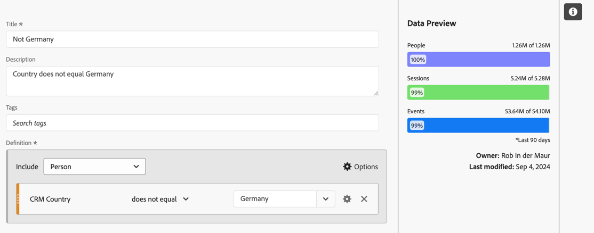

# Métricas segmentadas

No [Construtor de métrica calculada](cm-build-metrics.md#definition-builder), você pode aplicar segmentos à definição de métricas. A aplicação de segmentos é útil se você deseja usar métricas para um subconjunto de seus dados em análise.

>[!NOTE]
>
>As definições de segmento são atualizadas por meio do [Construtor de segmentos](/help/components/segments/seg-builder.md). Se você fizer uma alteração em um segmento, ele será atualizado automaticamente em todos os lugares em que for usado, inclusive se fizer parte de uma definição de métrica calculada.
>

Você deseja comparar métricas para os alemães que interagem com sua marca e pessoas de fora da Alemanha. Assim, você pode responder a perguntas como:

1. Quantos alemães contra internacionais estão visitando suas [páginas mais populares](#popular-pages).
1. Quantos alemães x internacionais no [total](#totals) interagiram online com sua marca este mês.
1. Quais são as [porcentagens](#percentages) de alemães e internacionais que visitaram suas páginas populares?

Consulte as seções abaixo para ilustrar como as métricas segmentadas podem ajudar você a responder a essas perguntas. Se for caso disso, são feitas referências a documentação mais pormenorizada.

## Páginas populares

1. [Crie uma métrica calculada](cm-workflow.md) de um projeto do Workspace, denominado `German people`.
1. No [Construtor de métrica calculada](cm-build-metrics.md), [crie um segmento](/help/components/segments/seg-builder.md), intitulado `Germany`, que esteja usando o campo País do CRM dos seus dados do CRM para determinar de onde uma pessoa vem.

   >[!TIP]
   >
   >No Criador de métrica calculada, é possível criar um segmento diretamente usando o painel Componentes.
   >   

   Seu segmento pode se parecer com.

   

1. De volta ao Criador de métrica calculada, use o segmento para atualizar a métrica calculada.

   

Repita as etapas acima para a versão internacional da sua métrica calculada.

1. Crie uma métrica calculada a partir do seu projeto do Workspace, intitulado `International people`.
1. No Criador de métrica calculada, crie um segmento, intitulado `Not Germany`, que esteja usando o campo País do CRM dos dados do CRM para determinar de onde uma pessoa vem.

   Seu segmento deve parecer com.

   

1. De volta ao Criador de métrica calculada, use o segmento para atualizar a métrica calculada.

   

1. Crie um projeto no Analysis Workspace, onde você pode ver as páginas visitadas por pessoas alemãs e internacionais.

   

## Totais

1. Crie duas novas métricas calculadas com base no Total geral. Abra cada um dos segmentos criados anteriormente, renomeie o segmento, defina o **[!UICONTROL Tipo de métrica]** para **[!UICONTROL Pessoas]** como **[!UICONTROL Total geral]** e use **[!UICONTROL Salvar como]** para salvar o segmento usando o novo nome. Por exemplo:

   

1. Adicione uma nova visualização de Tabela de forma livre ao projeto do Workspace, mostrando o total de páginas deste mês.

   

## Porcentagens

1. Crie duas novas métricas calculadas que calculam uma porcentagem a partir das métricas calculadas criadas anteriormente.

   

1. Atualize seu projeto do Workspace.

   

>[!BEGINSHADEBOX]

Consulte  [Usar uma métrica calculada segmentada como uma métrica sem implementação](https://video.tv.adobe.com/v/25407?quality=12&learn=on){target="_blank"} para ver um vídeo de demonstração.

{{videoaa}}

>[!ENDSHADEBOX]

