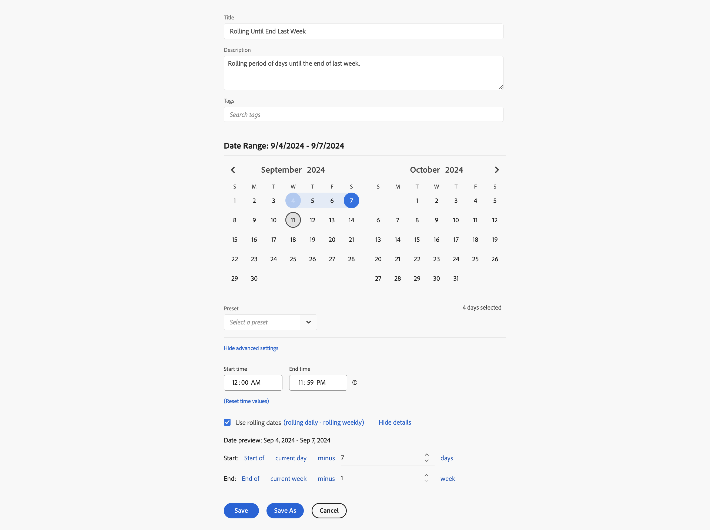

# Exemplos de intervalos de datas personalizados

Este artigo mostra mais exemplos de intervalos de datas personalizados.

## Há dois meses

+++ Detalhes

Você deseja definir um intervalo de datas personalizado que abrange os últimos dois meses. Use uma das predefinições.

+++

## Contínuo até o final da semana passada

+++ Detalhes

Você deseja definir um intervalo de datas que abrange o período entre o dia atual na semana passada até o final dessa mesma semana. Por exemplo, se hoje for quarta-feira, 11 de setembro de 2024. O intervalo de datas desejado abrange desde quarta-feira, 4 de setembro de 2024, até sábado, 7 de setembro de 2024.

+++ 

<!--
## Example: Use a 7-day rolling date range

You can create a date range that specifies a 7-day rolling window that ends one week ago:

Use *`rolling daily`*.

* The Start settings would be *`current day minus 6 days`*.

* The End settings would be *`current day minus 7 days`*.

This date range can be a component that you drag onto any freeform table.
-->