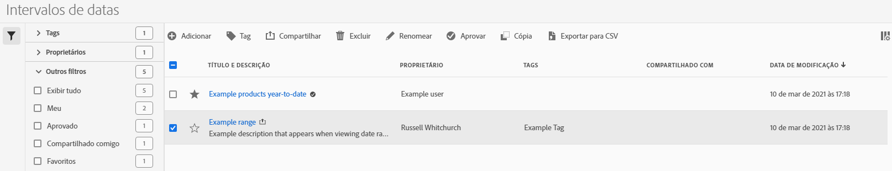

# Gerenciar intervalos de datas

Use o gerenciador de intervalo de datas para compartilhar, renomear ou excluir intervalos de datas. Para acessar o gerenciador de datas:

1. Faça logon em [analytics.adobe.com](https://analytics.adobe.com) usando suas credenciais da Adobe ID.
1. Navegue até [!UICONTROL Componentes] > [!UICONTROL Intervalos de datas].

## Interface

O gerenciador de intervalo de datas inclui as seguintes opções:

* **Adicionar**: crie um novo intervalo de datas. Consulte [Criar intervalo de datas](create.md) para obter mais informações.
* **Pesquisar por título**: procure um intervalo de datas por título. Os resultados são filtrados com base no texto inserido aqui.
* **Filtro**: filtre intervalos de datas usando a coluna à esquerda. É possível filtrar por tag personalizada, proprietário, criados por você, seus favoritos, aprovados ou compartilhados com você. Também é possível pesquisar por filtros desejados.
* **Favorito**: clique no ícone de  ao lado de um intervalo de datas para adicioná-lo aos favoritos.
* **Personalizar colunas**: clique no ícone de  para mostrar ou ocultar colunas no gerenciador de intervalo de datas.

Clique na caixa de seleção ao lado de um ou mais intervalos de datas para obter mais opções.

* **Tag**: aplique uma tag a todos os intervalos de datas selecionados. As tags ajudam a organizar intervalos de datas e permitem filtrá-los usando a coluna da esquerda.
* **Compartilhar**: compartilhe um intervalo de datas com outros usuários da Experience Cloud. Se você for um administrador de produto, também poderá compartilhar com toda a empresa ou com grupos. Intervalos de datas compartilhados com outros usuários em sua empresa incluem um ícone de  ao lado do título.
* **Excluir**: exclua permanentemente os intervalos de datas selecionados.
* **Renomear**: se um único intervalo de datas for selecionado, é possível alterar seu título.
* **Aprovar**: se você for um administrador de produto, poderá adicionar um carimbo de aprovação a um intervalo de datas. Intervalos de datas aprovados informam os usuários em sua empresa que eles são “oficiais”, diferindo-os dos intervalos de datas criados por outros usuários em sua empresa. Intervalos de datas aprovados incluem um ícone de  ao lado do título.
* **Cancelar aprovação**: se você for um administrador de produto e selecionar um intervalo de datas já aprovado, poderá cancelar a aprovação.
* **Copiar**: crie uma cópia dos intervalos de datas selecionados. Copiar intervalos de datas anexa `(Copy)` ao final do título dos intervalos de datas recém-copiados.
* **Exportar para CSV**: exporta todos os intervalos de datas selecionados em um arquivo CSV. As colunas no arquivo CSV resultante incluem todas as colunas visíveis no gerenciador de intervalo de datas.
