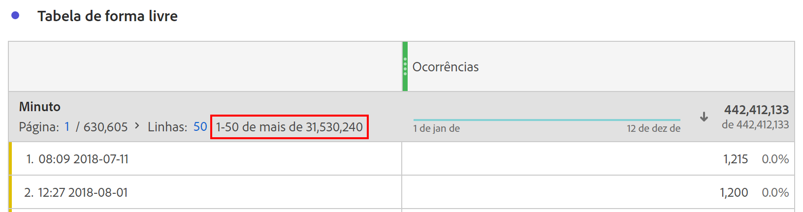

# Dimensões de alta cardinalidade

Ao usar uma dimensão que contém muitos valores únicos, o relatório resultante pode conter muitos itens de dimensão únicos para exibir ou calcular. Os resultados são truncados com a remoção dos itens de dimensão considerados menos importantes. Essas otimizações são feitas para manter o desempenho do projeto e do produto.

Quando você solicita um relatório com muitos valores únicos, o Analysis Workspace mostra um indicador no cabeçalho da dimensão informando que nem todos os itens de dimensão estão incluídos. Por exemplo, &quot;Linhas: 1-50 de mais de 22.343.156&quot;. A palavra-chave &quot;mais de&quot; indica que alguma otimização foi aplicada ao relatório para retornar os itens de dimensão mais importantes.

## Determinar quais itens de dimensão exibir

O Customer Journey Analytics processa relatórios no momento em que são executados, distribuindo o conjunto de dados combinado a vários servidores. Os dados por servidor de processamento são agrupados pela ID de pessoa, o que significa que um único servidor de processamento contém todos os dados de uma determinada pessoa. Depois que um servidor termina o processamento, ele entrega seu subconjunto de dados processados a um servidor agregador. Todos os subconjuntos de dados processados são combinados e retornados no formato de um relatório do Workspace.

Se qualquer servidor individual processar dados que excedam um limite exclusivo, ele truncará os resultados antes de retornar o subconjunto de dados processado. Os itens de dimensão truncados são determinados com base na métrica usada para classificação.

Se a métrica de classificação for uma métrica calculada, o servidor utilizará as métricas contidas na métrica calculada para determinar quais itens de dimensão serão truncados. Como as métricas calculadas podem conter várias métricas de importância variável, os resultados podem ser menos precisos. Por exemplo, ao calcular &quot;Receita por pessoa&quot;, o valor total da receita e o número total de pessoas são retornados e agregados antes de fazer a divisão. Como resultado, cada servidor de processamento individual escolhe quais itens serão removidos sem saber como seus resultados afetam a classificação geral.

Embora alguns itens de dimensão individuais possam estar ausentes nos relatórios de alta cardinalidade, os totais da coluna são precisos e não se baseiam em dados truncados. A função &quot;Contagem distinta&quot; nas métricas calculadas também não é afetada por itens de dimensão truncados.

## Práticas recomendadas para dimensões de alta cardinalidade

A melhor maneira de acomodar dimensões de alta cardinalidade é limitar o número de itens de dimensão que um relatório processa. Como todos os relatórios são processados no momento em que são solicitados, você pode ajustar os parâmetros do relatório para resultados imediatos. A Adobe recomenda qualquer uma das seguintes otimizações para dimensões de alta cardinalidade:

* Use um [Filtro](/help/components/filters/create-filters.md). Os filtros são aplicados no momento em que cada servidor processa um subconjunto de dados.
* Use uma pesquisa. Os itens de Dimension excluídos do termo de pesquisa são removidos dos resultados do relatório, tornando mais provável que você veja os itens de dimensão desejados.
* Use uma dimensão de conjunto de dados de pesquisa. As dimensões do conjunto de dados de pesquisa combinam itens de dimensão do conjunto de dados do evento, que limitam o número de valores únicos retornados.
* Use a configuração de componente [Incluir/excluir](/help/data-views/component-settings/include-exclude-values.md) no gerenciador de visualização de dados.
* Diminua o intervalo de datas da solicitação. Se muitos valores únicos se acumularem ao longo do tempo, a redução do intervalo de datas do relatório do Workspace pode limitar o número de valores únicos a serem processados pelos servidores.
* Considere usar [Exportação de Tabela Completa](/help/analysis-workspace/export/export-cloud.md) para retornar todas as linhas da tabela.
