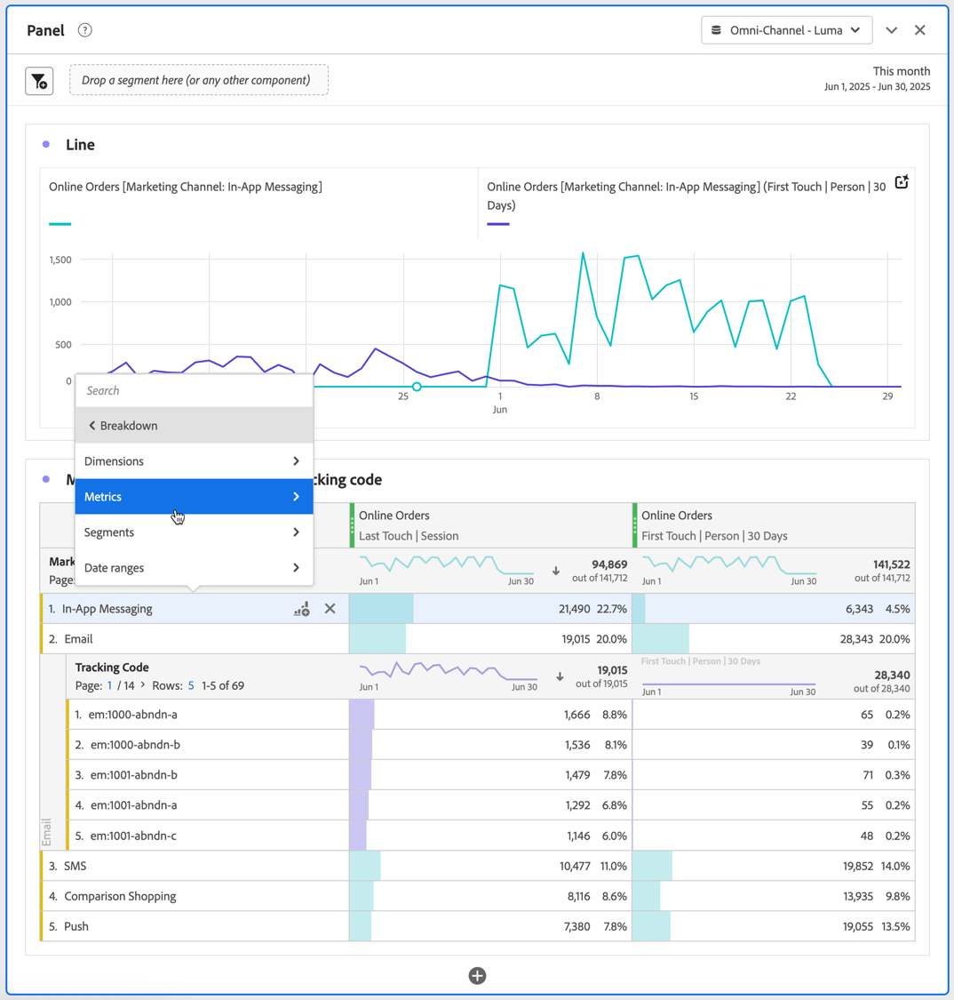
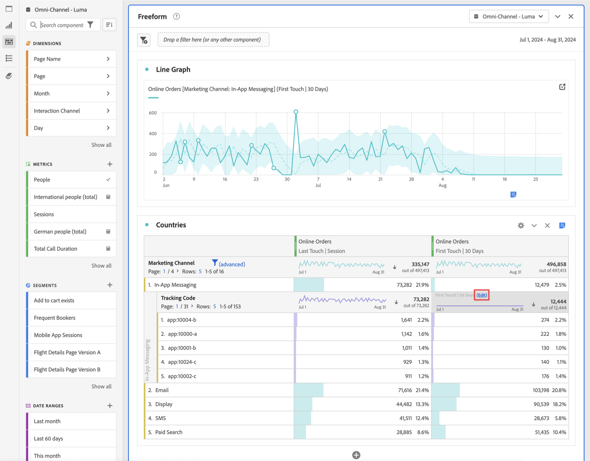

# Analisar dimensões

Você pode detalhar seus dados na Analysis Workspace de inúmeras maneiras e de acordo com suas necessidades específicas, criando consultas com o uso de métricas, dimensões, segmentos, linhas do tempo e outros valores de detalhamento de análise relevantes.

1. Em uma [Tabela de forma livre](/help/analysis-workspace/visualizations/freeform-table/freeform-table.md), no menu de contexto de uma ou mais linhas selecionadas, selecione **[!UICONTROL Detalhamento]** .

   

1. No submenu, selecione **[!UICONTROL Dimensões]**, **[!UICONTROL Métricas]**, **[!UICONTROL Segmentos]** ou **[!UICONTROL Intervalos de datas]** e selecione um item. Ou simplesmente procure por um componente no campo **[!UICONTROL *Pesquisa *]**.

Você pode analisar métricas por itens de dimensão ou segmentos de público-alvo em todos os períodos selecionados. É possível especificar ainda mais para um nível mais granular.

>[!NOTE]
>
>O número de detalhamentos exibidos na tabela é limitado a 400. Esse limite aumenta para exportar detalhamentos.

## Detalhamento por posição

Por padrão, os detalhamentos são corrigidos em itens de linha estáticos. Por exemplo, imagine que você detalhou os três principais itens de dimensão de página (Página inicial, Resultados de pesquisa, Check-out) por canal de marketing. Você sai do projeto e retorna duas semanas depois. Ao abrir o projeto novamente, as 3 principais páginas foram alteradas e, agora, a Página inicial, os Resultados da pesquisa e o Check-out são as 4 a 6 principais páginas. Por padrão, os detalhamentos do canal de marketing ainda aparecerão em Página inicial, Resultados de pesquisa e Check-out, mesmo que agora estejam nas linhas 4-6.

Por outro lado, o **Detalhamento por posição** sempre detalha os três itens principais, independentemente de quais sejam esses itens. Voltando ao exemplo, ao reabrir o projeto, os detalhamentos do canal de marketing são vinculados às três principais páginas da tabela. E não a Página inicial, Resultados de pesquisa e Check-out, que agora estão nas linhas 4-6. Consulte [Configurações de linha](/help/analysis-workspace/visualizations/freeform-table/column-row-settings/table-settings.md) para saber como definir esta configuração.

## Aplicar modelos de atribuição a detalhamentos

Qualquer detalhamento em uma tabela também pode ter qualquer modelo de atribuição aplicado a ela. Esse modelo de atribuição pode ser o mesmo ou diferente da coluna pai. Por exemplo, você pode analisar Pedidos lineares em sua dimensão de Canais de marketing mas deseja aplicar Pedidos de forma de U aos códigos de rastreamento específicos em um Canal. Para editar o modelo de atribuição aplicado a um detalhamento, passe o mouse sobre o modelo de detalhamento e selecione **[!UICONTROL Editar]**.

Este é o comportamento esperado ao aplicar modelos de atribuição a detalhamentos ou editá-los:

* Se você aplicar uma atribuição quando nenhuma outra atribuição existir, ela será aplicada a toda a árvore de colunas.

* Se você adicionar um detalhamento depois que uma atribuição for aplicada, ele usará o padrão para o detalhamento que foi adicionado (se essa dimensão tiver um padrão). Caso contrário, ele usará o detalhamento da coluna pai. Algumas dimensões têm uma alocação padrão. Por exemplo, as dimensões de Tempo e Referenciador usam o mesmo contato. A dimensão de Produto usa o último contato. Outras dimensões não têm um padrão e usarão a alocação de coluna master.

* Se já houver atribuições na árvore de colunas, alterar a atribuição afetará somente a que você estiver editando.

>[!BEGINSHADEBOX]

Assista a  [Dimension no Analysis Workspace](https://experienceleague.adobe.com/pt-br/docs/analytics-learn/tutorials/analysis-workspace/dimensions/adding-dimensions-and-metrics-to-your-project-in-analysis-workspace){target="_blank"} para ver um vídeo de demonstração.

{{videoaa}}

>[!ENDSHADEBOX]

>[!BEGINSHADEBOX]

Consulte  [Detalhamentos do Dimension](https://video.tv.adobe.com/v/30775?captions=por_br&quality=12&learn=on){target="_blank"} para ver um vídeo de demonstração.

{{videoaa}}

>[!ENDSHADEBOX]

>[!BEGINSHADEBOX]

Consulte  [Adicionando dimensões e métricas](https://experienceleague.adobe.com/pt-br/docs/analytics-learn/tutorials/analysis-workspace/dimensions/adding-dimensions-and-metrics-to-your-project-in-analysis-workspace){target="_blank"} para ver um vídeo de demonstração.

{{videoaa}}

>[!ENDSHADEBOX]

>[!BEGINSHADEBOX]

Consulte  [Trabalhando com dimensões em uma Tabela de Forma Livre](https://experienceleague.adobe.com/pt-br/docs/analytics-learn/tutorials/analysis-workspace/building-freeform-tables/working-with-dimensions-in-a-freeform-table){target="_blank"} para ver um vídeo de demonstração.

{{videoaa}}

>[!ENDSHADEBOX]

>[!BEGINSHADEBOX]

Consulte  [detalhamento do Dimension por posição](https://video.tv.adobe.com/v/30774?captions=por_br){target="_blank"} para ver um vídeo de demonstração.

{{videoaa}}

>[!ENDSHADEBOX]

