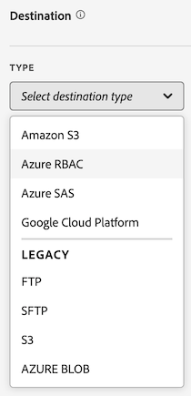

# Criar um feed de dados

Ao criar um feed de dados, você fornece à Adobe:

* As informações sobre o destino para onde os arquivos de dados brutos serão enviados

* Os dados para inclusão em cada arquivo

* A frequência com que o feed de dados deve ser enviado (incluindo o atraso de processamento para capturar ocorrências que chegam tarde)

Antes de criar um feed de dados, é importante ter uma compreensão básica dos feeds de dados e garantir o atendimento de todos os pré-requisitos. Para obter mais informações, consulte: [Visão geral dos feeds de dados](data-feed-overview.md).

## Criar e configurar um feed de dados {#create-and-configure-data-feed}

<!-- markdownlint-disable MD034 -->

>[!CONTEXTUALHELP]
>id="cja_datafeed_export_file"
>title="Manifesto"
>abstract="Escolha se deseja incluir um arquivo de manifesto em cada entrega do feed de dados. Os arquivos de manifesto contêm informações para cada arquivo incluído no feed de dados. Ao enviar dados do feed de dados em um único pacote, também é possível optar por incluir um arquivo de finalização, mas arquivos de manifesto são recomendados. "

<!-- markdownlint-enable MD034 -->

<!-- markdownlint-disable MD034 -->

>[!CONTEXTUALHELP]
>id="cja_datafeed_notify"
>title="Notificar quando concluído"
>abstract="Especifique um ou mais endereços de email para os quais deseja entregar uma notificação após o envio do feed de dados. Para inserir vários endereços de email, separe-os por vírgula."

<!-- markdownlint-enable MD034 -->

<!-- markdownlint-disable MD034 -->

>[!CONTEXTUALHELP]
>id="cja_datafeed_lookback_date_range"
>title="Intervalo de datas de pesquisa"
>abstract="Controla a aparência do Customer Journey Analytics ao processar a entrega do feed de dados. Essa configuração não altera a janela de frequência (hora ou dia). No entanto, o intervalo de datas da retrospectiva pode influenciar os dados entregues. A qualificação de segmento, o cálculo de sessão, algumas transformações de campo derivadas e a persistência de dimensão são afetados pelo intervalo de datas da retrospectiva."

<!-- markdownlint-enable MD034 -->

1. Faça logon em [experiencecloud.adobe.com](https://experiencecloud.adobe.com) usando as credenciais da Adobe ID.

1. Selecione [!UICONTROL **Customer Journey Analytics**] no alternador de aplicativos  na parte superior direita da interface.

1. Na barra de navegação superior, acesse [!UICONTROL **Admin**] > [!UICONTROL **Feeds de dados**].

1. Selecione [!UICONTROL **Criar feed de dados**].

   Uma página é exibida com as seguintes guias: [!UICONTROL **Detalhes**], [!UICONTROL **Estrutura de dados**] e [!UICONTROL **Entrega**].

   

1. Na seção [!UICONTROL **Detalhes**], preencha os seguintes campos:

   | Campo | Função |
   |---------|----------|
   | [!UICONTROL **Nome**] | O nome do feed de dados. Os nomes devem ser exclusivos na visualização de dados selecionada e podem ter até 255 caracteres. <!--[Learn more](/help/export/analytics-data-feed/df-faq.md#must-feed-names-be-unique)--> |
   | [!UICONTROL **Tags**] | Aplique tags ao feed de dados para facilitar a categorização. <!--You can filter on tags as described in [Filter and search the list of data feeds](/help/export/analytics-data-feed/df-manage-feeds.md#filter-and-search-the-list-of-data-feeds) in [Manage data feeds](/help/export/analytics-data-feed/df-manage-feeds.md).--> |
   | [!UICONTROL **Descrição**] | Especifique uma descrição para o feed de dados. A descrição adicionada fica visível ao editar o feed de dados. |
   | [!UICONTROL **Visualização de dados**] | Selecione a visualização de dados que contém os dados que você deseja exportar. |

1. Na seção [!UICONTROL **Estrutura de dados**], verifique se a exibição de dados correta está selecionada no campo **[!UICONTROL Exibição de dados]**. 
Considere o seguinte ao selecionar uma visualização de dados:
 <ul><li>Se vários feeds de dados forem criados para a mesma visualização, cada feed de dados deverá ter definições de coluna diferentes.</li><li>A lista de colunas disponíveis depende da empresa de logon à qual a visualização de dados selecionada pertence. Se você alterar a visualização de dados, a lista de colunas disponíveis poderá ser alterada. </li></ul>

1. Adicione colunas à configuração do feed de dados. Na seção do painel de componentes à esquerda, localize as colunas que deseja incluir e arraste-as para a tela para criar sua estrutura de dados. Você pode selecionar várias colunas mantendo a tecla **[!UICONTROL Shift]** pressionada, ou mantendo a tecla **[!UICONTROL Command]** (no macOS) ou **[!UICONTROL Ctrl]** (no Windows) pressionada.

   Use as informações a seguir para entender as dimensões que sempre estão incluídas, as dimensões que não podem ser incluídas e as métricas que devem ser substituídas:

   +++ Dimensões que são sempre incluídas nos feeds de dados

   As seguintes dimensões são incluídas por padrão em todos os feeds de dados e não podem ser removidas:

   | Nome da dimensão | Notas | Feeds de dados | Outros relatórios |
   |---|---|---|---|
   | Carimbo de data e hora | Carimbo de data e hora do período do evento. Granularidade de microssegundos. Representado em UTC. | Obrigatório | Não disponível |
   | ID da linha | Identificador exclusivo da linha | Obrigatório | Não disponível |
   | ID da sessão | Identificador exclusivo de cada sessão | Obrigatório | Não disponível |
   | ID da pessoa | O identificador de pessoa para a visualização de dados e a conexão | Obrigatório | Padrão opcional |
   | ID da conta [!BADGE B2B edition]{type=Informative url="https://experienceleague.adobe.com/pt-br/docs/analytics-platform/using/cja-overview/cja-b2b/cja-b2b-edition" newtab=true tooltip="Customer Journey Analytics B2B Edition"} | ID da conta ao usar o contêiner Conta | Obrigatório | Padrão opcional |

   +++

   +++ Dimensões que não podem ser incluídas nos feeds de dados

   As dimensões padrão do Customer Journey Analytics não podem ser incluídas nos feeds de dados. A tabela a seguir lista essas dimensões:

   | Nome da dimensão | Notas | Feeds de dados |
   |---|---|---|
   | 5 minutos | Intervalos de cinco minutos quando os eventos ocorreram (arredondados para baixo) | Não disponível |
   | 15 minutos | Intervalos de 15 minutos quando os eventos ocorreram (arredondados para baixo) | Não disponível |
   | 30 minutos | Intervalos de trinta minutos quando os eventos ocorreram (arredondados para baixo) | Não disponível |
   | Dia | Dia em que um evento ocorreu | Não disponível |
   | Dia da semana | Dia da semana em que um evento ocorreu | Não disponível |
   | Dia do mês | Dia do mês em que um evento ocorreu | Não disponível |
   | Profundidade do evento | Valor numérico sequencial (1, 2, 3, etc.) atribuído a cada interação de evento em uma sessão | Não disponível |
   | Hora | Hora em que um evento ocorreu (arredondada para baixo) | Não disponível |
   | Hora do dia | Hora do dia em que um evento ocorreu (arredondada para baixo) | Não disponível |
   | Minuto | Minuto em que um evento ocorreu (arredondado para baixo) | Não disponível |
   | Minuto da hora | Minuto da hora em que um evento ocorreu (arredondado para baixo) | Não disponível |
   | Mês | Mês em que um evento ocorreu | Não disponível |
   | Mês do ano | Mês do ano em que um evento ocorreu | Não disponível |
   | Trimestre | Trimestre em que ocorreu um evento | Não disponível |
   | Trimestre do ano | Trimestre do ano em que um evento ocorreu | Não disponível |
   | Second | Segundo em que ocorreu um evento (arredondado para baixo) | Não disponível |
   | Semana | Semana em que um evento ocorreu | Não disponível |
   | Semana do ano | Semana do ano em que um evento ocorreu | Não disponível |
   | Ano | Ano em que um evento ocorreu | Não disponível |

   +++

   +++ Métricas que devem ser substituídas nos feeds de dados

   As seguintes métricas do Customer Journey Analytics devem ser substituídas:

   | Nome da métrica | Notas | Feeds de dados |
   |---|---|---|
   | Contas [!BADGE B2B Edition]{type=Informative url="https://experienceleague.adobe.com/pt-br/docs/analytics-platform/using/cja-overview/cja-b2b/cja-b2b-edition" newtab=true tooltip="Customer Journey Analytics B2B Edition"} | Com base na ID de conta especificada na conexão | Não disponível. Use a contagem distinta da ID da conta. |
   | Grupo de compras [!BADGE B2B edition]{type=Informative url="https://experienceleague.adobe.com/pt-br/docs/analytics-platform/using/cja-overview/cja-b2b/cja-b2b-edition" newtab=true tooltip="Customer Journey Analytics B2B Edition"} | Grupos de compras com base na ID do grupo de compras na conexão | Não disponível. Use a contagem distinta da ID do grupo de compra. |
   | Eventos | Número de linhas de todos os conjuntos de dados de eventos em uma conexão | Não disponível. Use a contagem distinta da ID de linha. |
   | Contas globais [!BADGE B2B edition]{type=Informative url="https://experienceleague.adobe.com/pt-br/docs/analytics-platform/using/cja-overview/cja-b2b/cja-b2b-edition" newtab=true tooltip="Customer Journey Analytics B2B Edition"} | Com base na ID de contas globais na conexão | Não disponível. Use a contagem distinta da ID de contas globais. |
   | Oportunidades [!BADGE B2B Edition]{type=Informative url="https://experienceleague.adobe.com/pt-br/docs/analytics-platform/using/cja-overview/cja-b2b/cja-b2b-edition" newtab=true tooltip="Customer Journey Analytics B2B Edition"} | Oportunidades baseadas na ID de oportunidade na conexão | Não disponível. Use a contagem distinta da ID de oportunidade. |
   | Pessoas | Com base na ID de pessoa especificada em uma conexão | Não disponível. Use a contagem distinta da ID de pessoa. |
   | Conversas | Número de conversas | Não disponível. Use a contagem distinta da ID de conversa. |
   | Término da sessão | Número de eventos que foram o último evento de uma sessão | Não disponível |
   | Início da sessão | Número de eventos que foram o primeiro evento de uma sessão | Não disponível |
   | Sessões | Com base nas configurações de sessão da visualização de dados | Não disponível. Use a contagem distinta da ID da sessão. |
   | Tempo gasto (segundos) | Soma o tempo entre dois valores de dimensão diferentes | Não disponível |

   +++

   +++ Componentes padrão opcionais

   | Nome do componente | Tipo | Notas | Feeds de dados |
   |---|---|---|---|
   | AM/PM | Dimensão de separação de tempo | AM ou PM | Não disponível |
   | ID do lote | Dimensão | Identificador para um lote do Experience Platform | Disponível |
   | ID do conjunto de dados | Dimensão | Identificador para um conjunto de dados da Experience Platform | Disponível |
   | Dia do mês | Dimensão de separação de tempo | 1-31 | Não disponível |
   | Dia da semana | Dimensão de separação de tempo | de segunda a domingo | Não disponível |
   | Dia do ano | Dimensão de separação de tempo | 1-366 | Não disponível |
   | Hora do dia | Dimensão de separação de tempo | 0-23 | Não disponível |
   | Mês do ano | Dimensão de separação de tempo | Janeiro-dezembro | Não disponível |
   | Primeiras sessões | Métrica | A primeira sessão definida de uma pessoa na janela de relatórios | Não disponível |
   | Sessões de retorno | Métrica | Sessões que não foram a primeira sessão de uma pessoa | Não disponível |
   | Namespace da ID de pessoa | Dimensão | Tipo de ID no qual a ID de pessoa consiste (por exemplo, ID de email ou cookie) | Disponível |
   | ID da Conta Global [!BADGE B2B edition]{type=Informative url="https://experienceleague.adobe.com/pt-br/docs/analytics-platform/using/cja-overview/cja-b2b/cja-b2b-edition" newtab=true tooltip="Customer Journey Analytics B2B Edition"} | Dimensão | ID da conta global ao usar o contêiner da conta global | Disponível |
   | ID da oportunidade [!BADGE B2B edition]{type=Informative url="https://experienceleague.adobe.com/pt-br/docs/analytics-platform/using/cja-overview/cja-b2b/cja-b2b-edition" newtab=true tooltip="Customer Journey Analytics B2B Edition"} | Dimensão | ID da oportunidade ao usar o contêiner Oportunidade | Disponível |
   | ID do Grupo de Compras [!BADGE B2B edition]{type=Informative url="https://experienceleague.adobe.com/pt-br/docs/analytics-platform/using/cja-overview/cja-b2b/cja-b2b-edition" newtab=true tooltip="Customer Journey Analytics B2B Edition"} | Dimensão | ID do Grupo de compra ao usar o contêiner Grupo de compra | Disponível |
   | Trimestre do ano | Dimensão de separação de tempo | T1, T2, T3, T4 | Não disponível |
   | Repetir sessão | Métrica | Sessões que não foram a primeira sessão de uma pessoa | Não disponível |
   | Tipo de sessão | Dimensão | Dois valores: Primeira Vez ou Retorno | Não disponível |
   | Tempo gasto por evento | Dimensão | Segmenta a métrica Tempo gasto em segmentos de evento | Não disponível |
   | Tempo gasto por sessão | Dimensão | Segmenta a métrica Tempo gasto em segmentos de sessão | Não disponível |
   | Tempo gasto por pessoa | Dimensão | Segmenta a métrica Tempo gasto em segmentos de pessoa | Não disponível |
   | Final de semana/Dia de semana | Dimensão de separação de tempo | Final de semana ou Dia de semana | Não disponível |

   +++

1. Na seção [!UICONTROL **Delivery**], especifique as seguintes informações:

   | Campo | Função |
   |---------|----------|
   | [!UICONTROL **Tipo de feed**] | Selecione o tipo de feed que deseja criar:<ul><li>[!UICONTROL **Feed ativo**]: exporta dados atuais e futuros.</li><li>[!UICONTROL **Feed de preenchimento retroativo**]: exporta dados históricos entre duas datas anteriores.</li></ul> |
   | [!UICONTROL **Data de início**] | Especifique a data em que deseja que o feed de dados comece. Para iniciar imediatamente o processamento dos feeds de dados de dados históricos, verifique se [!UICONTROL **Feed de preenchimento retroativo**] está selecionado e defina essa data como qualquer data no passado quando os dados estiverem sendo coletados. A data de início é baseada no fuso horário da visualização de dados. |
   | [!UICONTROL **Data final**] | Especifique a data em que deseja que o feed de dados termine. A data de término é baseada no fuso horário da visualização de dados. |
   | [!UICONTROL **Frequência**] | Selecione a frequência com que o feed de dados deve ser enviado. Eventos com carimbos de data e hora que caem na janela de frequência são incluídos na entrega do feed de dados. Os campos [!UICONTROL **Intervalo de datas de retrospectiva**] e [!UICONTROL **Atraso de processamento**] também podem afetar quais eventos são incluídos nos dados para a frequência de entrega escolhida.
Para feeds ao vivo, selecione para incluir uma hora de dados ou um dia de dados. Os feeds de preenchimento retroativo devem ser diários.
<ul><li>**Diariamente**: os feeds contêm dados de um dia inteiro, da meia-noite a meia-noite no fuso horário da visualização de dados. Use essa opção para feeds de preenchimento retroativo ou para feeds em tempo real.</li><li>**Por hora**: os feeds contêm dados de uma hora. Use essa opção para feeds em tempo real.</li></ul> |
   | [!UICONTROL **Intervalo de datas de retrospectiva**] | Controla a aparência do Customer Journey Analytics ao processar a entrega do feed de dados. 
Essa configuração não altera a janela de frequência (hora ou dia), que define o intervalo de tempo dos eventos a serem incluídos na saída do feed de dados. No entanto, o intervalo de datas da retrospectiva pode influenciar os dados entregues, das seguintes maneiras: 
<ul><li>**Qualificação do segmento**: quando um segmento é aplicado à sua definição de feed de dados, todos os eventos dentro do intervalo de datas da pesquisa determinam se uma pessoa se qualifica. A configuração de contêiner do segmento determina o escopo. (Os contêineres possíveis são: Pessoa, Sessão ou Evento. B2B tem os seguintes contêineres adicionais: Conta global, Conta, Oportunidade, Grupo de compras.)  
Por exemplo, se um contêiner Pessoa for usado e a pessoa for qualificada durante o intervalo de datas da retrospectiva, todos os eventos dessa pessoa durante a janela de frequência também serão qualificados.
</li><li>**Cálculo de sessão**: os limites de sessão são calculados usando dados dentro do intervalo de datas da pesquisa.</li><li>**Transformações de campo derivadas**: todas as funções de campo derivadas que fazem referência a contêineres (como as funções Resumir, Desduplicar e Profundidade) usam o intervalo de datas da retrospectiva nas exportações de feed de dados.</li><li>**Persistência do Dimension**: se você optar por definir a persistência em uma dimensão individual, também escolha uma expiração para determinar por quanto tempo um item de dimensão persiste além do evento em que está definido. 
O intervalo de datas de pesquisa afeta a persistência da dimensão quando a expiração é definida como uma das seguintes opções na visualização de dados:
<ul><li>Para cada dimensão na definição de feed de dados que usa [!UICONTROL **Janela de relatório**] como expiração, o intervalo de datas de retrospectiva se torna a nova janela de relatório.</li><li>Para cada dimensão na definição de feed de dados que usa [!UICONTROL **Tempo personalizado**] como sua expiração, e se o tempo personalizado selecionado se estender além do intervalo de datas da pesquisa, o tempo personalizado será ignorado e o intervalo de datas da pesquisa será usado para a expiração da dimensão.
Para obter mais informações sobre como configurar a persistência em dimensões na visualização de dados, consulte [Configurações do componente de Persistência](/help/data-views/component-settings/persistence.md).
</li></ul> |
   | [!UICONTROL **Atraso no processamento**] | Escolha o tempo de espera antes do processamento de um arquivo de feed de dados. Quaisquer ocorrências de chegada tardia que chegarem durante o atraso de processamento serão incluídas no feed de dados. 
Um atraso pode ser útil para dar às implementações móveis uma oportunidade para que os dispositivos offline fiquem online e enviem dados. Ele também pode ser usado para acomodar os processos do lado do servidor de sua organização ao gerenciar arquivos processados anteriormente. 

Você pode atrasar um feed por 2, 3, 4 ou 8 horas.
As sessões devem ser iniciadas após o limite do atraso de processamento para serem incluídas; as sessões que iniciam antes do limite e terminam dentro do atraso de processamento não são incluídas.
 |

1. Na seção [!UICONTROL **Destino**], configure o destino para onde deseja que os dados sejam enviados.

   >[!NOTE]
   >
   >Considere o seguinte ao configurar um destino de relatórios:
   >
   ><!--* Adobe recommends using a cloud account for your report destination. [Legacy FTP and SFTP accounts](/help/components/locations/configure-import-accounts.md) are available, but are not recommended.-->
   >* Todas as contas em nuvem configuradas anteriormente estão disponíveis para uso nos feeds de dados. Você pode configurar contas em nuvem no Gerenciador de locais, em [Componentes > Exportações > Contas de local](/help/components/exports/cloud-export-accounts.md).
   >
   >* As contas em nuvem estão associadas à sua conta de usuário do Customer Journey Analytics. Outros usuários não podem usar ou exibir contas na nuvem configuradas por você, a menos que você as disponibilize para todos os usuários da organização.
   >
   >* Você pode editar qualquer local que criar no Gerenciador de locais em [Componentes > Exportações > Locais](/help/components/exports/cloud-export-locations.md).

   Preencha os campos a seguir:

   | Campo | Função |
   |---------|----------|
   | [!UICONTROL **Conta**] | Realize uma das seguintes ações:<ul><li>**Usar uma conta existente:** Selecione o menu suspenso ao lado do campo **[!UICONTROL Conta]**. Ou comece digitando o nome da conta e selecione-o no menu suspenso. 
As contas estão disponíveis somente se você as configurar ou se forem compartilhadas com uma organização da qual você faz parte.
</li><li>**Criar uma nova conta:** Selecione **[!UICONTROL Adicionar novo]** abaixo do campo **[!UICONTROL Conta]**. Para obter informações sobre como configurar a conta, consulte [Configurar contas de exportação na nuvem](/help/components/exports/cloud-export-accounts.md).</li></ul> |
   | [!UICONTROL **Localização**] | Realize uma das seguintes ações:<ul><li>**Usar um local existente:** Selecione o menu suspenso ao lado do campo **[!UICONTROL Local]**. Ou comece digitando o nome do local e selecione-o no menu suspenso.</li><li>**Criar um novo local:** Selecione **[!UICONTROL Adicionar novo]** abaixo do campo **[!UICONTROL Local]**. Para obter informações sobre como configurar o local, consulte [Configurar locais de exportação na nuvem](/help/components/exports/cloud-export-locations.md).</li></ul> |
   | [!UICONTROL **Notificar quando concluído**] | Especifique um ou mais endereços de email nos quais uma notificação deve ser entregue após o feed de dados ser enviado com êxito ou após uma falha no envio. Para inserir vários endereços de email, separe-os por vírgula. |
   | [!UICONTROL **Habilitar manifesto**] | Escolha se deseja incluir um arquivo de manifesto em cada entrega do feed de dados. O arquivo de manifesto contém informações para cada arquivo incluído no feed de dados. |

1. Selecione **[!UICONTROL Salvar]**.

<!-- why would you want to do this? -->

<!--
I don't think we need anything after this, but saving here just in case:

1. In the [!UICONTROL **Feed Information**] section, complete the following fields:
   
   | Field | Function |
   |---------|----------|
   | [!UICONTROL **Name**] | The name of the data feed. Must be unique within the selected report suite, and can be up to 255 characters in length. [Learn more](/help/export/analytics-data-feed/df-faq.md#must-feed-names-be-unique) |
   | [!UICONTROL **Report suite**] | The report suite that the data feed is based on. If multiple data feeds are created for the same report suite, they must have different column definitions. Only source report suites support data feeds; virtual report suites are not supported. |
   | [!UICONTROL **Email when complete**] | The email address to be notified when a feed finishes processing. The email address must be properly formatted. |
   | [!UICONTROL **Feed interval**] | Select **Daily** for backfill or historical data. Daily feeds contain a full day's worth of data, from midnight to midnight in the report suite's time zone. Select **Hourly** for continuing data (Daily is also available for continuing feeds if you prefer). Hourly feeds contain a single hour's worth of data. |
   | [!UICONTROL **Delay processing**] | Wait a given amount of time before processing a data feed file. A delay can be useful to give mobile implementations an opportunity for offline devices to come online and send data. It can also be used to accommodate your organization's server-side processes in managing previously processed files. In most cases, no delay is needed. A feed can be delayed by up to 120 minutes. |
   | [!UICONTROL **Start & end dates**] | The start date indicates the date when you want the data feed to begin. To immediately begin processing data feeds for historical data, set this date to any date in the past when data is being collected. The start and end dates are based on the report suite's time zone. |
   | [!UICONTROL **Continuous feed**] | This checkbox removes the end date, allowing a feed to run indefinitely. When a feed finishes processing historical data, a feed waits for data to finish collecting for a given hour or day. Once the current hour or day concludes, processing begins after the specified delay. |
   
1. In the [!UICONTROL **Destination**] section, in the [!UICONTROL **Type**] drop-down menu, select the destination where you want the data to be sent. 

   >[!NOTE]
   >
   >Consider the following when configuring a report destination:
   >
   >* We recommend using a cloud account for your report destination. [Legacy FTP and SFTP accounts](#legacy-destinations) are available, but are not recommended.
   >* Any cloud accounts that you previously configured are available to use for Data Feeds. You can configure cloud accounts in any of the following ways:
   >
   >   * When configuring cloud accounts for [Data Warehouse](/help/export/data-warehouse/create-request/dw-request-report-destinations.md) 
   >   
   >   * When [importing Adobe Analytics classification data](/help/components/locations/locations-manager.md) (Any locations that are configured for importing classification data cannot be used.)
   >   
   >   * From the Locations manager, in [Components > Locations](/help/components/locations/configure-import-accounts.md) 
   >
   >* Cloud accounts are associated with your Adobe Analytics user account. Other users cannot use or view cloud accounts that you configure.
   >
   >* You can edit any locations that you create from the Locations manager in [Components > Locations](/help/components/locations/configure-import-accounts.md)

   

   Use any of the following destination types when creating a data feed. For configuration instructions, expand the destination type. (Additional [legacy destinations](#legacy-destinations) are also available, but are not recommended.)

   +++Amazon S3

   You can send feeds directly to Amazon S3 buckets. This destination type requires only your Amazon S3 account and the location (bucket). 

   Adobe Analytics uses cross-account authentication to upload files from Adobe Analytics to the specified location in your Amazon S3 instance.

   When using Amazon S3 with Data Feeds, only SSE-S3 encryption is supported.

   To configure an Amazon S3 bucket as the destination for a data feed:

   1. Begin creating a data feed as described in [Create and configure a data feed](#create-and-configure-a-data-feed).
   
   1. In the [!UICONTROL **Destination**] section, in the [!UICONTROL **Type**] drop-down menu, select [!UICONTROL **Amazon S3**].

      

   1. Select [!UICONTROL **Select location**].

      The Amazon S3 Export Locations page is displayed.

   1. (Conditional) If an Amazon S3 account (and a location on that account) has already been configured in Adobe Analytics, you can use it as your data feed destination: 

      >[!NOTE]
      >
      >Accounts are available to you only if you configured them or if they were shared with an organization you are a part of.
   
      1. Select the account from the [!UICONTROL **Select account**] drop-down menu.

         Any cloud accounts that were configured in any of the following areas of Adobe Analytics are available to use:
      
         * When importing Adobe Analytics classification data, as described in [Schema](/help/components/classifications/sets/manage/schema.md).
      
           However, any locations that are configured for importing classification data cannot be used. Instead, add a new destination as described below.

         * When configuring accounts and locations in the Locations area, as described in [Configure cloud import and export accounts](/help/components/locations/configure-import-accounts.md) and [Configure cloud import and export locations](/help/components/locations/configure-import-locations.md).
   
      1. Select the location from the [!UICONTROL **Select location**] drop-down menu.

      1. Select [!UICONTROL **Save**] > [!UICONTROL **Save**].

      The destination is now configured to send data to the Amazon S3 location that you specified.
   
   1. (Conditional) If you have not previously added an Amazon S3 account:

      1. Select [!UICONTROL **Add account**], then specify the following information:
   
         |Field | Function |
         |---------|----------|
         | [!UICONTROL **Account name**] | A name for the account. This can be any name you choose. |
         | [!UICONTROL **Account description**] | A description for the account. |
         | [!UICONTROL **Role ARN**] | You must provide a Role ARN (Amazon Resource Name) that Adobe can use to gain access to the Amazon S3 account. To do this, you create an IAM permission policy for the source account, attach the policy to a user, and then create a role for the destination account. For specific information, see [this AWS documentation](https://aws.amazon.com/premiumsupport/knowledge-center/cross-account-access-iam/). |
         | [!UICONTROL **User ARN**] | The User ARN (Amazon Resource Name) is provided by Adobe. You must attach this user to the policy you created. |

         {style="table-layout:auto"}

      1. Select [!UICONTROL **Add location**], then specify the following information:
   
         |Field | Function |
         |---------|----------|
         | [!UICONTROL **Name**] | A name for the account.  |
         | [!UICONTROL **Description**] | A description for the account. |
         | [!UICONTROL **Bucket**] | The bucket within your Amazon S3 account where you want Adobe Analytics data to be sent. 
Ensure that the User ARN that was provided by Adobe has the `S3:PutObject` permission in order to upload files to this bucket. This permission allows the User ARN to upload initial files and overwrite files for subsequent uploads.

Bucket names must meet specific naming rules. For example, they must be between 3 to 63 characters long, can consist only of lowercase letters, numbers, dots (.), and hyphens (-), and must begin and end with a letter or number. [A complete list of naming rules are available in the AWS documentation](https://docs.aws.amazon.com/AmazonS3/latest/userguide/bucketnamingrules.html). 
 |
         | [!UICONTROL **Prefix**] | The folder within the bucket where you want to put the data. Specify a folder name, then add a backslash after the name to create the folder. For example, `folder_name/` |

         {style="table-layout:auto"}

      1. Select [!UICONTROL **Create**] > [!UICONTROL **Save**].

         The destination is now configured to send data to the Amazon S3 location that you specified.

      1. (Conditional) If you need to manage the destination (account and location) that you just created, it is available in the [Locations manager](/help/components/locations/locations-manager.md).
   
   +++

   +++Azure RBAC

   You can send feeds directly to an Azure container by using RBAC authentication. This destination type requires an Application ID, Tenant ID, and Secret. 

   To configure an Azure RBAC account as the destination for a data feed:

   1. If you haven't already, create an Azure application that Adobe Analytics can use for authentication, then grant access permissions in access control (IAM). 
   
      For information, refer to the [Microsoft Azure documentation about how to create an Azure Active Directory application](https://learn.microsoft.com/en-us/azure/active-directory/develop/howto-create-service-principal-portal). 
   
   1. In the Adobe Analytics admin console, in the [!UICONTROL **Destination**] section, in the [!UICONTROL **Type**] drop-down menu, select [!UICONTROL **Azure RBAC**].

      

   1. Select [!UICONTROL **Select location**].

      The Azure RBAC Export Locations page is displayed.

   1. (Conditional) If an Azure RBAC account (and a location on that account) has already been configured in Adobe Analytics, you can use it as your data feed destination: 

      >[!NOTE]
      >
      >Accounts are available to you only if you configured them or if they were shared with an organization you are a part of.
   
      1. Select the account from the [!UICONTROL **Select account**] drop-down menu.

      Any cloud accounts that you configured in any of the following areas of Adobe Analytics are available to use:
      
         * When importing Adobe Analytics classification data, as described in [Schema](/help/components/classifications/sets/manage/schema.md).
      
           However, any locations that are configured for importing classification data cannot be used. Instead, add a new destination as described below.

         * When configuring accounts and locations in the Locations area, as described in [Configure cloud import and export accounts](/help/components/locations/configure-import-accounts.md) and [Configure cloud import and export locations](/help/components/locations/configure-import-locations.md).

      1. Select the location from the [!UICONTROL **Select location**] drop-down menu.

      1. Select [!UICONTROL **Save**] > [!UICONTROL **Save**].

         The destination is now configured to send data to the Azure RBAC location that you specified.

   1. (Conditional) If you have not previously added an Azure RBAC account:

      1. Select [!UICONTROL **Add account**], then specify the following information:
   
         |Field | Function |
         |---------|----------|
         | [!UICONTROL **Account name**] | A name for the Azure RBAC account. This name displays in the [!UICONTROL **Select account**] drop-down field and can be any name you choose. |
         | [!UICONTROL **Account description**] | A description for the Azure RBAC account. This description displays in the [!UICONTROL **Select account**] drop-down field and can be any name you choose.  |
         | [!UICONTROL **Application ID**] | Copy this ID from the Azure application that you created. In Microsoft Azure, this information is located on the **Overview** tab within your application. For more information, see the [Microsoft Azure documentation about how to register an application with the Microsoft identity platform](https://learn.microsoft.com/en-us/azure/active-directory/develop/quickstart-register-app). |
         | [!UICONTROL **Tenant ID**] | Copy this ID from the Azure application that you created. In Microsoft Azure, this information is located on the **Overview** tab within your application. For more information, see the [Microsoft Azure documentation about how to register an application with the Microsoft identity platform](https://learn.microsoft.com/en-us/azure/active-directory/develop/quickstart-register-app). |
         | [!UICONTROL **Secret**] | Copy the secret from the Azure application that you created. In Microsoft Azure, this information is located on the **Certificates & secrets** tab within your application. For more information, see the [Microsoft Azure documentation about how to register an application with the Microsoft identity platform](https://learn.microsoft.com/en-us/azure/active-directory/develop/quickstart-register-app). |

         {style="table-layout:auto"}

      1. Select [!UICONTROL **Add location**], then specify the following information: 
   
         |Field | Function |
         |---------|----------|
         | [!UICONTROL **Name**] | A name for the location. This name displays in the [!UICONTROL **Select location**] drop-down field and can be any name you choose. |
         | [!UICONTROL **Description**] | A description for the location. This description displays in the [!UICONTROL **Select location**] drop-down field and can be any name you choose. |
         | [!UICONTROL **Account**] | The Azure storage account. |
         | [!UICONTROL **Container**] | The container within the account you specified where you want Adobe Analytics data to be sent. Ensure that you grant permissions to upload files to the Azure application that you created earlier. |
         | [!UICONTROL **Prefix**] | The folder within the container where you want to put the data. Specify a folder name, then add a backslash after the name to create the folder. For example, `folder_name/`
Make sure the Application ID that you specified when configuring the Azure RBAC account has been granted the `Storage Blob Data Contributor` role in order to access the container (folder).
 
For more information, see [Azure built-in roles](https://learn.microsoft.com/en-us/azure/role-based-access-control/built-in-roles).
 |

         {style="table-layout:auto"}

      1. Select [!UICONTROL **Create**] > [!UICONTROL **Save**].

         The destination is now configured to send data to the Azure RBAC location that you specified.

      1. (Conditional) If you need to manage the destination (account and location) that you just created, it is available in the [Locations manager](/help/components/locations/locations-manager.md).
   
   +++

   +++Azure SAS

   You can send feeds directly to an Azure container by using SAS authentication. This destination type requires an Application ID, Tenant ID, Key vault URI, Key vault secret name, and secret. 

   To configure Azure SAS as the destination for a data feed:

   1. If you haven't already, create an Azure application that Adobe Analytics can use for authentication. 
   
      For information, refer to the [Microsoft Azure documentation about how to create an Azure Active Directory application](https://learn.microsoft.com/en-us/azure/active-directory/develop/howto-create-service-principal-portal). 
   
   1. In the Adobe Analytics admin console, in the [!UICONTROL **Destination**] section, select [!UICONTROL **Azure SAS**].

      

   1. Select [!UICONTROL **Select location**].

      The Azure SAS Export Locations page is displayed.

   1. (Conditional) If an Azure SAS account (and a location on that account) has already been configured in Adobe Analytics, you can use it as your data feed destination: 

      >[!NOTE]
      >
      >Accounts are available to you only if you configured them or if they were shared with an organization you are a part of.
   
      1. Select the account from the [!UICONTROL **Select account**] drop-down menu.

         Any cloud accounts that you configured in any of the following areas of Adobe Analytics are available to use:
      
         * When importing Adobe Analytics classification data, as described in [Schema](/help/components/classifications/sets/manage/schema.md).
      
           However, any locations that are configured for importing classification data cannot be used. Instead, add a new destination as described below.

         * When configuring accounts and locations in the Locations area, as described in [Configure cloud import and export accounts](/help/components/locations/configure-import-accounts.md) and [Configure cloud import and export locations](/help/components/locations/configure-import-locations.md).

      1. Select the location from the [!UICONTROL **Select location**] drop-down menu.

      1. Select [!UICONTROL **Save**] > [!UICONTROL **Save**].

         The destination is now configured to send data to the Azure SAS location that you specified.
   
   1. (Conditional) If you have not previously added an Azure SAS account:

      1. Select [!UICONTROL **Add account**], then specify the following information:
   
         |Field | Function |
         |---------|----------|
         | [!UICONTROL **Account name**] | A name for the Azure SAS account. This name displays in the [!UICONTROL **Select account**] drop-down field and can be any name you choose. |
         | [!UICONTROL **Account description**] | A description for the Azure SAS account. This description displays in the [!UICONTROL **Select account**] drop-down field and can be any name you choose. |
         | [!UICONTROL **Application ID**] | Copy this ID from the Azure application that you created. In Microsoft Azure, this information is located on the **Overview** tab within your application. For more information, see the [Microsoft Azure documentation about how to register an application with the Microsoft identity platform](https://learn.microsoft.com/en-us/azure/active-directory/develop/quickstart-register-app). |
         | [!UICONTROL **Tenant ID**] | Copy this ID from the Azure application that you created. In Microsoft Azure, this information is located on the **Overview** tab within your application. For more information, see the [Microsoft Azure documentation about how to register an application with the Microsoft identity platform](https://learn.microsoft.com/en-us/azure/active-directory/develop/quickstart-register-app). |
         | [!UICONTROL **Key vault URI**] | 
The path to the SAS URI in Azure Key Vault. To configure Azure SAS, you need to store an SAS URI as a secret using Azure Key Vault. For information, see the [Microsoft Azure documentation about how to set and retrieve a secret from Azure Key Vault](https://learn.microsoft.com/en-us/azure/key-vault/secrets/quick-create-portal?source=recommendations).

After the key vault URI is created:<ul><li>Add an access policy on the Key Vault in order to grant permission to the Azure application that you created.
For information, see the [Microsoft Azure documentation about how to assign a Key Vault access policy](https://learn.microsoft.com/en-us/azure/key-vault/general/assign-access-policy?tabs=azure-portal).

Or

If you want to grant an access role directly without creating an access policy, see the [Microsoft Azure documentation about how to assign Azure roles using Azure portal](https://learn.microsoft.com/en-us/azure/role-based-access-control/role-assignments-portal). This adds the role assignment for the application ID to access the key vault URI. 
</li><li>Make sure the Application ID has been granted the `Key Vault Certificate User` built-in role in order to access the key vault URI. 
For more information, see [Azure built-in roles](https://learn.microsoft.com/en-us/azure/role-based-access-control/built-in-roles).
</li></ul> |
         | [!UICONTROL **Key vault secret name**] | The secret name you created when adding the secret to Azure Key Vault. In Microsoft Azure, this information is located in the Key Vault you created, on the **Key Vault** settings pages. For information, see the [Microsoft Azure documentation about how to set and retrieve a secret from Azure Key Vault](https://learn.microsoft.com/en-us/azure/key-vault/secrets/quick-create-portal?source=recommendations). |
         | [!UICONTROL **Secret**] | Copy the secret from the Azure application that you created. In Microsoft Azure, this information is located on the **Certificates & secrets** tab within your application. For more information, see the [Microsoft Azure documentation about how to register an application with the Microsoft identity platform](https://learn.microsoft.com/en-us/azure/active-directory/develop/quickstart-register-app). |

         {style="table-layout:auto"}

      1. Select [!UICONTROL **Add location**], then specify the following information: 
   
         |Field | Function |
         |---------|----------|
         | [!UICONTROL **Name**] | A name for the location. This name displays in the [!UICONTROL **Select location**] drop-down field and can be any name you choose. |
         | [!UICONTROL **Description**] | A description for the location. This description displays in the [!UICONTROL **Select location**] drop-down field and can be any name you choose. |
         | [!UICONTROL **Container**] | The container within the account you specified where you want Adobe Analytics data to be sent. |
         | [!UICONTROL **Prefix**] | The folder within the container where you want to put the data. Specify a folder name, then add a backslash after the name to create the folder. For example, `folder_name/`
Make sure that the SAS URI store that you specified in the Key Vault secret name field when configuring the Azure SAS account has the `Write` permission. This allows the SAS URI to create files in your Azure container. 
If you want the SAS URI to also overwrite files, make sure that the SAS URI store has the `Delete` permission.

For more information, see [Blob storage resources](https://learn.microsoft.com/en-us/azure/storage/blobs/storage-blobs-introduction#blob-storage-resources) in the Azure Blob Storage documentation.
 |

         {style="table-layout:auto"}

      1. Select [!UICONTROL **Create**] > [!UICONTROL **Save**].

         The destination is now configured to send data to the Azure SAS location that you specified.

      1. (Conditional) If you need to manage the destination (account and location) that you just created, it is available in the [Locations manager](/help/components/locations/locations-manager.md).
   
   +++

   +++Google Cloud Platform

   You can send feeds directly to Google Cloud Platform (GCP) buckets. This destination type requires only your GCP account name and the location (bucket) name. 
   
   Adobe Analytics uses cross-account authentication to upload files from Adobe Analytics to the specified location in your GCP instance.

   To configure a GCP bucket as the destination for a data feed:

   1. In the Adobe Analytics admin console, in the [!UICONTROL **Destination**] section, select [!UICONTROL **Google Cloud Platform**].

      

   1. Select [!UICONTROL **Select location**].

      The GCP Export Locations page is displayed.

   1. (Conditional) If a Google Cloud Platform account (and a location on that account) has already been configured in Adobe Analytics, you can use it as your data feed destination: 

      >[!NOTE]
      >
      >Accounts are available to you only if you configured them or if they were shared with an organization you are a part of.
   
      1. Select the account from the [!UICONTROL **Select account**] drop-down menu.

         Any cloud accounts that you configured in any of the following areas of Adobe Analytics are available to use:
      
         * When importing Adobe Analytics classification data, as described in [Schema](/help/components/classifications/sets/manage/schema.md).
      
           However, any locations that are configured for importing classification data cannot be used. Instead, add a new destination as described below.

         * When configuring accounts and locations in the Locations area, as described in [Configure cloud import and export accounts](/help/components/locations/configure-import-accounts.md) and [Configure cloud import and export locations](/help/components/locations/configure-import-locations.md).

      1. Select the location from the [!UICONTROL **Select location**] drop-down menu.

      1. Select [!UICONTROL **Save**] > [!UICONTROL **Save**].

         The destination is now configured to send data to the Google Cloud Platform location that you specified.
   
   1. (Conditional) If you have not previously added a GCP account:

      1. Select [!UICONTROL **Add account**], then specify the following information:
   
         |Field | Function |
         |---------|----------|
         | [!UICONTROL **Account name**] | A name for the account. This can be any name you choose. |
         | [!UICONTROL **Account description**] | A description for the account. |
         | [!UICONTROL **Project ID**] | Your Google Cloud project ID. See the [Google Cloud documentation about getting a project ID](https://cloud.google.com/resource-manager/docs/creating-managing-projects#identifying_projects). |

         {style="table-layout:auto"}

      1. Select [!UICONTROL **Add location**], then specify the following information:
   
         |Field | Function |
         |---------|----------|
         | [!UICONTROL **Principal**] | The Principal is provided by Adobe. You must grant permission to receive feeds to this principal. |
         | [!UICONTROL **Name**] | A name for the account.  |
         | [!UICONTROL **Description**] | A description for the account. |
         | [!UICONTROL **Bucket**] | The bucket within your GCP account where you want Adobe Analytics data to be sent. 
Ensure that you have granted either of the following permissions to the Principal provided by Adobe: (For information about granting permissions, see [Add a principal to a bucket-level policy](https://cloud.google.com/storage/docs/access-control/using-iam-permissions#bucket-add) in the Google Cloud documentation.)<ul><li>`roles/storage.objectCreator`: Use this permission if you  want to limit the Principal to only create files in your GCP account.  **Important:** If you use this permission with scheduled reporting, you must use a unique file name for each new scheduled export. Otherwise, the report generation will fail because the Principal does not have access to overwrite existing files.</li><li>(Recommended) `roles/storage.objectUser`: Use this permission if you want the Principal to have access to view, list, update, and delete files in your GCP account. This permission allows the Principal to overwrite existing files for subsequent uploads, without the need to auto-generate unique file names for each new scheduled export.</li></ul>
If your organization is using [Organization policy constraints](https://cloud.google.com/storage/docs/org-policy-constraints) to allow only the Google Cloud Platform account in your allow list, you need the following Adobe-owned Google Cloud Platform organization ID: <ul><li>`DISPLAY_NAME`: `adobe.com`</li><li>`ID`: `178012854243`</li><li>`DIRECTORY_CUSTOMER_ID`: `C02jo8puj`</li></ul> 
 |
         | [!UICONTROL **Prefix**] | The folder within the bucket where you want to put the data. Specify a folder name, then add a backslash after the name to create the folder. For example, `folder_name/` |

         {style="table-layout:auto"}

      1. Select [!UICONTROL **Create**] > [!UICONTROL **Save**].

         The destination is now configured to send data to the GCP location that you specified.

      1. (Conditional) If you need to manage the destination (account and location) that you just created, it is available in the [Locations manager](/help/components/locations/locations-manager.md).
   
   +++

1. In the  [!UICONTROL **Data Column Definitions**] section, select the latest [!UICONTROL **All Adobe Columns**] template in the drop-down menu, then complete the following fields:
   
   |Field | Function |
   |---------|----------|
   | [!UICONTROL **Remove escaped characters**] | When collecting data, some characters (such as newlines) can cause issues. Check this box if you would like these characters removed from feed files. |
   | [!UICONTROL **Compression format**] | The type of compression used. **Gzip** outputs files in `.tar.gz` format. **Zip** outputs files in `.zip` format. |
   | [!UICONTROL **Packaging type**] | Select [!UICONTROL **Multiple files**] for most data feeds. This option paginates your data into uncompressed 2GB chunks. (If the [!UICONTROL **Multiple files**] option is selected and uncompressed data for the reporting window is less than 2GB, one file is sent.) Selecting **Single file** outputs the `hit_data.tsv` file in a single, potentially massive file. |
   | [!UICONTROL **Manifest**] | Determines whether Adobe should deliver a [manifest file](c-df-contents/datafeeds-contents.md#feed-manifest) to the destination when no data is collected for a feed interval. If you select **Manifest File**, you receive a manifest file similar to the following when no data is collected:
`text`

`Datafeed-Manifest-Version: 1.0`

`Lookup-Files: 0`

`Data-Files: 0`

 `Total-Records: 0`
 |
   | [!UICONTROL **Column templates**] | When creating many data feeds, Adobe recommends creating a column template. Selecting a column template automatically includes the specified columns in the template. Adobe also provides several templates by default. |
   | [!UICONTROL **Available columns**] | All available data columns in Adobe Analytics. Click [!UICONTROL Add all] to include all columns in a data feed. |
   | [!UICONTROL **Included columns**] | The columns to include in a data feed. Click [!UICONTROL Remove all] to remove all columns from a data feed. |
   | [!UICONTROL **Download CSV**] | Downloads a CSV file containing all included columns. |

1. Select [!UICONTROL **Save**] in the top-right.

    Historical data processing begins immediately. When data finishes processing for a day, the file is sent to the destination that you configured.

    For information about how to access the data feed and to get a better understanding of its contents, see [Data feed contents - overview](/help/export/analytics-data-feed/c-df-contents/datafeeds-contents.md).

## Legacy destinations

>[!IMPORTANT]
>
>The destinations described in this section are legacy, and are not recommended. Instead, use one of the following destinations when creating a data feed: Amazon S3, Google Cloud Platform, Azure RBAC, or Azure SAS. See [Create and configure a data feed](#create-and-configure-a-data-feed) for detailed information about each of these recommended destinations. 

The following information provides configuration information for each of the legacy destinations:

### FTP

Data feed data can be delivered to an Adobe or customer-hosted FTP location. Requires an FTP host, username, and password. Use the path field to place feed files in a folder. Folders must already exist; feeds throw an error if the specified path does not exist.

Use the following information when completing the available fields:

* [!UICONTROL **Host**]: Enter the desired FTP destination URL. For example, `ftp://ftp.omniture.com`.
* [!UICONTROL **Path**]: Can be left blank
* [!UICONTROL **Username**]: Enter the username to log in to the FTP site.
* [!UICONTROL **Password and confirm password**]: Enter the password to log in to the FTP site.

### SFTP

SFTP support for data feeds is available. Requires an SFTP host, username, and the destination site to contain a valid RSA or DSA public key. You can download the appropriate public key when creating the feed.

### S3

You can send feeds directly to Amazon S3 buckets. This destination type requires a Bucket name, an Access Key ID, and a Secret Key. See [Amazon S3 bucket naming requirements](https://docs.aws.amazon.com/awscloudtrail/latest/userguide/cloudtrail-s3-bucket-naming-requirements.html) within the Amazon S3 docs for more information.

The user you provide for uploading data feeds must have the following [permissions](https://docs.aws.amazon.com/AmazonS3/latest/API/API_Operations_Amazon_Simple_Storage_Service.html):

* s3:GetObject
* s3:PutObject
* s3:PutObjectAcl

  >[!NOTE]
  >
  >For each upload to an Amazon S3 bucket, [!DNL Analytics] adds the bucket owner to the BucketOwnerFullControl ACL, regardless of whether the bucket has a policy that requires it. For more information, see "[What is the BucketOwnerFullControl setting for Amazon S3 data feeds?](df-faq.md#BucketOwnerFullControl)"

The following 16 standard AWS regions are supported (using the appropriate signature algorithm where necessary):

* us-east-2
* us-east-1
* us-west-1
* us-west-2
* ap-south-1
* ap-northeast-2
* ap-southeast-1
* ap-southeast-2
* ap-northeast-1
* ca-central-1
* eu-central-1
* eu-west-1
* eu-west-2
* eu-west-3
* eu-north-1
* sa-east-1

>[!NOTE]
>
>The cn-north-1 region is not supported.

### Azure Blob

Data feeds support Azure Blob destinations. Requires a container, account, and a key. Amazon automatically encrypts the data at rest. When you download the data, it gets decrypted automatically. See [Create a storage account](https://docs.microsoft.com/en-us/azure/storage/common/storage-quickstart-create-account?tabs=azure-portal#view-and-copy-storage-access-keys) within the Microsoft Azure docs for more information.

>[!NOTE]
>
>You must implement your own process to manage disk space on the feed destination. Adobe does not delete any data from the server.

-->
