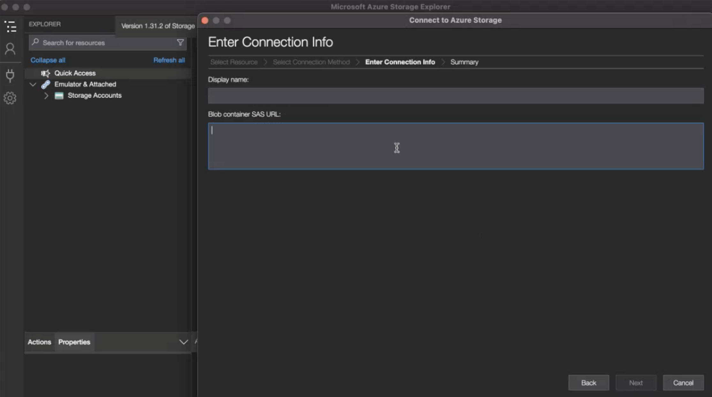

# Configurar contas de exportação na nuvem

Antes de exportar relatórios do Customer Journey Analytics para um destino de nuvem (do Analysis Workspace, conforme descrito em [Exportar relatórios do Customer Journey Analytics para a nuvem](/help/analysis-workspace/export/export-cloud.md), ou do Report Builder, conforme descrito em [Exportar relatórios do Report Builder](/help/report-builder/report-builder-export.md)), é necessário adicionar e configurar o destino para onde deseja que os dados sejam enviados.

Esse processo consiste em adicionar e configurar a conta (como Amazon S3, Google Cloud Platform e assim por diante) conforme descrito neste artigo e, em seguida, adicionar e configurar o local nessa conta (como uma pasta na conta) conforme descrito em [Configurar locais de exportação da nuvem](/help/components/exports/cloud-export-locations.md).

Para obter informações sobre como gerenciar contas existentes, incluindo exibição, edição e exclusão de contas, consulte [Gerenciar locais e contas de exportação na nuvem](/help/components/exports/manage-export-locations.md).

## Começar a criar uma conta de exportação em nuvem

1. Certifique-se de atender aos [requisitos mínimos](/help/analysis-workspace/export/export-cloud.md#minimum-requirements) para exportar relatórios para a nuvem.
1. No Customer Journey Analytics, selecione [!UICONTROL **Componentes**] > [!UICONTROL **Exportações**].
1. Na página [!UICONTROL Exportações], selecione a guia [!UICONTROL **Contas de localização**].

   

1. Selecione [!UICONTROL **Adicionar conta**].

   A caixa de diálogo Add account (Adicionar conta) é exibida.

1. No campo [!UICONTROL **Nome da conta de localização**], especifique um nome para a conta de localização. Esse nome aparece ao criar um local.

1. No campo [!UICONTROL **Descrição da conta de localização**], forneça uma breve descrição da conta para ajudá-lo a diferenciá-la de outras contas do mesmo tipo.

1. Habilite a opção de [!UICONTROL **Disponibilizar a conta para todos os usuários em sua organização**] se quiser permitir que outros usuários em sua organização usem a conta.

   Considere o seguinte ao compartilhar contas:

   * As contas compartilhadas não podem ter o compartilhamento cancelado.

   * As contas compartilhadas podem ser editadas somente pelo proprietário da conta.

   * Qualquer pessoa pode criar um local para a conta compartilhada.

1. No campo [!UICONTROL **Tipo de conta**], selecione o tipo de conta de nuvem para a qual você está exportando. Os tipos de conta disponíveis são Amazon S3 Role ARN, Google Cloud Platform, Azure SAS, Azure RBAC, Snowflake e AEP Data Landing Zone.

1. Continue com a seção abaixo que corresponde ao [!UICONTROL **Tipo de conta**] selecionado.

   * [Zona de destino de dados da AEP](#aep-data-landing-zone)

   * [Amazon S3 Role ARN](#amazon-s3-role-arn)

   * [Google Cloud Platform](#google-cloud-platform)

   * [Azure SAS](#azure-sas)

   * [Azure RBAC](#azure-rbac)

   * [Snowflake](#snowflake)

### Zona de destino de dados da AEP

>[!IMPORTANT]
>
>Considere o seguinte ao usar a Zona de aterrissagem de dados da AEP para sua conta de exportação:
>
> * Ao exportar relatórios do Customer Journey Analytics para a Data Landing Zone da Adobe Experience Platform, baixe os dados em 7 dias e exclua-os da Data Landing Zone da AEP. Após 7 dias, os dados são excluídos automaticamente da Zona de aterrissagem de dados da AEP.
> * A Zona de aterrissagem de dados do AEP usa o armazenamento do Azure ou do AWS. Se sua organização estiver usando uma empresa de logon configurada para usar o Azure, a Zona de aterrissagem de dados da AEP usará o Azure. Se a empresa de logon estiver configurada para usar o AWS, a Zona de aterrissagem de dados da AEP usará o AWS.
>

1. Comece a criar uma conta de exportação em nuvem das seguintes maneiras:

   * Na página Exportações, conforme descrito acima, em [Comece a criar uma conta de exportação em nuvem](#begin-creating-a-cloud-export-account)

   * Ao [exportar tabelas completas do Analysis Workspace](/help/analysis-workspace/export/export-cloud.md#export-full-tables-from-analysis-workspace)

1. Depois de selecionar **[!UICONTROL Zona de Aterrissagem de Dados da AEP]** no campo **[!UICONTROL Tipo de conta]**, selecione [!UICONTROL **Salvar**].

   Qualquer uma das caixas de diálogo a seguir é exibida, dependendo se sua Zona de aterrissagem de dados do AEP está configurada para usar o armazenamento do Azure ou do AWS:

   * **Armazenamento do Azure:**

     A caixa de diálogo [!UICONTROL **Exportar conta criada**] é exibida.

     

   * **Armazenamento do AWS:**

     >[!AVAILABILITY]
     >
     >Esta seção aplica-se às implementações da Experience Platform executadas no Amazon Web Services (AWS). A Experience Platform em execução no AWS está disponível atualmente para um número limitado de clientes. Para saber mais sobre a infraestrutura da Experience Platform compatível, consulte a [Visão geral da nuvem múltipla da Experience Platform](https://experienceleague.adobe.com/pt-br/docs/experience-platform/landing/multi-cloud).

     A caixa de diálogo [!UICONTROL **Conta criada**] é exibida.

     

1. (Condicional) Se você estiver usando o armazenamento do Azure:

   1. Copie o conteúdo do campo [!UICONTROL **URI SAS**] para a área de transferência. Você usará esse URI SAS para acessar os dados exportados do Analysis Workspace a partir da Data Landing Zone da AEP.

      Se esse campo estiver vazio, você precisará ter permissão para acessar o Adobe Experience Platform.

   1. No Adobe Experience Platform, configure o contêiner da Data Landing Zone para usar o URI SAS copiado.

      >[!NOTE]
      >
      >Ao usar uma conta da Zona de aterrissagem de dados da AEP baseada no Azure, a maneira mais fácil de acessar os relatórios exportados para a Zona de aterrissagem de dados da AEP é usando o Azure Storage Explorer. As etapas a seguir usam esse método.

      1. Caso ainda não o tenha feito, baixe o [Microsoft Azure Storage Explorer](https://azure.microsoft.com/en-us/products/storage/storage-explorer/).

      1. Na documentação do Adobe Experience Platform, siga as etapas descritas em [Conecte seu contêiner de Zona de Aterrissagem de Dados ao Azure Storage Explorer](https://experienceleague.adobe.com/docs/experience-platform/destinations/catalog/cloud-storage/data-landing-zone.html?lang=pt-BR#connect-your-data-landing-zone-container-to-azure-storage-explorer).

         Você pode ignorar as tarefas descritas nas seções [Recuperar as credenciais da Zona de Aterrissagem de Dados](https://experienceleague.adobe.com/docs/experience-platform/destinations/catalog/cloud-storage/data-landing-zone.html?lang=pt-BR#retrieve-dlz-credentials) e [Atualizar credenciais da Zona de Aterrissagem de Dados](https://experienceleague.adobe.com/docs/experience-platform/destinations/catalog/cloud-storage/data-landing-zone.html?lang=pt-BR#update-dlz-credentials), pois o URI copiado contém essas credenciais.

      1. Ao seguir a documentação do Adobe Experience Platform e chegar ao campo [!UICONTROL **URL SAS do contêiner de blob**], cole o URI SAS que você copiou na Etapa 3.

         >[!NOTE]
         >
         >Você precisa executar essa ação a cada 7 dias, pois o URI SAS expira 7 dias após sua criação. Você pode criar um script para automatizar esse processo.

         

   1. Selecione [!UICONTROL **Avançar**] > [!UICONTROL **Conectar**].

   1. No Customer Journey Analytics, na caixa de diálogo [!UICONTROL **Exportar conta criada**], selecione [!UICONTROL **OK**].

      

1. (Condicional) Se você estiver usando o armazenamento do AWS:

   1. Copie o conteúdo dos seguintes campos para a área de transferência (você usará essas informações para acessar os dados exportados do Analysis Workspace a partir da Data Landing Zone da AEP):

      * [!UICONTROL **ID da chave de acesso**]

      * **[!UICONTROL Chave de acesso secreta]**

      * **[!UICONTROL Token de sessão]**

      * **[!UICONTROL Nome do bucket]**

      * **[!UICONTROL Pasta DLZ]**

      

   1. Selecione [!UICONTROL **OK**].

1. Continuar com [Configurar locais de exportação na nuvem](/help/components/exports/cloud-export-locations.md).

### Amazon S3 Role ARN

1. Comece a criar uma conta de exportação em nuvem das seguintes maneiras:

   * Na página Exportações, conforme descrito acima, em [Comece a criar uma conta de exportação em nuvem](#begin-creating-a-cloud-export-account)

   * Ao [exportar tabelas completas do Analysis Workspace](/help/analysis-workspace/export/export-cloud.md#export-full-tables-from-analysis-workspace)

1. Na seção [!UICONTROL **Propriedades da conta**] da caixa de diálogo [!UICONTROL **Adicionar conta**], especifique as seguintes informações:

   | Campo | Função |
   |---------|----------|
   | [!UICONTROL **ARN de função**] | Você deve fornecer um ARN (Amazon Resource Name) de função que a Adobe possa usar para obter acesso à conta do Amazon S3. Para fazer isso, crie uma política de permissão IAM para a conta de origem, anexe a política a um usuário e crie uma função para a conta de destino. Para obter informações específicas, consulte [esta documentação do AWS](https://aws.amazon.com/premiumsupport/knowledge-center/cross-account-access-iam/). |

   {style="table-layout:auto"}

1. Selecione [!UICONTROL **Salvar**].

   A caixa de diálogo [!UICONTROL **Exportar conta criada**] é exibida.

   

1. Copie o conteúdo do campo [!UICONTROL **Usuário ARN**] para a área de transferência. O ARN (Amazon Resource Name) de usuário é fornecido pela Adobe. Você deve anexar esse usuário à política criada no ARN de função do Amazon S3.

1. Selecione [!UICONTROL **OK**].

1. Continuar com [Configurar locais de exportação na nuvem](/help/components/exports/cloud-export-locations.md).

### Google Cloud Platform

1. Comece a criar uma conta de exportação em nuvem das seguintes maneiras:

   * Na página Exportações, conforme descrito acima, em [Comece a criar uma conta de exportação em nuvem](#begin-creating-a-cloud-export-account)

   * Ao [exportar tabelas completas do Analysis Workspace](/help/analysis-workspace/export/export-cloud.md#export-full-tables-from-analysis-workspace)

1. Na seção [!UICONTROL **Propriedades da conta**] da caixa de diálogo [!UICONTROL **Adicionar conta**], especifique as seguintes informações:

   | Campo | Função |
   |---------|----------|
   | [!UICONTROL **ID do projeto**] | A ID do projeto do Google Cloud que você copia da conta do Google Cloud. Consulte a [documentação da Google Cloud sobre como obter uma ID de projeto](https://cloud.google.com/resource-manager/docs/creating-managing-projects#identifying_projects). |

   {style="table-layout:auto"}

1. Selecione [!UICONTROL **Salvar**].

   A caixa de diálogo [!UICONTROL **Exportar conta criada**] é exibida.

   

1. Copie o conteúdo do campo [!UICONTROL **Principal**] para a área de transferência e conceda permissão ao Principal para carregar arquivos para esse compartimento na Google Cloud Platform. <!-- add link to Google Cloud docs on how to do this -->

1. Selecione [!UICONTROL **OK**].

1. Continuar com [Configurar locais de exportação na nuvem](/help/components/exports/cloud-export-locations.md).

### Azure SAS

1. Comece a criar uma conta de exportação em nuvem das seguintes maneiras:

   * Na página Exportações, conforme descrito acima, em [Comece a criar uma conta de exportação em nuvem](#begin-creating-a-cloud-export-account)

   * Ao [exportar tabelas completas do Analysis Workspace](/help/analysis-workspace/export/export-cloud.md#export-full-tables-from-analysis-workspace)

1. Na seção [!UICONTROL **Propriedades da conta**] da caixa de diálogo [!UICONTROL **Adicionar conta**], especifique as seguintes informações:

   | Campo | Função |
   |---------|----------|
   | [!UICONTROL **ID do aplicativo**] | Copie essa ID do aplicativo do Azure que você criou. No Microsoft Azure, essas informações se localizam na guia **Visão geral** do aplicativo. Para obter mais informações, consulte a [documentação do Microsoft Azure sobre como registrar um aplicativo na plataforma de identidade da Microsoft](https://learn.microsoft.com/en-us/azure/active-directory/develop/quickstart-register-app). |
   | [!UICONTROL **ID do locatário**] | Copie essa ID do aplicativo do Azure que você criou. No Microsoft Azure, essas informações se localizam na guia **Visão geral** do aplicativo. Para obter mais informações, consulte a [documentação do Microsoft Azure sobre como registrar um aplicativo na plataforma de identidade da Microsoft](https://learn.microsoft.com/en-us/azure/active-directory/develop/quickstart-register-app). |
   | [!UICONTROL **URI do cofre de chaves**] | <p>O caminho para o URI do SAS no Azure Key Vault. Para configurar o Azure SAS, é necessário armazenar um URI do SAS como um segredo usando o Azure Key Vault. Para obter informações, consulte a [documentação do Microsoft Azure sobre como definir e recuperar um segredo do cofre de chaves do Azure](https://learn.microsoft.com/en-us/azure/key-vault/secrets/quick-create-portal?source=recommendations).</p><p>Depois que o URI do cofre de chaves for criado:<ul><li>Adicione uma política de acesso no cofre de chaves para conceder permissão ao aplicativo do Azure que você criou.<p><p>Para obter informações, consulte a [documentação do Microsoft Azure sobre como atribuir uma política de acesso do cofre de chaves](https://learn.microsoft.com/en-us/azure/key-vault/general/assign-access-policy?tabs=azure-portal).</p>Ou</p><p>Se você quiser conceder uma função de acesso diretamente sem criar uma política de acesso, consulte a [documentação do Microsoft Azure sobre como atribuir funções do Azure usando o portal do Azure](https://learn.microsoft.com/en-us/azure/role-based-access-control/role-assignments-portal). Isso adiciona a atribuição de função para a ID do aplicativo acessar o URI do cofre de chaves. </p></li><li>Verifique se a ID do aplicativo recebeu a função integrada `Key Vault Certificate User` para acessar o URI do cofre de chaves.</br><p>Para obter mais informações, consulte [Funções integradas do Azure](https://learn.microsoft.com/en-us/azure/role-based-access-control/built-in-roles).</p></li></ul> |
   | [!UICONTROL **Nome secreto do cofre de chaves**] | O nome secreto que você criou ao adicionar o segredo ao cofre de chaves do Azure. No Microsoft Azure, essas informações se localizam no cofre de chaves que você criou, nas páginas de configurações do **cofre de chaves**. Para obter mais informações, consulte a [documentação do Microsoft Azure sobre como definir e recuperar um segredo do cofre de chaves do Azure](https://learn.microsoft.com/en-us/azure/key-vault/secrets/quick-create-portal?source=recommendations). |
   | [!UICONTROL **Segredo da conta de localização**] | Copie o segredo do aplicativo do Azure que você criou. No Microsoft Azure, essas informações se localizam na guia **Certificados e segredos** do aplicativo. Para obter mais informações, consulte a [documentação do Microsoft Azure sobre como registrar um aplicativo com a Microsoft identity platform](https://learn.microsoft.com/en-us/azure/active-directory/develop/quickstart-register-app). <!-- need to grant permission to the bucket. Jun will send info on where that is documented) --> |

   {style="table-layout:auto"}

1. Selecione [!UICONTROL **Salvar**].

   A caixa de diálogo [!UICONTROL **Exportar conta criada**] é exibida.

   

1. Caso ainda não o tenha feito, certifique-se de conceder permissões para o bucket no Azure SAS. <!-- add link to Google Cloud docs on how to do this -->

1. Selecione [!UICONTROL **OK**].

1. Continuar com [Configurar locais de exportação na nuvem](/help/components/exports/cloud-export-locations.md).

### Azure RBAC

1. Comece a criar uma conta de exportação em nuvem das seguintes maneiras:

   * Na página Exportações, conforme descrito acima, em [Comece a criar uma conta de exportação em nuvem](#begin-creating-a-cloud-export-account)

   * Ao [exportar tabelas completas do Analysis Workspace](/help/analysis-workspace/export/export-cloud.md#export-full-tables-from-analysis-workspace)

1. Na seção [!UICONTROL **Propriedades da conta**] da caixa de diálogo [!UICONTROL **Adicionar conta**], especifique as seguintes informações:

   | Campo | Função |
   |---------|----------|
   | [!UICONTROL **ID do aplicativo**] | Copie essa ID do aplicativo do Azure que você criou. No Microsoft Azure, essas informações se localizam na guia **Visão geral** do aplicativo. Para obter mais informações, consulte a [documentação do Microsoft Azure sobre como registrar um aplicativo na plataforma de identidade da Microsoft](https://learn.microsoft.com/en-us/azure/active-directory/develop/quickstart-register-app). |
   | [!UICONTROL **ID do locatário**] | Copie essa ID do aplicativo do Azure que você criou. No Microsoft Azure, essas informações se localizam na guia **Visão geral** do aplicativo. Para obter mais informações, consulte a [documentação do Microsoft Azure sobre como registrar um aplicativo na plataforma de identidade da Microsoft](https://learn.microsoft.com/en-us/azure/active-directory/develop/quickstart-register-app). |
   | [!UICONTROL **Segredo da conta de localização**] | Copie o segredo do aplicativo do Azure que você criou. No Microsoft Azure, essas informações se localizam na guia **Certificados e segredos** do aplicativo. Para obter mais informações, consulte a [documentação do Microsoft Azure sobre como registrar um aplicativo na plataforma de identidade da Microsoft](https://learn.microsoft.com/en-us/azure/active-directory/develop/quickstart-register-app). |

   {style="table-layout:auto"}

1. Selecione [!UICONTROL **Salvar**].

   A caixa de diálogo [!UICONTROL **Exportar conta criada**] é exibida.

   

1. Caso ainda não o tenha feito, certifique-se de conceder permissões para o compartimento no Azure RBAC. <!-- add link to Google Cloud docs on how to do this -->

1. Selecione [!UICONTROL **OK**].

1. Continuar com [Configurar locais de exportação na nuvem](/help/components/exports/cloud-export-locations.md).

### Snowflake

1. Comece a criar uma conta de exportação em nuvem das seguintes maneiras:

   * Na página Exportações, conforme descrito acima, em [Comece a criar uma conta de exportação em nuvem](#begin-creating-a-cloud-export-account)

   * Ao [exportar tabelas completas do Analysis Workspace](/help/analysis-workspace/export/export-cloud.md#export-full-tables-from-analysis-workspace)

1. Na seção [!UICONTROL **Propriedades da conta**] da caixa de diálogo [!UICONTROL **Adicionar conta**], especifique as seguintes informações:

   | Campo | Função |
   |---------|----------|
   | [!UICONTROL **Identificador da conta**] | Identifica exclusivamente uma conta do Snowflake em sua organização, bem como em toda a rede global de plataformas de nuvem e regiões de nuvem compatíveis com a Snowflake. <p>É necessário obter o identificador da conta da sua conta da Snowflake e, em seguida, colar as informações aqui.</p><p>Para saber onde obter essas informações, consulte a [página Identificadores de Conta na documentação do Snowflake](https://docs.snowflake.com/en/user-guide/admin-account-identifier).</p> |
   | [!UICONTROL **Usuário**] | O nome de logon do usuário que será usado para a conexão. Recomendamos criar um novo usuário que será usado especificamente para o Adobe. Especifique o nome aqui e crie um usuário no Snowflake com o mesmo nome. Você pode criar um usuário no Snowflake usando o comando `CREATE USER`.  <p>Para obter mais informações, consulte os [Comandos de Usuário, Função e Privilégio](https://docs.snowflake.com/en/sql-reference/commands-user-role).</p> |
   | [!UICONTROL **Função**] | A função que será atribuída ao usuário. Recomendamos criar uma nova função que será usada especificamente para o Adobe. Especifique a função aqui e, em seguida, crie uma função no Snowflake com o mesmo nome e conceda a função ao usuário. Você pode criar uma função no Snowflake usando o comando `CREATE ROLE`. <p>Para obter mais informações, consulte os [Comandos de Usuário, Função e Privilégio](https://docs.snowflake.com/en/sql-reference/commands-user-role).</p> |

   {style="table-layout:auto"}

1. Selecione [!UICONTROL **Salvar**].

   A caixa de diálogo [!UICONTROL **Exportar conta criada**] é exibida.

   

1. Copie o conteúdo do campo [!UICONTROL **Chave pública**] para a área de transferência. A chave pública é fornecida pelo Adobe.

   Use a chave pública no Snowflake para se conectar à sua conta do Snowflake. Você deve associar o usuário criado a esta chave pública.

   Por exemplo, no Snowflake, especifique o seguinte comando:

   ```
   CREATE USER <your_adobe_user> RSA_PUBLIC_KEY = '<your_public_key>';
   ```

   Para obter mais informações, consulte a [página Autenticação do par de chaves e Rotação do par de chaves na documentação da Snowflake](https://docs.snowflake.com/en/user-guide/key-pair-auth).

1. Selecione [!UICONTROL **OK**].

1. Continuar com [Configurar locais de exportação na nuvem](/help/components/exports/cloud-export-locations.md).
