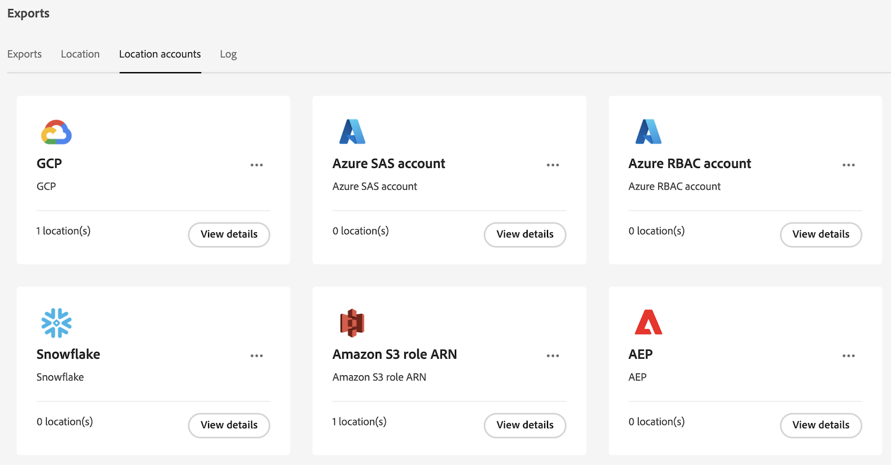

# Gerenciar locais e contas de exportação da nuvem

É possível exibir, editar e excluir locais de exportação na nuvem.

Para obter informações sobre como criar um novo local, consulte [Configurar locais de exportação da nuvem](/help/components/exports/cloud-export-locations.md).

## Filtrar e pesquisar locais

Para encontrar as informações necessárias, você pode filtrar a lista de locais ou pesquisar um local.

### Filtrar a lista de locais

1. No Customer Journey Analytics, selecione [!UICONTROL **Componentes**] > [!UICONTROL **Exportações**].

1. Selecione o [!UICONTROL **Localizações**] guia.

1. Selecione o **Filtro** ícone.

   <!-- add screenshot -->

   Você pode filtrar pelos seguintes critérios:

   | Filtro | Descrição |
   |---------|----------|
   | [!UICONTROL **Tipo de local**]<!--should this be changed to Account type?--> | O tipo de conta ao qual a localização está associada. Os seguintes tipos de conta podem estar disponíveis: <ul><li>[!UICONTROL **Zona de destino de dados da AEP**]</li><li>[!UICONTROL **Amazon S3 Role ARN**]</li><li>[!UICONTROL **Google Cloud Platform**]</li><li>[!UICONTROL **Azure SAS**]</li><li>[!UICONTROL **Azure RBAC**]</li><li>[!UICONTROL **Snowflake**]</li></ul> |
   | [!UICONTROL **Conta**] | O nome da conta à qual a localização está associada. |
   | [!UICONTROL **Criado por**] | O endereço de email do usuário que criou a localização. |

   {style="table-layout:auto"}

### Pesquisar locais

1. No Customer Journey Analytics, selecione [!UICONTROL **Componentes**] > [!UICONTROL **Exportações**].

1. Selecione o [!UICONTROL **Localizações**] guia.

1. Na guia Pesquisar, comece digitando qualquer informação associada ao local em que você está pesquisando. Você pode pesquisar dados de qualquer coluna disponível na tabela.

## Editar locais

1. No Customer Journey Analytics, selecione [!UICONTROL **Componentes**] > [!UICONTROL **Exportações**].

1. Selecione o [!UICONTROL **Localizações**] e selecione o local que deseja editar.

   <!-- add screenshot? -->

1. Selecione [!UICONTROL **Editar**].

1. Faça as alterações desejadas e selecione [!UICONTROL **Salvar**].

## Excluir locais

Se você excluir um local, todas as exportações que usam esse local também serão excluídas.

Antes de excluir um local, verifique primeiro se ele está sendo usado por alguma exportação selecionando o ícone de informações ao lado do nome do local.

Para excluir um local:

1. No Customer Journey Analytics, selecione [!UICONTROL **Componentes**] > [!UICONTROL **Exportações**].

1. Selecione o [!UICONTROL **Localizações**] e, em seguida, selecione um ou mais locais que deseja excluir.

   <!-- add screenshot? -->

1. Selecionar [!UICONTROL **Excluir**] e selecione [!UICONTROL **Excluir**] novamente no diálogo de confirmação.

## Editar contas

1. No Customer Journey Analytics, selecione [!UICONTROL **Componentes**] > [!UICONTROL **Exportações**].

1. Selecione o [!UICONTROL **Contas de localização**] guia.

   

1. Selecionar [!UICONTROL **Exibir detalhes**] na conta que deseja editar.

1. Faça as alterações desejadas e selecione [!UICONTROL **Salvar**].

## Excluir contas

1. No Customer Journey Analytics, selecione [!UICONTROL **Componentes**] > [!UICONTROL **Exportações**].

1. Selecione o [!UICONTROL **Contas de localização**] guia.

   

1. Selecione o ícone de 3 pontos na conta que deseja editar e selecione [!UICONTROL **Excluir conta**].

1. Selecionar [!UICONTROL **Excluir**] novamente no diálogo de confirmação.
