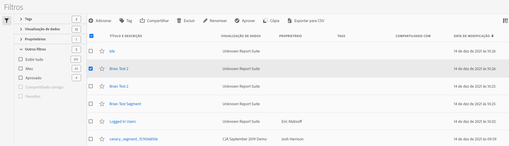

# Gerenciador de filtros

O gerenciador de Filtros oferece várias formas de cuidar de filtros, como compartilhar, marcar, aprovar, copiar, excluir e marcar como favoritos.

O gerenciador Filtros mostra todos os seus filtros e os compartilhados com você. Os usuários de nível administrativo podem visualizar todos os filtros na organização. Esta visão geral apresenta a interface do usuário e os recursos do gerenciador de Filtros.

## Acessar o gerenciador de Filtros

1. No Customer Journey Analytics, selecione a guia **[!UICONTROL Componentes]** e, em seguida, selecione **[!UICONTROL Filtros]**.

## Ações disponíveis no gerenciador de filtros

No gerenciador de Filtros, é possível:

* [Filtrar a lista de filtros](/help/components/filters/filters-filter.md)

* [Marcar filtros como favoritos](/help/components/filters/filters-favorite.md)

* [Aprovar filtros](/help/components/filters/filters-approve.md)

* [Marcar filtros](/help/components/filters/filters-tag.md)

* [Compartilhar filtros](/help/components/filters/filters-share.md)

* Exporte um filtro para um arquivo CSV.

* [Copiar filtros](/help/components/filters/filters-copy.md)

* Excluir filtros

## Configurar colunas

Você pode configurar as informações exibidas para cada filtro no gerenciador de Filtros configurando as colunas exibidas.

Para configurar as colunas visíveis no gerenciador de Filtros:

1. No Customer Journey Analytics, selecione a guia **[!UICONTROL Componentes]** e, em seguida, selecione **[!UICONTROL Filtros]**.

1. No gerenciador de Filtros, selecione o **ícone Personalizar colunas**  e selecione as colunas que deseja exibir no gerenciador de Filtros.

   As seguintes colunas estão disponíveis:

   | Título da coluna | Descrição |
   |---|---|
   | Título e descrição | Esses valores são fornecidos no Construtor de filtros. Para editar o título e a descrição, selecione o link de título para abrir o Construtor de filtros. |
   | Favoritos | Exibe ícones de estrela ao lado de cada filtro, permitindo marcar filtros como favoritos. Para obter mais informações, consulte [Marcar filtros como favoritos](/help/components/filters/filters-favorite.md). |
   | Visualização de dados | Essa coluna indica em qual visualização de dados o filtro foi salvo pela última vez. |
   | Proprietário | Indica quem é o proprietário do filtro. Como um usuário não administrativo, você pode ver somente os filtros que possui ou que foram compartilhados com você. |
   | Tags (não marcadas no seletor de colunas, portanto, a coluna não aparece) | Tags aplicadas ao filtro, por você ou outras pessoas que compartilharam o filtro com você. |
   | Compartilhado com | Lista indivíduos ou grupos (somente Administrador) ou Todos (somente Administrador) com os quais você compartilhou o filtro. 
Quando um filtro está sendo compartilhado por você ou com você, um ícone de compartilhamento é exibido ao lado do nome do filtro.
 |
   | Data de modificação | Mostra a data em que o filtro foi modificado pela última vez. |
   | Usado em | Mostra em quantos componentes o filtro está sendo usado atualmente. 
Por exemplo, se o filtro estiver sendo usado em 40 projetos e 2 alertas, o valor dessa coluna será exibido como [!UICONTROL **42 componentes**].
 
Selecione o valor desta coluna para ver o detalhamento de onde o filtro está sendo usado (por exemplo, [!UICONTROL **Projetos (40)**], [!UICONTROL **Alertas (2)**]).

Os filtros podem ser usados em qualquer um dos seguintes tipos de componentes:
 <ul><li>Métricas calculadas</li><li>Projetos</li><li>Projetos programados</li></ul>
Essas informações podem ajudar você a determinar se um componente é valioso para os usuários em sua organização, onde é usado e se precisa ser excluído ou modificado.

Considere o seguinte ao visualizar esta coluna:
<ul><li>Essas informações não incluem o uso da API, Report Builder ou Data Warehouse.</li><li>A coluna [!UICONTROL **Usado em**] não é exibida por padrão. [Configure as colunas](#configure-columns) para exibi-las.</li><li>Se não houver dados nesta coluna para um determinado componente, mas ela tiver uma data [!UICONTROL **Última utilização**], o componente pode ter sido usado em uma análise sem ser salvo.</li><li>Essas informações estão disponíveis somente para administradores do sistema.</li></ul>
Você pode usar o [Dicionário de Dados](/help/components/data-dictionary/data-dictionary-overview.md) juntamente com essas informações para ajudá-lo a acompanhar e entender melhor como os componentes estão sendo usados em sua organização.
 |
   | Última utilização | Mostra a data em que o filtro foi usado pela última vez em qualquer um dos seguintes tipos de componentes: <ul><li>Métricas calculadas</li><li>Projetos</li><li>Projetos programados</li><li>Filtros</li></ul> 
Essas informações podem ajudar você a determinar se um componente é valioso para os usuários em sua organização ou se deve ser excluído.

Considere o seguinte ao visualizar esta coluna:
<ul><li>Essas informações não incluem o uso da API, Report Builder ou Data Warehouse.</li><li>Para alguns componentes, essa coluna pode não conter dados se o componente tiver sido usado pela última vez antes de setembro de 2023.</li><li>Essas informações estão disponíveis somente para administradores do sistema.</li></ul>
Você pode usar o [Dicionário de Dados](/help/components/data-dictionary/data-dictionary-overview.md) juntamente com essas informações para ajudá-lo a acompanhar e entender melhor como os componentes estão sendo usados em sua organização. |

   {style="table-layout:auto"}
