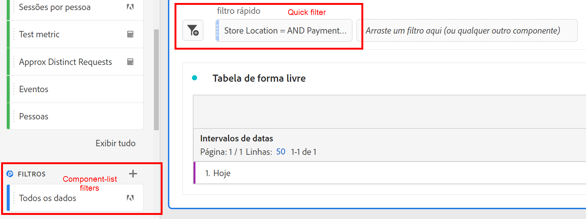
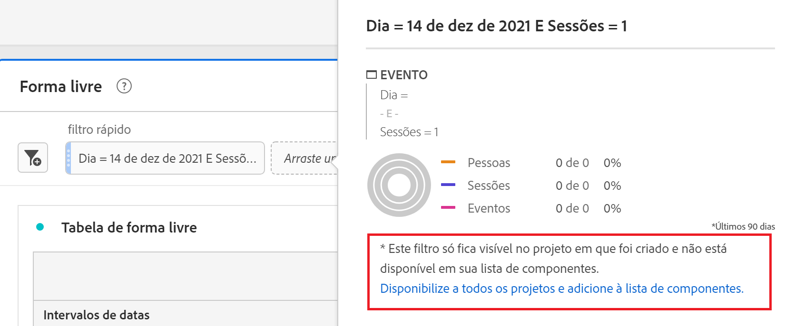
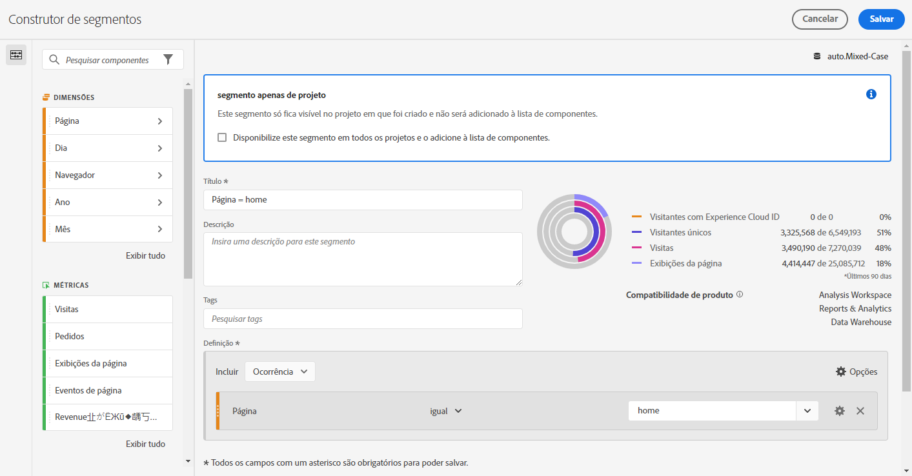
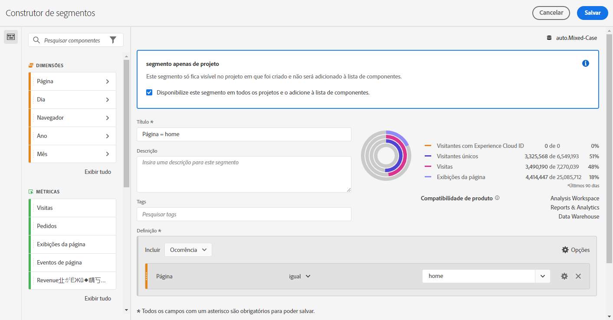

# Filtros rápidos

Você pode criar filtros rápidos dentro de um projeto para evitar a complexidade do [Construtor de filtros](/help/components/filters/create-filters.md) completo. Filtros rápidos

* Aplicar como [filtros somente de projeto](https://experienceleague.adobe.com/docs/analytics-platform/using/cja-components/cja-filters/quick-filters.html#project-only).
* Permitem até três regras
* Não acomodam containers aninhados ou regras sequenciais.

Para uma comparação do que os filtros rápidos podem fazer com relação aos filtros completos da lista de componentes, acesse [aqui](/help/components/filters/filters-overview.md).

Este é um vídeo sobre filtros rápidos (observe que ele usa o termo &quot;segmentos rápidos&quot;.) No entanto, a funcionalidade é a mesma.

>[!VIDEO](https://video.tv.adobe.com/v/341466/?quality=12&learn=on)

## Pré-requisitos {#prereqs}

Qualquer pessoa pode criar um filtro rápido. No entanto, você precisa da permissão Criação de filtro na variável [Adobe Admin Console](https://experienceleague.adobe.com/docs/analytics/admin/admin-console/permissions/summary-tables.html#analytics-tools) para salvar um filtro rápido ou abri-lo no Construtor de filtros.

## Criar filtros rápidos {#create}

Em uma tabela de Forma livre, clique no ícone do filtro+ no cabeçalho do painel:

| Configuração | Descrição |
| --- | --- |
| [!UICONTROL Nome] | O nome padrão de um filtro é uma combinação dos nomes das regras no filtro. É possível renomear o filtro para um nome mais amigável. |
| [!UICONTROL Incluir/excluir] | Você pode incluir ou excluir componentes na definição do filtro, mas não ambos. |
| [!UICONTROL Container de ocorrência/visita/visitante] | Filtros rápidos incluem somente um [container de filtro](https://experienceleague.adobe.com/docs/analytics-platform/using/cja-components/cja-filters/filters-overview.html#filter-containers) que permite incluir uma dimensão/métrica/intervalo de datas no (ou excluí-lo do) filtro. O [!UICONTROL Visitante] contém dados abrangentes específicos para o visitante entre visitas e visualizações de página. Um container de [!UICONTROL Visita] permite definir regras para detalhar os dados do visitante com base em visitas, e um container de [!UICONTROL Ocorrência] permite detalhar as informações do visitante com base em visualizações de página individuais. O container padrão é o de [!UICONTROL Ocorrência]. |
| [!UICONTROL Componentes] (Dimension/métrica/intervalo de datas) | Defina até 3 regras adicionando componentes (dimensões, métricas, intervalos de datas ou valores de dimensão). Há três maneiras de encontrar o componente correto:<ul><li>Comece a digitar e o construtor de [!UICONTROL Filtros rápidos] encontrará automaticamente o componente apropriado.</li><li>Use a lista suspensa para localizar o componente.</li><li>Arraste os componentes do painel esquerdo e solte-os.</li></ul> |
| [!UICONTROL Operador] | Use o menu suspenso para encontrar operadores padrão e operadores de [!UICONTROL Contagem distinta]. Consulte [Operadores de filtro](operators.md). |
| Sinal de mais (+) | Adicionar outra regra |
| Qualificadores AND/OR | É possível adicionar qualificadores “AND” ou ”OR” às regras, mas não é possível misturar &quot;AND&quot; e &quot;OR&quot; em uma única definição de filtro. |
| [!UICONTROL Aplicar] | Aplicar esse filtro ao painel. Se o filtro não contiver dados, você será questionado se deseja continuar. |
| [!UICONTROL Abrir builder] | Abre o Construtor de filtros. Depois de salvar ou aplicar o filtro no Construtor de filtros, ele não é mais considerado um “Filtro rápido”. Ele se torna parte da biblioteca de filtros da lista de componentes. |
| [!UICONTROL Cancelar] | Cancele esse filtro rápido - não o aplique. |
| [!UICONTROL Intervalo de datas] | O validador usa o intervalo de datas do painel para a pesquisa de dados. Mas qualquer intervalo de datas aplicado em um filtro rápido substitui o intervalo de datas na parte superior do painel. |
| Pré-visualizar (canto superior direito) | Permite ver se você tem um filtro válido e a amplitude deste. Representa o detalhamento do conjunto de dados que se pode esperar ao aplicar esse filtro. Você pode receber um aviso indicando que esse filtro não tem dados. Nesse caso, você pode continuar ou alterar a definição do filtro. |

Aqui está um exemplo de um filtro que combina dimensões e métricas:

O filtro é exibido na parte superior. Observe a barra lateral com listras azuis, diferente da barra lateral azul para filtros baseados em componente na biblioteca de filtros à esquerda.

## Editar filtros rápidos {#edit}

1. Passe o mouse sobre o filtro rápido e selecione o ícone do lápis.
1. Edite a definição ou o nome do filtro.
1. Clique em [!UICONTROL Aplicar].

## Salvar filtros rápidos {#save}

Você pode optar por salvar filtros rápidos no [!UICONTROL Construtor de filtros rápidos] ou no [!UICONTROL Construtor de filtros].

>[!IMPORTANT]
>Depois de salvar ou aplicar o filtro, não é mais possível editá-lo no Construtor de filtros rápidos, somente no Construtor de filtros comum.

### Salvar no Construtor de filtros rápidos {#save2}

1. Depois de aplicar o filtro rápido, passe o mouse sobre ele e selecione o ícone de informações (&quot;i&quot;).
1. Clique em **[!UICONTROL Disponibilizar para todos os projetos e adicionar à lista de componentes]**.
1. Renomeie o filtro (opcional).
1. Clique em **[!UICONTROL Salvar]**.

Observe como a barra lateral do filtro muda de azul listrado para azul-claro. Agora ele aparece na lista de componentes no painel esquerdo.

### Salvar no Construtor de filtros {#save3}

1. Passe o mouse sobre o filtro rápido e selecione o ícone de informações (&quot;i&quot;).
1. Selecione **[!UICONTROL Salvar filtro]**
1. Deixe o nome como está ou renomeie o filtro.

   Volte para o espaço de trabalho e observe como o filtro agora tem uma barra lateral azul-clara. Isso indica que ele não pode mais ser editado/aberto no Construtor de filtros rápidos. E ao salvá-lo, ele se torna parte da lista de componentes.

   

Depois de aplicar o filtro, você pode optar por adicioná-lo à lista de componentes de filtro e disponibilizá-lo para todos os projetos.

1. Passe o mouse sobre o filtro salvo e selecione o ícone do lápis.

1. Na parte superior do Construtor de filtros, observe esta caixa de diálogo:

   

1. Marque a caixa de seleção ao lado de **[!UICONTROL Disponibilizar para todos os projetos e adicionar à lista de componentes.]**
1. Clique em **[!UICONTROL Salvar]**.
1. O filtro agora aparece na lista de componentes de filtro para todos os seus projetos.
1. Você também pode [compartilhar o filtro](/help/components/filters/manage-filters.md) com outras pessoas em sua empresa.

## O que são filtros exclusivos de projeto? {#project-only}

Os filtros somente do projeto são filtros que se aplicam somente ao projeto atual em que foram criados. Eles não estão disponíveis em outros projetos e não podem ser compartilhados com outros usuários. Eles são destinados à exploração rápida de seus dados sem precisar criar e salvar um filtro no painel esquerdo. Filtros somente de projeto podem ser criados na área de soltar do painel com filtros rápidos ou [filtros ad hoc](/help/components/filters/ad-hoc-filters.md).

Se você abrir um filtro somente para projeto no [!UICONTROL Construtor de filtros], uma notificação somente de projeto é exibida. Se não marcar &quot;Disponibilizar este filtro..&quot; e clique em **[!UICONTROL APLICAR]**, o segmento permanece um filtro somente de projeto.

>[!NOTE]
>
>Se você aplicar um filtro Rápido no Construtor de filtros, ele não poderá mais ser aberto na [!UICONTROL Construtor de filtros rápidos].

Se marcar &quot;Tornar este filtro disponível..&quot; e clique em **[!UICONTROL SALVAR]**, o filtro fica disponível na lista de componentes do painel à esquerda para uso em outros projetos. Ele também pode ser compartilhado com outros usuários no Gerenciador de filtros.

