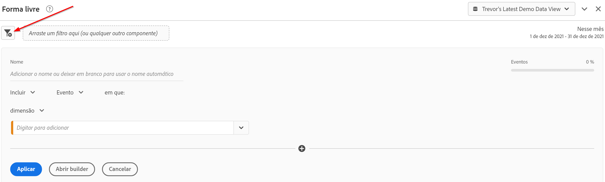
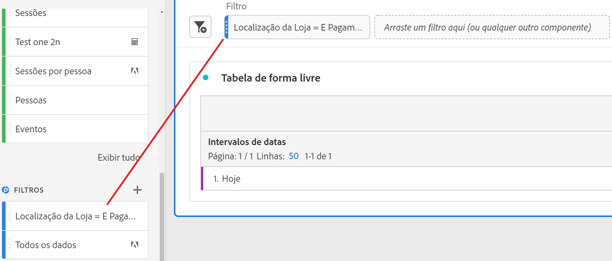
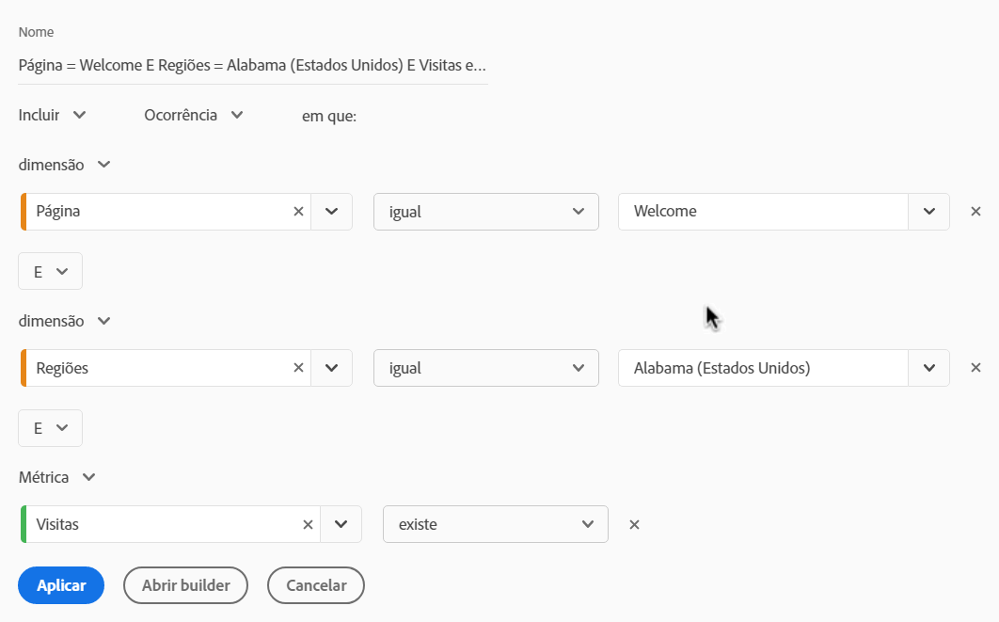

# Filtros rápidos

Filtros rápidos permitem explorar dados facilmente em um determinado projeto, sem a necessidade de criar um filtro de lista de componentes mais complexo no [Construtor de filtros](/help/components/filters/create-filters.md).

Considere o seguinte ao criar filtros rápidos:

* Os filtros rápidos se aplicam somente ao projeto em que foram criados. Eles não estão disponíveis em outros projetos e não é possível compartilhá-los com outros usuários.
* São permitidas no máximo 3 regras.
* Não há suporte para containers aninhados ou regras sequenciais.
* Se você compartilhar um projeto com outros usuários, esses usuários poderão editar filtros rápidos e outros componentes somente de projeto que estão incorporados ao projeto compartilhado.

O vídeo a seguir demonstra como usar filtros rápidos. (Observação: este vídeo usa o termo &quot;segmentos rápidos&quot; em vez de &quot;filtros rápidos&quot;. No entanto, a funcionalidade é a mesma.)

>[!VIDEO](https://video.tv.adobe.com/v/341466/?quality=12&learn=on)

## Criar um filtro rápido {#create}

Qualquer usuário no Analysis Workspace pode criar um filtro rápido.

Para criar um filtro rápido:

1. Escolha um dos seguintes métodos para começar a criar o filtro rápido:

   * **Ad hoc (arrastar e soltar):** No painel esquerdo, arraste um componente para a área de destino do filtro no cabeçalho do painel.

     

     Você pode editar o filtro rápido conforme descrito em [Editar um filtro rápido](#edit-a-quick-filter).

     >[!NOTE]
     >
     > Considere o seguinte ao criar um filtro rápido ad hoc (arrastar e soltar):
     > * Os seguintes tipos de componentes não são compatíveis: métricas calculadas e dimensões, bem como métricas a partir das quais você não pode criar filtros.
     > * Para dimensões e eventos completos, o Analysis Workspace cria filtros de evento &quot;existe&quot;. Exemplos: `Hit where eVar1 exists` ou `Hit where event1 exists`.
     > * Se “não especificado” ou “nenhum” forem soltos na área de destino do filtro, eles serão automaticamente convertidos em um filtro “não existe” para que sejam tratados corretamente durante a filtragem.

   * **Usando o ícone de filtro:** Em uma tabela de Forma livre, selecione o ícone **Filtro** no cabeçalho do painel.

     

1. Ajuste qualquer uma das seguintes configurações:

   | Configuração | Descrição |
   | --- | --- |
   | [!UICONTROL Nome] | O nome padrão de um filtro é uma combinação dos nomes das regras no filtro. É possível renomear o filtro para um nome mais amigável. |
   | [!UICONTROL Incluir/excluir] | Você pode incluir ou excluir componentes na definição do filtro, mas não ambos. |
   | [!UICONTROL Container de ocorrência/visita/visitante] | Filtros rápidos incluem somente um [container de filtro](https://experienceleague.adobe.com/docs/analytics-platform/using/cja-components/cja-filters/filters-overview.html?lang=pt-BR#filter-containers) que permite incluir uma dimensão/métrica/intervalo de datas no (ou excluí-lo do) filtro. [!UICONTROL Visitante] contém dados abrangentes específicos para a pessoa entre visitas e visualizações de página. Um contêiner de [!UICONTROL Visita] permite definir regras para detalhar os dados da pessoa com base em visitas, e um contêiner de [!UICONTROL Ocorrência] permite detalhar as informações da pessoa com base em visualizações de página individuais. O container padrão é o de [!UICONTROL Ocorrência]. |
   | [!UICONTROL Componentes] (Dimensão/métrica/intervalo de datas) | Defina até 3 regras adicionando componentes (dimensões, métricas, intervalos de datas ou valores de dimensão). Há três maneiras de encontrar o componente correto:<ul><li>Comece a digitar e o construtor de filtros rápidos encontrará automaticamente o componente apropriado.</li><li>Use a lista suspensa para localizar o componente.</li><li>Arraste os componentes do painel esquerdo e solte-os.</li></ul> |
   | [!UICONTROL Operador] | Use o menu suspenso para encontrar operadores padrão e operadores de [!UICONTROL Contagem distinta]. Consulte [Operadores de filtro](operators.md). |
   | Sinal de mais (+) | Adicionar outra regra |
   | Qualificadores AND/OR | É possível adicionar qualificadores “AND” ou ”OR” às regras, mas não é possível misturar &quot;AND&quot; e &quot;OR&quot; em uma única definição de filtro. |
   | [!UICONTROL Aplicar] | Aplicar esse filtro ao painel. Se o filtro não contiver dados, você será perguntado se deseja continuar. |
   | [!UICONTROL Abrir builder] | Abre o Construtor de filtros. Depois de salvar ou aplicar o filtro no Construtor de filtros, ele não é mais considerado um &quot;Filtro rápido&quot;. Ele se torna parte da biblioteca de filtros da lista de componentes. 
Para disponibilizar o componente em todos os projetos e no painel esquerdo, selecione a opção [!UICONTROL **Disponibilizar este filtro para todos os projetos e adicioná-lo à lista de componentes**].

Para obter mais informações, consulte a seção [Salvar um filtro rápido como um filtro da lista de componentes](#save-a-quick-filter-as-a-component-list-filter) neste artigo.

**Observação:** somente usuários com a permissão Criação de Segmentos no [Adobe Admin Console](https://experienceleague.adobe.com/docs/analytics/admin/admin-console/permissions/analytics-tools.html?lang=pt-BR) podem abrir o Construtor de Filtros.
 |
   | [!UICONTROL Cancelar] | Cancelar este filtro rápido (não o aplicar). |
   | [!UICONTROL Intervalo de datas] | O validador usa o intervalo de datas do painel para a pesquisa de dados. Mas qualquer intervalo de datas aplicado em um filtro rápido substitui o intervalo de datas na parte superior do painel. |
   | Pré-visualizar (canto superior direito) | Permite ver se você tem um filtro válido e a amplitude deste. Representa o detalhamento do conjunto de dados que você pode esperar ao aplicar esse filtro. Você pode receber um aviso indicando que esse filtro não tem dados. Nesse caso, você pode continuar ou alterar a definição do filtro. |

1. Clique em [!UICONTROL **Aplicar**] para salvar suas alterações.

## Editar um filtro rápido {#edit}

1. Passe o mouse sobre o filtro rápido que deseja editar, em seguida, selecione o ícone **Editar**.

   

1. Edite a definição ou o nome do filtro.
1. Clique em [!UICONTROL **Aplicar**] para salvar suas alterações.

## Salvar um filtro rápido como um filtro da lista de componentes {#save}

>[!IMPORTANT]
>
> Considere o seguinte ao salvar um filtro rápido:
> 
> * Para salvar um filtro rápido, você precisa da permissão Criação de segmentos no [Adobe Admin Console](https://experienceleague.adobe.com/docs/analytics/admin/admin-console/permissions/analytics-tools.html?lang=pt-BR).
> 
> * Depois de salvar ou aplicar o filtro, ele não poderá mais ser editado no construtor de filtros rápidos. Em vez disso, você deve usar o Construtor de filtros comum.

Você pode optar por salvar filtros rápidos como filtros da lista de componentes. As vantagens dos filtros da lista de componentes incluem:

* Disponibilidade em todos os projetos do espaço de trabalho
* Suporte a filtros mais complexos, bem como filtros sequenciais

Você pode salvar filtros no construtor de filtros rápidos ou no [!UICONTROL Construtor de filtros].

### Salvar no construtor de filtros rápidos {#save2}

1. Depois de aplicar o filtro rápido, passe o mouse sobre ele e selecione o ícone de informações (&quot;i&quot;).
1. Selecione **[!UICONTROL Disponibilizar em todos os projetos e adicionar à sua lista de componentes]**.
1. Renomeie o filtro (opcional).
1. Selecione **[!UICONTROL Salvar]**.

   O filtro agora aparece na lista de componentes no painel esquerdo. Além disso, observe que a barra lateral do filtro muda de azul-claro para azul-escuro, indicando que ele não pode mais ser editado ou aberto no construtor de filtros rápidos.

### Salvar no Construtor de filtros {#save3}

1. Depois de aplicar o filtro rápido, passe o mouse sobre ele e selecione o ícone de informações (&quot;i&quot;).
1. Selecione **[!UICONTROL Salvar filtro]**
1. (Opcional) Renomeie o filtro e selecione [!UICONTROL **Aplicar**].

   Retorne ao Workspace e observe que a barra lateral do filtro muda de azul-claro para azul-escuro, indicando que ele não pode mais ser editado ou aberto no construtor de filtros rápidos. E ao salvá-lo, ele se torna parte da lista de componentes.

   

Depois de aplicar o filtro, você pode optar por adicioná-lo à lista de componentes de filtro e disponibilizá-lo para todos os projetos.

1. Passe o mouse sobre o filtro salvo e selecione o ícone do lápis.

1. Selecione [!UICONTROL **Abrir construtor**].

1. Na parte superior do Construtor de filtros, observe esta caixa de diálogo:

   

1. Marque a caixa de seleção ao lado de **[!UICONTROL Disponibilize este filtro para todos os projetos e adicione-o à lista de componentes.]**

1. Selecione **[!UICONTROL Salvar]**.

   O filtro agora aparece na lista de componentes de filtro para todos os seus projetos.
Você também pode [compartilhar o filtro](/help/components/filters/filters-share.md) com outras pessoas em sua empresa.

## Exemplo de filtro rápido

O exemplo a seguir de um filtro combina dimensões e métricas:

