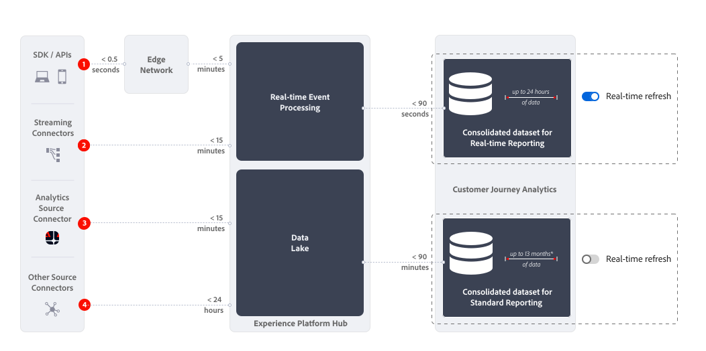

# Visão geral do relatório em tempo real

O relatório em tempo real no Customer Journey Analytics exibe e atualiza dados e visualizações em um ou mais painéis no Analysis Workspace em tempo real.

{{ultimate-package}}

>[!TIP]
>
>Se você estiver qualificado para o pacote do Ultimate, mas não vir o [Botão de atualização em tempo real](use-real-time.md), crie um tíquete de atendimento ao cliente para solicitar a ativação dos relatórios em tempo real para sua organização.

## Casos de uso

Esta seção fornece uma visão geral dos casos de uso típicos valiosos e menos valiosos. E também informações quando não se deve considerar relatórios em tempo real.

* Os casos de uso mais valiosos para relatórios em tempo real estão relacionados às principais vendas, promoções ou lançamentos de produtos.
Como parte desse lançamento, você deseja saber:

   * Como as vendas se comparam com sua última venda?
   * Como esse lançamento de produto se compara ao último lançamento de produto?
   * Suas promoções para esse dia ou evento importante realmente funcionam?

* Casos de uso relevantes, mas menos valiosos, para relatórios em tempo real são os casos de uso de validação.
Você deseja validar, por exemplo:

   * A jornada de campanha lançada recentemente está funcionando?
   * Quando a nova página do produto entrou em funcionamento, você está coletando dados do cliente da página?
   * Seu evento de mídia ao vivo está indo bem?

Não considere a geração de relatórios em tempo real para casos de uso de monitoramento de operações. Por exemplo, para responder à pergunta se um site está funcionando corretamente. Como o [botão de atualização em tempo real](use-real-time.md) é desabilitado automaticamente depois de 30 minutos e o relatório em tempo real para de ser atualizado, você não deve usar um relatório em tempo real como uma fonte confiável para esses casos de uso.

## Como funciona

Os relatórios em tempo real usam um conjunto de dados consolidado que é completamente separado do [conjunto de dados consolidado (combinado)](/help/connections/combined-dataset.md) usado para relatórios padrão. Você usa o [botão de atualização em tempo real](use-real-time.md) para alternar entre:

* Relatórios em tempo real em um conjunto de dados consolidado que contém até 24 horas de dados contínuos.
* Emissão de relatórios padrão no conjunto de dados consolidado que contém até 13 meses de dados contínuos (ou mais, caso você tenha licenciado o Complemento de capacidade de dados estendida).

{zoomable="yes"}

### Latências

A maneira como você coleta dados determina a latência dos relatórios em tempo real no Customer Journey Analytics. A ilustração acima e a tabela abaixo mostram latências aproximadas para vários cenários de coleta de dados ao usar relatórios padrão em tempo real e (para comparação).

| | Coleção de dados | Latência de relatório em tempo real  (aprox. menor que) | Latência de relatório padrão  (aprox. menor que) |
|:---:|---|--:|--:|
| 1 | Edge Network SDK/APIs na Edge Network | 7 minutos | 95 minutos |
| 2 | Conectores de transmissão | 17 minutos | 105 minutos |
| 3 | Conector de origem do Adobe Analytics | 17 minutos | 105 minutos |
| 4 | Outros conectores de origem nos conectores de origem (incluindo dados em lote) | 25 horas | 25 horas |

Se uma interrupção dos serviços ocorrer por mais de meia hora, os dados em tempo real não serão preenchidos retroativamente com dados quando os problemas forem resolvidos. Em vez disso, os relatórios em tempo real coletam dados em tempo real a partir do momento em que os serviços começam a funcionar novamente. Nenhum dado é perdido durante esse período e ainda está disponível usando os recursos de relatório padrão fora do relatório em tempo real.

## Limitações

Esteja ciente da seguinte limitação para relatórios em tempo real:

* O relatório em tempo real só relata os dados disponíveis em um período contínuo de 24 horas. Os dados com mais de 24 horas não estão disponíveis para relatórios em tempo real. Assim que a [atualização em tempo real](use-real-time.md) de um relatório for desabilitada ou desabilitada automaticamente, todos os dados relevantes estarão disponíveis mais uma vez no [conjunto de dados consolidado](/help/connections/combined-dataset.md) normalmente usado para relatórios no Customer Journey Analytics.
* A atribuição, a segmentação, as métricas calculadas e muito mais trabalharão apenas nos dados disponíveis no período acumulado de 24 horas. Por exemplo, um segmento *Visitantes repetidos* inclui pouquíssimas pessoas em um relatório em tempo real, pois o relatório inclui apenas pessoas que visitaram várias vezes nas últimas 24 horas. Uma limitação semelhante se aplica quando você cria um relatório em tempo real sobre pessoas que clicaram anteriormente em uma campanha que não está mais ativa.
* O relatório em tempo real funciona melhor em dados de evento e nível de sessão, e você deve ter cuidado ao usar o relatório em tempo real para dados de nível de pessoa. Como apenas eventos do período contínuo de 24 horas estão disponíveis para relatórios em tempo real, o histórico de eventos de uma pessoa também está limitado a essa janela. Considere a preferência por dados de evento e nível de sessão ao selecionar uma dimensão e métricas (calculadas). E quando você usa funcionalidades como detalhamentos, anteriores ou seguintes e muito mais no painel habilitado para atualização em tempo real.
* Não é possível combinar a compilação com os relatórios em tempo real. Os relatórios em tempo real abordam dados de nível de evento e sessão e são menos relevantes para dados com base em pessoas.
* Nenhuma métrica de mídia coletada de heartbeat está disponível, exceto as métricas de início e fechamento de mídia. Dessa forma, você ainda pode usar os relatórios em tempo real para ativar um caso de uso de mídia.
* Ao usar as [opções de download ou exportação](/help/analysis-workspace/export/download-send.md) para baixar um projeto ou exportar dados de uma tabela de forma livre, considere o seguinte:
   * Um projeto CSV baixado ou arquivo CSV exportado contém os dados em tempo real disponíveis no momento do download ou da exportação.
   * Um projeto do PDF baixado contém dados que não são em tempo real, semelhantes aos dados que são mostrados quando a atualização em tempo real está desativada.
