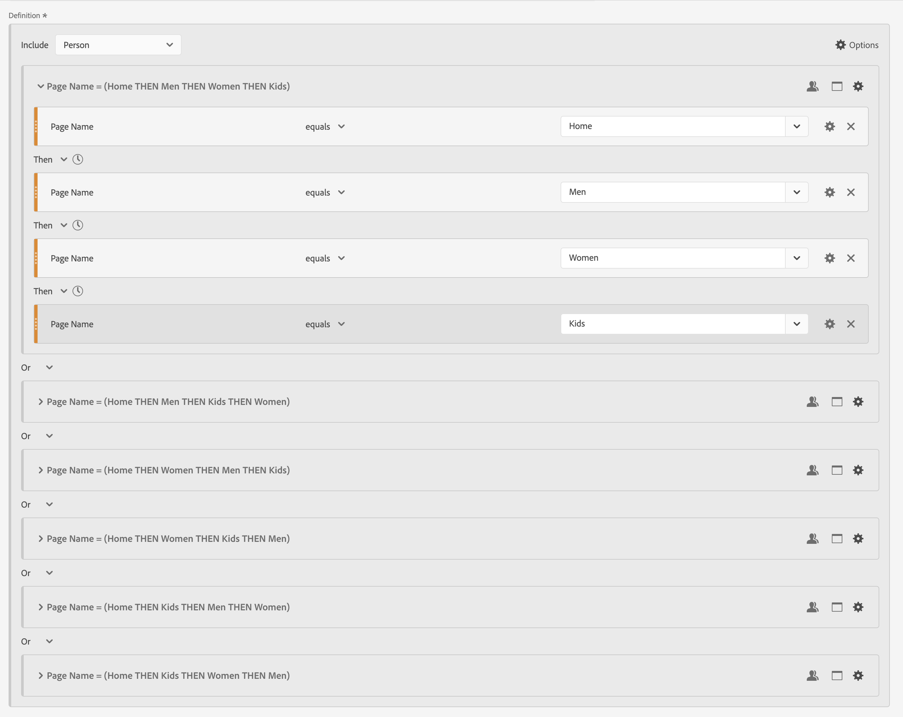
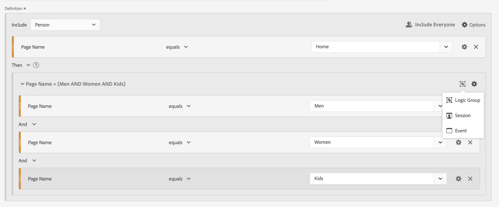

# Segmentos sequenciais

Você cria segmentos sequenciais usando o operador lógico [!UICONTROL Then] entre componentes, contêineres e componentes ou contêineres. O operador lógico [!UICONTROL Then] implica que uma condição de segmento ocorre, seguida de outra.

>[!BEGINSHADEBOX]

Consulte  [Segmentação sequencial](https://video.tv.adobe.com/v/25405/?quality=12&learn=on){target="_blank"} para ver um vídeo de demonstração.

{{videoaa}}

>[!ENDSHADEBOX]

Um segmento sequencial tem alguma [funcionalidade básica](#basics) e opções adicionais que você pode configurar para adicionar mais complexidade ao segmento sequencial:

* [Restrições After e within](#after-and-within) para a lógica Then na definição de segmento de sequência:

* Quais dados [incluir](#include) como parte da sequência geral para a definição do segmento. Ou para uma sequência definida como parte de um container. Por padrão, todos os dados correspondentes são considerados. Esses dados são identificados por  [!UICONTROL Incluir todos].

   * Selecione  **[!UICONTROL Only Before Sequence]** para considerar apenas os dados antes da sequência.
   * Selecione  **[!UICONTROL Only After Sequence]** para considerar apenas os dados após a sequência.

* Quais dados [excluir](#exclude) como parte da definição de segmento sequencial.

* Como [agrupar logicamente](#logic-group) condições na definição do segmento sequencial.

## Noções básicas

As noções básicas para construir um segmento sequencial não são diferentes de construir um segmento regular usando o [Construtor de segmentos](seg-builder.md). Você pode usar o [Criador de definições](seg-builder.md#definition-builder) para criar sua definição de segmento. Nessa construção, você usa componentes, contêineres, operadores e lógica. Um segmento regular se torna um segmento sequencial assim que você seleciona o operador **[!UICONTROL Then]** na definição principal ou em qualquer um dos contêineres usados no [Construtor de definições](seg-builder.md#definition-builder).

### Exemplos

Os exemplos abaixo ilustram como você usa segmentos sequenciais em vários casos de uso.

#### Sequência simples

Identifique as pessoas que visualizaram uma página e, em seguida, visualizaram outra página. Os dados no nível do evento são segmentados usando essa sequência. Independentemente de sessões anteriores, passadas ou interinas de pessoas ou do tempo ou número de exibições de página que ocorrem entre as sessões.

#### Sequência entre sessões

Identifique as pessoas que visualizaram uma página em uma sessão e, em seguida, visualizaram outra página em outra sessão. Para diferenciar entre sessões, use contêineres para criar a sequência e definir o nível de  **[!UICONTROL Sessão]** para cada contêiner.

#### Sequência de nível misto

Identifique pessoas que visualizam duas páginas em um número indeterminado de sessões e visualize uma terceira página em uma sessão separada. Novamente, use contêineres para criar a sequência e definir o nível de  **[!UICONTROL Sessão]** no contêiner que define a sessão separada.

#### Sequência agregada

Identifique as pessoas que, na primeira sessão, visitaram uma página específica e, posteriormente, visitaram outras páginas. Para diferenciar entre a sequência de eventos, use contêineres para separar a lógica em um nível de contêiner de  **[!UICONTROL Sessão]**.

#### Aninhar uma sequência

Identifique todas as sessões em que uma pessoa visita uma página antes de outra e tenha sessões de acompanhamento que envolvem duas outras páginas. Por exemplo, identifique todas as sessões em que uma pessoa visita a home page pela primeira vez, em seguida, uma página de categoria 1 e, em seguida, tem outras sessões em que, em cada sessão, as páginas de categoria 2 e categoria 3 são visitadas.

## [!UICONTROL Depois] e [!UICONTROL Dentro]

Você pode usar  **[!UICONTROL Depois]** e  **[!UICONTROL Dentro]** o operador **[!UICONTROL Então]** para definir [restrições de tempo](#time-constraints) ou [restrições adicionais para Eventos, Sessões ou Dimensões](#event-session-and-dimension-constraints).

### Restrições de tempo

Para aplicar restrições de tempo ao operador **[!UICONTROL Then]**:

1. Selecione .
1. Selecione **[!UICONTROL Dentro]** ou **[!UICONTROL Depois]** no menu de contexto.
1. Especifique um período (**[!UICONTROL Minuto]**, **[!UICONTROL Hora]**, até **[!UICONTROL Anos]**).
1. Selecione a  **[!UICONTROL *número *]**para abrir um pop-up que permita digitar ou especificar um número usando**[!UICONTROL -]**ou**[!UICONTROL +]**.

Para remover uma restrição de tempo, use .

A tabela abaixo explica com mais detalhes os operadores de restrição de tempo.

| Operadores | Descrição |
|--- |--- |
| **[!UICONTROL Depois]** | O operador [!UICONTROL After] é usado para especificar um limite mínimo na quantidade de tempo entre dois pontos de verificação. Ao definir os valores de After, o limite de tempo começa quando o segmento é aplicado. Por exemplo, se o operador [!UICONTROL After] estiver definido em um contêiner para identificar pessoas que visitaram a página A, mas não retornam para visitar a página B depois de um dia, esse dia começará quando o visitante sair da página A.  Para que o visitante seja incluído no segmento, no mínimo, 1440 minutos (um dia) devem se passar após sair da página A para visualizar a página B. |
| **[!UICONTROL Dentro]** | O operador [!UICONTROL Dentro] é usado para especificar um limite máximo na quantidade de tempo entre dois pontos de verificação. Por exemplo, se o operador [!UICONTROL Within] estiver definido em um contêiner para identificar pessoas que visitam a página A e retornam para visitar a página B dentro de um dia, esse dia começará quando a pessoa sair da página A. Para ser incluído no segmento, a pessoa tem um tempo máximo de um dia antes de abrir a página B. Para que a pessoa seja incluída no segmento, a abertura da página B deve ocorrer em no máximo 1440 minutos (um dia) após sair da página A para visualizar a página B. |
| **[!UICONTROL Depois, mas Dentro]** | Ao usar ambos os operadores [!UICONTROL After] e [!UICONTROL Within], ambos os operadores iniciam e terminam em paralelo, não em sequência.  Por exemplo, você compila um segmento com o contêiner definido como: `After = 1 Week(s) and Within = 2 Week(s)`. As condições para identificar visitantes neste segmento são atendidas somente entre uma e duas semanas. Ambas as condições são aplicadas a partir da primeira exibição de página. |

#### Exemplos

Alguns exemplos de uso das restrições de tempo.

##### Operador [!UICONTROL Depois]

Identifique as pessoas que visitaram uma página e, em seguida, outra página somente após duas semanas. Por exemplo, as pessoas que visitaram a Página inicial, mas a variável | Página de sapatos só depois de duas semanas.

Se ocorrer uma exibição de página da Página inicial em 1 de junho de 2024 às 00:01, será exibida uma exibição de página para a Página mulheres | Os sapatos corresponderão, desde que essa exibição de página ocorra após 15 de junho de 2024 às 00:01.

##### Operador [!UICONTROL Within]

Identifique as pessoas que visitaram uma página e, em seguida, outra página dentro de cinco minutos. Por exemplo, as pessoas que visitaram a Página inicial e, em seguida, a | Página de sapatos em 5 minutos.

Se uma exibição de página da Página inicial ocorrer em 1 de junho de 2024 às 12h01, uma exibição de página para a Página inicial será exibida para Mulheres | Os sapatos corresponderão, desde que essa exibição de página ocorra antes de 15 de junho de 2024 às 12h16.

##### [!UICONTROL Depois] mas [!UICONTROL Dentro] operador

Identifique as pessoas que visitaram uma página e, em seguida, visitaram outra página após duas semanas, mas no prazo de um mês. Por exemplo, as pessoas que visitaram a página inicial e depois após duas semanas e dentro de um mês as mulheres | Página de sapatos.

Todas as pessoas que acessam a página inicial em 1 de junho de 2024 e que retornam para visitar as mulheres | Página de sapatos após 15 de junho de 2019 às 00:01, mas antes de 1 de julho de 2019, qualifique-se para o segmento.

### Restrições de [!UICONTROL Evento], [!UICONTROL Sessão] e [!UICONTROL Dimension]

As restrições  **[!UICONTROL After]** e  **[!UICONTROL Within]** permitem não apenas especificar uma restrição de tempo, mas também uma restrição de evento, sessão ou dimensão. Selecione **[!UICONTROL Evento(s)]**, **[!UICONTROL Sessão(ões)]** ou **[!UICONTROL Outras dimensões]**  **[!UICONTROL *Nome do Dimension *]**. Você pode usar o campo [!UICONTROL *Pesquisa*] para procurar uma dimensão.

#### Exemplo

Veja abaixo um exemplo de um segmento sequencial procurando pessoas que visitaram uma página de categoria de produto (Mulheres) | Sapatos), seguido por uma página de check-out (Check-out | Obrigado) em uma página.

Os exemplos de sequências a seguir correspondem ou não:

| Sequência |  |
|--- | :---: |
| Página `Women \| Shoes` seguida pela página `Checkout \| Thank You` |  |
| Página `Women \| Shoes` seguida pela página `Women \| Tops` seguida pela página `Checkout \| Thank You` |  |

## [!UICONTROL Incluir]

Você pode especificar quais dados incluir no segmento sequencial ou em um contêiner sequencial que faça parte do segmento sequencial.

### [!UICONTROL Todos] {#include_everyone}

Para criar um segmento sequencial que inclua todos, selecione a opção  **[!UICONTROL Incluir todos]**.

O segmento sequencial identifica dados que correspondem ao padrão como um todo.  Veja abaixo um exemplo de um segmento de sequência básica procurando pessoas que visitaram uma página de categoria de produto (Mulheres) | Sapatos), seguido por uma página de check-out (Check-out | Obrigado). O segmento está definido como  **[!UICONTROL Incluir todos]**.

Os exemplos de sequências a seguir correspondem ou não:

| | Sequência |  |
|---:|--- | --- |
| 1 | `Women \| Shoes` então `Checkout \| Thank You` na mesma sessão |  |
| 2 | `Women \| Shoes` então `Men \| Shoes` então `Checkout \| Thank You` (em diferentes sessões) |  |
| 3 | `Checkout \| Thank You` então `Women \| Shoes` |  |

### [!UICONTROL Somente antes da sequência] e [!UICONTROL Somente depois da sequência]

As opções  **[!UICONTROL Somente Antes de Sequence]** e  **[!UICONTROL Somente Depois de Sequence]** segmentam os dados para um subconjunto antes ou depois da sequência especificada.

*  **Only Before Sequence**: inclui todos os dados antes de uma sequência e os primeiros dados da própria sequência. Se uma sequência aparece várias vezes como parte dos dados, [!UICONTROL Somente antes da sequência] inclui a primeira ocorrência da última ocorrência da sequência e todas as ocorrências anteriores.
*  **Only After Sequence**: inclui todas as ocorrências após uma sequência e os últimos dados da própria sequência. Se uma sequência aparece várias vezes como parte dos dados, [!UICONTROL Somente depois da sequência] inclui a última ocorrência da primeira ocorrência da sequência e todas as ocorrências subsequentes.

Considere uma definição que especifique uma sequência de um componente com critérios identificados por B, seguido (Then) por um componente com critérios identificados por D. As três opções identificariam os dados da seguinte forma:

| B Então D | A | B | C | D | E | F |
|---|:---:|:---:|:---:|:---:|:---:|:---:|
| Incluir todos |  |  |  |  |  |  |
| Somente antes da sequência |  |  |  |  |  |  |
| Somente após sequência |  |  |  |  |  |  |

{style="table-layout:fixed"}

| B Então D (ocorre várias vezes) | A | B | C | D | B | C | D | E |
|---|:---:|:---:|:---:|:---:|:---:|:---:|:---:|:---:|
| Incluir todos |  |  |  |  |  |  |  |  |
| Somente antes da sequência |  |  |  |  |  |  |  |  |
| Somente após sequência |  |  |  |  |  |  |  |  |

{style="table-layout:fixed"}

#### Exemplo

Você definiu três versões de um segmento sequencial para seções do site. Um com a opção  **[!UICONTROL Incluir Todos]**, um com a opção  **[!UICONTROL Apenas Antes da Sequência]** e um com a opção  **[!UICONTROL Apenas Após a Sequência]**. Você nomeou os três segmentos de acordo.

Ao criar relatórios em seções do site usando esses três segmentos, o exemplo de saída em uma tabela de forma livre é semelhante a:

## [!UICONTROL Excluir]

As definições de segmento incluem todos os dados, a menos que você exclua especificamente dados de  [!UICONTROL Pessoa],  [!UICONTROL Sessão] ou  [!UICONTROL Evento] usando **[!UICONTROL Excluir]**.

[!UICONTROL Excluir] permite que você descarte dados comuns e crie segmentos com mais foco. Excluir também permite criar segmentos, excluindo grupos específicos de pessoas. Por exemplo, para definir um segmento que especifique pessoas que fizeram pedidos e, em seguida, excluir esse grupo de pessoas para identificar *não compradores*. Uma prática recomendada é criar regras que usem uma definição ampla em vez de tentar usar [!UICONTROL Excluir] para direcionar personalidades específicas que correspondam a valores de inclusão específicos.

Exemplo de definições de exclusão:

* **Excluir páginas**. Use uma definição de segmento para retirar uma página específica (como a *Página inicial*) de um relatório, criar uma regra de Evento na qual a página seja igual a `Home Page` e excluir a regra. Essa definição inclui automaticamente todas as páginas, exceto a *Página inicial*.
* **Excluir os domínios de referência**. Use uma definição que inclua apenas domínios de referência de Google.com e exclua todos os outros.
* **Identificar não compradores**. Identifique quando os pedidos forem maiores que zero e exclua a [!UICONTROL Pessoa].

[!UICONTROL Excluir] pode ser usado para identificar uma sequência em que as pessoas não fazem parte de sessões específicas ou executam eventos específicos. [!UICONTROL Excluir] também pode ser incluído em um [!UICONTROL Grupo lógico] (veja abaixo).

É possível excluir contêineres, não componentes.

### Exemplos

Veja abaixo exemplos de uso de [!UICONTROL Excluir].

#### [!UICONTROL Excluir] dentro de

Identifique as pessoas que visitaram uma página, não visitaram outra página e visitaram outra página. Você exclui o contêiner usando  [!UICONTROL Exclusão]. Um contêiner excluído é identificado por uma barra vermelha fina à esquerda.

#### [!UICONTROL Excluir] no início

Identifique as pessoas que visitaram uma página sem nunca acessar outra página. Por exemplo, pessoas que fizeram check-out de uma compra sem nunca terem visitado a página inicial.

#### [!UICONTROL Excluir] no final

Identifique as pessoas que visitaram uma página, mas nunca visitaram outras páginas. Por exemplo, pessoas que visitaram sua página inicial, mas nunca as páginas de check-out.

## [!UICONTROL Grupo lógico]

>[!NOTE]
>
>Um [!UICONTROL Grupo lógico] só pode ser definido em um segmento sequencial, o que significa que o operador [!UICONTROL Then] é usado no contêiner.

O Grupo lógico permite agrupar as condições em um único ponto de verificação de segmento sequencial. Como parte da sequência, a lógica definida no contêiner identificado como Grupo lógico é avaliada após qualquer ponto de verificação sequencial anterior e antes de qualquer ponto de verificação sequencial posterior.

As condições no próprio Grupo lógico podem ser cumpridas em qualquer ordem. Por outro lado, os contêineres não sequenciais (evento, sessão, pessoa) não exigem que suas condições sejam atendidas na sequência geral, produzindo possíveis resultados não intuitivos, se usados com um operador Then.

O [!UICONTROL Grupo lógico] foi projetado para tratar *várias condições como um grupo, sem qualquer ordem* entre as condições agrupadas. Caso contrário, a ordem das condições em um Grupo lógico é irrelevante.

Algumas práticas recomendadas para usar o Grupo lógico são:

* Para agrupar pontos de verificação sequenciais.
* Para simplificar a construção de segmentos sequenciais.

### Exemplos

Estes são exemplos sobre como usar o contêiner do Grupo lógico.

#### Qualquer pedido

Identifique as pessoas que visitaram uma página e, em seguida, visualizaram cada página de outro conjunto de páginas em qualquer ordem. Por exemplo, as pessoas que visitaram a Página inicial e, em seguida, visitaram cada uma das páginas Homens, Mulheres e Crianças, independentemente da ordem.

Você pode criar este segmento sem um [!UICONTROL Grupo lógico], mas a construção será complexa e trabalhosa. Especifique cada sequência de páginas que o visitante poderia visualizar. Para maior clareza, apenas o primeiro contêiner é aberto  e os outros contêineres são fechados . Você pode derivar o conteúdo dos outros contêineres pelos títulos.

Você pode usar o [!UICONTROL Grupo lógico] para simplificar a criação deste segmento, conforme mostrado abaixo. Selecione o  **[!UICONTROL Grupo lógico]** para o contêiner.

#### Primeira correspondência

Identifique as pessoas que visitaram uma página ou outra página e, em seguida, visitaram outra página. Por exemplo, as pessoas que visitaram a página Mulheres ou a página Homens, visitaram o Check-out | Página de agradecimento.

#### [!UICONTROL Excluir] [!UICONTROL E]

Identifique as pessoas que visitaram uma página e que explicitamente não visitaram um conjunto de outras páginas, mas visitaram outra página. Por exemplo, as pessoas que visitaram a Página inicial, não visitaram a página Homens ou Mulheres, mas visitaram a página Crianças.

#### [!UICONTROL Excluir] [!UICONTROL Ou]

Identifique as pessoas que visitaram uma página e que explicitamente não visitaram nenhuma página de um conjunto de páginas, mas visitaram outra página. Por exemplo, as pessoas que visitaram a Página inicial, não visitaram a página Homens e mulheres, mas visitaram a página Crianças.

<!--
An example of a complex sequential segment if you want to find the persons that 

| Session One | Session Two | Session Three |
| --- | --- | --- |
| The person went to the main landing page A, excluded the campaign page B, and then viewed the Product page C.| The person again went to the main landing page A, excluded the campaign page B, and went again to the Product page C, and then to a new page D. | The person entered and followed that same path as in the first and second visits, then excluded page F to go directly to a targeted product on page G. |
-->

## Um exemplo final

Como exemplo final, você deseja identificar as pessoas que aprenderam sobre uma página de produto específica, sem que essas pessoas tenham sido tocadas pela sua campanha Empower Your Move (Dê força à sua movimentação). E em sua primeira visita à sua loja on-line visualizaram a página inicial, mas não olharam mais para qualquer produto fitness (engrenagem) da categoria Homens. No entanto, na próxima sessão, eles foram a uma página de produto e fizeram um pedido online sem passar pela página inicial primeiro.

