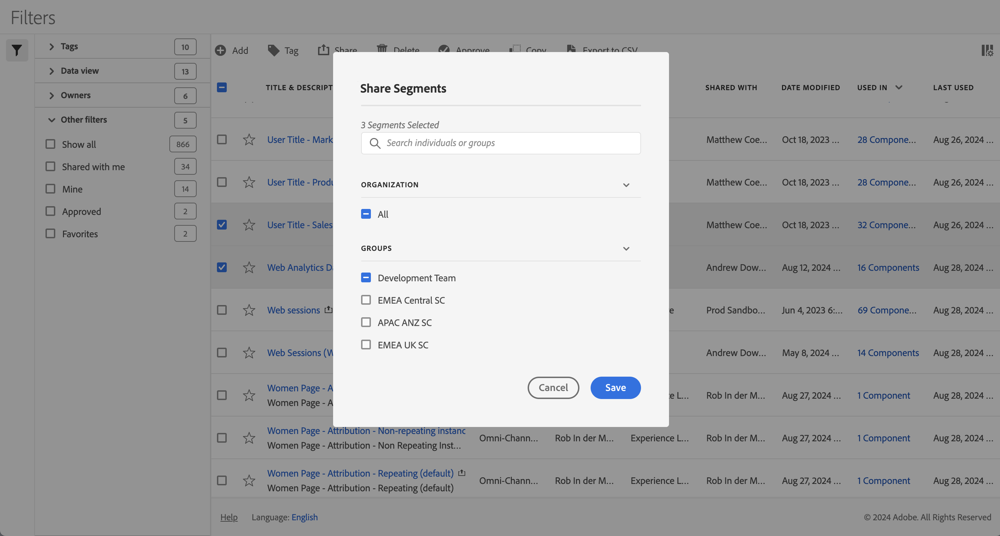

# Compartilhar segmentos

No [Gerenciador de segmentos](seg-manage.md), você pode compartilhar segmentos. Dependendo das permissões, você pode compartilhar segmentos com organizações, grupos ou usuários individuais:

* **Administradores**: os administradores podem compartilhar segmentos com toda a organização, com grupos em uma organização e com usuários individuais. Consulte a [documentação do Admin Console](https://helpx.adobe.com/br/enterprise/using/manage-products.html) para obter mais informações.
* **Não administradores**: não administradores podem compartilhar somente os segmentos que criaram e somente com usuários individuais. |

Para compartilhar um ou mais segmentos:

1. No [Gerenciador de segmentos](seg-manage.md), selecione um ou mais segmentos que deseja compartilhar.
1. Na barra de ações, selecione  **[!UICONTROL Compartilhar]**.
1. Na caixa de diálogo **[!UICONTROL Compartilhar segmentos]**:

   

   1. (opcionalmente) use a  para *Pesquisar pessoas físicas ou grupos* e limite a lista de grupos ou pessoas físicas com os quais você deseja compartilhar o segmento.

   1. Selecione uma ou mais opções da seção **[!UICONTROL Organização]** ou **[!UICONTROL Grupos]** ou pesquise e selecione uma ou mais pessoas físicas. As opções disponíveis dependem da sua função.

   1. Selecione **[!UICONTROL Salvar]** para compartilhar os segmentos. Selecione **[!UICONTROL Cancelar]** para cancelar.

Se você tiver acesso a segmentos compartilhados, poderá usá-los em projetos ou como parte das [configurações de uma visualização de dados](/help/data-views/session-settings.md).

## Práticas recomendadas

Abaixo estão algumas práticas recomendadas para compartilhar segmentos e com quem você deve compartilhar segmentos.

* Como administrador, compartilhe um segmento somente com Todos se você estiver convencido de que qualquer pessoa na sua organização está confortável em usar os segmentos. Você também pode considerar favorecer esses segmentos. Consulte [Marcar um segmento como favorito](seg-favorite.md) para obter mais informações.

* Como administrador, compartilhe um segmento com um grupo específico se esse segmento fornecer valor de negócios para a parte dos usuários desse grupo.

* Como administrador ou usuário individual, compartilhe um segmento com um ou mais indivíduos para validar um segmento. Se os segmentos não forem úteis, você poderá excluí-los.
