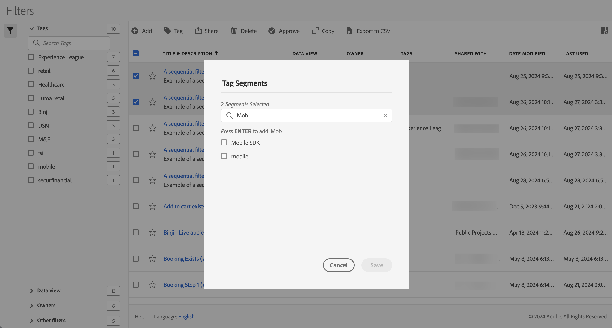

# Marcar segmentos

No [Gerenciador de segmentos](seg-manage.md), você pode usar marcas para organizar segmentos. Os administradores podem marcar todos os segmentos. Os não administradores podem marcar somente os segmentos que criam ou que foram compartilhados com eles.

Para marcar um ou mais segmentos:

1. No [Gerenciador de segmentos](seg-manage.md), selecione um ou mais segmentos que deseja marcar.
1. Na barra de ações, selecione  **[!UICONTROL Marca]**.
1. Na caixa de diálogo **[!UICONTROL Segmentos de Marca]**:

   

   1. (opcionalmente) use a  para pesquisar e limitar a lista de marcas.

   2. Com base na lista de tags:

      * selecione uma ou mais tags existentes na lista, ou
      * digite uma nova marca e pressione **[!UICONTROL ENTER]**. Repita para adicionar mais de uma nova tag.

1. Selecione **[!UICONTROL Salvar]** para salvar as marcas do segmento. Selecione **[!UICONTROL Cancelar]** para cancelar.

Depois de salvas, as marcas são listadas no campo [!UICONTROL Marca] para os segmentos selecionados no [Construtor de segmentos](seg-builder.md).

## Sugestões

Abaixo estão algumas sugestões para organizar tags com base em:

* **Equipe**: Por exemplo, Marketing Social, Marketing para Dispositivos Móveis.

* **Projeto**: por exemplo, Análise de página de entrada.

* **Categoria**:. Por exemplo, Homens, Mulheres, Crianças.

* **Geografia**: Por exemplo: Estados Unidos, Califórnia.

* **Fluxo de trabalho**: Por exemplo: Para ser aprovado, preparado

