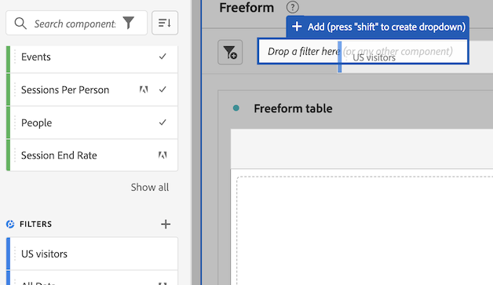

# Usar componentes no Analysis Workspace

Os componentes compõem os dados reais de qualquer projeto no Analysis Workspace. Os componentes consistem em dimensões, métricas, filtros e intervalos de datas. Você pode adicionar componentes a um projeto arrastando-os para visualizações ou painéis.

Para obter informações gerais sobre os tipos de componentes que podem ser adicionados, consulte [Visão geral dos componentes](/help/components/overview.md).

>[!TIP]
>
>Para obter informações sobre cada componente, selecione o ícone Informações ao lado do nome de um componente no painel esquerdo do Analysis Workspace.

## Começar a adicionar componentes a um projeto

1. [Criar um projeto no Analysis Workspace](/help/analysis-workspace/build-workspace-project/create-projects.md) se você ainda não tiver feito.

1. [Adicionar um painel](/help/analysis-workspace/c-panels/panels.md) ou [adicionar uma visualização](/help/analysis-workspace/visualizations/freeform-analysis-visualizations.md#add-visualizations-to-a-panel) ao projeto no Analysis Workspace.

   Se você adicionar um componente a um projeto em branco, uma visualização de tabela de forma livre será criada automaticamente.

1. Clique no ícone **[!UICONTROL Componentes]** no menu esquerdo.

   

1. Role para ou procure o componente que deseja adicionar e arraste-o para um painel ou visualização em seu projeto.

   Por exemplo, você pode arrastar um filtro para a área de soltar do filtro em um cabeçalho do painel.

   

1. Para obter informações mais detalhadas, continue com uma das seções a seguir, dependendo do tipo de componente que você está adicionando:

   * [Adicionar dimensões a um projeto](#add-dimensions-to-a-project)

   * [Adicionar métricas a um projeto](#add-metrics-to-a-project)

   * [Adicionar filtro a um projeto](#add-filters-to-a-project)

   * [Adicionar intervalos de datas a um projeto](#add-date-ranges-to-a-project)

## Adicionar dimensões a um projeto

[Dimension](/help/components/dimensions/overview.md) são variáveis no Adobe Analytics que normalmente contêm valores de string. Por outro lado, as [métricas](/help/components/calc-metrics/calc-metr-overview.md) contêm valores numéricos que se vinculam a uma dimensão. Um relatório básico mostra linhas de valores da sequência de caracteres (dimensão) em relação a uma coluna de valores numéricos (métrica).

1. Comece a adicionar uma dimensão ao seu projeto no Analysis Workspace, conforme descrito em [Começar a adicionar componentes a um projeto](#begin-adding-components-to-a-project).

1. Escolha um dos métodos a seguir para adicionar dimensões e determinar o tipo de dados que deseja analisar:

   * Arraste uma dimensão para uma visualização (como uma tabela de forma livre) no Analysis Workspace.

     

   * Arraste uma ou mais dimensões do painel esquerdo para a área suspensa de filtro para criar um filtro ad hoc, conforme descrito em [Adicionar filtros a um projeto](#add-filters-to-a-project).

Para obter mais informações sobre como usar dimensões no Analysis Workspace, consulte [Visualizar dimensões](/help/components/dimensions/view-dimensions.md), [Detalhar dimensões](/help/components/dimensions/t-breakdown-fa.md), e [Dimensões de separação de tempo](/help/components/dimensions/time-parting-dimensions.md).

## Adicionar métricas a um projeto

As métricas permitem quantificar os pontos de dados no Analysis Workspace. Elas são usadas com mais frequência como colunas em uma visualização e são vinculadas a dimensões.

Para adicionar uma métrica a um projeto no Analysis Workspace:

1. Comece a adicionar uma métrica ao seu projeto no Analysis Workspace, conforme descrito em [Começar a adicionar componentes a um projeto](#begin-adding-components-to-a-project).

1. Escolha um dos seguintes métodos para adicionar uma métrica no Analysis Workspace:

   * Arraste uma métrica para a área de soltar métrica em uma tabela de forma livre vazia para ver a tendência da métrica no período de data do projeto.

     

   * Arrastar uma métrica quando uma dimensão estiver presente para ver essa métrica em comparada a cada item de dimensão.

   * Arrastar uma métrica sobre um cabeçalho de métrica já existente para substituí-lo.

   * Arrastar uma métrica ao lado de um cabeçalho para ver ambas as métricas lado a lado.

Para obter mais informações sobre métricas, consulte [Visão geral das métricas calculadas](/help/components/calc-metrics/calc-metr-overview.md).

## Adicionar filtros a um projeto

[Filtros](/help/components/filters/filters-overview.md) O permite identificar subconjuntos de visitantes com base em características ou interações específicas.

Para adicionar um filtro a um projeto no Analysis Workspace:

1. Comece a adicionar um filtro ao seu projeto no Analysis Workspace, conforme descrito em [Começar a adicionar componentes a um projeto](#begin-adding-components-to-a-project).

1. Escolha um dos seguintes métodos para começar a filtrar o painel:

   * Arraste um filtro individual do painel esquerdo para a área de soltar do filtro.

     

   * Mantenha pressionada a tecla Shift ou Ctrl para selecionar vários filtros no painel esquerdo e, em seguida, mantenha pressionada a tecla Shift enquanto os solta na área de soltar dos filtros.

     

     Isso cria um menu suspenso que permite que os usuários do painel escolham o filtro que desejam aplicar. O menu suspenso contém uma [!UICONTROL **Sem filtro**] opção que os usuários podem selecionar, o que deixa o painel não filtrado.

     Você pode selecionar o (x) para remover qualquer opção do menu suspenso. Se você remover a variável [!UICONTROL **Sem filtro**] então, um filtro é necessário.

   * Crie filtros ad hoc arrastando componentes que não são de filtros até a área designada. Isso pode economizar o tempo e o esforço de acessar o Construtor de filtros. Os filtros criados dessa maneira são definidos automaticamente como filtros de nível de ocorrência. Essa definição pode ser modificada clicando no ícone de informações (i) ao lado do filtro e, em seguida, no ícone de edição em forma de lápis e editando-a no Construtor de filtros.

     Os filtros ad hoc são um tipo de filtro rápido e são exclusivos ao projeto. Eles não aparecem no painel esquerdo, a menos que você os torne públicos.

     Para obter mais informações, consulte [Filtros rápidos](/help/components/filters/quick-filters.md).

Para obter mais informações sobre como usar a área de soltar do filtro em um painel para filtrar seu painel, consulte [Área para soltar](/help/analysis-workspace/c-panels/panels.md#drop-zone) in [Visão geral dos painéis](/help/analysis-workspace/c-panels/panels.md).

## Adicionar intervalos de datas a um projeto

[Intervalos de datas](/help/components/date-ranges/custom-date-ranges.md) determine o intervalo de tempo do relatório no Analysis Workspace e possa ser aplicado a um ou mais painéis em um projeto.

Cada painel inclui um intervalo de datas por padrão. Há várias maneiras de atualizar um intervalo de datas para um painel. Uma maneira de atualizar um intervalo de datas para um painel no Analysis Workspace é arrastar um componente de intervalo de datas do painel esquerdo:

1. Comece a adicionar um intervalo de datas ao seu projeto no Analysis Workspace, conforme descrito em [Começar a adicionar componentes a um projeto](#begin-adding-components-to-a-project).

1. Arraste um intervalo de datas do painel esquerdo para o intervalo de datas atual na parte superior direita do painel.

   

Para obter mais informações sobre como usar calendários e intervalos de datas no Analysis Workspace, consulte [Visão geral do calendário e de intervalos de datas](/help/components/date-ranges/custom-date-ranges.md).
