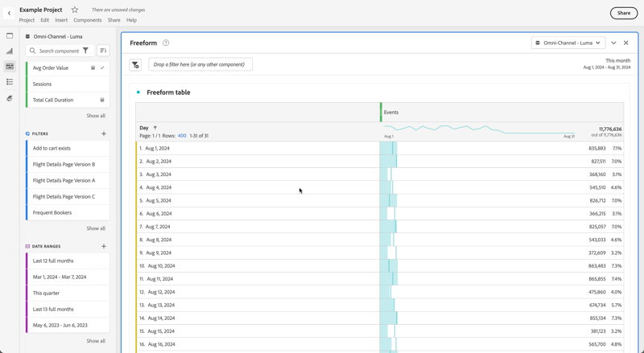

# Usar componentes no Analysis Workspace

Os componentes compõem os dados reais de qualquer projeto no Analysis Workspace. Os componentes consistem em dimensões, métricas, filtros e intervalos de datas. Você pode adicionar componentes a um projeto arrastando-os para visualizações ou painéis.

Consulte a [Visão geral dos componentes](/help/components/overview.md) para obter mais informações sobre os tipos de componentes que você pode adicionar.

>[!TIP]
>
>Para obter informações sobre cada componente, use . Consulte [Informações do componente](#component-info) para obter mais informações

## Adicionar componentes a um projeto

1. [Criar um projeto no Analysis Workspace](/help/analysis-workspace/build-workspace-project/create-projects.md).

1. [Adicione um painel](/help/analysis-workspace/c-panels/panels.md#create-a-panel) ou [adicione uma visualização](/help/analysis-workspace/visualizations/freeform-analysis-visualizations.md#add-visualizations-to-a-panel) ao projeto no Analysis Workspace. Se você adicionar um componente a um projeto em branco, uma visualização de tabela de forma livre já será criada para você.

1. Selecione  **[!UICONTROL Componentes]** no painel de botões. Você verá todos os componentes disponíveis no painel esquerdo. Consulte [Interface](/help/analysis-workspace/home.md#interface) para obter mais detalhes.

1. Role para ou procure o componente que deseja adicionar e arraste-o para um painel ou visualização em seu projeto.

1. Opcionalmente, é possível arrastar um componente para a área de soltar do filtro em um cabeçalho do painel. Esse arrastar e soltar define o componente como um filtro e aplica o filtro a todo o conteúdo do painel.
Para obter informações sobre como você pode usar a área de destino do filtro em um painel para filtrar seu painel, consulte [Área de destino](/help/analysis-workspace/c-panels/panels.md#drop-zone) na [Visão geral dos painéis](/help/analysis-workspace/c-panels/panels.md).

1. Para obter informações mais detalhadas, consulte as seguintes seções:

   * [Adicionar dimensões a um projeto](#add-dimensions-to-a-project)

   * [Adicionar métricas a um projeto](#add-metrics-to-a-project)

   * [Adicionar filtros a um projeto](#add-filters-to-a-project)

   * [Adicionar intervalos de datas a um projeto](#add-date-ranges-to-a-project)

### Adicionar dimensões a um projeto

[Dimension](/help/components/dimensions/overview.md) são variáveis em Customer Journey Analytics que normalmente contêm valores de cadeia de caracteres. Por outro lado, as [métricas](/help/components/calc-metrics/calc-metr-overview.md) contêm valores numéricos que se vinculam a uma dimensão. Um relatório básico mostra linhas de valores da sequência de caracteres (dimensão) em relação a uma coluna de valores numéricos (métrica).

1. Comece a adicionar uma dimensão ao seu projeto no Analysis Workspace, conforme descrito em [Adicionar componentes a um projeto](#add-components-to-a-project).

1. Escolha um dos métodos a seguir para adicionar dimensões e determinar o tipo de dados que deseja analisar:

   

   * Arraste uma dimensão para uma visualização (como uma tabela de forma livre) no Analysis Workspace.

   * Arraste uma ou mais dimensões do painel esquerdo para a área de destino do filtro para criar um filtro rápido, conforme descrito em [Adicionar filtros a um projeto](#add-filters-to-a-project).

1. Opcionalmente, é possível detalhar dimensões e itens de dimensão no Analysis Workspace com outros componentes. Para obter mais informações, consulte [Analisar dimensões no Workspace](/help/components/dimensions/t-breakdown-fa.md).

Para obter mais informações sobre como usar dimensões no Analysis Workspace, consulte [Visualizar dimensões](/help/components/dimensions/view-dimensions.md), [Analisar dimensões](/help/components/dimensions/t-breakdown-fa.md) e [Dimensões de separação de tempo](/help/components/dimensions/time-parting-dimensions.md).

### Adicionar métricas a um projeto

As métricas permitem quantificar os pontos de dados no Analysis Workspace. Elas são usadas com mais frequência como colunas em uma visualização e são vinculadas a dimensões.

Para adicionar uma métrica a um projeto no Analysis Workspace:

1. Comece a adicionar uma métrica ao seu projeto no Analysis Workspace, conforme descrito em [Adicionar componentes a um projeto](#add-components-to-a-project).

1. Escolha um dos seguintes métodos para adicionar uma métrica no Analysis Workspace:

   

   * Arraste uma métrica para a área de soltar métrica em uma tabela de forma livre vazia para ver a tendência da métrica no período de data do projeto.

   * Arraste uma métrica quando uma dimensão estiver presente para ver essa métrica para cada item de dimensão.

   * Arrastar uma métrica sobre um cabeçalho de métrica já existente para substituí-lo.

   * Arraste uma métrica ao lado esquerdo do lado direito de um cabeçalho de métrica existente para adicionar a nova métrica.

   * Arraste uma métrica para cima ou para baixo de um cabeçalho de métrica existente para criar uma sobreposição de métrica.

Para obter mais informações, consulte [Métricas](/help/components/apply-create-metrics.md).

### Adicionar filtros a um projeto

[Filtros](/help/components/filters/filters-overview.md) permitem identificar subconjuntos de pessoas, sessões ou eventos com base em características ou interações específicas.

Você pode usar filtros no Analysis Workspace de qualquer uma das seguintes maneiras:

* Adicionar filtros a um painel
Ao adicionar filtros a um painel, eles se aplicam a todo o conteúdo do painel.
Para obter informações sobre como você pode usar a área de destino do filtro em um painel para filtrar seu painel, consulte [Área de destino](/help/analysis-workspace/c-panels/panels.md#drop-zone) na [Visão geral dos painéis](/help/analysis-workspace/c-panels/panels.md).

* Adicionar filtros a uma visualização
Ao adicionar filtros a uma coluna em uma tabela de forma livre, os filtros se aplicam a todo o conteúdo na coluna da tabela. Também é possível adicionar filtros como parte de uma visualização de fallout.

* Usar filtros em componentes
Ao definir componentes como [métricas calculadas](/help/components/calc-metrics/cm-workflow/metrics-with-segments.md), [anotações](/help/components/annotations/create-annotations.md#annotation-builder) ou até mesmo [filtros](/help/components/filters/filter-builder.md), você pode usar filtros como parte da definição.

### Adicionar intervalos de datas a um projeto

[Intervalos de datas](/help/components/date-ranges/overview.md) determinam o intervalo de tempo do relatório no Analysis Workspace e podem ser aplicados a um ou mais painéis em um projeto e também a algumas visualizações (como a Tabela de forma livre).

Cada painel inclui um intervalo de datas por padrão. Há várias maneiras de atualizar um intervalo de datas para um painel. Uma maneira de atualizar um intervalo de datas para um painel no Analysis Workspace é arrastar um componente de intervalo de datas do painel esquerdo:

1. Opcionalmente, adicione um intervalo de datas ao seu projeto no Analysis Workspace, conforme descrito em [Adicionar componentes a um projeto](#add-components-to-a-project).

1. Arraste e solte um intervalo de datas do painel esquerdo em:

   * O intervalo de datas atual, para modificar o intervalo de datas do painel.

     

   * Uma métrica ou dimensão em uma visualização de tabela de forma livre. Consulte [Usar intervalos de dados](/help/components/date-ranges/overview.md#use-date-ranges) para obter mais informações.

Para obter mais informações sobre como usar e gerenciar intervalos de datas no Analysis Workspace, consulte [Visão geral sobre intervalos de datas](/help/components/date-ranges/overview.md).

## Informações do componente

Você pode passar o mouse sobre qualquer componente para exibir . Quando selecionada, um pop-up é exibido com informações adicionais sobre o componente.

Com base no seu controle de acesso, você pode:

* Acesse a definição do  [!UICONTROL Dicionário de dados] para o componente.
* Acesse o construtor de componentes  ou a exibição de dados em que o componente está definido.
