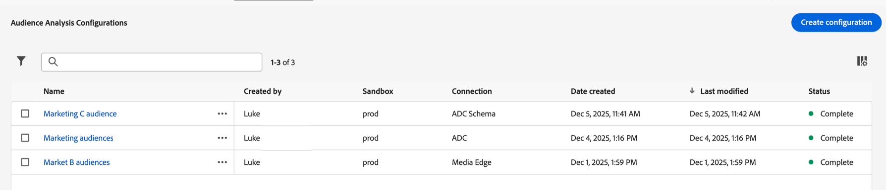

# Gerenciar configurações de análise de público{#manage-audience-analysis}

Depois de [criar configurações de análise de público-alvo](/help/connections/audience-analysis/audience-analysis-configure.md), você pode exibi-las, editá-las ou excluí-las.

Somente administradores do sistema podem gerenciar configurações de análise de público-alvo.

Para obter informações sobre análise de público-alvo, consulte [Visão geral da análise de público-alvo](/help/connections/audience-analysis/audience-analysis-overview.md).

## Exibir e filtrar configurações existentes

Para exibir as configurações de análise de público-alvo existentes:

1. No Customer Journey Analytics, selecione **[!UICONTROL Gerenciamento de dados]** > **[!UICONTROL Configuração da análise de público-alvo]**.

   

   As seguintes colunas de informações estão disponíveis sobre cada configuração:

   * **[!UICONTROL Criado por]**: o usuário que criou a configuração.

   * **[!UICONTROL Sandbox]**: a sandbox da Experience Platform que contém o conjunto de dados do perfil adicionado à sua conexão.

   * **[!UICONTROL Conexão]**: a conexão adicionada à sua configuração.

   * **[!UICONTROL Data de criação]**: a data em que a configuração foi criada.

   * **[!UICONTROL Última modificação]**: a data em que a configuração foi modificada pela última vez.

   * **[!UICONTROL Status]**: o status da configuração. Os possíveis status são Concluído, Em andamento ou Falha. <!--true?-->

   Você pode ocultar qualquer coluna selecionando o ícone Coluna , desmarcando todas as colunas que deseja ocultar e selecionando **[!UICONTROL Aplicar]**.

1. (Opcional) Para filtrar a lista de configurações, selecione o **Ícone Filtro** do  e filtre por qualquer um dos seguintes critérios:

   * **[!UICONTROL Conexão]**

   * **[!UICONTROL Criado por]**

   * **[!UICONTROL Sandbox]**

   * **[!UICONTROL Status]**

## Editar uma configuração

Para editar uma configuração de análise de público-alvo existente:

1. No Customer Journey Analytics, selecione **[!UICONTROL Gerenciamento de dados]** > **[!UICONTROL Configuração da análise de público-alvo]**.

   

1. Selecione o nome da configuração que deseja editar.

   Ou

   Marque a caixa de seleção ao lado da configuração que você deseja editar e selecione **[!UICONTROL Editar]**.

1. Faça as alterações desejadas na configuração e selecione **[!UICONTROL Salvar]**.

## Excluir uma configuração

Para excluir uma configuração de análise de público-alvo existente:

1. No Customer Journey Analytics, selecione **[!UICONTROL Gerenciamento de dados]** > **[!UICONTROL Configuração da análise de público-alvo]**.

   

1. Marque a caixa de seleção ao lado da configuração que você deseja excluir e selecione **[!UICONTROL Excluir]**.
