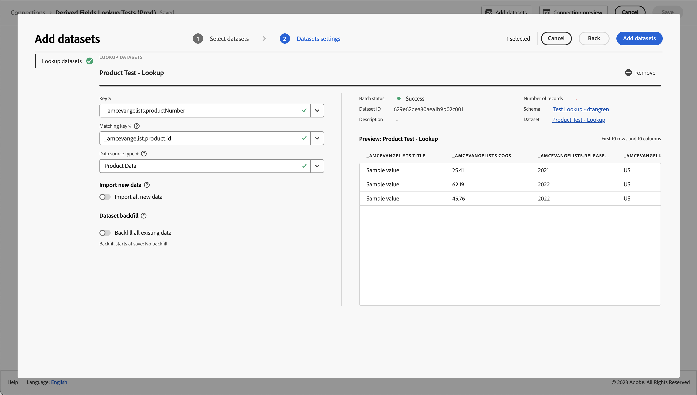

# Criar ou editar uma conexão {#create-or-edit-a-connection}

<!-- markdownlint-disable MD034 -->

>[!CONTEXTUALHELP]
>id="cja_connections_recordsadded"
>title="Registros adicionados"
>abstract="O número de registros (linhas) adicionados a uma conexão durante o intervalo de tempo selecionado para os conjuntos de dados escolhidos."

<!-- markdownlint-enable MD034 -->

<!-- markdownlint-disable MD034 -->

>[!CONTEXTUALHELP]
>id="cja_connections_recordsskipped"
>title="Registros ignorados"
>abstract="O número de registros (linhas) ignorados durante a transferência de dados para uma conexão durante o intervalo de tempo selecionado para os conjuntos de dados escolhidos."

<!-- markdownlint-enable MD034 -->

<!-- markdownlint-disable MD034 -->

>[!CONTEXTUALHELP]
>id="cja_connections_recordsdeleted"
>title="Registros excluídos"
>abstract="O número de registros (linhas) removidos de uma conexão durante o intervalo de tempo selecionado para os conjuntos de dados escolhidos"

<!-- markdownlint-enable MD034 -->

<!-- markdownlint-disable MD034 -->

>[!CONTEXTUALHELP]
>id="cja_connection_lastadded"
>title="Última adição"
>abstract="O carimbo de data e hora do lote mais recente de qualquer conjunto de dados transferido para uma conexão."

<!-- markdownlint-enable MD034 -->

<!-- markdownlint-disable MD034 -->

>[!CONTEXTUALHELP]
>id="cja_connection_enablerollingdatawindow"
>title="Habilitar janela de dados contínuos"
>abstract="Defina a retenção de dados como uma janela contínua em meses no nível da conexão."

<!-- markdownlint-enable MD034 -->

<!-- markdownlint-disable MD034 -->

>[!CONTEXTUALHELP]
>id="cja_connection_averagenumberofdailyuses"
>title="Número médio de usos diários"
>abstract="Selecione um intervalo para o número de eventos diários esperados para toda a conexão."

<!-- markdownlint-enable MD034 -->

<!-- markdownlint-disable MD034 -->

>[!CONTEXTUALHELP]
>id="connections_recordsadded"
>title="Registros adicionados"
>abstract="O número de registros (linhas) adicionados a uma conexão durante o intervalo de tempo selecionado para os conjuntos de dados escolhidos."

<!-- markdownlint-enable MD034 -->

<!-- markdownlint-disable MD034 -->

>[!CONTEXTUALHELP]
>id="connections_recordsskipped"
>title="Registros ignorados"
>abstract="O número de registros (linhas) ignorados durante a transferência de dados para uma conexão durante o intervalo de tempo selecionado para os conjuntos de dados escolhidos."

<!-- markdownlint-enable MD034 -->

<!-- markdownlint-disable MD034 -->

>[!CONTEXTUALHELP]
>id="connections_recordsdeleted"
>title="Registros excluídos"
>abstract="O número de registros (linhas) removidos de uma conexão durante o intervalo de tempo selecionado para os conjuntos de dados escolhidos"

<!-- markdownlint-enable MD034 -->

<!-- markdownlint-disable MD034 -->

>[!CONTEXTUALHELP]
>id="connection_lastadded"
>title="Última adição"
>abstract="O carimbo de data e hora do lote mais recente de qualquer conjunto de dados transferido para uma conexão."

<!-- markdownlint-enable MD034 -->

<!-- markdownlint-disable MD034 -->

>[!CONTEXTUALHELP]
>id="connection_enablerollingdatawindow"
>title="Habilitar janela de dados contínuos"
>abstract="Defina a retenção de dados como uma janela contínua em meses no nível da conexão."

<!-- markdownlint-enable MD034 -->

<!-- markdownlint-disable MD034 -->

>[!CONTEXTUALHELP]
>id="connection_averagenumberofdailyuses"
>title="Número médio de usos diários"
>abstract="Selecione um intervalo para o número de eventos diários esperados para toda a conexão."

<!-- markdownlint-enable MD034 -->


A experiência de criação e edição de conexão reúne todos os conjuntos de dados e configurações de conexão no centro da tela com um fluxo de trabalho auxiliar. Ele fornece uma experiência detalhada de seleção, configuração e revisão de conjunto de dados. Também é possível especificar informações vitais como o tipo de conjunto de dados, tamanho, esquema, ID do conjunto de dados, status do lote, status de preenchimento, IDs de pessoa e muito mais, para reduzir o risco de configuração incorreta da conexão. Esta é uma visão geral dos recursos:

* Você pode habilitar uma janela de retenção de dados sem interrupção ao criar a conexão.
* Você pode adicionar e remover conjuntos de dados de uma conexão. (A remoção de um conjunto de dados o remove da conexão e afeta qualquer visualização de dados associada e projetos subjacentes do Analysis Workspace.)
* Você pode ativar e solicitar dados de preenchimento retroativo por conjunto de dados.
* É possível editar conjuntos de dados, por exemplo, para solicitar outro preenchimento retroativo.
* É possível importar dados existentes por conjunto de dados.

+++ Vídeo para ilustrar a criação e edição de uma experiência de conexão

>[!VIDEO](https://video.tv.adobe.com/v/343044/?quality=12&learn=on)

+++

## Pré-requisitos

O número máximo de conjuntos de dados que você pode adicionar a uma conexão é limitado a 100. A combinação depende de qual pacote do Customer Journey Analytics sua empresa comprou.

Entre em contato com sua administração se não tiver certeza de qual pacote do Customer Journey Analytics você possui.

| **Selecionar** pacote | Pacote **Foundation** |
| --- | --- |
| Qualquer combinação de conjuntos de dados de evento/perfil/pesquisa/resumo, cuja soma seja de até 100 | Um conjunto de dados de evento por conexão |
|  | Até 99 conjuntos de dados de perfil, pesquisa ou resumo por conexão |

{style="table-layout:auto"}

## Criar e configurar a conexão {#create-connection}

1. No Customer Journey Analytics, selecione a guia **[!UICONTROL Conexões]**.
1. Selecione **[!UICONTROL Criar nova conexão]**.

   

1. Defina as configurações de conexão.

   | Configuração | Descrição |
   | --- | --- |
   | **[!UICONTROL Nome da conexão]** | Digite um nome exclusivo para a conexão. |
   | **[!UICONTROL Descrição da conexão]** | Descreva a finalidade desta conexão. |
   | **[!UICONTROL Sandbox]** | Escolha uma sandbox na Experience Platform que contenha os conjuntos de dados para os quais você deseja criar uma conexão.<p>A Adobe Experience Platform fornece [sandboxes](https://experienceleague.adobe.com/pt-br/docs/experience-platform/sandbox/home) que particionam uma única instância da Platform em ambientes virtuais separados para ajudar a desenvolver aplicativos de experiência digital. Você pode considerar as sandboxes como “silos de dados” que contêm conjuntos de dados. As sandboxes são usadas para controlar o acesso aos conjuntos de dados.<p>Depois de selecionar a sandbox, o painel esquerdo mostra todos os conjuntos de dados que você pode obter dela. |
   | **[!UICONTROL Ativar janela de dados contínuos]** | Essa caixa de seleção, se marcada, permite definir a retenção de dados do Costumer Journey Analytics como uma janela contínua em meses (1 mês, 3 meses, 6 meses etc.), no nível da conexão.<p>A retenção de dados tem por base os carimbos de data e hora do conjunto de dados do evento e se aplica somente aos conjuntos de dados do evento. Não existe configuração de janela de dados contínuos para conjuntos de dados de perfil ou pesquisa, pois não há carimbos de data/hora aplicáveis. No entanto, se sua conexão incluir qualquer perfil ou conjuntos de dados de pesquisa (além de um ou mais conjuntos de dados de evento), esses dados serão retidos pelo mesmo período.<p> O principal benefício é armazenar ou relatar apenas dados que sejam aplicáveis e úteis, além de excluir dados mais antigos que não sejam mais úteis. Isso ajuda você a ficar dentro dos limites do contrato e reduz o risco de custo excedente.<p>Se deixar o padrão (desmarcado), a configuração de retenção de dados da Adobe Experience Platform terá precedência sobre o período de retenção. Se você tiver dados correspondentes a 25 meses na Experience Platform, o Customer Journey Analytics obterá 25 meses de dados por meio de preenchimento retroativo. Se você excluiu 10 desses meses na Platform, o Customer Journey Analytics manterá os 15 meses restantes. |
   | **[!UICONTROL Adicionar conjuntos de dados]** (veja abaixo) | Adicione conjuntos de dados se nenhum conjunto de dados for exibido na lista do conjunto de dados. |
   | **[!UICONTROL Nome do conjunto de dados]** | Selecione um ou mais conjuntos de dados que você deseja inserir no Customer Journey Analytics e clique em **[!UICONTROL Adicionar]**.<p>(Se tiver vários conjuntos de dados, você poderá pesquisar os corretos usando a barra de consulta Pesquisar conjuntos de dados acima da lista de conjuntos de dados.) |
   | **[!UICONTROL Última atualização]** | Somente para conjuntos de dados de eventos, essa configuração é definida automaticamente para o campo de carimbo de data e hora padrão em esquemas baseados em eventos na Experience Platform. “N/A” significa que esse conjunto de dados não contém dados. |
   | **[!UICONTROL Número de registros]** | O total de registros no mês anterior do conjunto de dados na Experience Platform. |
   | **[!UICONTROL Esquema]** | O [esquema](https://experienceleague.adobe.com/pt-br/docs/experience-platform/xdm/schema/composition) que foi usado como base para criar o conjunto de dados na Adobe Experience Platform. |
   | **[!UICONTROL Tipo de conjunto de dados]** | Para cada conjunto de dados adicionado a essa conexão, o Customer Journey Analytics define automaticamente o tipo de conjunto de dados de acordo com os dados recebidos. Há 3 tipos diferentes de conjunto de dados: dados de Evento, dados de Perfil e dados de Pesquisa. Consulte a tabela abaixo para obter uma explicação dos tipos de conjunto de dados. |
   | **[!UICONTROL Granularidade]** | A granularidade dos dados no conjunto de dados, aplicável somente para conjuntos de dados de resumo. |
   | **[!UICONTROL Tipo de fonte de dados]** | O tipo de fonte de dados do conjunto de dados. Não aplicável para conjuntos de dados de resumo. |
   | **[!UICONTROL ID de pessoa]** | Selecione uma ID de pessoa na lista suspensa de identidades disponíveis. Essas identidades foram definidas no esquema do conjunto de dados na Experience Platform. Consulte abaixo para obter informações sobre como usar o Mapa de identidade como uma ID de pessoa.<p>IMPORTANTE: se não houver IDs de pessoa para escolher, significa que uma ou mais IDs de pessoa não foram definidas no esquema. Assista a [este vídeo](https://www.youtube.com/watch?v=G_ttmGl_LRU) sobre como definir uma identidade na Experience Platform. |
   | **[!UICONTROL Chave]** | Somente para conjuntos de dados de pesquisa (como _id). |
   | **[!UICONTROL Chave correspondente]** | Somente para conjuntos de dados de pesquisa (como _id). |
   | **[!UICONTROL Importar novos dados]** | Defina como Ligado ou Desligado. |
   | **[!UICONTROL Dados de preenchimento retroativo]** | Você pode solicitar o preenchimento retroativo de dados em um conjunto de dados. Por exemplo, é possível solicitar o preenchimento retroativo dos dados dos últimos 7 dias. Configure o conjunto de dados corretamente e teste sua conexão. Se tudo estiver correto, você pode preencher os dados restantes com facilidade.<p>Além disso, é possível habilitar a importação de novos dados por conjunto de dados. |
   | **[!UICONTROL Status de preenchimento retroativo]** | Esse status indica se algum dado de preenchimento retroativo está sendo processado. |

   {style="table-layout:auto"}

## Adicionar e configurar conjuntos de dados {#add-dataset}

<!-- markdownlint-disable MD034 -->

>[!CONTEXTUALHELP]
>id="cja_connection_primaryid"
>title="ID primária"
>abstract="Selecione a ID principal adequada para a sua conexão: pessoa para um cenário B2C. Conta para um cenário B2B."

<!-- markdownlint-enable MD034 -->

<!-- markdownlint-disable MD034 -->

>[!CONTEXTUALHELP]
>id="cja_connection_optionalcontainers"
>title="Contêineres opcionais"
>abstract="Selecione contêineres adicionais.<br/><br/>**[!UICONTROL Conta global ]**: habilita a configuração de contas globais em uma conexão.<br/>**[!UICONTROL Oportunidade]**: habilita a configuração de oportunidades em uma conexão.<br/>**[!UICONTROL Grupo de compras ]**: habilita a configuração de grupos de compras em uma conexão."

<!-- markdownlint-enable MD034 -->

<!-- markdownlint-disable MD034 -->

>[!CONTEXTUALHELP]
>id="cja_connection_personid"
>title="ID da pessoa"
>abstract="Selecione uma ID de pessoa entre as identidades disponíveis definidas no esquema do conjunto de dados da Experience Platform."

<!-- markdownlint-enable MD034 -->

<!-- markdownlint-disable MD034 -->

>[!CONTEXTUALHELP]
>id="cja_connection_accountid"
>title="ID da Conta"
>abstract="Selecione uma ID de conta (o identificador exclusivo de uma conta) entre as identidades disponíveis definidas no esquema do conjunto de dados da Experience Platform."

<!-- markdownlint-enable MD034 -->

<!-- markdownlint-disable MD034 -->

>[!CONTEXTUALHELP]
>id="cja_connection_accountfield"
>title="Campo conta"
>abstract="Selecione um campo que represente o ID da conta (o identificador exclusivo de uma conta)."

<!-- markdownlint-enable MD034 -->


<!-- markdownlint-disable MD034 -->

>[!CONTEXTUALHELP]
>id="cja_connection_globalaccountid"
>title="ID da conta global"
>abstract="Selecione uma ID de conta global (o identificador exclusivo de uma conta global) entre as identidades disponíveis definidas no esquema do conjunto de dados da Experience Platform."

<!-- markdownlint-enable MD034 -->

<!-- markdownlint-disable MD034 -->

>[!CONTEXTUALHELP]
>id="cja_connection_opportunityid"
>title="ID da oportunidade"
>abstract="Selecione uma ID de oportunidade (o identificador exclusivo de uma oportunidade) entre as identidades disponíveis definidas no esquema do conjunto de dados da Experience Platform."

<!-- markdownlint-enable MD034 -->

<!-- markdownlint-disable MD034 -->

>[!CONTEXTUALHELP]
>id="cja_connection_buyinggroupid"
>title="ID de grupo de compras"
>abstract="Selecione uma ID de grupo de compras (o identificador exclusivo de um grupo de compras) entre as identidades disponíveis definidas no esquema do conjunto de dados da Experience Platform."

<!-- markdownlint-enable MD034 -->

<!-- markdownlint-disable MD034 -->

>[!CONTEXTUALHELP]
>id="cja_connection_matchingkey"
>title="Chave correspondente"
>abstract="Selecione como associar: com base em uma chave correspondente ou em um container correspondente.<br/><br/>**[!UICONTROL Chave correspondente ]**: selecione o campo a ser associado a um dos conjuntos de dados de evento. Se essa lista estiver vazia, você provavelmente não adicionou nem configurou um conjunto de dados de evento.<br/>**[!UICONTROL Container correspondente]**: selecione um container a ser usado para associar a um dos conjuntos de dados do evento. Se a lista estiver vazia, você provavelmente não configurou um ou mais containers."

<!-- markdownlint-enable MD034 -->

<!-- markdownlint-disable MD034 -->

>[!CONTEXTUALHELP]
>id="cja_connection_importnewdata"
>title="Importar novos dados"
>abstract="Todos os novos lotes adicionados ao conjunto de dados da Experience Platform serão automaticamente adicionados nessa conexão e disponibilizados para análise."

<!-- markdownlint-enable MD034 -->

<!-- markdownlint-disable MD034 -->

>[!CONTEXTUALHELP]
>id="cja_connection_datasetbackfill"
>title="Preenchimento retroativo do conjunto de dados"
>abstract="Esta opção preencherá retroativamente os dados existentes (históricos) da Experience Platform para este conjunto de dados na conexão."

<!-- markdownlint-enable MD034 -->

<!-- markdownlint-disable MD034 -->

>[!CONTEXTUALHELP]
>id="cja_connection_transformdataset"
>title="Transformar conjunto de dados"
>abstract="Esta opção transformará o conjunto de dados, para que ele possa ser usado em pesquisas baseadas em pessoas nos cenários B2B. Uma vez ativada, a transformação do conjunto de dados é irreversível."

<!-- markdownlint-enable MD034 -->

<!-- markdownlint-disable MD034 -->

>[!CONTEXTUALHELP]
>id="cja_connection_connectionmap"
>title="Mapa de conexão"
>abstract="O Mapa de conexão visualiza as relações entre evento, pessoa, conta e conjuntos de dados de pesquisa relevantes (como oportunidades, membros da campanha e muito mais)."

<!-- markdownlint-enable MD034 -->

<!-- markdownlint-disable MD034 -->

>[!CONTEXTUALHELP]
>id="connection_primaryid"
>title="ID primária"
>abstract="Selecione a ID principal adequada para a sua conexão: pessoa para um cenário B2C. Conta para um cenário B2B."

<!-- markdownlint-enable MD034 -->

<!-- markdownlint-disable MD034 -->

>[!CONTEXTUALHELP]
>id="connection_optionalcontainers"
>title="Contêineres opcionais"
>abstract="Selecione contêineres adicionais.<br/><br/>**[!UICONTROL Conta global ]**: habilita a configuração de contas globais em uma conexão.<br/>**[!UICONTROL Oportunidade]**: habilita a configuração de oportunidades em uma conexão.<br/>**[!UICONTROL Grupo de compras ]**: habilita a configuração de grupos de compras em uma conexão."

<!-- markdownlint-enable MD034 -->

<!-- markdownlint-disable MD034 -->

>[!CONTEXTUALHELP]
>id="connection_personid"
>title="ID da pessoa"
>abstract="Selecione uma ID de pessoa entre as identidades disponíveis definidas no esquema do conjunto de dados da Experience Platform."

<!-- markdownlint-enable MD034 -->

<!-- markdownlint-disable MD034 -->

>[!CONTEXTUALHELP]
>id="connection_accountid"
>title="ID da Conta"
>abstract="Selecione uma ID de conta (o identificador exclusivo de uma conta) entre as identidades disponíveis definidas no esquema do conjunto de dados da Experience Platform."

<!-- markdownlint-enable MD034 -->

>[!CONTEXTUALHELP]
>id="connection_accountfield"
>title="Campo conta"
>abstract="Selecione um campo que represente o ID da conta (o identificador exclusivo de uma conta)."

<!-- markdownlint-enable MD034 -->

<!-- markdownlint-disable MD034 -->

>[!CONTEXTUALHELP]
>id="connection_globalaccountid"
>title="ID da conta global"
>abstract="Selecione uma ID de conta global (o identificador exclusivo de uma conta global) entre as identidades disponíveis definidas no esquema do conjunto de dados da Experience Platform."

<!-- markdownlint-enable MD034 -->

<!-- markdownlint-disable MD034 -->

>[!CONTEXTUALHELP]
>id="connection_opportunityid"
>title="ID da oportunidade"
>abstract="Selecione uma ID de oportunidade (o identificador exclusivo de uma oportunidade) entre as identidades disponíveis definidas no esquema do conjunto de dados da Experience Platform."

<!-- markdownlint-enable MD034 -->

<!-- markdownlint-disable MD034 -->

>[!CONTEXTUALHELP]
>id="connection_buyinggroupid"
>title="ID de grupo de compras"
>abstract="Selecione uma ID de grupo de compras (o identificador exclusivo de um grupo de compras) entre as identidades disponíveis definidas no esquema do conjunto de dados da Experience Platform."

<!-- markdownlint-enable MD034 -->

<!-- markdownlint-disable MD034 -->

>[!CONTEXTUALHELP]
>id="connection_matchingkey"
>title="Chave correspondente"
>abstract="Selecione como associar: com base em uma chave correspondente ou em um container correspondente.<br/><br/>**[!UICONTROL Chave correspondente ]**: selecione o campo a ser associado a um dos conjuntos de dados de evento. Se essa lista estiver vazia, você provavelmente não adicionou nem configurou um conjunto de dados de evento.<br/>**[!UICONTROL Container correspondente]**: selecione um container a ser usado para associar a um dos conjuntos de dados do evento. Se a lista estiver vazia, você provavelmente não configurou um ou mais containers."

<!-- markdownlint-enable MD034 -->

<!-- markdownlint-disable MD034 -->

>[!CONTEXTUALHELP]
>id="connection_importnewdata"
>title="Importar novos dados"
>abstract="Todos os novos lotes adicionados ao conjunto de dados da Experience Platform serão automaticamente adicionados nessa conexão e disponibilizados para análise."

<!-- markdownlint-enable MD034 -->

<!-- markdownlint-disable MD034 -->

>[!CONTEXTUALHELP]
>id="connection_datasetbackfill"
>title="Preenchimento retroativo do conjunto de dados"
>abstract="Esta opção preencherá retroativamente os dados existentes (históricos) da Experience Platform para este conjunto de dados na conexão."

<!-- markdownlint-enable MD034 -->

<!-- markdownlint-disable MD034 -->

>[!CONTEXTUALHELP]
>id="connection_transformdataset"
>title="Transformar conjunto de dados"
>abstract="Esta opção transformará o conjunto de dados, para que ele possa ser usado em pesquisas baseadas em pessoas nos cenários B2B. Uma vez ativada, a transformação do conjunto de dados é irreversível."

<!-- markdownlint-enable MD034 -->

<!-- markdownlint-disable MD034 -->

>[!CONTEXTUALHELP]
>id="connection_connectionmap"
>title="Mapa de conexão"
>abstract="O Mapa de conexão visualiza as relações entre evento, pessoa, conta e conjuntos de dados de pesquisa relevantes (como oportunidades, membros da campanha e muito mais)."

<!-- markdownlint-enable MD034 -->


O novo fluxo de trabalho permite adicionar um conjunto de dados da Experience Platform ao criar uma conexão.

1. Na caixa de diálogo Configurações de conexão, clique em **[!UICONTROL Adicionar conjuntos de dados]**.

1. Na etapa [!UICONTROL Selecionar conjuntos de dados], você verá uma lista dos conjuntos de dados da Experience Platform.

   

   Para cada conjunto de dados, a lista mostra:

   | Coluna | Descrição |
   |---|---|
   | Conjunto de dados | Nome do conjunto de dados. Selecione o nome para acessar o conjunto de dados na Experience Platform. Selecione  para exibir uma janela pop-up com mais detalhes sobre o conjunto de dados. Você pode selecionar **[!UICONTROL Editar na plataforma]** para editar o conjunto de dados diretamente na Experience Platform. |
   | Tipo de conjunto de dados | O tipo de conjunto de dados: evento, perfil, pesquisa ou resumo. |
   | Número de registros | O total de registros no mês anterior do conjunto de dados na Experience Platform. |
   | Esquema | O esquema do conjunto de dados. Selecione o nome para acessar o esquema na Experience Platform. |
   | Último lote | O estado do último lote assimilado na Experience Platform. Consulte [Estados dos lotes](https://experienceleague.adobe.com/pt-br/docs/experience-platform/ingestion/batch/troubleshooting#batch-states) para mais informações. |
   | ID do conjunto de dados | O ID do conjunto de dados. |
   | Última atualização | O carimbo de data e hora da última atualização do conjunto de dados. |


1. Selecione um ou mais conjuntos de dados e clique em **[!UICONTROL Próximo]**. Pelo menos um conjunto de dados de evento deve fazer parte da conexão.
   * Para alterar as colunas exibidas para a lista de conjuntos de dados, selecione  e selecione as colunas a serem exibidas na caixa de diálogo [!UICONTROL Personalizar tabela].
   * Para pesquisar um conjunto de dados específico, use o campo .
   * Para alternar entre mostrar ou ocultar os conjuntos de dados selecionados, clique em  **[!UICONTROL Ocultar selecionados]** ou **[!UICONTROL Mostrar selecionados]**.
   * Para remover um conjunto de dados da lista de conjuntos de dados selecionados, use . Para remover todos os conjuntos de dados selecionados, clique em **[!UICONTROL Limpar tudo]**.


1. Agora, configure os conjuntos de dados um por um.

   

   | Configuração | Descrição |
   | --- | --- |
   | **[!UICONTROL ID de pessoa]** | Disponível somente para conjuntos de dados de evento e perfil. Selecione uma ID de pessoa na lista suspensa de identidades disponíveis. Essas identidades foram definidas no esquema do conjunto de dados na Experience Platform. Consulte abaixo para obter informações sobre como usar o Mapa de identidade como uma ID de pessoa.<p>Se não houver IDs de pessoa para escolher, significa que uma ou mais IDs de pessoa não foram definidas no esquema. Consulte [Definir campos de identidade na interface](https://experienceleague.adobe.com/pt-br/docs/experience-platform/xdm/ui/fields/identity) para obter mais informações. <p>O valor da ID de pessoa selecionada diferencia maiúsculas de minúsculas. Por exemplo, `abc123` e `ABC123` são dois valores diferentes. |
   | **[!UICONTROL Carimbo de data e hora]** | Somente para conjuntos de dados de evento e resumo, essa configuração é definida automaticamente para o campo de carimbo de data e hora padrão em esquemas baseados em eventos na Experience Platform. |
   | **[!UICONTROL Chave]** | Disponível somente para conjuntos de dados de pesquisa. A chave a ser usada para um conjunto de dados de pesquisa. |
   | **[!UICONTROL Chave correspondente]** | Disponível somente para conjuntos de dados de pesquisa. A chave correspondente a ser associada a um dos conjuntos de dados do evento. Se essa lista estiver vazia, você provavelmente não adicionou nem configurou um conjunto de dados de evento. |
   | **[!UICONTROL Fuso horário]** | Disponível somente para dados de resumo. Selecione o fuso horário apropriado para os dados de resumo da série temporal. |
   | **[!UICONTROL Tipo de fonte de dados]** | Selecione um tipo de fonte de dados. <br/>Os tipos de fontes de dados incluem: <ul><li>[!UICONTROL Dados da Web]</li><li>[!UICONTROL Dados do aplicativo móvel]</li><li>[!UICONTROL Dados de POS]</li><li>[!UICONTROL Dados de CRM]</li><li>[!UICONTROL Dados de pesquisa]</li><li>[!UICONTROL Dados da central de atendimento]</li><li>[!UICONTROL Dados de produto]</li><li> [!UICONTROL Dados de contas]</li><li> [!UICONTROL Dados de transação]</li><li>[!UICONTROL Dados de feedback de clientes]</li><li> [!UICONTROL Outro]</li></ul>Este campo é usado para consultar os tipos de fontes de dados que estão sendo usados. |
   | **[!UICONTROL Importar novos dados]** | Habilite essa opção se quiser estabelecer uma conexão contínua. Com uma conexão contínua, novos lotes de dados adicionados aos conjuntos de dados ficam disponíveis automaticamente no Workspace. |
   | **[!UICONTROL Preenchimento retroativo do conjunto de dados]** | Habilitar a opção **[!UICONTROL Preenchimento retroativo de todos os dados existentes]** para garantir que todos os dados existentes sejam preenchidos retroativamente.<br/><br/>Selecione **[!UICONTROL Solicitar preenchimento retroativo]** para preencher dados históricos retroativamente por um período específico. Você pode definir até 10 períodos de preenchimento retroativo de conjunto de dados.<ol><li>Defina o período inserindo dados de início e término ou selecionando datas usando o .</li><li>Selecione **[!UICONTROL Preenchimento retroativo de fila]** para adicionar o preenchimento retroativo à lista, ou **[!UICONTROL Cancelar]** para cancelar.</li></ol>Para cada entrada, selecione  para editar o período ou  para excluir a entrada.<br/><br/>Em preenchimentos retroativos:<ul><li>Você pode preencher cada conjunto de dados individualmente.</li><li>Prioriza-se a adição de novos dados a um conjunto de dados na conexão, de modo que esses dados tenham a latência mais baixa.</li><li>Qualquer dado de preenchimento retroativo (histórico) é importado mais lentamente. A quantidade de dados históricos influencia a latência.</li><li>O conector de origem do Analytics importa até 13 meses de dados (independentemente do tamanho) para sandboxes de produção. O preenchimento retroativo em sandboxes de não produção é limitado a 3 meses.</li></ul> |
   | **[!UICONTROL Transformar conjunto de dados]** | Para conjuntos de dados de pesquisa B2B específicos, é possível habilitar a transformação de um conjunto de dados para cenários de relatório adequados baseados em pessoas B2B. Consulte [Transformar conjuntos de dados para pesquisas B2B](transform-datasets-b2b-lookups.md) para obter mais informações. |
   | **[!UICONTROL Status de preenchimento retroativo]** | Os possíveis indicadores de status são:<ul><li>Sucesso</li><li>Processamento de X preenchimentos retroativos</li><li>Desligado</li></ul> |
   | **[!UICONTROL ID do conjunto de dados]** | Essa ID é gerada automaticamente. |
   | **[!UICONTROL Descrição]** | A descrição fornecida para esse conjunto de dados quando ele foi criado. |
   | **[!UICONTROL Tamanho do conjunto de dados]** | O tamanho do conjunto de dados. |
   | **[!UICONTROL Esquema]** | É o esquema que foi usado como base para criar o conjunto de dados na Adobe Experience Platform. |
   | **[!UICONTROL Conjunto de dados]** | O nome do conjunto de dados. |
   | **[!UICONTROL Visualização: *nome do conjunto de dados *]** | Visualiza o conjunto de dados com colunas de data, minha ID e identificador. |
   | **[!UICONTROL Remover]** | Você pode excluir ou remover o conjunto de dados e alterar a ID de pessoa sem excluir toda a conexão. A exclusão ou remoção reduz os custos envolvidos na assimilação de dados e o complicado processo de recriar toda a conexão e as visualizações de dados associadas. |

   {style="table-layout:auto"}

## Visualização da conexão {#preview}

Para visualizar a conexão criada, clique em **[!UICONTROL Visualização da conexão]** na caixa de diálogo de configurações da conexão.


Esta visualização contém algumas colunas que listam a configuração da conexão. Os tipos de colunas mostrados dependem dos conjuntos de dados individuais.

## Tipos de conjunto de dados {#dataset-types}

Para cada conjunto de dados adicionado a essa conexão, o [!UICONTROL Customer Journey Analytics] define automaticamente o tipo de conjunto de dados, de acordo com os dados recebidos.

>[!IMPORTANT]
>
>Adicione pelo menos um conjunto de dados de evento ou resumo como parte de uma conexão.

Existem diferentes tipos de conjunto de dados: dados de [!UICONTROL Evento], [!UICONTROL Perfil], [!UICONTROL Pesquisa] e [!UICONTROL Resumo].

| Tipo de conjunto de dados | Descrição | Carimbo de data e hora | Esquema | ID da pessoa |
|---|---|---|---|---|
| **[!UICONTROL Evento]** | Dados que representam eventos no tempo. Por exemplo, visitas à web, interações, transações, dados de POS, dados de pesquisa, dados de impressão publicitária e assim por diante. Esses dados podem ser dados típicos de fluxo de cliques, com uma ID de cliente ou uma ID de cookie e um registro de data e hora. Os dados do evento fornecem flexibilidade em relação a qual ID é usada como a ID da pessoa. | Isso é automaticamente definido para o campo de carimbo de data/hora padrão em esquemas baseados em eventos na [!UICONTROL Experience Platform]. | Qualquer esquema incorporado ou personalizado baseado em uma classe XDM com o comportamento “Série de tempo”. Exemplos incluem “Evento de experiência XDM” ou “Evento de decisão XDM”. | Você pode escolher a ID de pessoa que deseja incluir. Cada esquema de conjunto de dados definido na Experience Platform pode ter seu próprio conjunto de uma ou mais identidades definidas e associadas a um Namespace de identidade. Qualquer uma dessas identidades pode ser usada como a ID de pessoa. Os exemplos incluem: ID de cookie, ID compilada, ID de usuário, código de rastreamento etc. |
| **[!UICONTROL Pesquisa]** | Você pode adicionar conjuntos de dados como pesquisas de campos em todos os tipos de conjuntos de dados: conjuntos de dados de perfil, pesquisa e evento (este último sempre foi compatível). Esse recurso adicional expande a capacidade de o Customer Journey Analytics aceitar modelos de dados complexos, incluindo B2B. Esses dados são usados para procurar valores ou chaves encontrados nos dados de evento, perfil ou pesquisa. Você pode adicionar até dois níveis de pesquisas. (Observe que [Campos derivados](/help/data-views/derived-fields/derived-fields.md) não podem ser usados como chaves correspondentes para pesquisas em Conexões). Por exemplo, você pode fazer upload de dados de pesquisa que mapeiam IDs numéricas nos dados do evento para nomes de produtos. Consulte o [Exemplo de B2B](/help/use-cases/b2b/example.md). | N/D | Qualquer esquema incorporado ou personalizado baseado em uma classe XDM com o comportamento “Gravar”, exceto a classe “Perfil individual XDM”. | N/D |
| **[!UICONTROL Perfil]** | Dados que são aplicados às pessoas, usuários ou clientes nos dados de [!UICONTROL evento]. Por exemplo, permite carregar dados do CRM sobre seus clientes. | N/D | Qualquer esquema incorporado ou personalizado baseado na classe “Perfil individual XDM”. | Você pode escolher a ID de pessoa que deseja incluir. Cada conjunto de dados (exceto conjuntos de dados de resumo), definido na [!DNL Experience Platform], tem seu próprio conjunto de uma ou mais IDs de pessoa definidas. Por exemplo, ID de cookie, ID compilada, ID de usuário, código de rastreamento etc.<br>**Observação**: se você criar uma conexão que inclui conjuntos de dados com IDs diferentes, o relatório refletirá isso. Para mesclar conjuntos de dados, use a mesma ID de pessoa. |
| **Resumo** | Dados de série temporal que não estão ligados a uma ID de pessoa individual. Os dados de resumo representam dados agregados em um nível diferente de agregação, por exemplo, campanhas. Você pode usar esses dados no Customer Journey Analytics para oferecer suporte a vários casos de uso. Veja [Dados resumidos](/help/data-views/summary-data.md) para obter mais informações. | É automaticamente definido para o campo de carimbo de data e hora padrão de esquemas de métricas de resumo baseados em eventos na Experience Platform. Somente a granularidade por hora ou por dia é aceita. | Qualquer esquema integrado ou personalizado baseado na classe “Métrica de resumo do XDM”. | N/D |

{style="table-layout:auto"}

## Usar campos numéricos como chaves de pesquisa e valores de pesquisa {#numeric}

Essa funcionalidade de pesquisa é útil se você quiser adicionar um campo numérico, como um custo ou margem, a um campo de chave baseado em string. Ela permite que valores numéricos façam parte de pesquisas, como chaves ou como valores. No esquema de pesquisa, você pode ter valores numéricos vinculados, por exemplo, aos nomes de produtos, COGS, custo de marketing da campanha ou margens. Este é um exemplo de esquema de pesquisa na Adobe Experience Platform:


Agora, é possível trazer esses valores como métricas ou dimensões para os relatórios do Customer Journey Analytics. Ao configurar sua conexão e extrair conjuntos de dados de pesquisa, você pode editar os conjuntos de dados para selecionar a variável [!UICONTROL Chave] e [!UICONTROL Chave de correspondência]:



Ao configurar uma visualização de dados com base nessa conexão, você adiciona os valores numéricos como componentes à visualização de dados. Qualquer projeto baseado nessa visualização de dados pode, então, gerar relatórios sobre esses valores numéricos.

## Usar o Mapa de identidade como uma ID de pessoa {#id-map}

O Customer Journey Analytics permite usar o Mapa de identidade para sua ID de pessoa. O Mapa de identidade é uma estrutura de dados de mapa que permite que alguém carregue a chave -> pares de chaves. As chaves são namespaces de identidade e o valor é uma estrutura que contém o valor de identidade. O Mapa de identidade existe em cada linha/evento carregado e é preenchido de acordo com cada linha.

O Mapa de identidade está disponível para qualquer conjunto de dados que use um esquema com base na classe [ExperienceEvent XDM](https://experienceleague.adobe.com/pt-br/docs/experience-platform/xdm/home). Ao selecionar um conjunto de dados como esse para ser incluído em uma conexão do Customer Journey Analytics, você tem a opção de selecionar um campo como a ID primária ou o Mapa de identidade:


Ao selecionar o Mapa de identidade, você terá duas opções adicionais de configuração:

| Opção | Descrição |
|---|---|
| **[!UICONTROL Usar namespace da ID primária]** | Esta opção instrui o Customer Journey Analytics a encontrar a identidade no Mapa de Identidade que está marcada com um atributo `primary=true` e usar essa identidade como a ID de pessoa para essa linha. Essa identidade é a chave primária usada na Experience Platform para particionamento. Além disso, essa identidade também é a principal candidata a ser usada como a ID de pessoa do Customer Journey Analytics (dependendo de como o conjunto de dados está configurado na conexão do Customer Journey Analytics). |
| **[!UICONTROL Namespace]** | (Essa opção só estará disponível se você não usar o Namespace de ID primária). Os namespaces de identidade são um componente do [Serviço de identidade da Experience Platform](https://experienceleague.adobe.com/pt-br/docs/experience-platform/identity/features/namespaces). Os namespaces servem como indicadores do contexto ao qual uma identidade está relacionada. Se você especificar um namespace, o Customer Journey Analytics pesquisará cada linha do mapa de identidade para encontrar a chave desse namespace e usará a identidade desse namespace como a ID de pessoa dessa linha. Visto que o Customer Journey Analytics não pode fazer uma verificação completa de todas as linhas do conjunto de dados para determinar quais namespaces estão presentes, todos os namespaces possíveis são exibidos na lista suspensa. Você deve saber quais namespaces estão especificados nos dados, pois eles não são detectados automaticamente. |

{style="table-layout:auto"}

### Casos de borda do Mapa de identidade {#id-map-edge}

Essa tabela mostra as duas opções de configuração quando houver casos de borda e como eles são tratados:

| Opção | Nenhuma ID presente no mapa de identidade | Várias IDs, nenhuma marcada como primária | Várias IDs são marcadas como primárias | ID única, marcada como primária ou não | Namespace inválido com uma ID marcada como primária |
|---|---|---|---|---|---|
| Opção **[!UICONTROL Usar namespace de ID primária] marcada** | O Customer Journey Analytics descarta a linha. | O Customer Journey Analytics descarta a linha, pois nenhuma ID primária foi especificada. | Todas as IDs marcadas como primárias, em todos os namespaces, são extraídas para uma lista. Elas são então classificadas alfabeticamente; com essa nova classificação, o primeiro namespace com sua primeira ID é usado como a ID de pessoa. | Essa ID única é usada como a ID de pessoa. | Embora o namespace possa ser inválido (não está presente na Adobe Experience Platform), o Customer Journey Analytics usa a ID primária sob esse namespace como a ID de pessoa. |
| **[!UICONTROL Namespace específico do Mapa de identidade] selecionado** | O Customer Journey Analytics descarta a linha. | Todas as IDs no namespace selecionado são extraídas em uma lista e a primeira é usada como a ID de pessoa. | Todas as IDs no namespace selecionado são extraídas em uma lista e a primeira é usada como a ID de pessoa. | Todas as IDs no namespace selecionado são extraídas em uma lista e a primeira é usada como a ID de pessoa. | Todas as IDs no namespace selecionado são extraídas em uma lista e a primeira é usada como a ID de pessoa. (Somente um namespace válido pode ser selecionado no momento da criação da conexão, portanto, não é possível que um namespace/ID inválido seja usada como ID de pessoa). |

{style="table-layout:auto"}

## Calcular o número médio de eventos diários {#average-number}

Esse cálculo é feito para cada conjunto de dados na conexão.

1. Acesse os [Serviços de consulta da Adobe Experience Platform](https://experienceleague.adobe.com/pt-br/docs/experience-platform/query/home) e crie uma consulta.

   A consulta seria semelhante a:

   ```
   Select AVG(A.total_events) from (Select DISTINCT COUNT (*) as total_events, date(TIMESTAMP) from analytics_demo_data GROUP BY 2 Having total_events>0) A;
   ```

   Neste exemplo, “analytics_demo_data” é o nome do conjunto de dados.

2. Para mostrar todos os conjuntos de dados existentes na Adobe Experience Platform, execute a consulta `Show Tables`.


## Apara algorítmica de grandes conjuntos de dados de pesquisa

Ao criar uma conexão, você pode adicionar grandes conjuntos de dados para fins de pesquisa. Por exemplo, um conjunto de dados que representa um catálogo de produtos e permite a consulta de informações descritivas dos produtos ao criar relatórios e visualizações. Um conjunto de dados de pesquisa tão grande pode exceder o limite de 10 milhões de pesquisas únicas atualmente implementado como medida de proteção, o que resulta na omissão de dados adicionais.

E possível solicitar uma remoção algorítmica de um grande conjunto de dados de pesquisa. Essa remoção algorítmica mantém apenas os dados no conjunto de dados de pesquisa que correspondem às chaves no seu conjunto de dados de eventos. Dessa forma, não é preciso carregar todo o conjunto de dados de pesquisa não removido. Itens antigos ou usados com menos frequência são removidos, o que pode afetar ligeiramente os relatórios, mas oferece benefícios consideráveis. O algoritmo considera os últimos 90 dias e é atualizado semanalmente.

Entre em contato com a equipe de suporte da Adobe para obter mais informações e habilitar esse recurso.
