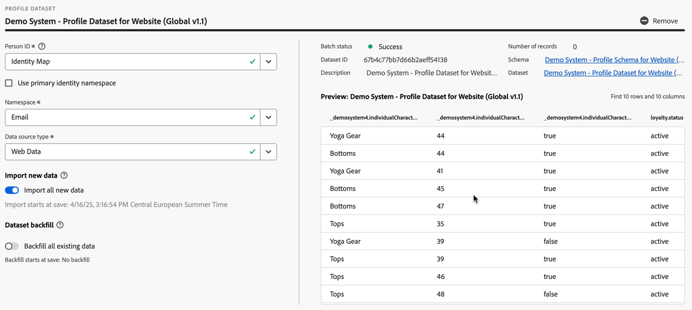
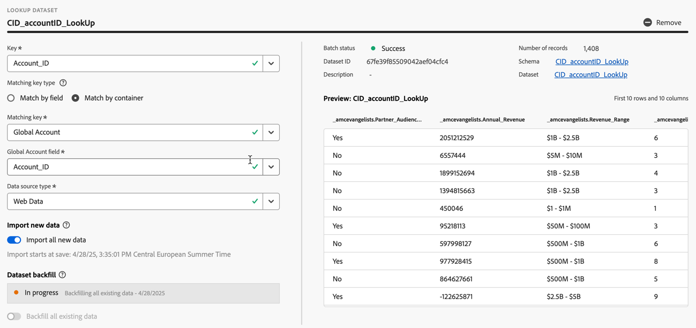

# Criar ou editar uma conexão {#create-or-edit-a-connection}

>[!CONTEXTUALHELP]
>id="cja_connections_recordsadded"
>title="Registros adicionados"
>abstract="O número de registros (linhas) adicionados a uma conexão durante o intervalo de tempo selecionado para os conjuntos de dados escolhidos."

>[!CONTEXTUALHELP]
>id="cja_connections_recordsskipped"
>title="Registros ignorados"
>abstract="O número de registros (linhas) ignorados durante a transferência de dados para uma conexão durante o intervalo de tempo selecionado para os conjuntos de dados escolhidos."

>[!CONTEXTUALHELP]
>id="cja_connections_recordsdeleted"
>title="Registros excluídos"
>abstract="A quantidade de registros (linhas) removidos de uma conexão durante o intervalo selecionado para os conjuntos de dados selecionados."

>[!CONTEXTUALHELP]
>id="cja_connection_lastadded"
>title="Última adição"
>abstract="O carimbo de data e hora do lote mais recente de qualquer conjunto de dados transferido para uma conexão."

>[!CONTEXTUALHELP]
>id="cja_connection_enablerollingdatawindow"
>title="Habilitar janela de dados contínuos"
>abstract="Defina a retenção de dados como uma janela contínua em meses no nível da conexão."

>[!CONTEXTUALHELP]
>id="cja_connection_averagenumberofdailyuses"
>title="Número médio de usos diários"
>abstract="Selecione um intervalo para o número de eventos diários esperados para toda a conexão."

>[!CONTEXTUALHELP]
>id="connections_recordsadded"
>title="Registros adicionados"
>abstract="O número de registros (linhas) adicionados a uma conexão durante o intervalo de tempo selecionado para os conjuntos de dados escolhidos."

>[!CONTEXTUALHELP]
>id="connections_recordsskipped"
>title="Registros ignorados"
>abstract="O número de registros (linhas) ignorados durante a transferência de dados para uma conexão durante o intervalo de tempo selecionado para os conjuntos de dados escolhidos."

>[!CONTEXTUALHELP]
>id="connections_recordsdeleted"
>title="Registros excluídos"
>abstract="O número de registros (linhas) removidos de uma conexão durante o intervalo de tempo selecionado para os conjuntos de dados escolhidos"

>[!CONTEXTUALHELP]
>id="connection_lastadded"
>title="Última adição"
>abstract="O carimbo de data e hora do lote mais recente de qualquer conjunto de dados transferido para uma conexão."

>[!CONTEXTUALHELP]
>id="connection_enablerollingdatawindow"
>title="Habilitar janela de dados contínuos"
>abstract="Defina a retenção de dados como uma janela contínua em meses no nível da conexão."

>[!CONTEXTUALHELP]
>id="connection_averagenumberofdailyuses"
>title="Número médio de usos diários"
>abstract="Selecione um intervalo para o número de eventos diários esperados para toda a conexão."

>[!CONTEXTUALHELP]
>id="connection_change_personid"
>title="Alterar ID de pessoa"
>abstract="Uma alteração da ID de pessoa exclui todos os dados existentes na conexão e assimila novamente todos os dados do conjunto de dados com base na nova ID de pessoa. Essa ação pode ter implicações de custos. <br/><br/>Ao selecionar **[!UICONTROL Continuar]**, é possível atrasar os relatórios até que o processo seja concluído."

>[!CONTEXTUALHELP]
>id="connection_change_accountid"
>title="Alterar ID da conta"
>abstract="Uma alteração na ID da conta exclui todos os dados existentes na conexão e assimila novamente todos os dados do conjunto de dados com base na nova ID da conta. Essa ação pode ter implicações de custos. <br/><br/>Ao selecionar **[!UICONTROL Continuar]**, é possível atrasar os relatórios até que o processo seja concluído."

>[!CONTEXTUALHELP]
>id="connection_change_globalaccountid"
>title="Alterar ID da conta global"
>abstract="Uma alteração na ID da conta global exclui todos os dados existentes na conexão e assimila novamente todos os dados do conjunto de dados com base na nova ID da conta global. Essa ação pode ter implicações de custos. <br/><br/>Ao selecionar **[!UICONTROL Continuar]**, é possível atrasar os relatórios até que o processo seja concluído."

>[!CONTEXTUALHELP]
>id="connection_change_opportunityid"
>title="Alterar ID de oportunidade"
>abstract="Uma alteração da ID de oportunidade exclui todos os dados existentes na conexão e assimila novamente todos os dados do conjunto de dados com base na nova ID de oportunidade. Essa ação pode ter implicações de custos. <br/><br/>Ao selecionar **[!UICONTROL Continuar]**, é possível atrasar os relatórios até que o processo seja concluído."

>[!CONTEXTUALHELP]
>id="connection_change_buyinggroupid"
>title="Alterar ID de grupo de compras"
>abstract="Uma alteração da ID de grupo de compras exclui todos os dados existentes na conexão e assimila novamente todos os dados do conjunto de dados com base na nova ID de grupo de compras. Essa ação pode ter implicações de custos. <br/><br/>Ao selecionar **[!UICONTROL Continuar]**, é possível atrasar os relatórios até que o processo seja concluído."

>[!CONTEXTUALHELP]
>id="connection_change_persistentid"
>title="Alterar ID persistente"
>abstract="Uma alteração da ID persistente exclui todos os dados existentes na conexão e assimila novamente todos os dados do conjunto de dados com base na nova ID persistente. Essa ação pode ter implicações de custos. <br/><br/>Ao selecionar **[!UICONTROL Continuar]**, é possível atrasar os relatórios até que o processo seja concluído."

A experiência de criação e edição de conexão reúne todos os conjuntos de dados e configurações de conexão no centro da tela com um fluxo de trabalho auxiliar. Ele fornece uma experiência detalhada de seleção, configuração e revisão de conjunto de dados. E permite especificar informações críticas como [tipo de conjunto de dados](#dataset-types), tamanho, esquema, ID do conjunto de dados, status do lote, status de preenchimento retroativo, identidades e muito mais, para reduzir o risco de configuração de conexão incorreta. Esta é uma visão geral dos recursos:

* Você pode habilitar uma janela de retenção de dados sem interrupção ao criar a conexão.
* Você pode adicionar e remover conjuntos de dados de uma conexão. (A remoção de um conjunto de dados o remove da conexão e afeta qualquer visualização de dados associada e projetos subjacentes do Analysis Workspace.)
* Você pode habilitar e solicitar dados de preenchimento retroativo por conjunto de dados.
* É possível editar conjuntos de dados, por exemplo, para solicitar outro preenchimento retroativo.
* É possível importar dados existentes por conjunto de dados.


>[!BEGINSHADEBOX]

Consulte  [Criar e editar uma conexão](https://video.tv.adobe.com/v/3409303/?quality=12&learn=on&captions=por_br){target="_blank"} para assistir a um vídeo de demonstração.

>[!ENDSHADEBOX]


## Pré-requisitos

O número máximo de conjuntos de dados que você pode adicionar a uma conexão é limitado a 100. A combinação depende de qual pacote do Customer Journey Analytics sua empresa comprou.

Entre em contato com sua administração se não tiver certeza de qual pacote do Customer Journey Analytics você possui.

| **Selecionar** pacote | Pacote **Foundation** |
| --- | --- |
| Qualquer combinação de evento, perfil, pesquisa ou conjuntos de dados de resumo, adicionando até 100 | Um conjunto de dados de evento por conexão |
|  | Até 99 conjuntos de dados de perfil, pesquisa ou resumo por conexão |

{style="table-layout:auto"}

## Criar uma conexão {#create-connection}

Para criar uma conexão:

1. No Customer Journey Analytics, selecione **[!UICONTROL Conexões]**, ou utilize a seção **[!UICONTROL Gerenciamento de dados]** no menu superior.
1. Selecione **[!UICONTROL Criar nova conexão]**.

Agora você pode [editar os detalhes da sua conexão](#edit-a-connection).

## Editar uma conexão {#edit-connection}

A forma como você edita a conexão depende do pacote do Customer Journey Analytics que você licenciou:

* [Customer Journey Analytics](#customer-journey-analytics)
* [Customer Journey Analytics B2B Edition](#customer-journey-analytics-b2b-edition)

### Customer Journey Analytics

Na tela **[!UICONTROL Conexões]** > **[!UICONTROL *Nome da conexão *]**:


1. Defina as configurações de conexão.

   | Configuração | Descrição |
   | --- | --- |
   | **[!UICONTROL Nome da conexão]** | Digite um nome exclusivo para a conexão. |
   | **[!UICONTROL Descrição da conexão]** | Descreva a finalidade desta conexão. |
   | **[!UICONTROL Tags]** | Especifique tags para adicionar tags à conexão e usá-las para pesquisar a conexão posteriormente. |
   | **[!UICONTROL Habilitar janela de dados contínuos]** | Essa caixa de seleção, se marcada, permite definir a retenção de dados do Costumer Journey Analytics como uma janela contínua em meses (1 mês, 3 meses, 6 meses etc.), no nível da conexão.<p>A retenção de dados tem por base os carimbos de data e hora do conjunto de dados do evento e se aplica somente aos conjuntos de dados do evento. Não existe configuração de janela de dados contínuos para conjuntos de dados de perfil ou pesquisa, pois não há carimbos de data/hora aplicáveis. No entanto, se sua conexão incluir qualquer perfil ou conjuntos de dados de pesquisa (além de um ou mais conjuntos de dados de evento), esses dados serão retidos pelo mesmo período.<p> O principal benefício é armazenar ou relatar apenas dados que sejam aplicáveis e úteis, além de excluir dados mais antigos que não sejam mais úteis. Isso ajuda você a ficar dentro dos limites do contrato e reduz o risco de custo excedente.<p><ul><li>Se deixar o padrão (desmarcado), a configuração de retenção de dados da Adobe Experience Platform terá precedência sobre o período de retenção. Se você tiver dados correspondentes a 25 meses na Experience Platform, o Customer Journey Analytics obterá 25 meses de dados por meio de preenchimento retroativo. Se você excluísse 10 desses meses no Experience Platform, o Customer Journey Analytics manteria os 15 meses restantes.</li><li>Se você habilitar uma janela de dados contínuos, especifique em **[!UICONTROL Selecionar número de meses]** o número de meses para os quais habilita a janela de dados contínuos. |
   | **[!UICONTROL Sandbox]** | Escolha uma sandbox no Experience Platform que contenha os conjuntos de dados para os quais você deseja criar uma conexão.<p>A Adobe Experience Platform fornece [sandboxes](https://experienceleague.adobe.com/pt-br/docs/experience-platform/sandbox/home) que particionam uma única instância da Platform em ambientes virtuais separados para ajudar a desenvolver aplicativos de experiência digital. Você pode considerar as sandboxes como “silos de dados” que contêm conjuntos de dados. As sandboxes são usadas para controlar o acesso aos conjuntos de dados.<p>Depois de selecionar a sandbox, o painel esquerdo mostra todos os conjuntos de dados que você pode obter dela. |
   | **[!UICONTROL Adicionar conjuntos de dados]** | Selecione  **[!UICONTROL Adicionar conjuntos de dados]** para adicionar conjuntos de dados. Se a conexão ainda não tiver conjuntos de dados, você também poderá selecionar **[!UICONTROL Adicionar conjuntos de dados]** na tabela de conjuntos de dados. |


   Para os conjuntos de dados que você configurou, a tabela de conjuntos de dados mostra as seguintes colunas:

   | Coluna | Descrição |
   |---|---|
   | **[!UICONTROL Nome do conjunto de dados]** | Selecione um ou mais conjuntos de dados que você deseja inserir no Customer Journey Analytics e clique em **[!UICONTROL Adicionar]**.<p>(Se tiver vários conjuntos de dados, você poderá pesquisar os corretos usando a barra de consulta Pesquisar conjuntos de dados acima da lista de conjuntos de dados.) |
   |  | Selecione  para abrir um menu de contexto para o conjunto de dados selecionado. Com base no conjunto de dados (tipo de), você pode selecionar:<ul><li>  **[!UICONTROL Excluir conjunto de dados]** a [excluir um conjunto de dados](#delete-a-dataset).</li><li> **[!UICONTROL Editar conjunto de dados]** para [editar um conjunto de dados](#edit-a-dataset).</li><li> **[!UICONTROL Preenchimentos retroativos anteriores]** para exibir [preenchimentos retroativos anteriores do conjunto de dados](#past-backfills). |
   | **[!UICONTROL Última atualização]** | Somente para conjuntos de dados de eventos, essa configuração é definida automaticamente para o campo de carimbo de data e hora padrão em esquemas baseados em eventos na Experience Platform. “N/A” significa que esse conjunto de dados não contém dados. |
   | **[!UICONTROL Número de registros]** | O total de registros no mês anterior do conjunto de dados na Experience Platform. |
   | **[!UICONTROL Esquema]** | O [esquema](https://experienceleague.adobe.com/pt-br/docs/experience-platform/xdm/schema/composition) que foi usado como base para criar o conjunto de dados na Adobe Experience Platform. |
   | **[!UICONTROL Tipo de conjunto de dados]** | Para cada conjunto de dados adicionado a essa conexão, o Customer Journey Analytics define automaticamente o [tipo de conjunto de dados](#dataset-types) de acordo com os dados recebidos. Há 3 tipos diferentes de conjunto de dados: dados de Evento, dados de Perfil e dados de Pesquisa. Consulte a tabela abaixo para obter uma explicação dos tipos de conjunto de dados. |
   | **[!UICONTROL Granularidade]** | A granularidade dos dados no conjunto de dados, aplicável somente para conjuntos de dados de resumo. |
   | **[!UICONTROL Tipo de fonte de dados]** | O tipo de fonte de dados do conjunto de dados. Não aplicável para conjuntos de dados de resumo. |
   | **[!UICONTROL ID de pessoa]** | A ID de pessoa usada para oferecer suporte a relatórios baseados em pessoas para o conjunto de dados. |
   | **[!UICONTROL Chave]** | A chave usada para um conjunto de dados de pesquisa. |
   | **[!UICONTROL Chave correspondente]** | A chave correspondente usada para um conjunto de dados de pesquisa. |
   | **[!UICONTROL Importar novos dados]** | O status de importação de novos dados para o conjunto de dados: <p>   **[!UICONTROL _x _Ativado]**&#x200B;se o conjunto de dados estiver configurado para importar novos dados e<p>   **[!UICONTROL _x Desativado_]** se o conjunto de dados estiver configurado para não importar novos dados. |
   | **[!UICONTROL Dados de preenchimento retroativo]** | O status dos dados de preenchimento retroativo do conjunto de dados.<p>   **[!UICONTROL _x _preenchimentos retroativos com falha]**&#x200B;para o número de preenchimentos retroativos com falha,<p>   **[!UICONTROL _x _processamento de preenchimentos retroativos]**&#x200B;para o número de preenchimentos retroativos em processamento,<p>   **[!UICONTROL _x _preenchimentos retroativos concluídos]**&#x200B;para o número de preenchimentos retroativos concluídos e<p>   **[!UICONTROL _Desativado_]** caso nenhum preenchimento retroativo esteja configurado. |

   Você pode pesquisar um conjunto de dados específico usando o campo .

### Customer Journey Analytics B2B Edition

[!BADGE B2B Edition]{type=Informative url="https://experienceleague.adobe.com/pt-br/docs/analytics-platform/using/cja-overview/cja-b2b/cja-b2b-edition" newtab=true tooltip="Customer Journey Analytics B2B edition"}

Na tela **[!UICONTROL Conexões]** > **[!UICONTROL *Nome da conexão *]**:


1. Defina as configurações de conexão.

   | Configuração | Descrição |
   | --- | --- |
   | **[!UICONTROL Nome da conexão]** | Digite um nome exclusivo para a conexão. |
   | **[!UICONTROL Descrição da conexão]** | Descreva a finalidade desta conexão. |
   | **[!UICONTROL Tags]** | Especifique tags para adicionar tags à conexão e usá-las para pesquisar a conexão posteriormente. |
   | **[!UICONTROL ID Primária]** | Selecione a ID primária apropriada para sua conexão: <ul><li> **[!UICONTROL Pessoa]** de uma conexão baseada em pessoa que você normalmente usa em um cenário B2C.</li><li>  **[!UICONTROL Conta]** para uma conexão baseada em conta que você normalmente usa em um cenário B2B.</li></ul>Assim que você adicionar um ou mais conjuntos de dados à conexão, não será mais possível alterar a ID primária. <br/>A seleção da ID primária define se a conexão é baseada em pessoas ou em contas. A base de conexão determina as [configurações](#dataset-settings) disponíveis para determinados tipos de conjuntos de dados. |
   | **[!UICONTROL Contêineres opcionais]** | Se você selecionou  **[!UICONTROL Conta]** como a **[!UICONTROL ID Primária]**, selecione contêineres adicionais.<ul><li>**[!UICONTROL Conta global]**: habilita a configuração de contas globais em uma conexão.</li><li>**[!UICONTROL Oportunidade]**: habilita a configuração de oportunidades em uma conexão.</li><li>**[!UICONTROL Grupo de compras]**: habilita a configuração de grupos de compras em uma conexão.</li><ul> |
   | **[!UICONTROL Sandbox]** | Escolha uma sandbox no Experience Platform que contenha os conjuntos de dados para os quais você deseja criar uma conexão.<p>A Adobe Experience Platform fornece [sandboxes](https://experienceleague.adobe.com/pt-br/docs/experience-platform/sandbox/home) que particionam uma única instância da Platform em ambientes virtuais separados para ajudar a desenvolver aplicativos de experiência digital. Você pode considerar as sandboxes como “silos de dados” que contêm conjuntos de dados. As sandboxes são usadas para controlar o acesso aos conjuntos de dados.<p>Depois de selecionar a sandbox, o painel esquerdo mostra todos os conjuntos de dados que você pode obter dela. |
   | **[!UICONTROL Habilitar janela de dados contínuos]** | Essa caixa de seleção, se marcada, permite definir a retenção de dados do Costumer Journey Analytics como uma janela contínua em meses (1 mês, 3 meses, 6 meses etc.), no nível da conexão.<p>A retenção de dados tem por base os carimbos de data e hora do conjunto de dados do evento e se aplica somente aos conjuntos de dados do evento. Não existe configuração de janela de dados contínuos para conjuntos de dados de perfil ou pesquisa, pois não há carimbos de data/hora aplicáveis. No entanto, se sua conexão incluir qualquer perfil ou conjuntos de dados de pesquisa (além de um ou mais conjuntos de dados de evento), esses dados serão retidos pelo mesmo período.<p> O principal benefício é armazenar ou relatar apenas dados que sejam aplicáveis e úteis, além de excluir dados mais antigos que não sejam mais úteis. Isso ajuda você a ficar dentro dos limites do contrato e reduz o risco de custo excedente.<p><ul><li>Se deixar o padrão (desmarcado), a configuração de retenção de dados da Adobe Experience Platform terá precedência sobre o período de retenção. Se você tiver dados correspondentes a 25 meses na Experience Platform, o Customer Journey Analytics obterá 25 meses de dados por meio de preenchimento retroativo. Se você excluiu 10 desses meses na Platform, o Customer Journey Analytics manterá os 15 meses restantes.</li><li>Se você habilitar uma janela de dados contínuos, especifique em **[!UICONTROL Selecionar número de meses]** o número de meses para os quais habilita a janela de dados contínuos. |
   | **[!UICONTROL Adicionar conjuntos de dados]** | Selecione  **[!UICONTROL Adicionar conjuntos de dados]** a [adicionar conjuntos de dados](#add-datasets). Se a conexão ainda não tiver conjuntos de dados, você também poderá selecionar **[!UICONTROL Adicionar conjuntos de dados]** na tabela de conjuntos de dados. |


   Para os conjuntos de dados que você configurou, a tabela de conjuntos de dados mostra as seguintes colunas:

   | Coluna | Descrição |
   |---|---|
   | **[!UICONTROL Nome do conjunto de dados]** | Selecione um ou mais conjuntos de dados que você deseja inserir no Customer Journey Analytics e clique em **[!UICONTROL Adicionar]**.<p>(Se tiver vários conjuntos de dados, você poderá pesquisar os corretos usando a barra de consulta Pesquisar conjuntos de dados acima da lista de conjuntos de dados.) |
   |  | Selecione  para abrir um menu de contexto para o conjunto de dados selecionado. Com base no conjunto de dados (tipo de), você pode selecionar:<ul><li>  **[!UICONTROL Excluir conjunto de dados]** a [excluir um conjunto de dados](#delete-a-dataset).</li><li> **[!UICONTROL Editar conjunto de dados]** para [editar um conjunto de dados](#edit-a-dataset).</li><li> **[!UICONTROL Preenchimentos retroativos anteriores]** para exibir [preenchimentos retroativos anteriores do conjunto de dados](#past-backfills). |
   | **[!UICONTROL Última atualização]** | Somente para conjuntos de dados de eventos, essa configuração é definida automaticamente para o campo de carimbo de data e hora padrão em esquemas baseados em eventos na Experience Platform. “N/A” significa que esse conjunto de dados não contém dados. |
   | **[!UICONTROL Número de registros]** | O total de registros no mês anterior do conjunto de dados na Experience Platform. |
   | **[!UICONTROL Esquema]** | O [esquema](https://experienceleague.adobe.com/pt-br/docs/experience-platform/xdm/schema/composition) que foi usado como base para criar o conjunto de dados na Adobe Experience Platform. |
   | **[!UICONTROL Tipo de conjunto de dados]** | Para cada conjunto de dados adicionado a essa conexão, o Customer Journey Analytics define automaticamente o [tipo de conjunto de dados](#dataset-types) de acordo com os dados recebidos. Há 3 tipos diferentes de conjunto de dados: dados de Evento, dados de Perfil e dados de Pesquisa. Consulte a tabela abaixo para obter uma explicação dos tipos de conjunto de dados. |
   | **[!UICONTROL Granularidade]** | A granularidade dos dados no conjunto de dados, aplicável somente para conjuntos de dados de resumo. |
   | **[!UICONTROL Tipo de fonte de dados]** | O tipo de fonte de dados do conjunto de dados. Não aplicável para conjuntos de dados de resumo. |
   | **[!UICONTROL ID da conta]** | (exibido somente para conexões baseadas em conta) A ID da conta usada para oferecer suporte a relatórios baseados em conta para o conjunto de dados. |
   | **[!UICONTROL ID da Conta Global]** | (exibido somente para conexões baseadas em conta) A ID da conta global usada para oferecer suporte a relatórios baseados em conta para o conjunto de dados. |
   | **[!UICONTROL ID do Grupo de Compras]** | (exibido somente para conexões baseadas em conta) A ID do Grupo de compra que é usada para pesquisar dados do grupo de compra. |
   | **[!UICONTROL ID da oportunidade]** | (exibido somente para conexões baseadas em conta) A ID da oportunidade usada para pesquisar dados da oportunidade. |
   | **[!UICONTROL ID de pessoa]** | A ID de pessoa usada para oferecer suporte a relatórios baseados em pessoas para o conjunto de dados. |
   | **[!UICONTROL Chave]** | A chave usada para um conjunto de dados de pesquisa. |
   | **[!UICONTROL Chave correspondente]** | A chave correspondente usada para um conjunto de dados de pesquisa. |
   | **[!UICONTROL Importar novos dados]** | O status de importação de novos dados para o conjunto de dados: <p>   **[!UICONTROL _x _Ativado]**&#x200B;se o conjunto de dados estiver configurado para importar novos dados e<p>   **[!UICONTROL _x Desativado_]** se o conjunto de dados estiver configurado para não importar novos dados. |
   | **[!UICONTROL Dados de preenchimento retroativo]** | O status dos dados de preenchimento retroativo do conjunto de dados.<p>   **[!UICONTROL _x _preenchimentos retroativos com falha]**&#x200B;para o número de preenchimentos retroativos com falha,<p>   **[!UICONTROL _x _processamento de preenchimentos retroativos]**&#x200B;para o número de preenchimentos retroativos em processamento,<p>   **[!UICONTROL _x _preenchimentos retroativos concluídos]**&#x200B;para o número de preenchimentos retroativos concluídos e<p>   **[!UICONTROL _Desativado_]** caso nenhum preenchimento retroativo esteja configurado. |

   Você pode pesquisar um conjunto de dados específico usando o campo .

## Conjuntos de dados {#datasets}

Você [adiciona um ou mais conjuntos de dados](#add-datasets) ou [edita conjuntos de dados existentes](#edit-a-dataset) como parte do fluxo de trabalho de conexão.


>[!CONTEXTUALHELP]
>id="cja_connection_primaryid"
>title="ID primária"
>abstract="Selecione a ID principal adequada para a sua conexão: pessoa para um cenário B2C. Conta para um cenário B2B."

>[!CONTEXTUALHELP]
>id="cja_connection_optionalcontainers"
>title="Contêineres opcionais"
>abstract="Selecione contêineres adicionais.<br/><br/>**[!UICONTROL Conta global &#x200B;]**: habilita a configuração de contas globais em uma conexão.<br/>**[!UICONTROL Oportunidade]**: habilita a configuração de oportunidades em uma conexão.<br/>**[!UICONTROL Grupo de compras &#x200B;]**: habilita a configuração de grupos de compras em uma conexão."

>[!CONTEXTUALHELP]
>id="cja_connection_accountid"
>title="ID da Conta"
>abstract="Selecione uma ID de conta (o identificador exclusivo de uma conta) entre as identidades disponíveis definidas no esquema do conjunto de dados da Experience Platform."

>[!CONTEXTUALHELP]
>id="cja_connection_accountfield"
>title="Campo conta"
>abstract="Selecione um campo que representa a ID da conta (o identificador exclusivo de uma conta)."

>[!CONTEXTUALHELP]
>id="cja_connection_globalaccountid"
>title="ID de conta global"
>abstract="Selecione uma ID de conta global (o identificador exclusivo de uma conta global) entre as identidades disponíveis definidas no esquema do conjunto de dados da Experience Platform."

>[!CONTEXTUALHELP]
>id="cja_connection_opportunityid"
>title="ID de oportunidade"
>abstract="Selecione uma ID de oportunidade (o identificador exclusivo de uma oportunidade) entre as identidades disponíveis definidas no esquema do conjunto de dados da Experience Platform."

>[!CONTEXTUALHELP]
>id="cja_connection_buyinggroupid"
>title="ID de grupo de compras"
>abstract="Selecione uma ID de grupo de compra (o identificador exclusivo de um grupo de compra) entre as identidades disponíveis definidas no esquema do conjunto de dados da Experience Platform."

>[!CONTEXTUALHELP]
>id="cja_connection_personid"
>title="ID da pessoa"
>abstract="Selecione uma ID de pessoa (o identificador exclusivo de uma pessoa) entre as identidades disponíveis definidas no esquema do conjunto de dados da Experience Platform."

>[!CONTEXTUALHELP]
>id="cja_connection_matchingkey"
>title="Chave correspondente"
>abstract="Selecione o campo para associar a um dos conjuntos de dados de evento. Se essa lista estiver vazia, você provavelmente não adicionou nem configurou um conjunto de dados de evento."

>[!CONTEXTUALHELP]
>id="cja_connection_importnewdata"
>title="Importar novos dados"
>abstract="Quaisquer novos lotes adicionados ao conjunto de dados da Experience Platform serão automaticamente inseridos nesta conexão e disponibilizados para análise."

>[!CONTEXTUALHELP]
>id="cja_connection_datasetbackfill"
>title="Preenchimento retroativo do conjunto de dados"
>abstract="Esta opção preencherá retroativamente os dados existentes (históricos) da Experience Platform para este conjunto de dados na conexão."

>[!CONTEXTUALHELP]
>id="cja_connection_transformdataset"
>title="Transformar conjunto de dados"
>abstract="Esta opção transformará o conjunto de dados para que ele possa ser usado em pesquisas baseadas em pessoas nos cenários de B2B. Uma vez ativada, a transformação do conjunto de dados é irreversível."

>[!CONTEXTUALHELP]
>id="cja_connection_connectionmap"
>title="Mapa de conexão"
>abstract="O Mapa de conexão visualiza as relações entre evento, pessoa, conta e conjuntos de dados de pesquisa relevantes (como oportunidades, membros da campanha e muito mais)."

>[!CONTEXTUALHELP]
>id="connection_primaryid"
>title="ID primária"
>abstract="Selecione a ID principal adequada para a sua conexão: pessoa para um cenário B2C. Conta para um cenário B2B."

>[!CONTEXTUALHELP]
>id="connection_optionalcontainers"
>title="Contêineres opcionais"
>abstract="Selecione contêineres adicionais.<br/><br/>**[!UICONTROL Conta global &#x200B;]**: habilita a configuração de contas globais em uma conexão.<br/>**[!UICONTROL Oportunidade]**: habilita a configuração de oportunidades em uma conexão.<br/>**[!UICONTROL Grupo de compras &#x200B;]**: habilita a configuração de grupos de compras em uma conexão."

>[!CONTEXTUALHELP]
>id="connection_personid"
>title="ID da pessoa"
>abstract="Selecione uma ID de pessoa entre as identidades disponíveis definidas no esquema do conjunto de dados da Experience Platform."

>[!CONTEXTUALHELP]
>id="connection_accountid"
>title="ID da Conta"
>abstract="Selecione uma ID de conta (o identificador exclusivo de uma conta) entre as identidades disponíveis definidas no esquema do conjunto de dados da Experience Platform."

>[!CONTEXTUALHELP]
>id="connection_accountfield"
>title="Campo conta"
>abstract="Selecione um campo que representa a ID da conta (o identificador exclusivo de uma conta)."

>[!CONTEXTUALHELP]
>id="connection_globalaccountid"
>title="ID de conta global"
>abstract="Selecione uma ID de conta global (o identificador exclusivo de uma conta global) entre as identidades disponíveis definidas no esquema do conjunto de dados da Experience Platform."

>[!CONTEXTUALHELP]
>id="connection_opportunityid"
>title="ID de oportunidade"
>abstract="Selecione uma ID de oportunidade (o identificador exclusivo de uma oportunidade) entre as identidades disponíveis definidas no esquema do conjunto de dados da Experience Platform."

>[!CONTEXTUALHELP]
>id="connection_buyinggroupid"
>title="ID de grupo de compras"
>abstract="Selecione uma ID de grupo de compra (o identificador exclusivo de um grupo de compra) entre as identidades disponíveis definidas no esquema do conjunto de dados da Experience Platform."

>[!CONTEXTUALHELP]
>id="connection_matchingkey"
>title="Chave correspondente"
>abstract="Selecione o campo para associar a um dos conjuntos de dados de evento. Se essa lista estiver vazia, você provavelmente não adicionou nem configurou um conjunto de dados de evento."

>[!CONTEXTUALHELP]
>id="connection_matchingkeytype"
>title="Tipo de chave correspondente"
>abstract="Selecione como associar: com base em uma correspondência por campo ou por container.<br/><br/>**[!UICONTROL Correspondência por campo &#x200B;]**: selecione um campo para associar com um dos conjuntos de dados de eventos. Se essa lista estiver vazia, você provavelmente não adicionou nem configurou um conjunto de dados de evento.<br/>**[!UICONTROL Corresponder por container]**: selecione um container a ser associado a um dos conjuntos de dados de evento."

>[!CONTEXTUALHELP]
>id="connection_importnewdata"
>title="Importar novos dados"
>abstract="Quaisquer novos lotes adicionados ao conjunto de dados da Experience Platform serão automaticamente inseridos nesta conexão e disponibilizados para análise."

>[!CONTEXTUALHELP]
>id="connection_datasetbackfill"
>title="Preenchimento retroativo do conjunto de dados"
>abstract="Esta opção preencherá retroativamente os dados existentes (históricos) da Experience Platform para este conjunto de dados na conexão."

>[!CONTEXTUALHELP]
>id="connection_transformdataset"
>title="Transformar conjunto de dados"
>abstract="Esta opção transformará o conjunto de dados para que ele possa ser usado em pesquisas baseadas em pessoas nos cenários de B2B. Uma vez ativada, a transformação do conjunto de dados é irreversível."

>[!CONTEXTUALHELP]
>id="connection_connectionmap"
>title="Mapa de conexão"
>abstract="O Mapa de conexão visualiza as relações entre evento, pessoa, conta e conjuntos de dados de pesquisa relevantes (como oportunidades, membros da campanha e muito mais)."

>[!CONTEXTUALHELP]
>id="connection_stitching_enable"
>title="Habilitar compilação de identidades"
>abstract="Habilite a compilação de identidades para encaminhar este conjunto de dados de eventos para análise entre canais."
>additional-url="https://experienceleague.adobe.com/pt-br/docs/analytics-platform/using/stitching/overview" text="Visão geral da compilação"

>[!CONTEXTUALHELP]
>id="connection_stitching_dialog"
>title="Habilitar compilação de identidades"
>abstract="Habilitar a compilação de identidades deriva uma ID compilada de um ou vários conjuntos de dados. Este processo pode incluir a mesclagem de dados de usuários de sessões autenticadas e não autenticadas.<br/><br/>Você é responsável por cumprir as leis e regulamentos cabíveis. Essa conformidade inclui a obtenção das permissões de usuário final necessárias antes de mesclar conjuntos de dados."
>additional-url="https://experienceleague.adobe.com/pt-br/docs/analytics-platform/using/stitching/overview" text="Visão geral da compilação"

>[!CONTEXTUALHELP]
>id="connection_persistentid"
>title="ID persistente"
>abstract="Selecione uma ID persistente entre as identidades disponíveis. Uma ID persistente é um identificador que está disponível em todos os eventos do conjunto de dados de eventos."
>additional-url="https://experienceleague.adobe.com/pt-br/docs/analytics-platform/using/stitching/overview" text="Visão geral da compilação"

>[!CONTEXTUALHELP]
>id="connection_lookbackwindow"
>title="Janela de retrospectiva"
>abstract="Selecione o período apropriado para a janela de pesquisa a ser usado na compilação de reprodução."
>additional-url="https://experienceleague.adobe.com/pt-br/docs/analytics-platform/using/stitching/overview" text="Visão geral da compilação"

>[!CONTEXTUALHELP]
>id="connection_namespace_map"
>title="Mapa de identidade do namespace"
>abstract="Selecione o namespace a ser usado para escolher o identificador no mapa de identidade."
>additional-url="https://experienceleague.adobe.com/pt-br/docs/analytics-platform/using/stitching/overview" text="Visão geral da compilação"

>[!CONTEXTUALHELP]
>id="connection_namespace_graph"
>title="Gráfico de identidade do namespace"
>abstract="Selecione o namespace a ser usado para atualizar o identificador no gráfico de identidade."
>additional-url="https://experienceleague.adobe.com/pt-br/docs/analytics-platform/using/stitching/overview" text="Visão geral da compilação"

>[!CONTEXTUALHELP]
>id="connection_changeto_identitygraph"
>title="Alterar para gráfico de identidade"
>abstract="Verifique se concluiu a configuração do gráfico de identidade antes de usá-lo para compilação."


### Adicionar conjuntos de dados

É possível adicionar um ou mais conjuntos de dados do Experience Platform ao criar ou editar uma conexão.


1. Em **[!UICONTROL Conexão]** > **[!UICONTROL _Nome da interface de conexão_]**, selecione  **[!UICONTROL Adicionar conjuntos de dados]**.

1. Na etapa ➊ **[!UICONTROL Selecionar conjuntos de dados]**, você verá uma lista dos conjuntos de dados do Experience Platform.

   

   Para cada conjunto de dados, a lista mostra:

   | Coluna | Descrição |
   |---|---|
   | **[!UICONTROL Conjunto de dados]** | Nome do conjunto de dados. Selecione o nome para acessar o conjunto de dados na Experience Platform. Selecione  para exibir uma janela pop-up com mais detalhes sobre o conjunto de dados. Você pode selecionar **[!UICONTROL Editar na plataforma]** para editar o conjunto de dados diretamente na Experience Platform. |
   | **[!UICONTROL Tipo de conjunto de dados]** | O tipo de conjunto de dados: Evento, Perfil, Pesquisa ou Resumo. |
   | **[!UICONTROL Número de registros]** | O total de registros no mês anterior do conjunto de dados na Experience Platform. |
   | **[!UICONTROL Esquema]** | O esquema do conjunto de dados. Selecione o nome para acessar o esquema na Experience Platform. |
   | **[!UICONTROL Último lote]** | O estado do último lote assimilado na Experience Platform. Consulte [Estados dos lotes](https://experienceleague.adobe.com/pt-br/docs/experience-platform/ingestion/batch/troubleshooting#batch-states) para mais informações. |
   | **[!UICONTROL ID do conjunto de dados]** | A ID do conjunto de dados. |
   | **[!UICONTROL Última atualização]** | O último carimbo de data e hora atualizado do conjunto de dados. |

   * Para alterar as colunas exibidas para a lista de conjuntos de dados, selecione  e selecione as colunas a serem exibidas na caixa de diálogo [!UICONTROL Personalizar tabela].
   * Para pesquisar um conjunto de dados específico, use o campo .
   * Para alternar entre mostrar ou ocultar os conjuntos de dados selecionados, clique em  **[!UICONTROL Ocultar selecionados]** ou **[!UICONTROL Mostrar selecionados]**.
   * Para remover um conjunto de dados da lista de conjuntos de dados selecionados, use . Para remover todos os conjuntos de dados selecionados, clique em **[!UICONTROL Limpar tudo]**.
   * Para exibir detalhes de um conjunto de dados, selecione .


1. Selecione um ou mais conjuntos de dados e clique em **[!UICONTROL Próximo]**. Pelo menos um evento ou conjunto de dados de resumo deve fazer parte da conexão.

1. Defina as [configurações para cada um dos conjuntos de dados selecionados](#dataset-settings), uma por uma, na etapa ➋ **[!UICONTROL Configurações de conjuntos de dados]** da caixa de diálogo **[!UICONTROL Adicionar conjuntos de dados]**.

   

1. Selecione **[!UICONTROL Adicionar conjuntos de dados]** para adicionar os conjuntos de dados configurados à conexão. Você é notificado quando não fornece todas as configurações necessárias para cada um dos conjuntos de dados que deseja adicionar.

   Como alternativa, você pode selecionar **[!UICONTROL Cancelar]** para cancelar a adição de conjuntos de dados à conexão. Ou selecione **[!UICONTROL Voltar]** para voltar à etapa ➊ **[!UICONTROL Selecionar conjuntos de dados]**.


### Editar um conjunto de dados

Para editar um conjunto de dados que já está configurado para uma conexão, na interface **[!UICONTROL Conexões]** > **[!UICONTROL _Nome da conexão_]**:

1. Selecione  para o conjunto de dados listado na tabela de conjunto de dados que você deseja editar
1. Selecione  **[!UICONTROL Editar conjunto de dados]**.

1. Defina as [configurações do conjunto de dados](#dataset-settings) na caixa de diálogo **[!UICONTROL Editar conjunto de dados: _Nome do conjunto de dados_]**.

   

1. Selecione **[!UICONTROL Aplicar]** para aplicar as configurações do conjunto de dados. Selecione **[!UICONTROL Cancelar]** para cancelar.


### Configurações do conjunto de dados

Ao adicionar conjuntos de dados ou editar um conjunto existente, você define as configurações de cada conjunto de dados. As configurações disponíveis dependem do [tipo de conjunto de dados](#dataset-types) e, para alguns tipos de conjunto de dados, do tipo de conexão (com base em pessoa ou na conta do [!BADGE B2B edition]{type=Informative url="https://experienceleague.adobe.com/pt-br/docs/analytics-platform/using/cja-overview/cja-b2b/cja-b2b-edition" newtab=true tooltip="Customer Journey Analytics B2B edition"}.).

Todos os conjuntos de dados e tipos de conjuntos de dados têm [configurações e detalhes gerais](#general-dataset-settings-and-details), como importar ou não novos dados e solicitar preenchimentos retroativos.

#### Conjunto de dados de evento

As configurações específicas para um conjunto de dados de evento dependem do tipo de conexão.

##### Conexão baseada em pessoas

 do conjunto de dados do evento

Para um conjunto de dados de evento em uma conexão baseada em pessoas, você pode especificar:

| Configuração | Descrição |
| --- | --- |
| **[!UICONTROL ID de pessoa]** | Selecione uma ID de pessoa no menu suspenso de identidades disponíveis. Essas identidades foram definidas no esquema do conjunto de dados na Experience Platform. Consulte [Usar o Mapa de identidade como uma ID de pessoa](#id-map) para obter informações sobre como usar o Mapa de identidade como uma ID de pessoa.<p>Se não houver IDs de pessoa para escolher, significa que nenhuma ID de pessoa está definida no esquema. Consulte [Definir campos de identidade na interface](https://experienceleague.adobe.com/pt-br/docs/experience-platform/xdm/ui/fields/identity) para obter mais informações. <p>O valor da ID de pessoa selecionada diferencia maiúsculas de minúsculas. Por exemplo, `abc123` e `ABC123` são dois valores diferentes.<p>Se um registro não contiver um valor para a identidade selecionada como a ID de pessoa para o conjunto de dados do evento, o registro será ignorado. |
| **[!UICONTROL Carimbo de data e hora]** | Essa configuração é definida automaticamente para o campo de carimbo de data e hora padrão em esquemas baseados em eventos no Experience Platform. |
| **[!UICONTROL Tipo de fonte de dados]** | Selecione um tipo de fonte de dados. Os tipos de fontes de dados incluem: <ul><li>[!UICONTROL Dados da Web]</li><li>[!UICONTROL Dados do aplicativo móvel]</li><li>[!UICONTROL Dados de POS]</li><li>[!UICONTROL Dados de CRM]</li><li>[!UICONTROL Dados de pesquisa]</li><li>[!UICONTROL Dados da central de atendimento]</li><li>[!UICONTROL Dados de produto]</li><li> [!UICONTROL Dados de contas]</li><li> [!UICONTROL Dados de transação]</li><li>[!UICONTROL Dados de feedback de clientes]</li><li> [!UICONTROL Outro]</li></ul>Este campo é usado para consultar os tipos de fontes de dados que estão sendo usados. |
| **[!UICONTROL Descrição da fonte de dados]** | Uma descrição da fonte de dados quando você seleciona Outro como o tipo de fonte de dados. |


##### Conexão baseada em conta

[!BADGE B2B Edition]{type=Informative url="https://experienceleague.adobe.com/pt-br/docs/analytics-platform/using/cja-overview/cja-b2b/cja-b2b-edition" newtab=true tooltip="Customer Journey Analytics B2B edition"}

Para um conjunto de dados de evento em uma conexão baseada em conta, você pode especificar:

 do conjunto de dados do evento

| Configuração | Descrição |
| --- | --- |
| **[!UICONTROL ID da Conta Global]** | Selecione uma ID de conta global (o identificador exclusivo de uma conta) entre as identidades disponíveis definidas no esquema do conjunto de dados na Experience Platform. Aplicável quando você adicionou a Conta global como um contêiner à conexão. <p>Se um registro não contiver um valor para a identidade selecionada como a ID da conta para o conjunto de dados do evento, o registro será ignorado. |
| **[!UICONTROL ID da conta]** | Selecione uma ID de conta (o identificador exclusivo de uma conta) entre as identidades disponíveis definidas no esquema do conjunto de dados na Experience Platform. Aplicável quando você não adicionou a Conta global como um contêiner à conexão. |
| **[!UICONTROL ID da oportunidade]** | Selecione uma ID de oportunidade (o identificador exclusivo de uma oportunidade) entre as identidades disponíveis definidas no esquema do conjunto de dados na Experience Platform. |
| **[!UICONTROL ID do Grupo de Compras]** | Selecione uma ID do grupo de compra (o identificador exclusivo de um grupo de compra) entre as identidades disponíveis definidas no esquema do conjunto de dados na Experience Platform. |
| **[!UICONTROL ID de pessoa]** | Selecione uma ID de pessoa no menu suspenso de identidades disponíveis. Essas identidades foram definidas no esquema do conjunto de dados na Experience Platform. Consulte [Usar o Mapa de identidade como uma ID de pessoa](#id-map) para obter informações sobre como usar o Mapa de identidade como uma ID de pessoa.<p>Se não houver IDs de pessoa para escolher, significa que uma ou mais IDs de pessoa não foram definidas no esquema. Consulte [Definir campos de identidade na interface](https://experienceleague.adobe.com/pt-br/docs/experience-platform/xdm/ui/fields/identity) para obter mais informações. <p>O valor da ID de pessoa selecionada diferencia maiúsculas de minúsculas. Por exemplo, `abc123` e `ABC123` são dois valores diferentes. |
| **[!UICONTROL Carimbo de data e hora]** | Essa configuração é definida automaticamente para o campo de carimbo de data e hora padrão em esquemas baseados em eventos no Experience Platform. |
| **[!UICONTROL Tipo de fonte de dados]** | Selecione um tipo de fonte de dados. Os tipos de fontes de dados incluem: <ul><li>[!UICONTROL Dados da Web]</li><li>[!UICONTROL Dados do aplicativo móvel]</li><li>[!UICONTROL Dados de POS]</li><li>[!UICONTROL Dados de CRM]</li><li>[!UICONTROL Dados de pesquisa]</li><li>[!UICONTROL Dados da central de atendimento]</li><li>[!UICONTROL Dados de produto]</li><li> [!UICONTROL Dados de contas]</li><li> [!UICONTROL Dados de transação]</li><li>[!UICONTROL Dados de feedback de clientes]</li><li> [!UICONTROL Outro]</li></ul>Este campo é usado para consultar os tipos de fontes de dados que estão sendo usados. |
| **[!UICONTROL Descrição da fonte de dados]** | Uma descrição da fonte de dados quando você seleciona Outro como o tipo de fonte de dados. |

#### Conjunto de dados Perfil

As configurações específicas para um conjunto de dados de perfil dependem do tipo de conexão.

##### Conexão baseada em pessoas

 das configurações do conjunto de dados de perfil

Para um conjunto de dados de perfil em uma conexão baseada em pessoas, você especifica:

| Configuração | Descrição |
| --- | --- |
| **[!UICONTROL ID de pessoa]** | Selecione uma ID de pessoa no menu suspenso de identidades disponíveis. Essas identidades foram definidas no esquema do conjunto de dados na Experience Platform. Consulte [Usar o Mapa de identidade como uma ID de pessoa](#id-map) para obter informações sobre como usar o Mapa de identidade como uma ID de pessoa.<p>Se não houver IDs de pessoa para escolher, nenhuma ID de pessoa será definida no esquema. Consulte [Definir campos de identidade na interface](https://experienceleague.adobe.com/pt-br/docs/experience-platform/xdm/ui/fields/identity) para obter mais informações. <p>O valor da ID de pessoa selecionada diferencia maiúsculas de minúsculas. Por exemplo, `abc123` e `ABC123` são dois valores diferentes. <p>Se um registro não contiver um valor para a identidade selecionada como a ID de pessoa para o conjunto de dados do perfil, o registro será ignorado. |
| **[!UICONTROL Tipo de fonte de dados]** | Selecione um tipo de fonte de dados. Os tipos de fontes de dados incluem: <ul><li>[!UICONTROL Dados da Web]</li><li>[!UICONTROL Dados do aplicativo móvel]</li><li>[!UICONTROL Dados de POS]</li><li>[!UICONTROL Dados de CRM]</li><li>[!UICONTROL Dados de pesquisa]</li><li>[!UICONTROL Dados da central de atendimento]</li><li>[!UICONTROL Dados de produto]</li><li> [!UICONTROL Dados de contas]</li><li> [!UICONTROL Dados de transação]</li><li>[!UICONTROL Dados de feedback de clientes]</li><li> [!UICONTROL Outro]</li></ul>Este campo é usado para consultar os tipos de fontes de dados que estão sendo usados. |
| **[!UICONTROL Descrição da fonte de dados]** | Uma descrição da fonte de dados quando você seleciona Outro como o tipo de fonte de dados. |

#### Conexão baseada em conta

 das configurações do conjunto de dados de perfil

Para um conjunto de dados de perfil em uma conexão baseada em conta, você especifica:

| Configuração | Descrição |
| --- | --- |
| **[!UICONTROL ID de pessoa]** | Selecione uma ID de pessoa no menu suspenso de identidades disponíveis. Essas identidades foram definidas no esquema do conjunto de dados na Experience Platform. Consulte [Usar o Mapa de identidade como uma ID de pessoa](#id-map) para obter informações sobre como usar o Mapa de identidade como uma ID de pessoa.<p>Se não houver IDs de pessoa para escolher, nenhuma ID de pessoa será definida no esquema. Consulte [Definir campos de identidade na interface](https://experienceleague.adobe.com/pt-br/docs/experience-platform/xdm/ui/fields/identity) para obter mais informações. <p>O valor da ID de pessoa selecionada diferencia maiúsculas de minúsculas. Por exemplo, `abc123` e `ABC123` são dois valores diferentes. <p>Se um registro não contiver um valor para a identidade selecionada como a ID de pessoa para o conjunto de dados do perfil, o registro será ignorado. |
| **[!UICONTROL Campo de Conta Global]** | Selecione um campo de conta global para oferecer suporte a relatórios baseados em conta para o conjunto de dados no menu suspenso de identidades disponíveis. Aplicável quando você adicionou a Conta global como um contêiner à conexão. |
| **[!UICONTROL Campo de conta]** | Selecione um campo de conta para oferecer suporte a relatórios baseados em conta para o conjunto de dados no menu suspenso de identidades disponíveis. Aplicável quando você não adicionou a Conta global como um contêiner à conexão. |
| **[!UICONTROL Tipo de fonte de dados]** | Selecione um tipo de fonte de dados. Os tipos de fontes de dados incluem: <ul><li>[!UICONTROL Dados da Web]</li><li>[!UICONTROL Dados do aplicativo móvel]</li><li>[!UICONTROL Dados de POS]</li><li>[!UICONTROL Dados de CRM]</li><li>[!UICONTROL Dados de pesquisa]</li><li>[!UICONTROL Dados da central de atendimento]</li><li>[!UICONTROL Dados de produto]</li><li> [!UICONTROL Dados de contas]</li><li> [!UICONTROL Dados de transação]</li><li>[!UICONTROL Dados de feedback de clientes]</li><li> [!UICONTROL Outro]</li></ul>Este campo é usado para consultar os tipos de fontes de dados que estão sendo usados. |
| **[!UICONTROL Descrição da fonte de dados]** | Uma descrição da fonte de dados quando você seleciona Outro como o tipo de fonte de dados. |

#### Conjunto de dados de pesquisa

As configurações específicas de um conjunto de dados de pesquisa dependem do tipo de conexão.

##### Conexão baseada em pessoas


Para um conjunto de dados de pesquisa em uma conexão baseada em pessoas, você especifica:

| Configurações | Descrição |
|---|---|
| **[!UICONTROL Chave]** | A chave a ser usada para um conjunto de dados de pesquisa. <p>Se um registro não contiver um valor para a chave selecionada para o conjunto de dados de pesquisa, ele será ignorado. |
| **[!UICONTROL Chave correspondente]** | A chave correspondente para associação em um dos conjuntos de dados de evento. Se essa lista estiver vazia, você provavelmente não adicionou nem configurou um conjunto de dados de evento. |
| **[!UICONTROL Tipo de fonte de dados]** | Selecione um tipo de fonte de dados. Os tipos de fontes de dados incluem: <ul><li>[!UICONTROL Dados da Web]</li><li>[!UICONTROL Dados do aplicativo móvel]</li><li>[!UICONTROL Dados de POS]</li><li>[!UICONTROL Dados de CRM]</li><li>[!UICONTROL Dados de pesquisa]</li><li>[!UICONTROL Dados da central de atendimento]</li><li>[!UICONTROL Dados de produto]</li><li> [!UICONTROL Dados de contas]</li><li> [!UICONTROL Dados de transação]</li><li>[!UICONTROL Dados de feedback de clientes]</li><li> [!UICONTROL Outro]</li></ul>Este campo é usado para consultar os tipos de fontes de dados que estão sendo usados. |
| **[!UICONTROL Descrição da fonte de dados]** | Uma descrição da fonte de dados quando você seleciona Outro como o tipo de fonte de dados. |
| **[!UICONTROL Transformar conjunto de dados]** | Para conjuntos de dados de pesquisa B2B específicos, é possível habilitar a transformação de um conjunto de dados para cenários de relatório adequados baseados em pessoas B2B. Consulte [Transformar conjuntos de dados para pesquisas B2B](transform-datasets-b2b-lookups.md) para obter mais informações. |


##### Conexão baseada em conta

[!BADGE B2B Edition]{type=Informative url="https://experienceleague.adobe.com/pt-br/docs/analytics-platform/using/cja-overview/cja-b2b/cja-b2b-edition" newtab=true tooltip="Customer Journey Analytics B2B Edition"}


Para um conjunto de dados de pesquisa em uma conexão baseada em conta, você pode especificar:

| Configurações | Descrição |
|---|---|
| **[!UICONTROL Chave]** | A chave a ser usada para um conjunto de dados de pesquisa. <p>Se um registro não contiver um valor para a chave selecionada para o conjunto de dados de pesquisa, ele será ignorado. |
| **[!UICONTROL Tipo de chave correspondente]** | Selecione como unir os conjuntos de dados: com base nas opções **[!UICONTROL Corresponder por campo]** ou **[!UICONTROL Corresponder por container]**. Consulte [Corresponder por container de campo](/help/getting-started/cja-b2b-concepts-features.md#match-by-container-or-field) para obter mais informações. |
| **[!UICONTROL Chave correspondente]** | A chave correspondente para associação em um dos conjuntos de dados de evento. Se esta lista estiver vazia, provavelmente você não adicionou ou configurou um conjunto de dados de eventos. <br/><br/>Com base no **[!UICONTROL Tipo de chave correspondente]** selecionado, selecione o valor apropriado:<ul><li>**[!UICONTROL Corresponder por campo]**: <br/>Selecione um campo no menu suspenso **[!UICONTROL Chave correspondente]** para ingressar com um dos conjuntos de dados do evento. Se essa lista estiver vazia, você provavelmente não adicionou nem configurou um conjunto de dados de evento.</li><li>**[!UICONTROL Corresponder por contêiner]**: <br/>Selecione um contêiner do menu suspenso **[!UICONTROL Chave de correspondência]** para usar para ingressar com um dos conjuntos de dados do evento. Os contêineres incluídos como parte da configuração da conexão determinam os contêineres disponíveis para seleção.</li></ul> |
| **[!UICONTROL Campo de Conta Global]** | A ID de conta global a ser usada para relatórios baseados em conta. |


#### Conjunto de dados de resumo

As configurações específicas para um conjunto de dados de resumo são:

| Configuração | Descrição |
|---|---|
| **[!UICONTROL Carimbo de data e hora]** | Essa configuração é definida automaticamente para o campo de carimbo de data e hora padrão em esquemas baseados em eventos no Experience Platform. |
| **[!UICONTROL Fuso horário]** | Selecione o fuso horário apropriado para os dados de resumo da série temporal. |
| **[!UICONTROL Granularidade]** | Representa o intervalo de tempo usado para agregar dados de resumo por hora ou dia no momento. Derivado dos dados no conjunto de dados. |


#### Configurações e detalhes gerais do conjunto de dados

Cada (tipo de conjunto de dados) tem as seguintes configurações comuns:

{{common-dataset-settings}}


### Assimilar dados novamente

Às vezes, é necessário assimilar novamente os dados de um ou mais conjuntos de dados em uma conexão. Para fazer isso:

1. Para cada conjunto de dados que você deseja assimilar novamente os dados para:

   1. Altere qualquer uma das seguintes opções:

      * Um identificador (ID de pessoa, ID de conta ou outra ID) para um conjunto de dados de eventos já assimilado.
      * Uma chave, chave correspondente ou tipo de chave correspondente (campo ou contêiner) para um perfil ou conjunto de dados de pesquisa já assimilado.

      Como alternativa, você pode alternar o **[!UICONTROL Preenchimento retroativo de todos os dados existentes]** no conjunto de dados.

   1. **[!UICONTROL Aplicar]** as alterações do conjunto de dados.

1. **[!UICONTROL Salve]** a conexão. Os dados são assimilados novamente para os conjuntos de dados específicos.


### Excluir um conjunto de dados

Ao excluir um conjunto de dados, você é notificado sobre as implicações da exclusão. A exclusão de um conjunto de dados pode afetar todas as conexões associadas, visualizações de dados e projetos. Além disso, se você excluir apenas um evento ou conjunto de dados de resumo na conexão, será solicitado a adicionar outro evento ou conjunto de dados de resumo. Você só pode salvar uma conexão que contenha pelo menos um evento ou conjunto de dados de resumo.


### Preenchimentos retroativos anteriores

Ao selecionar  **[!UICONTROL Preenchimentos retroativos anteriores]** na interface, uma caixa de diálogo **[!UICONTROL Preenchimentos retroativos anteriores: _Nome do conjunto de dados_]**&#x200B;mostra os preenchimentos retroativos mais recentes do conjunto de dados.

## Tipos de conjunto de dados {#dataset-types}

Para cada conjunto de dados adicionado a essa conexão, o [!UICONTROL Customer Journey Analytics] define automaticamente o tipo de conjunto de dados, de acordo com os dados recebidos.

>[!IMPORTANT]
>
>Adicione pelo menos um conjunto de dados de evento ou resumo como parte de uma conexão.

Existem diferentes tipos de conjunto de dados: dados de [!UICONTROL Evento], [!UICONTROL Perfil], [!UICONTROL Pesquisa] e [!UICONTROL Resumo].

| Tipo de conjunto de dados | Descrição | Carimbo de data e hora | Esquema | ID de pessoa <br/> ID da conta [!BADGE B2B Edition]{type=Informative url="https://experienceleague.adobe.com/pt-br/docs/analytics-platform/using/cja-overview/cja-b2b/cja-b2b-edition" newtab=true tooltip="Customer Journey Analytics B2B Edition"} |
|---|---|---|---|---|
| **[!UICONTROL Evento]** | Dados que representam eventos no tempo. Por exemplo, visitas à web, interações, transações, dados de POS, dados de pesquisa, dados de impressão publicitária e assim por diante. Esses dados podem ser dados típicos de fluxo de cliques, com uma ID de cliente ou uma ID de cookie e um registro de data e hora. Os dados do evento fornecem flexibilidade em relação a qual ID é usada como a ID da pessoa. | Defina para o campo de carimbo de data/hora padrão a partir de esquemas baseados em eventos no [!UICONTROL Experience Platform]. | Qualquer esquema incorporado ou personalizado baseado em uma classe XDM com o comportamento *Série de tempo*. Exemplos incluem *Evento de experiência XDM* ou *Evento de decisão XDM*. | Você pode escolher a ID de pessoa ou a ID de conta [!BADGE B2B edition]{type=Informative url="https://experienceleague.adobe.com/pt-br/docs/analytics-platform/using/cja-overview/cja-b2b/cja-b2b-edition" newtab=true tooltip="Customer Journey Analytics B2B Edition"} que deseja incluir. Cada esquema do conjunto de dados definido na Experience Platform pode ter seu próprio conjunto de uma ou mais identidades definidas e associadas a um namespace de identidade. Qualquer uma dessas identidades pode ser usada como a ID de pessoa ou a ID de conta [!BADGE B2B edition]{type=Informative url="https://experienceleague.adobe.com/pt-br/docs/analytics-platform/using/cja-overview/cja-b2b/cja-b2b-edition" newtab=true tooltip="Customer Journey Analytics B2B Edition"}. Os exemplos incluem ID de Cookie, ID com título, ID de Usuário, Código de Rastreamento, ID de Conta [!BADGE B2B edition]{type=Informative url="https://experienceleague.adobe.com/pt-br/docs/analytics-platform/using/cja-overview/cja-b2b/cja-b2b-edition" newtab=true tooltip="Customer Journey Analytics B2B Edition"} e assim por diante. |
| **[!UICONTROL Pesquisa]** | Você pode adicionar conjuntos de dados como pesquisas de campos em todos os tipos de conjuntos de dados: conjuntos de dados de perfil, pesquisa e evento (este último sempre foi compatível). Esse recurso adicional expande a capacidade de o Customer Journey Analytics aceitar modelos de dados complexos, incluindo B2B. Esses dados são usados para procurar valores ou chaves encontrados nos dados de evento, perfil ou pesquisa. Você pode adicionar até dois níveis de pesquisas. (Observe que [Campos derivados](/help/data-views/derived-fields/derived-fields.md) não podem ser usados como chaves correspondentes para pesquisas em Conexões). Por exemplo, você pode fazer upload de dados de pesquisa que mapeiam IDs numéricas nos dados do evento para nomes de produtos. Consulte o [Exemplo de B2B](/help/use-cases/b2b/example.md). | N/A | Qualquer esquema incorporado ou personalizado baseado em uma classe XDM com o comportamento *Registro*, exceto a classe *Perfil Individual XDM*. | N/A |
| **[!UICONTROL Perfil]** | Dados que são aplicados à sua conta, pessoas, usuários ou clientes nos dados do [!UICONTROL evento]. Por exemplo, permite carregar dados do CRM sobre seus clientes. | N/D | Qualquer esquema incorporado ou personalizado baseado na classe *Perfil Individual XDM*. | Você pode escolher que ID de pessoa/ID de conta [!BADGE B2B edition]{type=Informative url="https://experienceleague.adobe.com/pt-br/docs/analytics-platform/using/cja-overview/cja-b2b/cja-b2b-edition" newtab=true tooltip="Customer Journey Analytics B2B Edition"} deseja incluir. Cada conjunto de dados (exceto conjuntos de dados de resumo) definido em [!DNL Experience Platform] tem seu próprio conjunto de uma ou mais IDs de pessoa ou de conta [!BADGE B2B Edition]{type=Informative url="https://experienceleague.adobe.com/pt-br/docs/analytics-platform/using/cja-overview/cja-b2b/cja-b2b-edition" newtab=true tooltip="Customer Journey Analytics B2B Edition"} definido. Por exemplo, ID de cookie, ID com título, ID de usuário, código de rastreamento, ID de conta e assim por diante.<br>**Observação**: se você criar uma conexão que inclui conjuntos de dados com IDs diferentes, o relatório refletirá isso. Para mesclar conjuntos de dados, é necessário usar a mesma ID de pessoa ou ID de conta [!BADGE B2B Edition]{type=Informative url="https://experienceleague.adobe.com/pt-br/docs/analytics-platform/using/cja-overview/cja-b2b/cja-b2b-edition" newtab=true tooltip="Customer Journey Analytics B2B Edition"}. |
| **Resumo** | Dados de série temporal que não estão associados a uma ID de pessoa individual. Os dados de resumo representam dados agregados em um nível diferente de agregação, por exemplo, campanhas. Você pode usar esses dados no Customer Journey Analytics para oferecer suporte a vários casos de uso. Veja [Dados resumidos](/help/data-views/summary-data.md) para obter mais informações. | Defina automaticamente para o campo de carimbo de data e hora padrão a partir de esquemas de Métricas de resumo baseadas em eventos no Experience Platform. Somente a granularidade por hora ou por dia é aceita. | Qualquer esquema incorporado ou personalizado baseado na classe *Métricas de resumo XDM*. | N/A |

## Visualização da conexão {#preview}

Para visualizar a conexão que você criou, selecione  **[!UICONTROL Visualização de conexão]** na caixa de diálogo Configurações de conexão.


Esta visualização contém algumas colunas que listam a configuração da conexão. Os tipos de colunas mostrados dependem dos conjuntos de dados individuais.


## Mapa de conexão

Para ver um mapa dos relacionamentos entre os conjuntos de dados que fazem parte da sua conexão, selecione  **[!UICONTROL Mapa de conexão]** na caixa de diálogo Configurações da conexão.


Este mapa ajuda você a entender melhor como definiu sua conexão e configurar a relação entre seu evento, perfil, pesquisa e conjuntos de dados de resumo usando contêineres e identificadores.


## Usar campos numéricos como chaves de pesquisa e valores de pesquisa {#numeric}

Essa funcionalidade de pesquisa é útil se você quiser adicionar um campo numérico, como um custo ou margem, a um campo de chave baseado em string. Ela permite que valores numéricos façam parte de pesquisas, como chaves ou como valores. No esquema de pesquisa, você pode ter valores numéricos vinculados, por exemplo, aos nomes de produtos, COGS, custo de marketing da campanha ou margens. Este é um exemplo de esquema de pesquisa na Adobe Experience Platform:


Agora, é possível trazer esses valores como métricas ou dimensões para os relatórios do Customer Journey Analytics. Ao configurar sua conexão e extrair conjuntos de dados de pesquisa, você pode editar os conjuntos de dados para selecionar a variável [!UICONTROL Chave] e [!UICONTROL Chave de correspondência]:


Ao configurar uma visualização de dados com base nessa conexão, você adiciona os valores numéricos como componentes à visualização de dados. Qualquer projeto baseado nessa visualização de dados pode, então, gerar relatórios sobre esses valores numéricos.

## Usar o Mapa de identidade como uma ID de pessoa {#id-map}

O Customer Journey Analytics permite usar o Mapa de identidade para sua ID de pessoa. O Mapa de identidade é uma estrutura de dados de mapa que permite carregar pares de valores principais. As chaves são namespaces de identidade e o valor é uma estrutura que contém o valor de identidade. O Mapa de identidade existe em cada linha/evento carregado e é preenchido de acordo com cada linha.

O Mapa de identidade está disponível para qualquer conjunto de dados que use um esquema com base na classe [ExperienceEvent XDM](https://experienceleague.adobe.com/pt-br/docs/experience-platform/xdm/home). Ao selecionar um conjunto de dados como esse para ser incluído em uma conexão do Customer Journey Analytics, você tem a opção de selecionar um campo como a ID primária ou o Mapa de identidade:


Ao selecionar o Mapa de identidade, você terá duas opções adicionais de configuração:

| Opção | Descrição |
|---|---|
| **[!UICONTROL Usar namespace da ID primária]** | Esta opção instrui o Customer Journey Analytics a encontrar a identidade no Mapa de Identidade que está marcada com um atributo `primary=true` e usar essa identidade como a ID de pessoa para essa linha. Essa identidade é a chave primária usada na Experience Platform para particionamento. E essa identidade também é a principal candidata para usar como ID de pessoa do Customer Journey Analytics (dependendo de como o conjunto de dados está configurado em uma conexão do Customer Journey Analytics). |
| **[!UICONTROL Namespace]** | (Essa opção só estará disponível se você não usar o Namespace de ID primária). Os namespaces de identidade são um componente do [Serviço de identidade da Experience Platform](https://experienceleague.adobe.com/pt-br/docs/experience-platform/identity/features/namespaces). Os namespaces servem como indicadores do contexto ao qual uma identidade está relacionada. Se você especificar um namespace, o Customer Journey Analytics pesquisará cada linha do mapa de identidade para encontrar a chave desse namespace e usará a identidade desse namespace como a ID de pessoa dessa linha. Como o Customer Journey Analytics não pode fazer uma verificação completa do conjunto de dados de todas as linhas para determinar quais namespaces estão presentes, todos os namespaces possíveis são exibidos no menu suspenso. Você deve saber quais namespaces estão especificados nos dados, pois eles não são detectados automaticamente. |

{style="table-layout:auto"}

### Casos de borda do Mapa de identidade {#id-map-edge}

Essa tabela mostra as duas opções de configuração quando houver casos de borda e como eles são tratados:

| Opção | Nenhuma ID presente no mapa de identidade | Várias IDs, nenhuma marcada como primária | Várias IDs são marcadas como primárias | ID única, marcada como primária ou não | Namespace inválido com uma ID marcada como primária |
|---|---|---|---|---|---|
| Opção **[!UICONTROL Usar namespace de ID primária] marcada** | O Customer Journey Analytics descarta a linha. | O Customer Journey Analytics descarta a linha, pois nenhuma ID primária foi especificada. | Todas as IDs marcadas como primárias, em todos os namespaces, são extraídas para uma lista. Elas são então classificadas alfabeticamente; com essa nova classificação, o primeiro namespace com sua primeira ID é usado como a ID de pessoa. | Essa ID única é usada como a ID de pessoa. | Embora o namespace possa ser inválido (não está presente na Adobe Experience Platform), o Customer Journey Analytics usa a ID primária sob esse namespace como a ID de pessoa. |
| **[!UICONTROL Namespace específico do Mapa de identidade] selecionado** | O Customer Journey Analytics descarta a linha. | Todas as IDs no namespace selecionado são extraídas em uma lista e a primeira é usada como a ID de pessoa. | Todas as IDs no namespace selecionado são extraídas em uma lista e a primeira é usada como a ID de pessoa. | Todas as IDs no namespace selecionado são extraídas em uma lista e a primeira é usada como a ID de pessoa. | Todas as IDs no namespace selecionado são extraídas em uma lista e a primeira é usada como a ID de pessoa. (Somente um namespace válido pode ser selecionado no momento da criação da conexão, portanto, não é possível que um namespace/ID inválido seja usada como ID de pessoa). |

{style="table-layout:auto"}

## Calcular o número médio de eventos diários {#average-number}

Esse cálculo é feito para cada conjunto de dados na conexão.

1. Acesse os [Serviços de consulta da Adobe Experience Platform](https://experienceleague.adobe.com/pt-br/docs/experience-platform/query/home) e crie uma consulta.

   A consulta seria semelhante a:

   ```
   Select AVG(A.total_events) from (Select DISTINCT COUNT (*) as total_events, date(TIMESTAMP) from analytics_demo_data GROUP BY 2 Having total_events>0) A;
   ```

   Neste exemplo, “analytics_demo_data” é o nome do conjunto de dados.

2. Para mostrar todos os conjuntos de dados existentes na Adobe Experience Platform, execute a consulta `Show Tables`.


>[!MORELIKETHIS]
>
>Blog: [como aproveitar os conjuntos de dados de evento, pesquisa e perfil no Adobe Customer Journey Analytics](https://experienceleaguecommunities.adobe.com/t5/adobe-analytics-blogs/how-to-leverage-event-lookup-and-profile-datasets-in-adobe/ba-p/681478?profile.language=pt)


