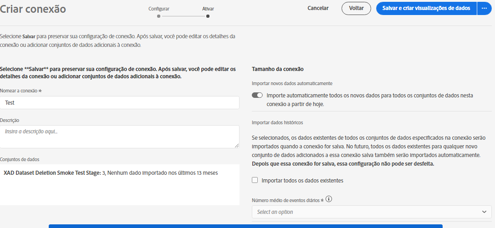

# Criar uma conexão

Uma conexão permite integrar conjuntos de dados do [!DNL Adobe Experience Platform] ao [!UICONTROL Workspace]. Para criar relatórios sobre conjuntos de dados do [!DNL Experience Platform], primeiro é necessário estabelecer uma conexão entre os conjuntos de dados no [!DNL Experience Platform] e no [!UICONTROL Workspace].

Clique [aqui](https://docs.adobe.com/content/help/en/platform-learn/tutorials/cja/connecting-customer-journey-analytics-to-data-sources-in-platform.html) para obter uma visão geral do vídeo.

>[!IMPORTANT]
>
>É possível combinar vários conjuntos de dados do [!DNL Experience Platform] em uma única conexão.

## Selecionar sandbox e conjuntos de dados

1. Acesse [https://analytics.adobe.com](https://analytics.adobe.com).

1. Clique na guia **[!UICONTROL Conexões]**.

1. Clique em **[!UICONTROL Criar nova conexão]** na parte superior direita.

   

1. Escolha uma sandbox na Experience Platform que contenha os conjuntos de dados para os quais você deseja criar uma conexão.

   A Adobe Experience Platform fornece [sandboxes](https://docs.adobe.com/content/help/pt-BR/experience-platform/sandbox/home.html) que particionam uma única instância da Platform em ambientes virtuais separados para ajudar a desenvolver aplicativos de experiência digital. Você pode considerar as sandboxes como &quot;silos de dados&quot; que contêm conjuntos de dados. As sandboxes são usadas para controlar o acesso aos conjuntos de dados.  Depois de selecionar a sandbox, o painel esquerdo mostra todos os conjuntos de dados que você pode obter dela.

   >[!IMPORTANT]
   >
   >Não é possível acessar dados em sandboxes, ou seja, você só pode combinar conjuntos de dados localizados na mesma sandbox.

1. Selecione um ou mais conjuntos de dados que você deseja transferir para o [!UICONTROL Customer Journey Analytics] e clique em **[!UICONTROL Adicionar]**.

   (Se tiver vários conjuntos de dados, você poderá pesquisar os corretos usando a barra de pesquisa **[!UICONTROL Pesquisar conjuntos de dados]** acima da lista de conjuntos de dados.)

## Configurar conjunto de dados

No lado direito, agora é possível configurar os conjuntos de dados adicionados.

1. **[!UICONTROL Tipo de conjunto de dados]**: para cada conjunto de dados adicionado a essa conexão, o [!UICONTROL Customer Journey Analytics] define automaticamente o tipo de conjunto de dados de acordo com os dados recebidos.

   Há 3 tipos diferentes de conjunto de dados: dados de [!UICONTROL Evento], dados de [!UICONTROL Perfil] e dados de [!UICONTROL Pesquisa].

   | Tipo do conjunto de dados | Descrição | Carimbo de data e hora | Esquema | ID da pessoa |
   |---|---|---|---|---|
   | [!UICONTROL Evento] | Dados que representam eventos no tempo (por exemplo, visitas da Web, interações, transações, dados de POS, dados de pesquisa, dados de impressão de anúncio etc.). Por exemplo, eles podem ser dados de sequência de cliques típicos, com uma ID do cliente ou uma ID do cookie e um carimbo de data e hora. Com os dados do Evento, você tem flexibilidade para saber qual ID é usada como a ID da pessoa. | É automaticamente definido para o campo de carimbo de data e hora padrão a partir de esquemas baseados em eventos no [!UICONTROL Experience Platform]. | Qualquer esquema incorporado ou personalizado baseado em uma classe XDM com o comportamento &quot;Série de tempo&quot;. Exemplos incluem &quot;Evento de experiência XDM&quot; ou &quot;Evento de decisão XDM&quot;. | Você pode escolher a ID de pessoa que deseja incluir. Cada esquema de conjunto de dados definido na Experience Platform pode ter seu próprio conjunto de uma ou mais identidades definidas e associadas a um Namespace de identidade. Qualquer uma dessas opções pode ser usada como a ID de pessoa. Os exemplos incluem ID de cookie, ID com título, ID de usuário, código de rastreamento etc. |
   | [!UICONTROL Pesquisa] | (Analogia a um arquivo de Classificações no Adobe Analytics tradicional.) Esses dados são usados para procurar valores ou chaves encontrados nos dados do Evento ou Perfil. Por exemplo, você pode fazer o upload de dados de pesquisa que mapeiam IDs numéricas nos dados do evento para nomes de produtos. Consulte este [caso de uso](/help/use-cases/b2b.md) para ver um exemplo. | N/D | Qualquer esquema incorporado ou personalizado baseado em uma classe XDM com o comportamento &quot;Gravar&quot;, exceto a classe &quot;Perfil individual XDM&quot;. | N/D |
   | [!UICONTROL Perfil] | Análogo a [!UICONTROL Atributos do cliente] - para atributos não variáveis e não temporais. Dados que são aplicados aos visitantes, usuários ou clientes nos dados de [!UICONTROL Evento]. Por exemplo, permite carregar dados do CRM sobre seus clientes. | N/D | Qualquer esquema incorporado ou personalizado baseado na classe &quot;Perfil individual XDM&quot;. | Você pode escolher a ID de pessoa que deseja incluir. Cada conjunto de dados definido no [!DNL Experience Platform] tem seu próprio conjunto de uma ou mais IDs de pessoa definidas, como ID de cookie, ID com título, ID de usuário, código de rastreamento etc. **Observação:** se você criar uma conexão que inclui conjuntos de dados com IDs diferentes, o relatórios refletirá isso. Para realmente unir conjuntos de dados, é necessário usar a mesma ID de pessoa. |

1. **[!UICONTROL ID do conjunto de dados]**: essa ID é gerada automaticamente.

1. **[!UICONTROL Carimbo de data e hora]**: Somente para conjuntos de dados de evento, essa configuração é definida automaticamente para o campo de carimbo de data e hora padrão a partir de schemas baseados em eventos em [!UICONTROL Experience Platform].

1. **[!UICONTROL Esquema]**: é o [esquema](https://docs.adobe.com/content/help/pt-BR/experience-platform/xdm/schema/composition.html) que foi usado como base para criar o conjunto de dados na Adobe Experience Platform.

1. **[!UICONTROL ID de pessoa]**: selecione uma ID de pessoa na lista suspensa de identidades disponíveis. Essas identidades foram definidas no esquema do conjunto de dados na Experience Platform. Consulte abaixo para obter informações sobre como usar o Mapa de identidade como uma ID de pessoa.

   >[!IMPORTANT]
   >
   >Se não houver IDs de pessoa para escolher, significa que uma ou mais IDs de pessoa não foram definidas no esquema. Assista a [este vídeo](https://youtu.be/G_ttmGl_LRU) sobre como definir uma identidade na Experience Platform.

1. Clique em **[!UICONTROL Avançar]** para acessar a caixa de diálogo [!UICONTROL Habilitar conexão].

### Usar o Mapa de identidade como uma ID de pessoa

O Customer Journey Analytics agora permite usar o Mapa de identidade para sua ID de pessoa. O Mapa de identidade é uma estrutura de dados de mapa que permite que alguém carregue pares de chaves -> valores. As chaves são namespaces de identidade e o valor é uma estrutura que contém o valor de identidade. O Mapa de identidade existe em cada linha/evento carregado e é preenchido de acordo com cada linha.

O Mapa de identidade está disponível para qualquer conjunto de dados que use um esquema com base na classe [ExperienceEvent XDM](https://docs.adobe.com/content/help/pt-BR/experience-platform/xdm/home.html). Ao selecionar um conjunto de dados para ser incluído em uma conexão do CJA, você tem a opção de selecionar um campo como a ID primária ou o Mapa de identidade:

Ao selecionar o Mapa de identidade, você terá duas opções adicionais de configuração:

| Opção | Descrição |
|---|---|
| [!UICONTROL Usar namespace da ID primária] | Essa opção instrui o CJA, por linha, a localizar a identidade no Mapa de identidade que está marcada com um atributo primário=verdadeiro e a usar como a ID de pessoa para essa linha. Significa que essa é a chave primária que será usada na Experience Platform para particionamento. Também é a principal candidata para usar como a ID de visitante do CJA (dependendo de como o conjunto de dados está configurado em uma conexão do CJA). |
| [!UICONTROL Namespace] | (Essa opção só estará disponível se você não usar a Namespace de ID primária.) Os namespaces de identidade são um componente do [Serviço de identidade da Adobe Experience Platform](https://docs.adobe.com/content/help/pt-BR/experience-platform/identity/namespaces.html) que serve como indicadores do contexto ao qual uma identidade está relacionada. Se você especificar um namespace, o CJA pesquisará no Mapa de identidade de cada linha por essa chave de namespace e usará a identidade sob essa namespace como a ID de pessoa para essa linha. Como o CJA não pode fazer uma verificação completa do conjunto de dados de todas as linhas para determinar quais namespaces estão realmente presentes, todos as namespaces possíveis são relacionados na lista suspensa. Você precisa saber quais namespaces são especificados nos dados; isso não pode ser detectado automaticamente. |

### Casos de borda do Mapa de identidade

Essa tabela mostra as duas opções de configuração quando houver casos de borda e como eles são tratados:

| Opção | Nenhuma ID está presente no Mapa de identidade | Nenhuma ID está marcada como primária | Várias IDs são marcadas como primárias | A ID única está marcada como primária | Namespace inválido com uma ID marcada como primária |
|---|---|---|---|---|---|
| **“Usar namespace de ID primária” marcada** | A linha é solta pelo CJA. | A linha é solta pelo CJA, pois nenhuma ID primária é especificada. | Todas as IDs marcadas como primárias, em todos os namespaces, são extraídas em uma lista. Elas são classificadas alfabeticamente; com essa nova classificação, o primeiro namespace com sua primeira ID é usado como a ID de pessoa. | A ID única marcada como primária é usada como a ID de pessoa. | Embora o namespace possa ser inválido (não presente no AEP), o CJA usará a ID primária sob esse namespace como a ID de pessoa. |
| **Namespace do Mapa de identidade específico selecionado** | A linha é solta pelo CJA. | Todas as IDs no namespace selecionado são extraídas em uma lista e a primeira é usada como a ID de pessoa. | Todas as IDs no namespace selecionado são extraídas em uma lista e a primeira é usada como a ID de pessoa. | Todas as IDs no namespace selecionado são extraídas em uma lista e a primeira é usada como a ID de pessoa. | Todas as IDs no namespace selecionado são extraídas em uma lista e a primeira é usada como a ID de pessoa. (Somente um namespace válido pode ser selecionado no momento da criação da conexão, portanto, não é possível que um namespace/ID inválido seja usada como ID de pessoa). |

## Habilitar conexão

1. Para habilitar uma conexão, defina estas configurações:

   | Opção | Descrição |
   |---|---|
   | [!UICONTROL Nomear a conexão] | Dê um nome descritivo à conexão. A conexão não pode ser salva sem um nome. |
   | [!UICONTROL Descrição] | Adicione mais detalhes para diferenciar essa conexão de outras pessoas. |
   | [!UICONTROL Conjuntos de dados] | Os conjuntos de dados incluídos nesta conexão. |
   | [!UICONTROL Importe automaticamente todos os novos conjuntos de dados nesta conexão, a partir de hoje.] | Selecione essa opção se quiser estabelecer uma conexão contínua, para que qualquer novo lote de dados adicionado aos conjuntos de dados nesta conexão continuem automaticamente fluindo para o [!UICONTROL Workspace]. |
   | [!UICONTROL Importar todos os dados existentes] | Ao selecionar essa opção e salvar a conexão, todos os dados existentes (históricos) do [!DNL Experience Platform] de todos os conjuntos de dados que estão nessa conexão serão importados. No futuro, todos os dados históricos existentes para qualquer conjunto de dados novo adicionado a essa conexão salva também serão importados automaticamente.  **Observe que, uma vez que essa conexão é salva, essa configuração não pode ser alterada.** |

   **Lembre-se:**

   * Se o tamanho cumulativo dos dados históricos de todos os conjuntos de dados na conexão exceder 1,5 bilhão de linhas, uma mensagem de erro indicará que você não pode importar essa quantidade de dados históricos. No entanto, você poderia adicionar um conjunto de dados com 1 bilhão de linhas de dados históricos, importar esses dados e, uma semana depois, adicionar outro conjunto de dados do mesmo tamanho e importar seus dados históricos.
   * Priorizamos novos dados adicionados a um conjunto de dados na conexão, de modo que esses dados tenham a latência mais baixa.
   * Todos os dados de preenchimento retroativo (históricos) são importados a uma taxa mais lenta (até 13 meses de dados, independentemente do tamanho).

1. Clique em **[!UICONTROL Salvar]**.

A próxima etapa do fluxo de trabalho é [criar uma visualização de dados](/help/data-views/create-dataview.md).
