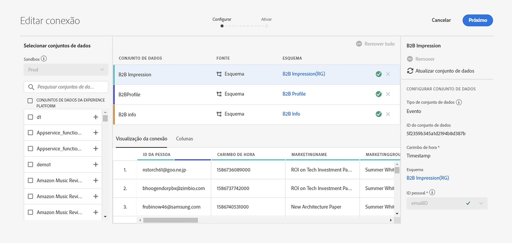
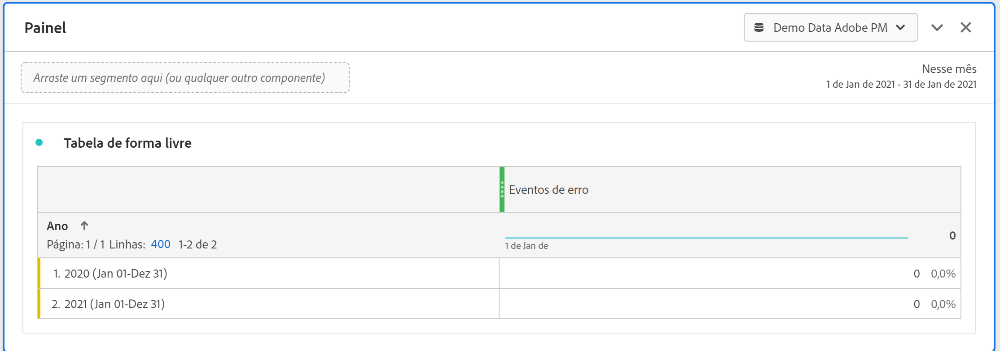

# Estimar tamanho da conexão

Talvez seja necessário saber quantas linhas de dados você tem atualmente no [!UICONTROL Customer Journey Analytics]. O objetivo deste tópico é mostrar como relatar o uso atual do [!UICONTROL Customer Journey Analytics].

1. No [!UICONTROL Customer Journey Analytics], clique na guia **[!UICONTROL Conexões]**.
1. Na tela [!UICONTROL Editar conexão], selecione uma conexão para a qual deseja determinar o tamanho de uso/conexão.

   

1. Selecione um conjunto de dados que faça parte da conexão no painel esquerdo. Nesse caso, é o conjunto de dados &quot;Impressão B2B&quot;.

   

1. Clique no ícone azul (i) (informações) ao lado do respectivo nome. Você observará que o conjunto de dados tem 3,8 mil linhas/eventos. Além disso, para saber o número exato de linhas, clique em **[!UICONTROL Editar na Experience Platform]** abaixo da tabela de pré-visualização. Isso redirecionará você para os conjuntos de dados na [!UICONTROL Adobe Experience Platform].

   

1. Observe que o **[!UICONTROL Total de registros]** desse conjunto de dados é de 3,83 mil, com o tamanho dos dados de 388,59 KB.

1. Repita as etapas de 1 a 5 para outros conjuntos de dados em sua conexão e adicione o número de registros/linhas. O número agregado final será a métrica de uso da sua conexão. Este é o número de linhas dos conjuntos de dados da sua conexão que você vai assimilar da [!UICONTROL Adobe Experience Platform].

## Determinar o número de linhas assimiladas

O número de eventos realmente assimilados no [!UICONTROL Customer Journey Analytics] depende das configurações da sua conexão. Além disso, se você tiver selecionado a ID de pessoa incorreta ou se essa ID não estiver disponível para algumas linhas nos conjuntos de dados, o [!UICONTROL Customer Journey Analytics] ignorará essas linhas. Para determinar as linhas reais de eventos assimilados, siga estas etapas:

1. Depois de salvar a conexão, crie uma visualização de dados da mesma conexão sem filtros.
1. Crie um projeto do Espaço de trabalho e selecione a visualização de dados correta. Crie uma tabela de forma livre e arraste e solte a métrica **[!UICONTROL Eventos]** com uma dimensão **[!UICONTROL Ano]**. Escolha um intervalo de datas grande o suficiente do seu calendário de seleção de datas para encapsular todos os dados da conexão. Isso permite que você veja o número de eventos que estão sendo assimilados no [!UICONTROL Customer Journey Analytics].

   

   >[!NOTE]
   >
   >Isso permite que você veja o número de eventos que estão sendo assimilados do conjunto de dados de eventos. Isso não inclui conjuntos de dados de tipo de perfil e pesquisa. Siga as etapas de 1 a 3 em &quot;Estimar o tamanho da conexão&quot; para conjuntos de dados de perfil e pesquisa e adicione os números para obter o número total de linhas para essa conexão.

## Diagnosticar discrepâncias

Em alguns casos, você pode notar que o número total de eventos assimilados pela sua conexão é diferente do número de linhas no conjunto de dados na [!UICONTROL Adobe Experience Platform]. Neste exemplo, o conjunto de dados &quot;Impressão B2B&quot; tem 7650 linhas, mas o conjunto de dados contém 3830 linhas na [!UICONTROL Adobe Experience Platform]. Há várias razões pelas quais podem ocorrer discrepâncias, e as seguintes etapas podem ser executadas para diagnosticar:

1. Detalhe essa dimensão por **[!UICONTROL ID do conjunto de dados da plataforma]** e você observará dois conjuntos de dados com o mesmo tamanho, mas diferentes **[!UICONTROL IDs do conjunto de dados da plataforma]**. Cada conjunto de dados tem 3825 registros. Isso significa que o [!UICONTROL Customer Journey Analytics] ignorou cinco registros devido a IDs de pessoa ausentes ou a carimbos de data e hora ausentes:

   

1. Além disso, se verificarmos a [!UICONTROL Adobe Experience Platform], não há conjunto de dados com a ID &quot;5f21c12b732044194bffc1d0&quot;, portanto, alguém excluiu esse conjunto de dados específico da [!UICONTROL Adobe Experience Platform] quando a conexão inicial estava sendo criada. Mais tarde, ele foi adicionado ao [!UICONTROL Customer Journey Analytics] novamente, mas uma [!UICONTROL ID do conjunto de dados da plataforma] diferente foi gerada pela [!UICONTROL Adobe Experience Platform].

Leia mais sobre as [implicações do conjunto de dados e a exclusão de conexão](https://experienceleague.adobe.com/docs/analytics-platform/using/cja-overview/cja-faq.html?lang=pt-BR#implications-of-deleting-data-components) no [!UICONTROL Customer Journey Analytics] e na [!UICONTROL Adobe Experience Platform].
