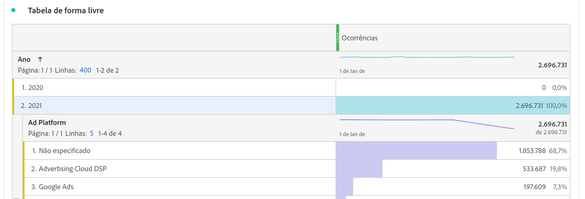

# Estimar tamanho da conexão

Talvez seja necessário saber quantas linhas de dados você tem atualmente no [!UICONTROL Customer Journey Analytics]. Para obter uma conta precisa do uso dos registros de dados de evento (linhas de dados) de sua organização, faça o seguinte **para cada uma das conexões criadas pela organização**.

1. No [!UICONTROL Customer Journey Analytics], clique na guia **[!UICONTROL Conexões]**.

   Agora você pode ver uma lista de todas as suas conexões atuais.

1. Clique em cada nome de conexão para acessar o Gerenciador de conexões.

1. Adicione o **[!UICONTROL Registros dos dados do evento disponíveis]** para todas as conexões criadas. (Dependendo do tamanho da sua conexão, o número pode levar algum tempo para ser exibido.)

   

1. Depois de ter uma soma de todas as linhas de dados do evento, procure o direito de &quot;Linhas de dados&quot; no contrato de Customer Journey Analytics que sua empresa assinou com o Adobe.

   Isso fornece o número máximo de linhas de dados autorizadas na Ordem de Venda. Se o número de linhas de dados resultante da Etapa 3 for maior que esse número, você está incorrendo em um excedente.

1. Para corrigir essa situação, você tem várias opções:

   * Altere seu [configurações de retenção de dados](https://experienceleague.adobe.com/docs/analytics-platform/using/cja-connections/manage-connections.html?lang=pt-BR#set-rolling-window-for-connection-data-retention).
   * [Excluir todas as conexões não usadas](https://experienceleague.adobe.com/docs/analytics-platform/using/cja-overview/cja-faq.html?lang=pt-BR#implications-of-deleting-data-components).
   * [Excluir um conjunto de dados no AEP](https://experienceleague.adobe.com/docs/analytics-platform/using/cja-overview/cja-faq.html?lang=en#implications-of-deleting-data-components).
   * Entre em contato com o Gerente de conta do Adobe para obter licença de capacidade adicional.

## Em relação às sobreposições de uso

Os limites de uso são rigorosamente monitorados e aplicados pelo Adobe, diariamente. &quot;Linhas de dados&quot;, as linhas médias diárias de dados disponíveis para análise no Customer Journey Analytics.

Considere que o direito do contrato limita o número de linhas para 1 milhão. Suponha que no Dia 1 de uso do Customer Journey Analytics você carregue 2 milhões de linhas de dados. No Dia 2, você exclui 1 milhão de linhas e mantém seu uso no máximo comprometido. Você ainda incorreria em taxas de utilização excessiva para o Dia 1.

## Diagnosticar discrepâncias

Em alguns casos, você pode notar que o número total de eventos assimilados pela sua conexão é diferente do número de linhas no conjunto de dados na [!UICONTROL Adobe Experience Platform]. Neste exemplo, o conjunto de dados &quot;Impressão B2B&quot; tem 7650 linhas, mas o conjunto de dados contém 3830 linhas na [!UICONTROL Adobe Experience Platform]. Há várias razões pelas quais podem ocorrer discrepâncias, e as seguintes etapas podem ser executadas para diagnosticar:

1. Detalhe essa dimensão por **[!UICONTROL ID do conjunto de dados da plataforma]** e você observará dois conjuntos de dados com o mesmo tamanho, mas diferentes **[!UICONTROL IDs do conjunto de dados da plataforma]**. Cada conjunto de dados tem 3825 registros. Isso significa que o [!UICONTROL Customer Journey Analytics] ignorou cinco registros devido a IDs de pessoa ausentes ou a carimbos de data e hora ausentes:

   

1. Além disso, se verificarmos a [!UICONTROL Adobe Experience Platform], não há conjunto de dados com a ID &quot;5f21c12b732044194bffc1d0&quot;, portanto, alguém excluiu esse conjunto de dados específico da [!UICONTROL Adobe Experience Platform] quando a conexão inicial estava sendo criada. Mais tarde, ele foi adicionado ao Customer Journey Analytics novamente, mas uma [!UICONTROL ID do conjunto de dados da plataforma] diferente foi gerada pela [!UICONTROL Adobe Experience Platform].

Leia mais sobre as [implicações do conjunto de dados e a exclusão de conexão](https://experienceleague.adobe.com/docs/analytics-platform/using/cja-overview/cja-faq.html?lang=en#implications-of-deleting-data-components) no [!UICONTROL Customer Journey Analytics] e na [!UICONTROL Adobe Experience Platform].
